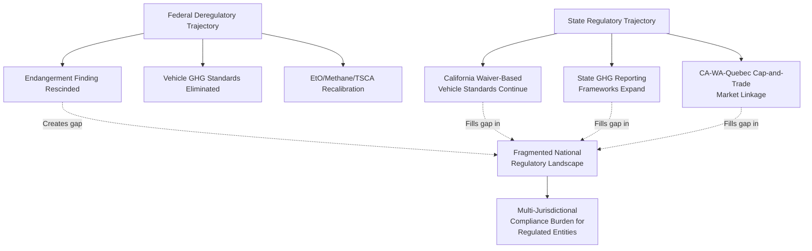

## Divergence Between Federal Rollback and State or International Regulatory Trajectories

### Overview

As the federal government pursues a sustained deregulatory agenda across climate and environmental policy, subnational (state) and international actors are moving in the opposite direction — maintaining or strengthening existing standards, or in some cases increasing them specifically to fill the gap left by federal retreat. This divergence produces a fragmented, multi-layered regulatory environment for any actor operating across jurisdictions: a company subject to federal deregulation may nonetheless face increasingly stringent state climate disclosure rules and simultaneously confront a mature European carbon border tariff regime having no analog in current U.S. federal policy. This item maps the structure of this divergence across three dimensions — U.S. federal-state fragmentation, U.S. withdrawal from and EU adherence to international climate commitments, and the practical multi-jurisdictional compliance consequences.

### Federal-State Divergence Within the United States

**Key Points**

1. **The core dynamic**: As EPA rolls back GHG laws, rules, and regulations consistent with current administration priorities, several states are independently advancing their own GHG emissions reporting frameworks and climate policy tools — creating a state-by-state patchwork that businesses operating nationally must now separately monitor, in contrast to a period when federal standards functioned as a more unifying baseline.
2. **California's continuing role**: California is expected to continue shaping environmental policy through its distinct regulatory authority over vehicle emissions, energy systems, and industrial standards, including its GHG reporting requirements and climate-related financial risk disclosure programs (e.g., SB 253-style disclosure mandates), independent of federal direction.
3. **Vehicle emissions as the clearest flashpoint**: EPA's 2026 repeal of the Endangerment Finding effectively removes the legal basis for federal light-duty vehicle GHG standards that had previously been finalized for model years 2023 through 2026 and were projected to yield substantial net economic benefits and emissions reductions by mid-century. However, states with Clean Air Act waiver authority, most prominently California, retain the ability to continue implementing their own, more stringent vehicle emissions standards independent of the federal repeal — meaning the practical stringency of vehicle emissions regulation an automaker faces can depend entirely on which state's market it is selling into.
4. **Cap-and-trade market expansion**: California and Washington are pursuing a linkage of their respective cap-and-trade (Washington's "Cap-and-Invest," created by the Climate Commitment Act of 2021) and cap-and-trade programs; a draft linkage agreement with the Western Climate Initiative was released in March 2026, which would create a framework not only to transfer compliance instruments between the three markets (California, Quebec, and Washington) but also to hold joint auctions across all three. Notably, some proponents of state-level carbon pricing view this consolidation explicitly as the most viable path for climate-forward states to act on climate change specifically because of federal rollback, framing subnational carbon markets as a substitute mechanism rather than a complement to now-diminished federal action.
5. **Uneven state momentum**: Not all state-level efforts are advancing at the same pace — New York's own cap-and-trade program, which had once been expected to launch close behind California and Washington, has fallen behind schedule amid political hesitation, illustrating that federal rollback does not automatically translate into uniform or accelerated state-level substitution; state political dynamics remain an independent variable.
6. **California's tightening trajectory independent of federal direction**: California's Air Resources Board has indicated it plans to propose new regulations further tightening the state cap-and-trade program's emissions cap by removing a greater number of allowances from the program between 2026 and 2030 than would otherwise occur under existing schedules — an independent tightening trajectory moving in the opposite direction from concurrent federal rollback.
7. **Sector-specific federal deregulation compounding the divergence**: Beyond GHG-specific rules, federal recalibration extends to ethylene oxide (EtO) and methane rule reconsideration and other TSCA-related reconsiderations, reflecting a broader federal shift from precautionary or comprehensive regulation toward a narrower, more minimalist regulatory posture across multiple pollutant categories simultaneously — while state-level disclosure and reporting mandates continue to expand in the same period.

### International Divergence: The Transatlantic Split

**Key Points**

1. **U.S. Paris Agreement withdrawal**: The administration initiated formal withdrawal from the Paris Agreement in January 2025 for the second time (having also done so during the first Trump term before a subsequent re-entry), citing economic sovereignty concerns and the perceived impact on domestic energy industries; the withdrawal took formal effect on January 27, 2026.
2. **EU's contrasting trajectory**: The European Union has reaffirmed its alignment with the Paris Agreement, with European Commission leadership publicly characterizing continued commitment to the agreement as essential; EU climate ambitions remain embedded in binding law through the European Climate Law, which mandates a 55% emissions reduction by 2030 and climate neutrality by 2050. In December 2025, the Council of the European Union and European Parliament reached a provisional agreement to amend the European Climate Law by introducing a binding intermediate target of a 90% reduction in net greenhouse-gas emissions by 2040 relative to 1990 levels — a further tightening of EU ambition occurring contemporaneously with U.S. federal retreat.
3. **Domestic policy reversal compounding international withdrawal**: The administration has also revoked key provisions of the Inflation Reduction Act, promoted fossil fuel extraction, lifted offshore drilling restrictions, suspended wind power development projects, and moved to terminate electric vehicle mandate provisions — a domestic policy package operating in parallel with, and reinforcing, the international withdrawal.
4. **The Carbon Border Adjustment Mechanism (CBAM) as an independent international pressure point**: The EU's CBAM, established by Regulation (EU) 2023/956, entered its final operative phase on January 1, 2026, ending its reporting-only transition period. U.S. exporters in carbon-intensive sectors — specifically steel, aluminum, cement, fertilizers, and hydrogen — must now be registered as "Authorized CBAM Declarants" when importing into the EU and will begin incurring financial liabilities tied to the embedded carbon content of their products, with those liabilities increasing as the EU simultaneously phases out free emissions allowances for its own domestic producers.
5. **CBAM's role in shaping (and being reshaped by) U.S. domestic politics**: The design of the Inflation Reduction Act's specific decarbonization provisions had previously been explicitly crafted in part to mitigate CBAM-related trade risk and align with emerging international carbon standards; the subsequent federal rollback, which primarily targeted the IRA, has instead characterized CBAM as an example of unfair European trade barriers — illustrating that the same international mechanism (CBAM) has been treated as a design consideration to accommodate under one administration and as a grievance justifying disengagement under the next, without the underlying EU policy itself changing.
6. **[Inference] Genuine tension between stated international ambition and observed transition pace**: Separately from the U.S.-EU divergence specifically, at least one major European energy company's 2026 sustainability reporting has publicly stated that global carbon neutrality by 2050 as envisioned under the Paris Agreement may no longer be achievable at the current pace of transition — suggesting that even within jurisdictions maintaining formal policy commitment to aggressive decarbonization targets, questions about real-world achievability are becoming more prominent; this should be read as evidence of debate about feasibility within the pro-Paris camp, not as evidence that stated EU legal targets have been formally revised downward.

### Compliance Consequences: The Multi-Jurisdictional Patchwork

**Key Points**

1. **Non-uniform disclosure obligations**: Companies must now navigate a genuinely fragmented landscape combining California disclosure mandates (e.g., climate-related financial risk and GHG emissions reporting), emerging state-by-state GHG reporting frameworks beyond California, New York facility-level rules, and the EU's CBAM and Corporate Sustainability Reporting Directive (CSRD) framework — with each regime having differing scope, reporting formats, and compliance timelines.
2. **Scope 3 supply-chain spillover**: Even a company not directly "in scope" for a given state disclosure statute, CBAM, or CSRD may still face indirect compliance pressure, since its customers — who may be in scope — will increasingly request Scope 3 supply-chain emissions data to meet their own first reporting deadlines; this creates de facto compliance obligations that extend well beyond the formal jurisdictional reach of any single regulatory regime.
3. **Strategic reframing for regulated entities**: Practitioner commentary characterizes 2026 as the year climate reporting shifts from a narrow compliance exercise into a broader strategic data management challenge, on the view that entities with strong underlying data infrastructure and stakeholder relationships will be better positioned to respond efficiently across multiple divergent regimes than entities that treat each jurisdiction's requirements as a separate, siloed compliance project.
4. **Litigation as an amplifier of fragmentation**: Federal deregulatory rollbacks that face sustained legal challenge (see the separate coverage of anticipated Supreme Court and circuit court dockets) create additional uncertainty layered on top of jurisdictional fragmentation — a regulated entity may face not only differing substantive requirements across federal, state, and international regimes, but also uncertainty about whether the current federal baseline itself will be judicially vacated, reinstated, or modified during the compliance planning horizon.

### Comparative Table: Divergent Trajectories by Jurisdiction

| Jurisdiction/Actor | Direction of Travel (2025–2026) | Key Mechanism | Relationship to Federal U.S. Rollback |
| --- | --- | --- | --- |
| U.S. Federal (EPA, agencies) | Deregulatory | Endangerment Finding rescission; vehicle/power plant GHG standard repeal; EtO/methane/TSCA recalibration | N/A (originating actor) |
| California | Maintaining/tightening | CAA waiver-based vehicle standards; GHG reporting and climate disclosure mandates; cap-and-trade cap tightening (2026–2030) | Explicitly filling gap left by federal repeal |
| Washington State | Maintaining/expanding | Cap-and-Invest program; WCI market linkage with California/Quebec | Framed by proponents as substitute for diminished federal climate action |
| New York | Stalled/delayed | Planned but delayed cap-and-trade program | Federal rollback increases stakes of state delay but has not accelerated it |
| European Union | Maintaining/tightening | Binding European Climate Law targets; CBAM final phase (Jan. 2026); provisional 90%-by-2040 target | Diverging sharply; EU reaffirms Paris Agreement as U.S. formally withdraws |
| U.S. (international posture) | Withdrawing | Second Paris Agreement withdrawal, effective Jan. 27, 2026 | Originating actor; direct cause of transatlantic divergence |

### Related Topics

- California's Clean Air Act waiver authority and its role in sustaining state-level vehicle emissions standards
- The Western Climate Initiative cap-and-trade linkage among California, Washington, and Quebec
- The EU Carbon Border Adjustment Mechanism (CBAM): legal structure, WTO compatibility questions, and compliance obligations for U.S. exporters
- State GHG emissions reporting frameworks and the resulting compliance patchwork for multi-state businesses
- The Inflation Reduction Act's decarbonization provisions and their relationship to CBAM-driven trade policy design
- Corporate Sustainability Reporting Directive (CSRD) and its interaction with U.S. state-level climate disclosure mandates
- Scope 3 emissions reporting and supply-chain compliance spillover effects
- The U.S. Paris Agreement withdrawal: procedural mechanics and historical precedent from the first Trump term
- Endangerment Finding rescission litigation and its effect on the federal-state vehicle emissions standard divide
- Comparative carbon pricing design: cap-and-trade (California/Washington/Quebec) versus carbon border tariff (EU CBAM) mechanisms