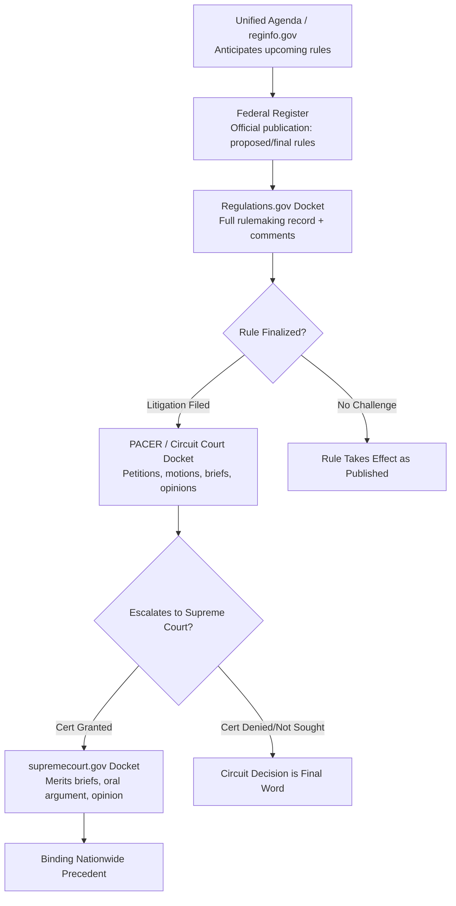

## Building a Continuing Education Practice for Tracking the Federal Register, Agency Dockets, and Court Filings

### Overview

Given the pace and volume of regulatory change documented throughout this chapter — the 2025–2026 deregulatory wave, shifting removal-power doctrine, and diverging federal-state-international trajectories — a practitioner or student in administrative and environmental law cannot rely on periodic legal updates or secondary commentary alone. This item provides a structured, tool-by-tool methodology for building a sustainable personal or institutional practice for monitoring primary sources directly: the Federal Register, agency-specific rulemaking dockets, and federal court filings.

### Why Primary-Source Monitoring Matters

**Key Points**

- Secondary sources (law firm client alerts, news coverage) are useful for synthesis and context but typically lag primary publication by days to weeks and may selectively frame developments; they are not a substitute for direct docket access when precise procedural posture, deadlines, or exact regulatory text matter.
- The current period is characterized by high rulemaking velocity, frequent supplemental notices (e.g., the WOTUS SNPRM issued after the initial proposed rule), extended and shifting comment deadlines, and litigation that can materially change a rule's status without a corresponding new rule being published — meaning docket-level and court-filing-level monitoring is necessary to know a rule's *actual current legal status* rather than only its originally announced content.
- Practitioners preparing comments, advising clients, or building academic analysis need accurate awareness of comment period deadlines, since these are often short (the WOTUS SNPRM comment window, for example, ran a matter of weeks) and firm.

### Core Primary-Source Tools

**Key Points**

1. **Federal Register (federalregister.gov)**
   - The official daily publication for all federal agency proposed rules, final rules, and notices.
   - Supports full-text search, filtering by agency, and a **public inspection** feature showing documents scheduled for publication before their official publication date — useful for earliest possible notice of an impending rule.
   - Each entry provides a **regulations.gov docket ID** linking to the underlying rulemaking docket.
   - Free email subscription service available for specific agencies or search terms, delivering daily digests.
2. **Regulations.gov**
   - The unified portal for federal agency rulemaking dockets, hosting the full docket for a given rulemaking: the proposed rule, supporting technical documents (e.g., an EPA Integrated Science Assessment or Regulatory Impact Analysis), all public comments submitted, and any supplemental notices.
   - Docket IDs (e.g., "EPA-HQ-OW-2025-0322" for the WOTUS proposed rule) are the standard citation and search key; bookmarking a specific docket ID allows direct return to its current state.
   - Comment submission occurs directly through this portal.
3. **Agency-specific trackers**
   - Agencies increasingly maintain their own rulemaking dashboards (e.g., EPA's rulemaking gateway, agency AI use-case inventories) that may surface a rule before or alongside its Federal Register appearance, and often contextualize it within the agency's broader regulatory agenda.
   - The **Unified Agenda of Regulatory and Deregulatory Actions** (published semiannually, compiled via reginfo.gov, run by OMB's Office of Information and Regulatory Affairs) previews rules agencies plan to propose or finalize in coming months, useful for anticipating upcoming dockets before a formal proposal appears.
4. **PACER (Public Access to Court Electronic Records)**
   - The federal judiciary's system for docket access and filed documents in federal district and circuit courts, including the D.C. Circuit, the primary venue for challenges to nationally applicable EPA actions under CAA §307(b)(1).
   - Provides direct access to petitions for review, procedural motions (e.g., abeyance requests), merits briefs, and opinions — the level of detail needed to track litigation posture precisely (e.g., distinguishing a case held in abeyance from one proceeding to merits briefing).
   - Per-page fee structure applies (with fee waivers for cumulative charges below a threshold in a given quarter); many university law libraries and some nonprofit legal organizations provide free or subsidized access.
5. **Supreme Court docket system (supremecourt.gov)**
   - Provides docket sheets, briefs, and orders for cases before the Court, including certiorari petitions, grants and denials, and merits documents; useful for tracking cases like those profiled in the anticipated-dockets item (e.g., *Suncor Energy v. Boulder County*).
6. **SCOTUSblog and circuit-specific tracking blogs**
   - Independent, high-quality secondary aggregation of Supreme Court docket activity, argument scheduling, and opinion releases; useful as a triage layer to flag which docket entries merit a deeper primary-source review, rather than as a substitute for the primary filings themselves.

### Structuring a Sustainable Monitoring Cadence

**Key Points**

A continuing education practice needs a defined cadence, not ad hoc checking, to avoid both information overload and missed developments.

1. **Daily**: Federal Register email digest review for tracked agencies (e.g., EPA, Army Corps, FWS, NOAA) — a 5–10 minute scan is generally sufficient to flag anything requiring deeper attention.
2. **Weekly**: Review of docket activity on actively tracked rulemakings and litigation (e.g., checking for new filings on the Endangerment Finding D.C. Circuit challenge, new WOTUS docket entries) — this is where procedural developments like abeyance motions or extension requests will surface.
3. **Monthly**: Broader horizon-scanning pass — reviewing the Unified Agenda for newly announced anticipated rulemakings, and checking Supreme Court order lists for certiorari grants/denials in relevant subject areas.
4. **Triggered/event-based**: Immediate deep review whenever a tracked rule is finalized, a tracked case receives an opinion, or a major political/personnel event occurs at a tracked agency (e.g., a change in agency leadership following a removal-power dispute) — these events typically cascade into multiple downstream docket and filing developments worth close reading.

### Example: A Tracking Workflow for a Specific Rulemaking

**Example**

Applying this practice to the WOTUS rulemaking as a concrete illustration:

1. Bookmark docket ID **EPA-HQ-OW-2025-0322** on regulations.gov upon first learning of the November 2025 proposed rule.
2. Set a calendar reminder for the initial comment deadline (January 5, 2026) and any subsequent comment windows announced via supplemental notices (e.g., the September 2026 SNPRM's October 9, 2026 deadline).
3. Subscribe to Federal Register email alerts filtered for "EPA" and "Army Corps of Engineers" to catch the SNPRM's publication in real time rather than relying on secondary reporting.
4. Once litigation is filed following any final rule, identify the case's docket number in the relevant circuit (historically, WOTUS litigation has produced multi-circuit challenges) and add it to a weekly PACER review list.
5. Cross-reference developments against secondary sources (law firm alerts, EELP's regulatory tracker, InsideEPA) not as the primary record but as a sense-check on interpretation and practical significance.

### Institutional and Free Resources Worth Building Into a Practice

**Key Points**

- **Harvard Environmental & Energy Law Program (EELP) Regulatory Tracker**: A maintained, citation-rich tracker of major environmental deregulatory and regulatory actions, useful as a curated index pointing to primary Federal Register and docket sources rather than as a standalone secondary summary.
- **Congress.gov and CRS Reports**: Congressional Research Service reports (e.g., on satellite methane monitoring, or on Supreme Court removal-power decisions) provide vetted, nonpartisan technical background suitable for citation in academic or practice contexts.
- **Law school environmental law clinics and centers**: Many maintain public trackers (e.g., environmental law review blogs) that can supplement — but should not replace — direct docket monitoring.
- **Bar association CLE programming**: Environmental and administrative law sections of state and national bar associations frequently offer timely continuing legal education specifically addressing major doctrinal shifts (e.g., post-*Loper Bright* rulemaking strategy, post-*Slaughter* removal-power implications), useful for structured synthesis alongside self-directed primary-source tracking.

### Comparative Table: Tool Selection by Monitoring Need

| Monitoring Need | Primary Tool | Update Frequency | Cost |
| --- | --- | --- | --- |
| New proposed/final rule announcements | Federal Register (federalregister.gov) | Daily digest | Free |
| Full rulemaking record, comments, technical documents | Regulations.gov | As filed | Free |
| Anticipated future rulemakings | Unified Agenda (reginfo.gov) | Semiannual | Free |
| Circuit court litigation status | PACER | As filed | Per-page fee (waivable at low volume) |
| Supreme Court docket status | supremecourt.gov | As filed | Free |
| Curated environmental deregulation tracking | EELP Regulatory Tracker (Harvard) | Rolling updates | Free |
| Congressional/nonpartisan technical background | Congress.gov / CRS Reports | As published | Free |

### Practical Cautions

**Key Points**

1. **Docket status can change without a new Federal Register entry**: A rulemaking held in litigation abeyance, or a comment deadline extended by agency notice, may not generate a fresh Federal Register publication in every instance — direct docket review remains necessary to confirm current status rather than relying solely on the original publication date.
2. **Comment periods can be genuinely short**: As illustrated by supplemental notices in active rulemakings, a comment window can run only a few weeks; a monitoring cadence with more than a one-to-two-week detection lag risks missing a comment opportunity entirely.
3. **Multiple simultaneous rulemakings compound tracking burden**: Given the current volume of concurrent EPA, FWS, and NOAA deregulatory actions, a practitioner should prioritize a small number of closely tracked dockets (chosen for direct relevance to practice or study focus) over attempting comprehensive tracking of the full deregulatory docket, which is not a sustainable individual practice given current agency output volume.
4. **Secondary sources remain valuable for triage, not verification**: Law firm alerts and news coverage are efficient for deciding *which* dockets merit primary-source attention, but should not be cited as the basis for precise procedural claims (exact deadlines, exact rule text, exact case posture) where the underlying primary document is available and should instead be consulted directly.

### Related Topics

- The Unified Agenda of Regulatory and Deregulatory Actions and its role in regulatory horizon-scanning
- Federal Register public inspection procedures and pre-publication document access
- PACER fee structures and free/subsidized access options through academic institutions
- The D.C. Circuit's role as primary venue for nationally applicable environmental rule challenges under CAA §307(b)(1)
- Comment letter drafting strategy and effective use of a rulemaking's technical docket record
- Harvard EELP Regulatory Tracker and comparable curated tracking resources
- Congressional Research Service (CRS) reports as a citation source for nonpartisan technical background
- Building a personal citation and case-tracking system for coursework or practice
- The Unified Agenda's relationship to actual rulemaking timelines: historical reliability considerations
- Continuing legal education (CLE) programming in environmental and administrative law as a synthesis complement to primary-source tracking