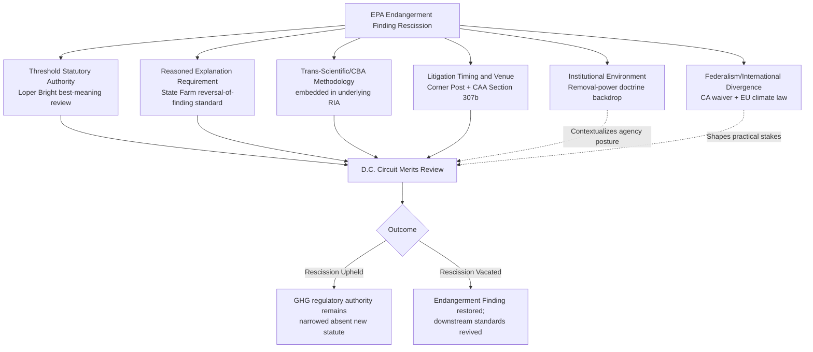

## Capstone Synthesis: Applying Administrative Law Doctrine to a Live Environmental Rulemaking Controversy

### Overview

This capstone item synthesizes the doctrinal, institutional, and strategic material developed across this chapter and the preceding chapter on science, risk, and uncertainty, applying it to a single live controversy: **EPA's rescission of the 2009 Endangerment Finding and the resulting repeal of federal vehicle and power plant greenhouse gas standards**. This controversy was selected because it uniquely activates nearly every doctrinal thread covered — scientific advisory committee dynamics, cost-benefit and discounting methodology, emerging monitoring technology, predicate-level deregulation strategy, post-*Loper Bright* statutory interpretation, *Corner Post* limitations exposure, removal-power questions affecting the surrounding institutional environment, and federal-state-international divergence. The goal is to demonstrate how these doctrines interact in a single, live administrative record rather than in isolation.

### Framing the Controversy as a Doctrinal Convergence Point

**Key Points**

The Endangerment Finding rescission is best understood not as a single legal question but as a **stack of distinct, layered administrative law issues**, each drawing on a different doctrinal area covered in this course:

1. **Threshold statutory authority question**: Does CAA §202(a) permit EPA to base vehicle GHG regulation on global climate-change concerns, or does the statute's structure limit "endangerment" to more geographically or causally proximate harms? This is a pure *Loper Bright* "best meaning" question, decided without *Chevron*-style deference to EPA's own reading.
2. **Reasoned-explanation question**: Assuming EPA has some interpretive latitude, has the agency adequately explained its reversal of a prior factual/scientific finding, per *State Farm*'s reasoned-decisionmaking requirement? This draws directly on the science-and-uncertainty material — specifically, how an agency engages (or fails to engage) with the prior scientific record, including any scientific advisory committee input, when reversing course.
3. **Trans-scientific and evidentiary questions embedded within the reversal**: EPA's rescission necessarily revisits questions like dose-response uncertainty, aggregation of global versus domestic climate effects, and the proper role of cost-benefit analysis (including discount-rate selection) in the underlying Regulatory Impact Analysis — reintroducing the trans-science and CBA methodology material in a concrete adjudicative posture.
4. **Litigation exposure and timing questions**: How do *Corner Post*'s extended limitations window and the D.C. Circuit's exclusive review venue under CAA §307(b)(1) structure who can challenge the rescission, and when?
5. **Institutional environment questions**: Does the ongoing removal-power realignment (*Slaughter*/*Cook*) affect the credibility or durability of EPA's own administrative posture, given that CAA leadership questions could, in principle, be affected by analogous removal-power litigation in the future even though EPA's single-administrator structure differs from the commission-model agencies directly implicated in *Slaughter*?
6. **Federalism and international divergence questions**: Does the rescission's effect vary by jurisdiction, given California's waiver-based vehicle standards and the EU's simultaneous tightening of its own climate law — and does this variation affect how a reviewing court might characterize the "stakes" of the rescission in assessing its reasonableness?

### Applying the Reasoned-Explanation Standard: A Structured Analysis

**Key Points**

*Motor Vehicle Mfrs. Ass'n v. State Farm* requires that an agency reversing a prior policy supply a reasoned explanation, including — where the reversal rests on a changed factual predicate — engagement with the facts and circumstances underlying the prior policy. Applying this to the rescission:

1. **What must EPA show**: Under *State Farm*'s framework, EPA need not prove its new position is objectively "better" than the 2009 finding, but it must show awareness that it is changing position, provide a reasoned explanation for the change, and — critically, per subsequent case law (*FCC v. Fox Television Stations*) — provide a more substantial justification where the new policy rests on factual findings that contradict those underlying the prior policy, or where the prior policy has engendered serious reliance interests.
2. **Reliance interests at stake**: Automakers, states, and other regulated parties made substantial compliance investments under the vehicle GHG standards framework built on the Endangerment Finding over roughly 15 years; a reviewing court may scrutinize whether EPA's rescission record adequately accounts for these reliance interests, consistent with the heightened *Fox Television* standard.
3. **The core factual dispute EPA must address**: EPA's stated rationale is that GHG emissions from the regulated source category (vehicles, and separately, power plants) do not "contribute significantly" to endangerment given the global and diffuse nature of climate change — a reformulated causal-contribution argument, not a claim that GHGs are harmless. A reviewing court applying *State Farm*/*Fox Television* will assess whether the administrative record adequately grapples with the substantial contrary scientific record (including the original 2009 endangerment finding's technical support documents and any relevant scientific advisory committee input) rather than simply asserting a new statutory interpretation without engaging the underlying factual basis.
4. **Interaction with reduced deference**: Because *Loper Bright* eliminates deference to EPA's *statutory interpretation*, but *State Farm*'s reasoned-explanation requirement for *factual/policy reversals* is a distinct doctrine not abrogated by *Loper Bright*, a reviewing court may simultaneously (a) independently determine the "best" reading of CAA §202(a) without deferring to EPA, and (b) separately assess whether EPA's factual reversal was reasoned — meaning EPA's litigation position must succeed on two independent doctrinal tracks, not one.

### Applying Trans-Science and CBA Methodology to the Underlying Record

**Key Points**

Drawing directly on the science-and-uncertainty chapter material:

1. **The trans-scientific core of the dispute**: Whether vehicle or power-plant GHG emissions "contribute significantly" to a global, cumulative, long-latency harm is a paradigmatic trans-scientific question — it cannot be resolved by measurement alone, because it requires a policy judgment about what threshold of causal contribution counts as "significant" in a system where no single source category is individually necessary or sufficient for the harm.
2. **Discount-rate stakes**: If EPA's rescission rulemaking includes a revised Regulatory Impact Analysis reversing the prior rule's benefit-cost conclusion, the discount rate applied to long-horizon climate damages (per the 2023 Circular A-4 framework) will materially affect the RIA's bottom-line net-benefit conclusion — a higher discount rate systematically undervalues long-deferred climate harms, making cost-benefit reversal easier to justify on paper; a challenger might argue EPA selectively adjusted discounting assumptions to reach a predetermined deregulatory conclusion, which would itself be a *State Farm* vulnerability if the record does not independently justify the methodological choice.
3. **VSL and co-benefits interaction**: To the extent the rescinded standards' original justification relied on co-benefits (e.g., criteria pollutant reductions co-occurring with GHG reductions) monetized via VSL, EPA's rescission record must address why those previously credited co-benefits are no longer sufficient to justify the standards — reprising the co-benefits controversy from the CBA topic in a live reversal context.
4. **Scientific advisory committee engagement**: Whether EPA sought or received input from a body akin to CASAC (or an equivalent GHG-specific advisory process) before rescinding a foundational scientific finding is directly relevant to the "boundary work" and administrative-record-quality themes developed in the advisory committee topic — an agency that bypasses its own established advisory review process before reversing a major scientific finding presents a more vulnerable administrative record than one that engaged such a process, even if it ultimately reached the same substantive conclusion.

### Applying Litigation Structure and Timing Doctrine

**Key Points**

1. **Venue**: CAA §307(b)(1) channels challenges to nationally applicable EPA actions to the D.C. Circuit, consistent with the venue observed in the actual pending litigation over the rescission.
2. **Corner Post exposure operating in both directions**: Because *Corner Post* runs the limitations period from a plaintiff's injury rather than a rule's promulgation date, this cuts two ways in this specific controversy: (a) parties newly injured by the *rescission* (e.g., states or public health organizations newly harmed by the absence of vehicle standards) have an extended window to sue over the rescission itself; and (b) if the rescission is later itself reversed by a future administration, parties newly injured by *that* reversal would separately gain an extended window — meaning *Corner Post* structurally extends litigation exposure for whichever rule is currently in effect, without favoring either regulatory direction as a general matter.
3. **Abeyance and procedural strategy**: Litigation over the actual rescission has featured extensive procedural motions and abeyance requests — a pattern consistent with historical Clean Power Plan litigation, where parties have previously used abeyance to delay merits resolution while political or administrative circumstances evolve; applying doctrine here requires distinguishing procedural maneuvering from the underlying merits questions, since a case's procedural posture at any given moment does not indicate anything about its likely substantive outcome.

### Applying the Institutional and Federalism Backdrop

**Key Points**

1. **Removal-power backdrop, properly scoped**: While *Slaughter* and *Cook* do not directly govern EPA's own leadership structure (EPA's single-administrator design differs from the multi-member commission model at issue in those cases), the broader doctrinal environment they create — one of increased executive control over agency decision-making and reduced institutional insulation generally — is relevant context for understanding why an administration might pursue predicate-level reversal aggressively and with unusually compressed procedural timelines, a pattern independently flagged as increasing litigation vulnerability across the deregulatory wave.
2. **Federalism stakes as an interpretive input, not a doctrinal trump card**: The fact that California's waiver-authority vehicle standards and international commitments (EU climate law, formerly the U.S.'s own Paris Agreement commitments) continue to operate independent of the federal rescission does not itself resolve the CAA §202(a) statutory question, but it is relevant to how a reviewing court might assess the practical stakes and reasonableness of EPA's contribution-significance argument — if a source category's emissions are conceded to be regulated as significant by other competent jurisdictions applying similar science, that may be probative (though not dispositive) evidence bearing on the reasonableness of EPA's contrary characterization.

### Structured Framework for Student/Practitioner Application

**Key Points**

When applying administrative law doctrine to any live rulemaking controversy (using this one as the template), work through the following sequence:

1. **Identify every layer of legal question** implicated (statutory authority, factual reversal, procedural regularity, litigation timing/venue) rather than treating the controversy as a single undifferentiated dispute.
2. **Determine which deference framework applies to each layer** — statutory interpretation gets *Loper Bright* independent review; factual/policy reversals get *State Farm*/*Fox Television* reasoned-explanation review; procedural compliance gets ordinary APA §553 notice-and-comment review.
3. **Trace the underlying scientific and economic record** for trans-scientific judgments, discount-rate and VSL methodology choices, and co-benefit treatment, since these are frequently where an administrative record's reasoning is thinnest and most litigable.
4. **Map the litigation structure**: venue, likely timeline, *Corner Post* exposure, and probable escalation path to the Supreme Court.
5. **Situate the controversy in its institutional and federalism context**: what surrounding doctrinal shifts (removal power, subnational/international divergence) inform the practical stakes and strategic behavior of the parties, without conflating context with controlling doctrine.

### Comparative Table: Doctrinal Threads Converging in the Capstone Controversy

| Doctrinal Thread | Course Origin | Application to Endangerment Finding Rescission |
| --- | --- | --- |
| *Loper Bright* independent statutory interpretation | Deregulatory realignment chapter | Governs whether CAA §202(a) permits GHG regulation absent deference to EPA |
| *State Farm*/*Fox Television* reasoned explanation | Foundational APA doctrine | Governs adequacy of EPA's justification for reversing the 2009 finding |
| Trans-science / advisory committee dynamics | Science, risk, and uncertainty chapter | Governs how "contributes significantly" is evaluated absent clean scientific resolution |
| Discounting, VSL, co-benefits | Science, risk, and uncertainty chapter | Governs the underlying RIA's net-benefit conclusion supporting rescission |
| *Corner Post* limitations exposure | Deregulatory realignment chapter | Governs which parties can challenge the rescission and when |
| CAA §307(b)(1) venue | Foundational administrative law | Channels litigation to the D.C. Circuit |
| Removal-power doctrine (*Slaughter*/*Cook*) | Deregulatory realignment chapter | Contextualizes institutional posture, though not directly controlling for EPA |
| Federal-state-international divergence | Deregulatory realignment chapter | Shapes practical stakes and comparative-evidence arguments, not the statutory question itself |

### Synthesis: Why This Controversy Is an Effective Capstone

**Key Points**

- No single doctrine resolves this controversy in isolation — a strong analysis requires sequencing and correctly scoping multiple standards of review across a single set of facts, which is the core analytical skill developed across the course.
- The controversy is genuinely live and unresolved: litigation is in early-to-mid procedural stages as of the most recent developments, meaning a rigorous student or practitioner analysis is not merely academic but potentially informative to real advocacy or advisory work.
- [Inference] Given the doctrinal complexity mapped here, this controversy will likely serve as a vehicle for clarifying several open questions simultaneously — most significantly, how *State Farm*'s reasoned-explanation standard interacts with *Loper Bright*'s reduced deference when an agency reverses both its statutory interpretation and its factual findings in the same rulemaking — though the precise doctrinal resolution cannot be predicted with confidence given the case's early procedural posture.

### Related Topics

- *Motor Vehicle Mfrs. Ass'n v. State Farm* and *FCC v. Fox Television Stations*: the reasoned-explanation standard for agency reversals
- *Massachusetts v. EPA* (2007) as the foundational precedent for the original Endangerment Finding
- Comprehensive case brief: the D.C. Circuit Endangerment Finding rescission litigation
- Comparative capstone exercise: applying the same doctrinal framework to the WOTUS or ESA rollback controversies
- The interaction of *Loper Bright* and *State Farm* review standards in a single rulemaking challenge
- Drafting a moot court brief on CAA Section 202(a) statutory interpretation post-*Loper Bright*
- Reliance-interest doctrine and its application to multi-year regulatory compliance investments
- Building an administrative record: best practices for agencies reversing prior factual findings
- Cross-chapter synthesis exercises: linking science-and-uncertainty doctrine to deregulatory-wave case studies
- Preparing for practice: translating capstone doctrinal analysis into client-facing regulatory risk assessments