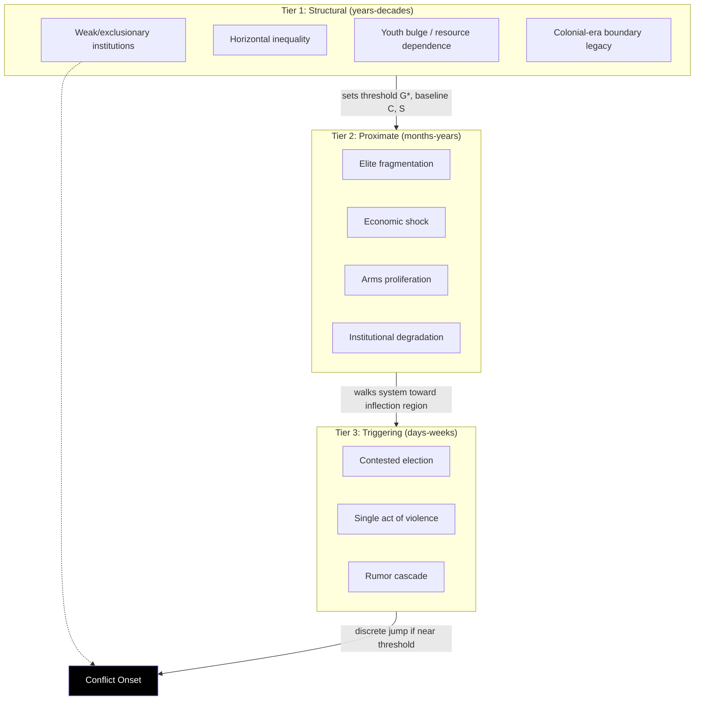

## Structural, Proximate, and Triggering Cause Taxonomy in Conflict Diagnosis

### Formal Purpose of the Taxonomy

The three-tier taxonomy exists to solve a specific diagnostic failure mode: collapsing causes operating at different timescales and different levels of necessity/sufficiency into a single undifferentiated "cause," which produces both bad prediction (why did *this* trigger, and not the hundred similar ones before it, ignite conflict?) and bad intervention design (removing a trigger does nothing if the structural conditions remain). The taxonomy — most systematically formalized in conflict-analysis practice by organizations such as International Alert and USAID's conflict assessment frameworks, and traceable to Johan Galtung's structural/direct violence distinction — partitions causes by **timescale of formation** and **causal role**, not by subject-matter domain.

### Tier 1: Structural Causes

**Definition:** Long-horizon, slow-changing background conditions that establish the *possibility space* for conflict but do not, by themselves, determine timing. Formally, structural causes shift the baseline parameters of the system — they change $G^*$ (the mobilization threshold, from grievance stock-flow modeling), $C(t)$ (organizational capacity ceiling), or $S(t)$ (state capacity) — rather than acting as a direct flow input at a specific moment.

Canonical structural categories:

- **Weak or exclusionary state institutions**: low bureaucratic capacity, patrimonial rather than rule-based governance, absent monopoly on legitimate violence (Weberian state failure).
- **Horizontal inequality**: as defined by Frances Stewart — persistent, group-based (not individual-based) disparities in political, economic, social, and cultural dimensions, sustained over decades and inherited across generations.
- **Demographic and economic structure**: youth bulge relative to labor-market absorption capacity, resource dependence (particularly lootable point-source resources — the Collier-Hoeffler "greed" channel), or land scarcity relative to population.
- **Historical legacy**: colonial-era administrative boundaries misaligned with pre-existing social groupings, prior unresolved conflicts left in "negative peace" (absence of war without addressing structural violence, per Galtung).
- **Geography**: terrain favoring insurgency (mountainous, forested, porous borders), which is time-invariant and therefore purely structural.

**Key formal property:** structural causes are necessary-but-not-sufficient and typically **do not correlate well with the specific timing of onset** — this is precisely the empirical weakness Collier-Hoeffler exposed in pure grievance-structural models, motivating the addition of opportunity/feasibility variables.

### Tier 2: Proximate Causes

**Definition:** Medium-horizon developments — months to a few years — that convert latent structural risk into an active, elevated-probability state. In stock-flow terms, proximate causes are sustained changes in *inflow or outflow rates* that move $G(t)$, $C(t)$, or $S(t)$ substantially before any single triggering event occurs. They are necessary conditions for a *specific* conflict episode but still insufficient alone.

Canonical proximate categories:

- **Elite fragmentation or competition**: a ruling coalition splitting into rival factions that each seek to mobilize constituencies — directly raises $\gamma(t)$, the narrative-amplification gain term, and raises $C(t)$ by providing organizational infrastructure to grievance.
- **Economic shock**: a commodity price collapse, currency crisis, or sudden unemployment spike — this is the proximate-cause equivalent of a sharp negative derivative in the relative-deprivation J-curve term.
- **Militarization and arms proliferation**: rising small-arms availability lowers the cost of violent mobilization, directly raising $C(t)$.
- **Institutional degradation**: court capture, electoral manipulation, media suppression — degrades $r_1(t)$ (institutional redress outflow capacity) over a period of months to years before any single election or ruling.
- **External patron shift**: a foreign backer beginning or ending support to a domestic faction, changing the expected payoff structure of mobilization (a shift in the game's payoff matrix, not merely a flow perturbation).

**Key formal property:** proximate causes are frequently *reversible in principle but rarely reversed in practice within the relevant window* — by the time proximate causes are visible to analysts, the system is usually already close to $G^*$, meaning intervention at this tier has a narrow effective window (this is the empirical basis for "conflict early warning" systems targeting proximate-cause indicators specifically, e.g., FEWS-style frameworks).

### Tier 3: Triggering Causes

**Definition:** Short-horizon, often singular events — days to weeks — that convert an already-elevated-probability state into actual conflict onset. Formally, a trigger is a **flow perturbation of arbitrary magnitude acting on a stock already near threshold** ($G(t) \to G^*$, or a similarly primed $M(t)$ threshold-crossing condition). The critical modeling point: **the trigger's magnitude is uncorrelated with the conflict's magnitude** — a disputed election result, an assassination, a police killing, or a rumor can each serve as a trigger, and none of them is individually "large" relative to the eventual violence. This is the direct resolution to the common analytical error of treating the trigger as *the* explanation.

Canonical triggering categories:

- **Contested elections or succession crises**: acute focal-point events that force public commitment and coordination (a Schelling focal-point mechanism — the event itself is informationally decisive for coordinating mobilization, not causally decisive on its own).
- **Single acts of violence or repression**: a killing that becomes a martyrdom symbol, functioning as a large jump discontinuity in $i_5(t)$ (narrative amplification) even if the underlying injury flow $i_1(t)$ is small in absolute terms.
- **Natural disaster or acute economic collapse**: sudden state incapacity revealed publicly, undermining perceived legitimacy of $S(t)$ at a single moment.
- **Rumor or misinformation cascade**: often the *smallest*-magnitude trigger class, but effective precisely because $G(t)$ is already near threshold and $\gamma(t)$ (amplification) is already elevated from the proximate-cause phase.

**Key formal property:** triggers are neither necessary nor sufficient in isolation — the *same* trigger type occurring in a low-$G(t)$, low-$C(t)$ system typically produces no conflict at all, which is why post-hoc "trigger" narratives fail as general predictive theories (selection on the dependent variable: analysts observe triggers only in cases that escalated, and undercount identical triggers in cases that did not).

### Tier Interaction — Formal Composite Model

$$P(\text{onset} \mid t) = \Phi\Big( \underbrace{\alpha \cdot \text{Struct}}_{\text{threshold-setting}} + \underbrace{\beta \cdot \text{Prox}(t)}_{\text{state-elevating}} + \underbrace{\kappa \cdot \text{Trig}(t)}_{\text{discontinuous jump}} \Big)$$

where $\Phi$ is a threshold/sigmoid mapping, $\text{Struct}$ sets the *baseline* argument to $\Phi$ (shifting the whole curve), $\text{Prox}(t)$ is a slow-moving addend that walks the system toward the inflection region of $\Phi$, and $\text{Trig}(t)$ is a near-instantaneous impulse that, *if and only if* the system is already near the inflection region, produces a large discrete jump in $P(\text{onset})$. [Inference] This composite is a stylized synthesis for pedagogical clarity, not a single canonical equation used identically across the conflict-assessment literature; different frameworks (USAID CAF, DFID Strategic Conflict Assessment, International Alert) operationalize the same three-tier logic with different formal weightings and indicator sets.

### Diagnostic and Design Implications

The tiered taxonomy directly determines **intervention timescale and tool selection**, which is the central practical payoff for conflict diagnosis:

- **Structural-tier interventions** require constitutional design, long-horizon development programming, and institutional reform — measured in years to decades, and generally outside the scope of crisis response.
- **Proximate-tier interventions** are the domain of preventive diplomacy, targeted economic support, and early-warning-triggered mediation — the effective window is months, and the relevant tool is often diplomatic/economic rather than institutional.
- **Triggering-tier interventions** are crisis management: rapid-response mediation, security deployment, information/rumor-control — measured in days, and cannot substitute for unaddressed structural or proximate conditions (removing a trigger without addressing the underlying stock leaves $G(t)$ elevated and merely postpones the next threshold-crossing event).

A common diagnostic failure this taxonomy is explicitly designed to prevent: treating a triggering-tier fix (e.g., a ceasefire after a specific incident) as if it resolves a structural-tier problem (e.g., horizontal inequality), producing the well-documented pattern of recurring "conflict traps" (Collier) where negative peace is achieved repeatedly without structural resolution.

**Key Points**

- The taxonomy partitions causes by timescale and causal necessity/sufficiency, not by subject domain — structural sets the threshold, proximate walks the system toward it, triggering provides the discrete jump.
- Trigger magnitude is uncorrelated with conflict magnitude; the same trigger type produces no effect in a low-grievance, low-capacity system, which is the formal reason single-cause "trigger" narratives generalize poorly.
- Each tier maps to a distinct, non-substitutable intervention timescale and toolset; mismatching tier and tool (crisis fix for a structural problem) produces recurring conflict traps rather than resolution.
- Selection bias in trigger-focused case analysis (only observing triggers in cases that escalated) is a known methodological hazard in conflict diagnosis.

**Related Topics**

- Galtung's structural violence vs. direct violence distinction
- Conflict early warning systems and proximate-indicator monitoring (FEWS-style frameworks)
- Collier's conflict trap model and post-conflict recurrence risk
- Schelling focal points as a formal model of triggering-event coordination
- Stock and flow modeling of grievance accumulation and depletion
- USAID/DFID structured conflict assessment methodologies