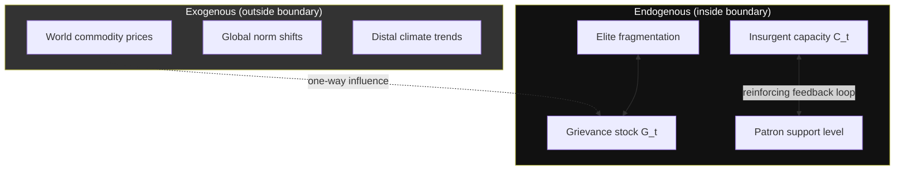

## System Boundary Specification and Actor Aggregation-Level Delineation

### Formal Purpose

Before any conflict system can be modeled — stock-flow, game-theoretic, or network-based — two prior specification choices must be made explicit, because they are not discovered from data but *imposed by the analyst*: (1) the **system boundary**, which variables and feedback loops are treated as endogenous versus held exogenous, and (2) the **aggregation level**, the granularity at which actors are treated as unitary decision-making nodes. Both choices are underdetermined by the empirical situation itself and materially change model output; this is the modeling-methodology analogue of Waltz's levels-of-analysis problem in IR, generalized to arbitrary system boundaries rather than only the individual/state/system triad.

### Boundary Specification

**Definition:** The system boundary is the set of variables and feedback relationships the model treats as **endogenous** (determined within the model, subject to feedback) versus **exogenous** (treated as fixed inputs or unmodeled shocks). A boundary choice is a modeling decision, not an empirical fact — the same real-world conflict can be validly modeled with different boundaries depending on the analytical question being asked, and different boundary choices are not "more" or "less" correct in the abstract, only more or less fit for a given diagnostic or design purpose.

**Formal criterion for inclusion:** a variable belongs endogenous to the system if there exists a feedback path from the core dynamics of interest back to that variable, over the time horizon under analysis. A variable is legitimately exogenous if it influences the system but is not, in turn, significantly influenced by it within the relevant horizon.

**Common boundary-drawing errors, each with a specific failure signature:**

- **Boundary too narrow (excessive exogeneity):** treating a variable that is actually feedback-coupled to the system as a fixed external shock. Classic example: treating "foreign patron support to an insurgency" as exogenous input, when in fact insurgent battlefield success (endogenous) causally increases patron willingness to invest (a reinforcing loop the analyst has boundary-excluded). This produces models that fail to reproduce escalation dynamics and systematically underestimate conflict duration, because the model cannot represent the self-reinforcing patron-insurgent loop.
- **Boundary too wide (spurious endogeneity):** including variables with no meaningful feedback path back into the core dynamics over the relevant horizon, which dilutes analytical tractability without adding explanatory power — e.g., including global commodity price formation as fully endogenous to a single civil war model when the war's marginal effect on world price is negligible; the correct treatment is exogenous input (a "one-way" boundary edge).
- **Horizon-boundary mismatch:** a boundary correct for a 2-year analysis may be wrong for a 20-year analysis, because variables with feedback loops longer than the short horizon (e.g., generational identity formation, demographic shifts) are legitimately exogenous in the short model and illegitimately excluded in the long one.

**Formal representation:** in System Dynamics practice this is made explicit via a **boundary diagram** (distinct from the causal loop diagram itself) that explicitly lists included/excluded variables and states the horizon and purpose driving each boundary decision — this artifact is a standard deliverable in rigorous conflict-system modeling precisely because boundary choices are otherwise implicit and unexamined.

### Actor Aggregation-Level Delineation

**Definition:** Aggregation level specifies the granularity at which real-world individuals or sub-groups are collapsed into a single modeled "actor" node with unitary preferences and a single decision function. This is the conflict-modeling instance of the general **unitary actor assumption** used throughout game-theoretic IR (treating "the state" as a single rational player), and its validity is scale- and question-dependent, not universal.

**Standard aggregation tiers used in conflict system modeling, from coarsest to finest:**

1. **System/regional level**: blocs, alliances, or regional order treated as unitary (e.g., "NATO," "the Coalition") — appropriate only when internal cohesion is high relative to the dynamics of interest.
2. **State level**: the state treated as a unitary rational actor — the standard IR simplification, valid for questions about interstate signaling and deterrence, invalid for questions about civil conflict onset, where the state's internal fragmentation is precisely the object of study.
3. **Faction/organizational level**: sub-state armed groups, political parties, or elite coalitions treated as unitary — necessary once the state-level aggregation breaks down (multi-party civil wars, coup-prone regimes), but each faction is itself an aggregation over its members.
4. **Individual/leader level**: single decision-makers modeled explicitly — required for questions turning on individual psychology, leader replacement, or principal-agent dynamics between a leader and their faction.
5. **Micro-level population**: households or individuals treated with heterogeneous, distributed attributes rather than a single representative agent — required for questions about differential victimization, displacement, or bottom-up mobilization, and is the domain of agent-based modeling (ABM) rather than the unitary-actor game-theoretic approach.

**Formal validity criterion — the unitary-actor assumption holds when:**

$$\text{Var}(\text{preferences within group}) \ll \text{Var}(\text{preferences between groups})$$

i.e., aggregation is valid exactly when intra-group preference variance is small relative to inter-group variance on the dimension relevant to the model's question. When this condition fails — e.g., a rebel group with a moderate negotiating wing and a radical spoiler wing whose preference variance is comparable to the variance between the rebel group and the government — treating that rebel group as a single unitary actor produces a specific, diagnosable modeling error: the model cannot represent **spoiler dynamics**, defined as actors within a nominally single camp who act to undermine a negotiated settlement because their individual payoff from continued conflict exceeds their payoff from the settlement their own "unitary" actor is modeled as pursuing (Stedman's spoiler problem typology). This is the single most common aggregation-level error in peace-process modeling: analysts model "the rebels" as one player in a two-player bargaining game, then are surprised when a faction defects from an agreement the aggregate player accepted.

**Aggregation-level mismatch across a single model** is also a distinct failure mode: modeling the government as a fully unitary actor while modeling the opposition at the faction level creates an asymmetric information/coherence advantage in the model that may not reflect the empirical situation (governments are frequently just as internally fragmented, e.g., between military and civilian factions, or center and periphery).

### Interaction Between Boundary and Aggregation Choices

The two specification problems are not independent: narrowing the aggregation level (moving from state to faction to individual) generally *requires* widening the system boundary, because finer-grained actors introduce new feedback relationships (e.g., intra-faction bargaining, leader succession dynamics) that a coarser model could legitimately leave exogenous or ignore entirely. A model that disaggregates actors without correspondingly re-examining its boundary will contain unitary-actor-era boundary assumptions applied to a finer-grained actor set — a common and diagnosable inconsistency in applied conflict models that mixes a fine aggregation level with a boundary drawn for a coarse one.

**Key Points**

- Boundary and aggregation-level choices are analyst-imposed modeling decisions, not empirical discoveries — validity is judged against the specific question and horizon, not in the abstract.
- Boundary-too-narrow errors exclude real feedback loops (producing models that miss escalation dynamics); boundary-too-wide errors dilute tractability without added explanatory power.
- The unitary-actor assumption is formally valid exactly when within-group preference variance is small relative to between-group variance on the relevant dimension; violation produces the specific, diagnosable spoiler-dynamics failure mode.
- Disaggregating actors without correspondingly widening the system boundary produces an internally inconsistent model — the two specification choices are coupled, not independent.

**Related Topics**

- Stedman's spoiler problem typology in peace process design
- Levels-of-analysis problem in International Relations (Waltz)
- Agent-based modeling vs. game-theoretic unitary-actor modeling
- Structural, proximate, and triggering cause taxonomy in conflict diagnosis
- Causal loop diagrams and System Dynamics boundary diagrams
- Principal-agent problems between armed group leadership and rank-and-file