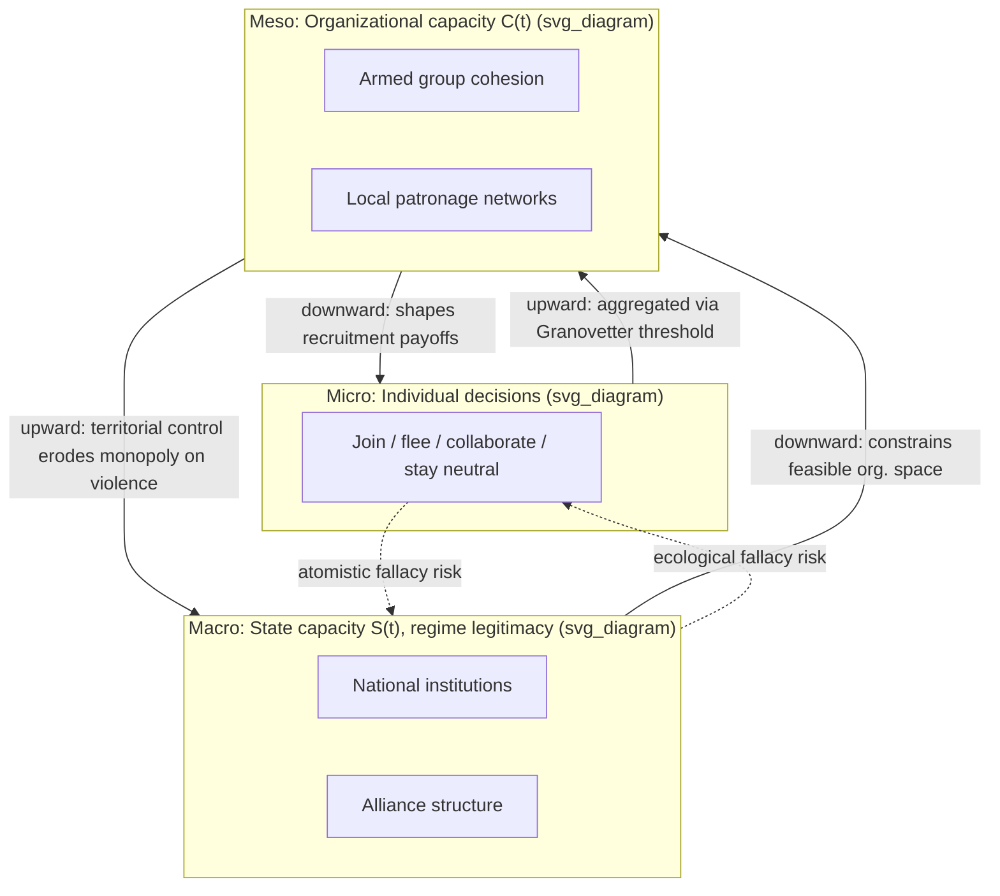

## Micro, Meso, and Macro Coupling Models in Conflict System Analysis

### Formal Purpose

Recall that actor aggregation-level delineation specifies the granularity at which real-world actors are collapsed into modeled nodes; the micro-meso-macro framework addresses a distinct, downstream problem: **how do dynamics at one aggregation level causally propagate to and from dynamics at another**, given that most conflict-relevant outcomes are jointly determined across levels rather than fully explained at any single level. This is the conflict-systems instance of the general micro-macro coupling problem in complex systems theory (cf. Coleman's boat / Coleman diagram from analytical sociology), applied specifically to political violence.

### The Three Levels, Defined

- **Micro level**: individual and household-level decision-making — an individual's decision to join an armed group, flee, collaborate, or stay neutral. State variables here are individual-level (perceived threat, economic opportunity cost, social network ties, exposure to prior violence).
- **Meso level**: organizational, community, and network-level structures — armed group command structures, local militias, ethnic associational networks, village-level institutions. State variables are group-level (organizational cohesion, recruitment capacity, local social capital, network density).
- **Macro level**: state, regime, and system-level structures — national institutions, regime type, interstate alliance structure, national economic aggregates. State variables are national/international-level (state capacity $S(t)$, regime legitimacy, GDP growth, alliance commitments).

This is a direct extension of the aggregation tiers in system boundary specification, but reframed around **coupling direction** rather than static classification: the object of analysis is the causal traffic between levels, not the levels themselves.

### Downward Causation (Macro → Meso → Micro)

**Mechanism:** macro-level structural conditions set the *parameter space* within which meso and micro actors optimize, without determining any individual's specific choice. Formally, macro variables enter as **constraints or payoff-shifters** in lower-level decision functions rather than as direct causes of individual behavior.

- **Macro → Meso:** state capacity $S(t)$ determines the feasible operating space for armed organizations — a weak state with limited territorial control (macro) permits meso-level insurgent organizations to establish parallel governance and taxation (this is the core logic of Fearon and Laitin's "feasibility" thesis: civil war onset correlates with state weakness because weakness expands the meso-level organizational opportunity set, not because weak states generate more grievance).
- **Meso → Micro:** local organizational structure (meso) shapes individual recruitment payoffs — an armed group with strong local patronage networks (meso) can lower the marginal cost of individual mobilization (micro) via selective incentives (Olson's collective action logic applied to insurgency, following Weinstein's *Inside Rebellion*: resource-rich organizations recruit opportunistically via material incentives, resource-poor organizations recruit via commitment-screening, producing systematically different micro-level participant profiles from an identical macro shock).

### Upward Causation (Micro → Meso → Macro)

**Mechanism:** aggregated individual choices, mediated through meso-level organizational structures, feed back into and can alter macro-level state variables. This is where the boundary-specification problem re-enters: whether this upward channel is modeled as endogenous feedback or held exogenous is exactly the boundary-drawing decision discussed in system boundary specification.

- **Micro → Meso:** individual defection or recruitment decisions aggregate into meso-level organizational capacity $C(t)$ — a threshold number of individually-rational recruitment decisions is required before a meso-level organization crosses its own viability threshold (a micro-founded version of Tilly's mobilization theory, formalized via threshold models of collective behavior, e.g., Granovetter's threshold model: each individual's participation decision depends on the *number of others already participating*, producing tipping-point dynamics at the meso level from purely micro-level rational choice).
- **Meso → Macro:** aggregated organizational capacity and territorial control (meso) feed back into macro state capacity — sustained insurgent territorial control degrades the state's macro-level monopoly on legitimate violence, which is precisely the reinforcing loop that boundary-too-narrow models exclude when they treat "state capacity" as a purely exogenous macro parameter.

### The Central Analytical Hazard: Level Conflation

**Ecological fallacy in the conflict-modeling context:** inferring individual (micro) motivation directly from macro-level correlations. The canonical example: cross-national econometric findings that civil war onset correlates with low per-capita GDP (macro) are frequently — and incorrectly — read as evidence that individual poverty motivates individual rebel participation (micro). Empirical micro-level studies (e.g., Humphreys and Weinstein's survey work on ex-combatants) do not consistently support a simple poverty-motivates-individual-recruitment mechanism; the macro correlation is better explained via the state-capacity/feasibility channel (macro-meso) than via a direct micro-level grievance channel. This is a direct instance of Robinson's original ecological fallacy warning, and its persistence in conflict studies is a well-documented methodological critique (associated particularly with the critique of early "greed vs. grievance" cross-national regressions for conflating levels).

**Atomistic fallacy (the inverse error):** inferring macro-level outcomes directly from micro-level individual preferences without modeling the meso-level aggregation mechanism — e.g., assuming that because most individuals in a population prefer peace, macro-level conflict cannot be sustained, which ignores that meso-level organizational structures can sustain conflict via selective incentives and coercion even against a majority-micro preference for peace (this is formally identical to the logic of why a small, well-organized meso-level actor can dominate outcomes despite an unfavorable aggregate micro-level preference distribution — a standard collective-action/free-rider result).

### Formal Coupling Representation

A minimal three-level coupled model represents each level's state as evolving under both its own internal dynamics and cross-level coupling terms:

$$\dot{X}_{macro} = f_{macro}(X_{macro}) + \eta_1 \cdot \Psi_{meso \to macro}(X_{meso})$$

$$\dot{X}_{meso} = f_{meso}(X_{meso}) + \eta_2 \cdot \Psi_{macro \to meso}(X_{macro}) + \eta_3 \cdot \Psi_{micro \to meso}(X_{micro})$$

$$\dot{X}_{micro} = f_{micro}(X_{micro}) + \eta_4 \cdot \Psi_{meso \to micro}(X_{meso})$$

where each $\Psi$ is a coupling function and each $\eta$ is a coupling-strength parameter. **The magnitude of each $\eta$ is precisely what boundary specification determines**: setting $\eta = 0$ for a given channel is formally equivalent to declaring that cross-level channel exogenous/absent from the model. [Inference] This generalized coupled-ODE representation is a pedagogical synthesis for exposition; applied conflict models rarely instantiate all three levels simultaneously in closed form, more commonly pairing agent-based micro/meso simulation with reduced-form macro inputs, or vice versa.

### Design Implication: Level-Matched Intervention

Because upward and downward coupling channels are distinct causal pathways, an intervention targeting the wrong level for a given outcome variable is a specific, diagnosable design error, not merely a matter of degree:

- A **macro-level intervention** (national power-sharing constitutional design) aimed at reducing micro-level individual violence will only work if the downward macro→meso→micro coupling channel is intact — if meso-level organizations have developed independent, self-sustaining patronage economies (a common post-conflict pathology), macro reform can leave meso-level violence largely unaffected because the coupling term $\eta_2$ has effectively decoupled.
- A **micro-level intervention** (individual demobilization/reintegration payments, per DDR — disarmament, demobilization, reintegration — programming) aimed at reducing macro-level conflict recurrence will only succeed if the upward micro→meso→macro channel is functioning — individually reintegrated ex-combatants reduce macro conflict risk only if their exit meaningfully degrades meso-level organizational viability ($C(t)$), which requires the DDR program to reach a threshold fraction of a given group's membership rather than a diffuse, sub-threshold trickle (a direct application of Granovetter threshold logic to program design).

**Key Points**

- The micro-meso-macro framework specifies coupling direction and mechanism between aggregation levels, distinct from the static level-classification problem addressed in actor aggregation-level delineation.
- Downward causation operates via constraint/payoff-shifting (macro sets the feasible space meso operates in; meso sets individual payoffs); upward causation operates via threshold aggregation (Granovetter-style) mediated through meso-level organizational structures.
- Ecological fallacy (macro correlation misread as micro motivation) and atomistic fallacy (micro preference misread as macro outcome) are the two canonical, opposite-direction level-conflation errors in conflict studies.
- Each cross-level coupling strength $\eta$ is precisely the parameter that system-boundary specification sets to zero or nonzero; intervention design must match the level at which the causal channel is actually intact, not merely the level at which the outcome is measured.

**Related Topics**

- System boundary specification and actor aggregation-level delineation
- Granovetter threshold models of collective behavior
- Fearon and Laitin's feasibility thesis of civil war onset
- Weinstein's resource-based theory of rebel recruitment (*Inside Rebellion*)
- Ecological and atomistic fallacies in cross-level inference
- DDR (disarmament, demobilization, reintegration) program design and threshold effects