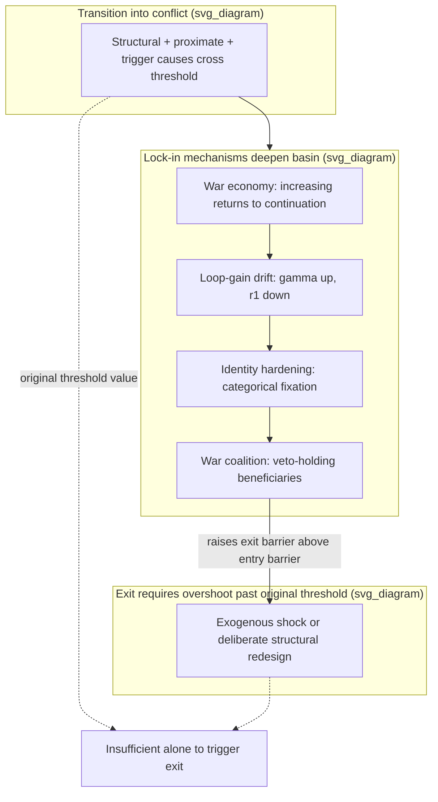

## Path Dependency and Lock-In Mechanisms in Conflict Trajectories

### Formal Definition

Path dependency describes a dynamical property in which the sequence of past states materially constrains the set of currently reachable states, such that two systems with identical *current* parameter values can occupy different regions of state space, and evolve differently going forward, solely because they arrived via different histories. Formally, a system is path-dependent if its state transition function is **non-Markovian with respect to current parameters alone** — the transition probability depends not just on $X(t)$ but on the trajectory $\{X(\tau)\}_{\tau<t}$, or equivalently, on accumulated stock variables (recall grievance stock $G(t)$ from stock-flow modeling) that encode history into the present state. This is the formal justification for modeling grievance and related conflict variables as stocks rather than as functions of current conditions alone: a stock *is* the mechanism by which history enters the present state.

**Lock-in** is the stronger, terminal case of path dependency: a state or trajectory from which the system cannot exit via the ordinary operation of its own internal dynamics, requiring an exogenous shock or deliberate structural intervention to escape. Formally, lock-in occurs when the system's attractor landscape has a basin of attraction so deep, or a transition barrier so high, that endogenous forces alone are insufficient to cross it within any policy-relevant time horizon.

### Mechanism 1: Increasing Returns and Self-Reinforcement

Drawing on Paul Pierson's application of increasing-returns economics (originally Arthur, David) to political processes: a trajectory becomes locked in when each additional step along it *lowers the relative cost* of continuing versus switching. In conflict systems, the canonical increasing-returns mechanism is the **war economy**: as conflict duration increases, actors develop specialized capital (smuggling networks, patronage relationships, weapons-procurement infrastructure) whose value is conditional on conflict continuing. Formally, if $V_{continue}(t)$ and $V_{exit}(t)$ are the respective payoffs to continuing versus exiting the conflict trajectory at time $t$:

$$\frac{d}{dt}\left[V_{continue}(t) - V_{exit}(t)\right] > 0$$

Each period of continued conflict raises the *relative* payoff to continuing further, not because conflict intrinsically pays more, but because switching costs (foregone specialized investment, loss of protection rents) rise monotonically with trajectory length. This is the formal skeleton of Collier's "conflict trap": conflict duration itself becomes a predictor of further duration, independent of the conflict's original structural or proximate causes, because increasing returns have decoupled continuation from the original cause.

### Mechanism 2: Reinforcing Feedback Loops Producing Attractor Deepening

Recall the R1 reinforcing loop from stock-flow grievance modeling (repression $\to$ grievance $\to$ mobilization $\to$ repression). Path dependency emerges when repeated traversal of a reinforcing loop **changes the loop's own gain parameters**, not merely the stock level — this is a second-order effect distinct from ordinary reinforcing-loop escalation. Each cycle through the repression-grievance loop can:

- Raise $\gamma(t)$ (narrative amplification gain) permanently, as atrocity narratives become embedded in group identity and intergenerational transmission — this converts the once-exogenous, event-specific amplification term into a persistent structural parameter.
- Degrade $r_1(t)$ (institutional redress capacity) irreversibly, as courts, media, and civil-society outflow mechanisms are captured or destroyed during conflict, meaning the *outflow-side infrastructure* required for eventual de-escalation is itself consumed by the escalation process.

This is why conflicts frequently do not "settle" when the original structural or proximate causes are addressed: the loop's own operation has altered the system's parameters, producing what Pierson terms a **moving target** — the conditions required for resolution have shifted during the conflict itself, distinct from the conditions that caused onset.

### Mechanism 3: Identity Hardening and Categorical Fixation

A specific lock-in mechanism operating at the meso/macro coupling level (recall micro-meso-macro coupling): sustained conflict along an identity cleavage tends to **harden the cleavage's categorical boundaries** — ambiguous, cross-cutting, or fluid pre-conflict identities become binary and rigid under conditions of violence, because violence forces individuals to publicly signal categorical affiliation for security reasons (a costly-signaling dynamic under threat). This is empirically documented in cases of pre-conflict intermarriage rates and mixed neighborhoods collapsing rapidly and *not rebounding* post-conflict even after violence ends — the categorical hardening outlasts the proximate violence that produced it, constituting a lock-in of social structure independent of any single actor's continued strategic choice.

### Mechanism 4: Institutional and Elite Lock-In (War Coalition Persistence)

Wartime governance frequently generates a **war coalition** — a specific configuration of elites, security-sector actors, and economic beneficiaries whose material and political position depends on the conflict's continuation. This produces a **veto-holding constituency for non-resolution**: distinct from a spoiler (recall Stedman's spoiler typology, who acts to undermine a *specific proposed settlement*), a locked-in war coalition has no active sabotage strategy — it simply constitutes a standing structural interest against any transition, embedded in formal and informal institutional positions (military procurement contracts, checkpoint taxation, control over reconstruction aid flows). Removing this lock-in mechanism typically requires an exogenous shock (military defeat, external sanction regime, leadership death) precisely because the coalition's members have no unilateral incentive to defect from the status quo even when the aggregate societal payoff to peace is high — a collective-action failure among winners-from-war rather than a grievance problem.

### Formal Representation: Attractor Landscape and Hysteresis

The composite effect of these mechanisms is best represented not as a single-equilibrium system but as a system with **multiple stable equilibria and hysteresis** — recall the hysteresis property introduced in stock-flow grievance modeling, where the ratchet-like inflow-outflow asymmetry prevents symmetric reversal. A conflict system with lock-in exhibits a potential-landscape structure where:

$$\frac{dX}{dt} = -\frac{\partial U(X, p)}{\partial X}$$

with $U(X,p)$ a potential function over conflict-state $X$ and control parameter $p$ (e.g., aggregate structural conditions). Lock-in corresponds to $X$ residing in a deep local minimum of $U$; the same value of $p$ that originally allowed transition *into* the conflict basin (via structural/proximate/triggering causes, per the three-tier taxonomy) is **not** sufficient to transition back out, because the basin has deepened via mechanisms 1–4 above. Exit requires $p$ to move substantially past its original transition-triggering value — the hallmark signature of hysteresis, and the formal reason "removing the original cause" is frequently insufficient for conflict termination.

### Design Implication: Why Symmetric Policy Fails

The central design payoff: because lock-in mechanisms are asymmetric (easy entry into conflict, hard exit), **policy interventions modeled on reversing the original cause are structurally insufficient** — this is the same asymmetric-ratchet logic introduced under grievance stock-flow hysteresis, now generalized across war-economy, loop-gain, identity, and elite-coalition channels simultaneously. Effective peace engineering targeting lock-in must therefore:

- **Target the specific lock-in mechanism, not the original cause** — e.g., war-economy lock-in requires deliberate economic transition programming (alternative livelihoods for war-economy-dependent actors) rather than merely addressing the conflict's original horizontal-inequality trigger.
- **Anticipate moving-target conditions** — a peace process designed against the conflict's *original* structural/proximate causes will underperform if $\gamma(t)$ and $r_1(t)$ have drifted during the conflict; diagnosis must be re-run against current, not initial, system parameters.
- **Address elite lock-in via incentive redesign, not persuasion** — because war-coalition persistence is a collective-action problem among beneficiaries rather than an information or grievance problem, mechanisms that change the war coalition's *payoff structure* (targeted sanctions on war-economy revenue streams, security-sector integration offering elites a stake in a peace-economy) are mechanistically appropriate; appeals to shared societal interest are not, because the coalition's members are individually rational in refusing unilateral defection from a profitable status quo.

**Key Points**

- Path dependency means the transition function depends on trajectory history (encoded via stocks), not current parameters alone; lock-in is the terminal case where endogenous dynamics cannot produce exit without exogenous intervention.
- Increasing-returns war economies raise the relative payoff to continuing conflict as duration increases, independent of the conflict's original cause — the formal basis of Collier's conflict trap.
- Reinforcing loops can alter their own gain parameters over repeated cycles (loop-gain drift), producing a "moving target" where the conditions needed for resolution differ from the conditions that caused onset.
- Locked-in war coalitions constitute a standing structural veto against resolution via collective-action failure among war's material beneficiaries, distinct from active spoiler sabotage of a specific settlement.
- Hysteresis means the parameter value sufficient to trigger conflict onset is generally insufficient to trigger exit; policy must overshoot past the original threshold or target lock-in mechanisms directly.

**Related Topics**

- Stock and flow modeling of grievance accumulation and depletion
- Structural, proximate, and triggering cause taxonomy in conflict diagnosis
- Collier's conflict trap and post-conflict recurrence risk
- Stedman's spoiler problem typology in peace process design
- Micro, meso, and macro coupling models in conflict system analysis
- War economy transition and DDR program design