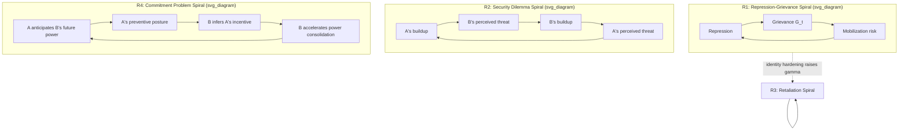

## Reinforcing Feedback Loops in Conflict Escalation Spirals

### Formal Definition

A reinforcing (positive) feedback loop is a closed causal chain in which a change in a variable propagates through the loop and returns to that variable with the **same sign** — an increase produces further increase, a decrease produces further decrease. Formally, for a loop with $n$ causal links each carrying a polarity $s_i \in \{+1, -1\}$, the loop is reinforcing if and only if $\prod_{i=1}^{n} s_i = +1$. This is distinct from a loop being reinforcing *in effect* only over some parameter range — polarity is a structural property of the causal links, not of the current trajectory, and a correctly identified reinforcing loop can still be dominated by a stronger balancing loop at a given moment (a point returned to below).

Reinforcing loops are the formal mechanism underlying escalation: they do not merely correlate with rising conflict intensity, they are the causal structure that *produces* unbounded (or boundedly unbounded, see saturation below) growth absent an external constraint. The R1 loop introduced in stock-flow grievance modeling (repression → grievance → mobilization → repression) is a specific instance of this general class.

### Canonical Escalation-Spiral Loop Structures

**R1 — Repression-Grievance Spiral** (recall from grievance stock-flow modeling): state repression $i_1(t)\uparrow$ → grievance stock $G(t)\uparrow$ → mobilization risk $\uparrow$ → state repression $\uparrow$. Polarity check: repression→grievance (+), grievance→mobilization (+), mobilization→repression (+, assuming a repressive-response state); product $= +1$, confirming reinforcing polarity.

**R2 — Security Dilemma Spiral**: one actor's defensive military buildup, undertaken to increase its own security, is perceived by a rival as offensive, prompting the rival's own buildup, which the first actor perceives as confirming threat, prompting further buildup. This is the classic security dilemma — a situation where actions taken by one actor to increase its own security decrease the security of others, who respond in kind, producing mutual insecurity despite no actor's underlying intent being aggressive (Jervis's spiral model). Formally: $\text{Buildup}_A \uparrow \to \text{Perceived Threat}_B \uparrow \to \text{Buildup}_B \uparrow \to \text{Perceived Threat}_A \uparrow \to \text{Buildup}_A \uparrow$. The loop's reinforcing property holds *independent of either actor's actual intentions* — this is the key diagnostic feature distinguishing a genuine security-dilemma spiral from a rationally-targeted arms race against a genuinely revealed aggressive type; the spiral operates purely on perception-updating dynamics, making it a structural (not merely informational) escalation driver.

**R3 — Retaliation/Revenge Spiral**: violence by Actor A against Actor B's group → in-group solidarity and out-group hostility rise within B (following intergroup threat theory) → retaliatory violence by B against A → in-group solidarity and hostility rise within A → further violence by A. Distinct from R1 in that the loop does not require state involvement — it operates at the meso/micro coupling level (recall micro-meso-macro coupling) between any two identity-differentiated groups, and its persistence is substantially carried by the identity-hardening mechanism (recall path dependency mechanism 3): each retaliation cycle further rigidifies categorical group boundaries, which lowers the threshold for future retaliatory mobilization.

**R4 — Commitment Problem Spiral**: recall that a commitment problem arises when a rising power cannot credibly promise not to exploit its future strength. In escalation terms: Actor A's anticipation of B's future relative power gain (even absent any current hostile action by B) generates a preventive-war incentive for A; A's preventive posturing is observed by B, who — correctly inferring A's incentive structure — accelerates its own power consolidation to entrench gains before A acts, which further validates A's original expectation. This loop is reinforcing even though **both actors may be acting on entirely accurate beliefs about the other's rational incentives** — it is not a perception-error spiral like R2 but a structural information/commitment failure: there exists no credible mechanism by which B can bind its future self not to exploit rising power, so A's fear is not merely subjective misperception but a correct read of an uncommitted, un-bindable future actor.

### Loop Gain and Escalation Rate

The **loop gain** determines the *rate* of escalation, not merely its direction. For a discrete-time reinforcing loop with per-cycle multiplicative gain $\lambda$:

$$X_{t+1} = \lambda \cdot X_t, \quad \lambda > 1 \implies \text{exponential escalation}$$

Recall the narrative amplification term $\gamma(t)$ from grievance stock-flow modeling — this is precisely a loop-gain parameter, and recall from path dependency that repeated loop traversal can **itself raise $\gamma(t)$** (loop-gain drift), meaning escalation spirals are frequently not constant-rate exponential processes but *accelerating* ones, where $\lambda$ itself increases with cumulative loop cycles: $\lambda(n) $ increasing in $n$, the cycle count. This is the formal reason many empirical escalation trajectories show super-exponential (rapidly accelerating) rather than simple exponential growth in violence intensity once a spiral is established.

### Why Reinforcing Loops Do Not Escalate Without Bound: Saturation and Loop Dominance

A structurally reinforcing loop produces theoretically unbounded growth only in the absence of countervailing constraints; real conflict systems virtually always exhibit **loop dominance shifts** — periods where the reinforcing loop's influence on system behavior is progressively offset by a balancing loop whose strength grows with the state variable (commonly a capacity-limited resource: population available for mobilization, weapons stockpiles, external material support), producing an S-shaped (logistic-like) rather than pure exponential trajectory:

$$\frac{dX}{dt} = \lambda X \left(1 - \frac{X}{K}\right)$$

where $K$ is a carrying-capacity-like ceiling (maximum sustainable mobilization, resource-constrained violence intensity). Near $X \ll K$, the reinforcing term dominates and growth is approximately exponential; as $X \to K$, the balancing term $(1 - X/K)$ increasingly offsets it, and growth decelerates. **Diagnostic implication:** an observed deceleration in escalation is not evidence that the reinforcing loop has been "broken" — it may simply indicate the system has approached a resource ceiling, with the reinforcing structure fully intact and ready to resume rapid growth if $K$ is exogenously raised (e.g., new external arms supply, new recruitment pool becoming available) or if $\lambda$ increases via loop-gain drift.

### Diagnostic Method: Identifying Loop Polarity and Dominance

Standard causal loop diagram (CLD) practice for escalation analysis requires two separate determinations, frequently conflated in informal conflict narratives:

1. **Polarity determination** — trace each causal link's sign and take the product; this is a structural, time-invariant property of the hypothesized causal mechanism, verifiable independent of current data.
2. **Dominance determination** — an empirical, time-varying question of which loop(s) currently dominate observed system behavior; requires examining actual trajectory data (accelerating vs. decelerating vs. oscillating), since a correctly-identified reinforcing loop can be present but currently dominated by a balancing loop, and vice versa.

Conflating these two questions produces a specific, diagnosable analytical error: observing a currently-stable or decelerating conflict and concluding the underlying reinforcing structure (e.g., R2 security dilemma) does not exist, when in fact it exists but is currently loop-dominated by a resource or capacity ceiling — a fragile stability that resumes escalating the moment the ceiling is relaxed.

### Design Implication: Breaking a Reinforcing Loop vs. Suppressing Its Output

Because loop *polarity* is structural, peace-engineering intervention has two formally distinct target types, with different robustness properties:

- **Break a link's polarity or magnitude** (structural intervention): e.g., converting R2 by introducing credible verification/transparency mechanisms (arms control inspection regimes) that decouple "B's buildup" from "A's perceived threat" — reducing the *magnitude* of that specific causal link, ideally toward zero, which durably removes the loop's capacity to reinforce regardless of current dominance status. This directly targets the R4 commitment problem as well: a credible commitment device (third-party verification, binding institutional constraint) is precisely a mechanism that severs the "B accelerates consolidation" → "A's fear validated" link by making B's restraint verifiable rather than merely asserted.
- **Suppress current output while leaving structure intact** (symptomatic intervention): e.g., a ceasefire or peacekeeping deployment that lowers current violence levels without altering the underlying causal links — this operates as an artificially imposed balancing constraint (effectively lowering $K$ or introducing an external damping term) rather than removing the reinforcing loop itself, meaning the structural spiral resumes at full rate upon withdrawal of the suppressing mechanism. This is the formal explanation for the well-documented pattern of conflict recurrence immediately following peacekeeping withdrawal, even absent any new triggering event: the reinforcing loop was suppressed, never broken.

**Key Points**

- A loop is reinforcing exactly when the product of its causal-link polarities equals $+1$; this is a structural property, independent of whether the loop currently dominates observed system behavior.
- R2 (security dilemma) and R4 (commitment problem) spirals are both reinforcing and both can operate under fully accurate mutual beliefs — escalation does not require misperception, only the specific causal structures described.
- Loop gain determines escalation rate; loop-gain drift (recall path dependency) can convert simple exponential escalation into accelerating, super-exponential escalation.
- Real escalation trajectories are typically logistic (S-shaped) due to loop dominance shifts toward a resource-constrained balancing loop, not evidence the reinforcing structure has been removed.
- Structural intervention (breaking a causal link's magnitude, e.g., via verification mechanisms) durably removes escalation capacity; symptomatic suppression (ceasefires, peacekeeping) leaves the loop intact and predicts recurrence upon withdrawal.

**Related Topics**

- Stock and flow modeling of grievance accumulation and depletion
- Path dependency and lock-in mechanisms in conflict trajectories
- Balancing feedback loops and negative-feedback stabilization in conflict systems
- Jervis's spiral model and the security dilemma
- Credible commitment devices and third-party verification mechanisms
- Micro, meso, and macro coupling models in conflict system analysis