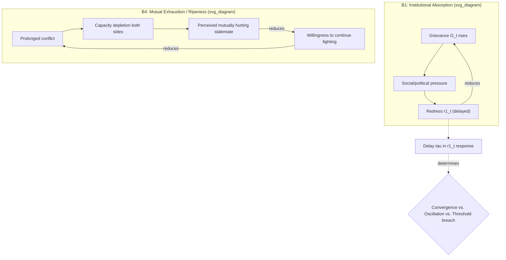

## Balancing Feedback Loops and Self-Limiting Conflict Dynamics

### Formal Definition

A balancing (negative) feedback loop is a closed causal chain in which a change in a variable propagates through the loop and returns to that variable with the **opposite sign**, producing self-correction toward a goal state or equilibrium rather than sustained growth. Recall the polarity criterion from reinforcing feedback loops: for a loop with $n$ links each carrying polarity $s_i \in \{+1,-1\}$, the loop is balancing exactly when $\prod_{i=1}^n s_i = -1$. Balancing loops are goal-seeking by structure — they act to close a *gap* between a current state and a reference state, and their characteristic behavior is convergence, oscillation-and-convergence, or sustained oscillation, depending on gain magnitude and delay length (both addressed below), never unbounded growth.

Balancing loops are the structural reason conflict systems do not universally escalate to total destruction despite the presence of reinforcing loops (recall R1–R4 from reinforcing feedback loops) — every documented case of de-escalation, negotiated settlement, or simple non-escalation of a potential spiral implies at least one balancing loop currently dominating the relevant reinforcing structure. This directly extends the loop-dominance concept: escalation and self-limitation are not different *types* of conflict, but different dominance regimes of the same underlying causal-loop structure.

### Canonical Balancing-Loop Structures in Conflict Systems

**B1 — Institutional Absorption** (introduced in grievance stock-flow modeling): grievance stock $G(t)\uparrow$ → political/social pressure $\uparrow$ → institutional redress $r_1(t)\uparrow$ → $G(t)\downarrow$. The reference state this loop seeks is an acceptable grievance level, and its gap-closing mechanism is institutional throughput capacity — the loop's effectiveness is therefore bounded by $r_1$'s maximum processing rate, a hard capacity constraint distinct from the loop's polarity.

**B2 — Deterrence and Cost Escalation**: as conflict intensity $X(t)$ rises, the marginal cost of continued fighting rises for at least one party (casualties, economic destruction, loss of external support) faster than the marginal expected benefit, reducing that party's willingness to escalate further, which caps $X(t)$'s growth. Formally, this is the balancing analog of the security dilemma's reinforcing structure: where R2 links buildup to perceived threat to further buildup, B2 links intensity to *cost* to reduced willingness to intensify — the same actor-response structure, opposite-sign link. Both loops can be simultaneously present and structurally correct; which dominates depends on the actors' cost sensitivity and resource endowment, an empirical rather than structural question (recall the polarity-vs-dominance distinction from reinforcing loops).

**B3 — Capacity/Resource Ceiling** (the balancing component of the logistic escalation model introduced under reinforcing loops): $\frac{dX}{dt} = \lambda X(1 - X/K)$ — the $(1-X/K)$ term is itself a balancing loop: as $X$ approaches carrying capacity $K$ (available fighters, matériel, financing), further increase in $X$ reduces the *rate* of increase, since resource competition among mobilized actors intensifies. This loop's reference state is not a policy-chosen equilibrium but a structurally imposed ceiling — it will cap escalation even absent any actor's deliberate restraint, which is why B3 is present in essentially every real conflict trajectory regardless of the actors' intentions.

**B4 — Mutual Exhaustion (Hurting Stalemate)**: prolonged conflict depletes both sides' capacity to sustain further violence at previous intensity, producing convergence toward a state where neither side can achieve unilateral improvement through continued fighting. This is the causal-loop-diagram formalization of Zartman's **ripeness theory**: a conflict becomes ripe for negotiated resolution specifically when both parties perceive themselves to be in a *mutually hurting stalemate* — a self-limiting condition where the balancing loop (mounting cost, depleting capacity) has become dominant over any residual reinforcing loop, and further, both parties **perceive** this dominance (ripeness requires the perception, not merely the objective condition — a stalemate that exists materially but is not perceived as mutually hurting by both sides does not produce negotiation-readiness, since each side rationally continues believing marginal continued investment will produce unilateral gain).

### Gain, Delay, and Oscillatory Behavior

Unlike reinforcing loops, whose defining behavioral signature is monotonic growth (possibly accelerating via gain drift), balancing loops introduce a second critical parameter beyond gain: **delay length** between the sensing of a gap and the corrective response's effect on the state variable. A balancing loop with sufficient delay does not simply converge smoothly to its reference state — it **overshoots**, producing oscillation, and can even become destabilizing if delay is long relative to the loop's natural correction timescale. Formally, for a linear balancing loop with delay $\tau$ and gain $k$:

$$\dot{X}(t) = -k \cdot X(t - \tau)$$

- **Short delay, moderate gain**: smooth exponential convergence to equilibrium (well-behaved de-escalation).
- **Delay comparable to the natural correction period**: damped oscillation — successive rounds of escalation and partial de-escalation, converging but not monotonically (a common empirical pattern in protracted low-intensity conflicts with recurring flare-ups of decreasing amplitude).
- **Delay long relative to correction period, or gain too high**: sustained or growing oscillation — the balancing loop's own delayed correction becomes destabilizing, producing recurring escalation-de-escalation cycles that do not converge, or even amplify over successive cycles.

**Mechanism producing delay in conflict systems**: institutional redress ($r_1$ in B1) typically operates with substantial delay — legal processes, negotiated settlements, and reparations mechanisms take months to years to produce effect after a grievance-reducing decision is made, while the grievance-generating (reinforcing) processes can operate on a timescale of days. This delay asymmetry is a specific, diagnosable structural vulnerability: **a balancing loop that is polarity-correct and adequately powerful in steady state can still fail to prevent escalation if its response delay exceeds the reinforcing loop's characteristic cycle time**, because the reinforcing loop can drive the system past a threshold (recall $G^*$ from grievance stock-flow modeling and threshold dynamics) before the balancing correction arrives.

### Diagnostic Method: Distinguishing True De-Escalation from Temporary Loop Suppression

Recall from reinforcing feedback loops that a suppressed reinforcing loop (via ceasefire, peacekeeping) is structurally distinct from a broken one. The symmetric diagnostic question for balancing loops: **is observed de-escalation produced by a genuine, structurally embedded balancing loop (B1–B4), or by temporary exogenous suppression of the reinforcing loop that merely masks continued reinforcing-loop readiness?** The formal test is whether the apparent balancing mechanism persists under **counterfactual removal of the current suppressing intervention** — B4 (mutual exhaustion) is a genuine structural balancing loop because it results from the actors' own depleted capacity and will persist independent of external intervention; a ceasefire enforced by external peacekeepers is not a balancing loop in this sense, because removing the peacekeepers removes the correction mechanism entirely, revealing the underlying reinforcing structure was never actually countered, merely externally suppressed.

### Design Implication: Engineering Durable Balancing Loops

Because delay is the critical vulnerability parameter, peace-engineering design for self-limiting dynamics should target **delay reduction** in balancing loops at least as much as gain magnitude:

- **Fast-response institutional redress mechanisms** (rapid-response ombudsman functions, expedited grievance-hearing tracks) reduce $\tau$ in B1 directly, closing the window during which a reinforcing loop can drive $G(t)$ past threshold before correction arrives — this is mechanistically distinct from, and complementary to, simply increasing $r_1$'s steady-state capacity.
- **Early-warning systems tied to automatic response protocols** function as delay-reduction infrastructure for B2/B4-type loops, shortening the sensing-to-correction lag that otherwise allows a reinforcing spiral to establish before any balancing mechanism engages.
- **Converting externally-suppressed stability into genuine ripeness** requires deliberately raising both sides' perceived cost of continuation (economic isolation, targeted pressure on war-economy revenue — recall the war-economy lock-in mechanism from path dependency) rather than relying on external enforcement alone, since only actor-internal cost perception constitutes a structurally embedded B4 loop that survives intervention withdrawal.
- A design implication follows directly from the ripeness-perception requirement: because B4 requires **mutual perception**, not just objective stalemate, information-transparency interventions (credible, verifiable reporting on both sides' actual capacity and losses) can accelerate ripeness onset even without altering underlying material conditions, by closing the perception gap that otherwise delays the actors' recognition of an already-existing hurting stalemate.

**Key Points**

- A loop is balancing exactly when its causal-link polarity product equals $-1$; balancing loops are goal-seeking, converging toward a reference state rather than growing without bound.
- B3 (resource/capacity ceiling) is present in essentially all real conflict trajectories independent of actor intent, explaining why pure exponential escalation is rare and logistic (S-shaped) trajectories are common.
- Delay length, not just gain, determines balancing-loop behavior: sufficient delay relative to the reinforcing loop's cycle time can cause the balancing correction to arrive too late, permitting threshold breach despite a structurally correct and adequately powerful balancing mechanism.
- Zartman's ripeness theory (mutually hurting stalemate) requires both actual balancing-loop dominance and both parties' *perception* of that dominance — objective stalemate alone is insufficient for negotiation-readiness.
- Externally suppressed reinforcing loops (ceasefires, peacekeeping) are not equivalent to genuine balancing loops; the diagnostic test is whether the correcting mechanism survives counterfactual removal of the external intervention.

**Related Topics**

- Reinforcing feedback loops in conflict escalation spirals
- Stock and flow modeling of grievance accumulation and depletion
- Zartman's ripeness theory and mutually hurting stalemate
- Path dependency and lock-in mechanisms in conflict trajectories (war economy as balancing-loop obstruction)
- Delay dynamics and oscillatory behavior in System Dynamics models
- Third-party verification and information-transparency interventions in ripeness acceleration