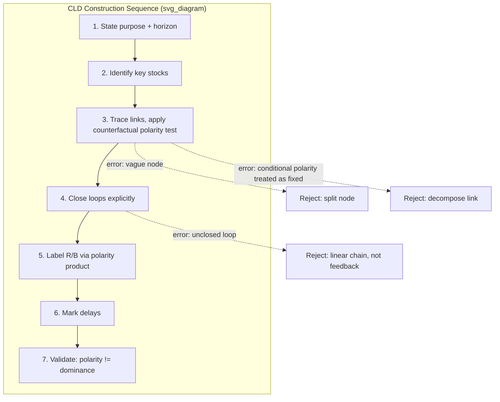

## Causal Loop Diagram Construction for Intergroup Conflict Systems

### Formal Purpose

A causal loop diagram (CLD) is the graphical formalism underlying every stock-flow and feedback-loop claim used throughout this chapter — it is the notation layer, not a separate theory. Recall that reinforcing and balancing loops were defined by the polarity product of their causal links; a CLD is the artifact that makes those links, their individual polarities, and the resulting loop-level polarity explicit and falsifiable, rather than left implicit in prose causal narrative. This item specifies the construction discipline itself: the rules, common errors, and validation procedure for building a CLD of an intergroup conflict system, as distinct from applying an already-built CLD's conclusions (the preceding items in this chapter).

### Primitive Elements

- **Variable node**: a named quantity that can meaningfully increase or decrease. Construction rule: every node must be a *stock, flow, or well-defined rate variable*, phrased so that "increase" and "decrease" are unambiguous — "Grievance" is a valid node; "Conflict" is not, because it is not stated whether increasing means intensity, duration, or geographic spread, and the modeler cannot assign a determinate polarity to any link touching an ambiguously-defined node.
- **Causal link**: a directed arrow from node A to node B, annotated with a polarity:
  - **Positive link (+)**: A and B move in the *same direction* relative to how they would otherwise have moved — an increase in A produces an increase in B (or a decrease in A produces a decrease in B) beyond what B would have done absent A's change.
  - **Negative link (−)**: A and B move in *opposite* directions relative to baseline — an increase in A produces a decrease in B beyond baseline.
- **Loop**: a closed path of links; loop polarity is the product of constituent link polarities (recall the formal criterion from reinforcing and balancing feedback loops), marked with an R (reinforcing) or B (balancing) label and typically a loop-identifying icon at the diagram's center.
- **Delay marker**: a double-hash symbol (∥) placed on a link to indicate the causal effect operates with significant lag — recall from balancing feedback loops that delay length is a first-class parameter determining oscillatory vs. convergent behavior, so delay marking is not optional decoration but a required modeling element wherever lag materially affects loop dynamics.

### Construction Discipline: Polarity Assignment Test

The single most common construction error is assigning polarity by *correlation intuition* rather than by the formal counterfactual test. The correct test for link A→B: **holding all other inputs to B constant, does an increase in A cause B to be higher or lower than it otherwise would have been?** This "than it otherwise would have been" clause is essential — it is a partial-derivative statement ($\partial B/\partial A$), not a claim about B's absolute trajectory, which may be falling for unrelated reasons even while the A→B link is positive.

A frequently misassigned example: "Peacekeeper presence" → "Violence level." Naive correlation reasoning might assign this negative in all cases (more peacekeepers, less violence), but the correct construction requires specifying the mechanism precisely — peacekeeping literature (Fortna, Doyle-Sambanis) documents contexts where peacekeeper presence perceived as biased or where mandate and capacity are mismatched to the threat produces near-zero or even counterproductive effect. Correct CLD practice is to **decompose the ambiguous link into its constituent mechanisms** (e.g., "Peacekeeper presence" → "Perceived deterrent cost of violence" [−] and separately "Peacekeeper presence" → "Perceived local bias/legitimacy" [ambiguous sign, context-dependent]) rather than asserting a single aggregate-level polarity that papers over a genuinely conditional mechanism. **A link whose sign is not stable across the relevant range of the system's operation should not be drawn as a single fixed-polarity link** — this is a core discipline distinguishing rigorous CLD construction from narrative causal-arrow diagrams.

### Aggregation and Boundary Decisions Are Made at Construction Time

Recall system boundary specification and actor aggregation-level delineation: every node in a CLD implicitly encodes both a boundary decision (is this node's own causes represented, or does it function as an exogenous input into the diagram?) and an aggregation-level decision (does this node represent a unitary actor, or an aggregate whose internal heterogeneity is being assumed away?). Construction practice requires these to be made **explicit and stated**, not left implicit in the choice of which nodes appear:

- A node drawn with no incoming arrows is an explicit claim that the node is exogenous to this diagram's boundary — this should be a deliberate decision (recall the boundary-too-narrow failure mode: an implicitly exogenous node that actually has significant endogenous feedback is a diagnosable construction error, not a neutral simplification).
- A node such as "Rebel group cohesion" aggregating a faction with internally divergent moderate/radical wings (recall the spoiler-dynamics failure mode from actor aggregation-level delineation) should be annotated or split into sub-nodes if the diagram's purpose requires representing intra-group variance — CLD construction forces this choice to be visible rather than smuggled into a single ambiguous node label.

### Common Construction Errors (Diagnostic Checklist)

1. **Vague or compound node names** ("Instability," "Tension," "The situation") — un-testable for polarity; split into specific, directionally unambiguous sub-variables.
2. **Static factor drawn as a variable node**: geography, historical colonial boundary — these do not vary over the model's time horizon and should be represented as fixed parameters or boundary conditions, not as nodes with incoming/outgoing causal links, since a node implies the quantity can meaningfully change within the model's scope.
3. **Missing delay markers on links known to operate with substantial lag** — recall from balancing feedback loops that omitting a delay marker on a genuinely lagged link (e.g., institutional redress) produces a diagram that predicts smooth convergence where oscillation or threshold-breach is the structurally correct prediction.
4. **Conflating correlation with the counterfactual polarity test** — including a link because two variables are observed to move together historically, without established mechanism-level justification for the direction of causation (a CLD-specific instance of the general causal-inference discipline of not inferring cause from correlation).
5. **Omitting loop-closing links because they are inconvenient to the analyst's preferred narrative** — the single most consequential construction error, since an incompletely closed loop diagram cannot represent feedback at all, only linear cause-effect chains dressed in loop notation; recall that the entire analytical value of systems framing over narrative cause-effect explanation (introduced in stock-flow grievance modeling) depends on loops actually being closed.
6. **Treating a link's polarity as fixed when it is actually conditional/regime-dependent** (the peacekeeper-violence example above) — the correct response is node decomposition, not polarity averaging.

### Construction Procedure

1. **State the diagram's purpose and time horizon explicitly** before drawing any nodes — this determines the correct boundary (recall horizon-boundary mismatch from system boundary specification) and which variables merit endogenous treatment.
2. **Identify the key stock(s)** the diagram is meant to explain the dynamics of (e.g., $G(t)$, $C(t)$, $S(t)$ from earlier items) — these anchor the diagram and prevent construction from drifting into an undifferentiated list of "relevant factors."
3. **Trace inflows and outflows to each stock**, applying the counterfactual polarity test to each link individually.
4. **Close loops explicitly** — for every causal chain drawn, verify it either terminates at a genuinely exogenous boundary node or returns to close a loop; an open chain is either incomplete or a legitimate boundary edge, and the diagram should make clear which.
5. **Label loop polarity** (R/B) by computing the link-polarity product, not by intuition about whether the loop "feels" escalatory — this catches misclassification errors, particularly in loops with several negative links where an odd/even counting error is common.
6. **Mark delays** on any link where lag is comparable to or longer than the loop's own natural cycle time (recall the delay-dynamics criterion from balancing feedback loops).
7. **Validate against the trajectory dominance question** (recall the polarity-vs-dominance distinction): a correctly constructed CLD specifies *which loops exist and their polarity*; it does not by itself specify *which loop currently dominates observed behavior* — that requires either simulation (assigning actual gain/delay parameter values) or trajectory-data analysis, a distinct step from diagram construction proper.

### Worked Micro-Example: Constructing R3 from Primitives

Recall R3 (retaliation/revenge spiral) was stated in reinforcing feedback loops as: violence by A → in-group solidarity/out-group hostility in B ↑ → retaliatory violence by B → hostility in A ↑ → further violence by A. Applying the construction discipline:

- Node check: "Violence by A" — valid (a rate, directionally unambiguous). "Hostility" — borderline; should be specified as "out-group hostility index within B," and if the diagram's purpose requires representing the identity-hardening mechanism (recall path dependency mechanism 3), it should be split into "categorical rigidity" (a slower-moving, more path-dependent stock) and "acute hostility" (a faster-moving, more reactive flow-adjacent variable) rather than collapsed into one node.
- Polarity test on "Violence by A" → "Hostility in B": holding other inputs to B's hostility constant, does A's violence increase B's hostility beyond baseline? Established via intergroup threat theory — yes, positive link.
- Delay marking: the "hostility → retaliatory violence" link typically has short delay (acute reactive violence); the "repeated cycling → categorical rigidity" link (if the node is split as above) has long delay and must be marked accordingly — omitting this delay marker is precisely error type 3 above, and would cause the diagram to misrepresent identity hardening as an immediate rather than cumulative effect.
- Loop closure and polarity: four links, all positive by the counterfactual test → product $=+1$ → correctly labeled R3.

**Key Points**

- CLD construction is a formal discipline with falsifiable rules, not a narrative-arrow sketch; polarity must be assigned via the counterfactual test ("holding other inputs constant, does A increase or decrease B relative to baseline"), not correlation intuition.
- Every node encodes an implicit boundary and aggregation-level decision (recall system boundary specification and actor aggregation-level delineation); these should be made explicit at construction time, not left implicit in which nodes appear.
- A link whose polarity is conditional or regime-dependent (the peacekeeper-violence example) should be decomposed into mechanism-specific sub-links, not assigned a single averaged polarity.
- Loop polarity (R/B label) is computed from the link-polarity product and is a structural property; it is distinct from loop dominance, which is an empirical, time-varying question requiring simulation or trajectory data beyond the diagram itself.
- Omitting delay markers on genuinely lagged links is a specific, consequential construction error that causes the diagram to misrepresent convergence/oscillation/threshold-breach dynamics (recall balancing feedback loops).

**Related Topics**

- Reinforcing feedback loops in conflict escalation spirals
- Balancing feedback loops and self-limiting conflict dynamics
- System boundary specification and actor aggregation-level delineation
- Stock and flow modeling of grievance accumulation and depletion
- Loop dominance analysis and simulation validation methods
- Intergroup threat theory and identity-hardening mechanisms