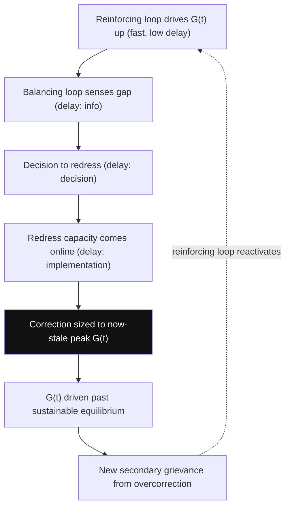

## Delay Structures and Overshoot Effects in Loop-Driven Escalation

### Formal Purpose

Delay was introduced in balancing feedback loops as a parameter determining convergence versus oscillation; this item treats delay as a first-class structural object in its own right — its typology, its formal representation, and specifically the **overshoot** phenomenon it produces, which is the single most consequential and most frequently mis-diagnosed dynamic in loop-driven escalation. Recall the core claim from balancing feedback loops: a polarity-correct, adequately-powered balancing loop can still fail to prevent threshold breach if its delay exceeds the reinforcing loop's cycle time. This item formalizes *why*, and characterizes the resulting behavior precisely, rather than asserting it qualitatively.

### Delay Typology

Not all delays are structurally equivalent; conflict-system CLDs (recall CLD construction discipline) require distinguishing delay types because each has a different formal representation and different design implications.

- **Information delay**: the lag between a state change and an actor's *awareness* of it — e.g., casualty reports, economic data, or intelligence assessments reaching decision-makers. This delay affects the *sensing* stage of a balancing loop.
- **Response/decision delay**: the lag between an actor becoming aware of a gap and formulating a policy response — bureaucratic or political decision-cycle time, distinct from information delay and often larger for institutional (state) actors than for less-bureaucratic armed groups, producing a structural response-speed asymmetry between state and non-state actors in the same conflict system.
- **Implementation delay**: the lag between a decision being made and its effect propagating to the target stock — the time for a redress mechanism ($r_1(t)$, recall grievance stock-flow modeling) to actually process claims and visibly reduce $G(t)$, or for a military redeployment to materially change the security balance.
- **Perception-update delay**: distinct from information delay about one's *own* state — this is the lag in updating beliefs about a *rival's* intentions or capacity, directly relevant to the R2 security-dilemma and R4 commitment-problem spirals (recall reinforcing feedback loops), where escalation is driven by perception rather than material fact and can therefore persist even after the material trigger has resolved, purely because perception-update delay has not yet caught up.

Total effective loop delay $\tau_{eff}$ is the sum of these components acting in series along a given causal path: $\tau_{eff} = \tau_{info} + \tau_{decision} + \tau_{implementation}$. Construction practice (recall CLD construction) requires marking delay at the *link* level where it occurs, because different links in the same loop can carry very different delay magnitudes — collapsing all delay into a single loop-level estimate obscures which stage is actually the binding constraint for intervention design.

### Formal Representation: Delayed Differential Equations

A reinforcing loop with negligible delay and a co-present balancing loop with significant delay $\tau$ produces a **delayed differential equation (DDE)** rather than an ordinary one:

$$\dot{X}(t) = \lambda X(t) - k\, X(t-\tau)$$

where $\lambda$ is the reinforcing loop's (near-instantaneous) gain and $k$ is the balancing loop's gain, applied to the state as it existed $\tau$ time units earlier rather than to the current state. This single structural difference — the balancing term reacting to *stale* information — is the entire formal origin of overshoot: the corrective force is always responding to a version of the system that has already been superseded by the reinforcing loop's continued growth.

**Stability condition** (standard DDE result, linear case): the system exhibits damped convergence, sustained oscillation, or growing oscillation depending on the product $k\tau$ relative to a critical threshold determined by $\lambda$ and $\tau$ jointly — informally, **delay is destabilizing in direct proportion to how large the reinforcing gain $\lambda$ is relative to the balancing loop's correction speed**. A balancing loop that would be perfectly stabilizing with zero delay can produce growing oscillation at sufficiently large $\tau$, even with identical steady-state gain $k$ — delay does not merely slow correction, it can invert a structurally stabilizing loop into a *destabilizing* one in dynamic terms.

### Overshoot: Formal Characterization

**Overshoot** is the specific behavior where a balancing loop's delayed correction continues acting *after* the gap it was responding to has already closed, driving the state variable past the reference point in the opposite direction, which then triggers a second (opposite-direction) correction, and so on. In conflict-system terms, the canonical overshoot pattern:

1. Reinforcing loop (e.g., R1, repression-grievance) drives $G(t)$ rapidly upward.
2. Balancing loop (e.g., B1, institutional redress) senses the gap with delay $\tau_{info}$, decides with delay $\tau_{decision}$, and begins implementing redress with delay $\tau_{implementation}$ — by the time redress capacity is actually online, $G(t)$ has continued rising for the full $\tau_{eff}$ duration, meaning the *magnitude* of correction eventually applied is calibrated to a peak $G(t)$ that has already been exceeded.
3. Redress capacity, once online, continues operating at the scale calibrated to the (now-stale, too-high) peak reading, driving $G(t)$ down past a sustainable equilibrium level — e.g., an over-large reparations or amnesty program calibrated to a maximal historical grievance estimate can overcorrect, producing new grievances among excluded or under-compensated groups (a documented pattern in transitional justice literature where redress programs generate secondary grievance from perceived unfairness in allocation).
4. This undershoot itself becomes a new gap, potentially triggering a renewed reinforcing cycle, and the system oscillates rather than settling — precisely the sustained-oscillation regime predicted by the DDE stability condition above when $k\tau$ exceeds the critical value.

This is the formal, general mechanism underlying the widely observed empirical pattern of **cyclical conflict recurrence with declining but non-zero amplitude** (recall the damped-oscillation case from balancing feedback loops) — each cycle's overshoot is smaller than the last if the system is in the stable-but-oscillatory regime, but the cycling itself is a direct signature of delay-driven overshoot, not evidence of an unrelated new triggering cause each time.

### Diagnostic Distinction: Overshoot vs. Genuine Loop Failure

A critical diagnostic discipline follows directly from the DDE formalization: **observing oscillation or a corrective mechanism "failing" to hold peace does not imply the balancing loop is structurally absent or under-powered (recall the polarity-vs-dominance distinction from reinforcing feedback loops, and the delay-length criterion from balancing feedback loops)** — it may be fully present, correctly signed, and adequately powered in steady-state gain $k$, but destabilized purely by $\tau$ being too large relative to $\lambda$. These two failure modes require **entirely different interventions**: an under-powered loop requires increasing $k$ (more institutional capacity, larger redress budgets); an over-delayed loop requires reducing $\tau$ (faster information flow, faster decision cycles, faster implementation) — increasing $k$ on an already over-delayed loop can *worsen* oscillation amplitude (a larger, still-late correction overshoots further), which is the formal reason that simply "doing more" of a delayed corrective policy is not a generically safe response to observed instability.

### Design Implication: Delay-Aware Intervention Sequencing

- **Diagnose which delay component dominates $\tau_{eff}$ before designing intervention** — information delay is addressed by monitoring/early-warning infrastructure; decision delay by streamlined institutional authority (pre-delegated response protocols rather than requiring fresh deliberation each cycle); implementation delay by pre-positioned capacity (standing rather than ad hoc redress mechanisms).
- **Calibrate correction magnitude to a forecast, not a lagging measurement** — since the core overshoot mechanism is correction sized to a stale reading, a redress mechanism that extrapolates the trend (anticipating where $G(t)$ will be when the correction actually takes effect) rather than reacting to the current or historical peak reading can substantially reduce overshoot magnitude without requiring any reduction in $\tau$ itself — this is the standard control-theory prescription (predictive/anticipatory control) applied to the conflict-system case.
- **Sequence delay-reduction before gain-increase** when facing oscillatory rather than simply insufficient correction — recall the diagnostic distinction above: increasing $k$ without first addressing $\tau$ risks worsening rather than resolving instability, making delay-structure diagnosis a required prerequisite step, not an optional refinement, before selecting between "more capacity" and "faster capacity" as the intervention target.

**Key Points**

- Total effective delay is the sum of information, decision, and implementation delay, each with a distinct formal representation and distinct intervention target — collapsing them into a single loop-level estimate obscures the actual binding constraint.
- A reinforcing loop paired with a delayed balancing loop is formally a delayed differential equation; the balancing term reacts to stale state, which is the precise origin of overshoot.
- Delay can invert a structurally stabilizing (correctly polarized, adequately powered) balancing loop into a dynamically destabilizing one purely by increasing $\tau$, independent of any change to steady-state gain $k$.
- Cyclical conflict recurrence with declining amplitude is the diagnostic signature of a stable-but-delayed balancing loop overshooting and correcting repeatedly — not necessarily evidence of a new unrelated triggering cause at each cycle.
- Under-powered and over-delayed loops require opposite interventions; increasing corrective gain $k$ on an over-delayed loop can worsen oscillation, making delay-source diagnosis a prerequisite to intervention design, not an optional step.

**Related Topics**

- Balancing feedback loops and self-limiting conflict dynamics
- Reinforcing feedback loops in conflict escalation spirals
- Causal loop diagram construction for intergroup conflict systems
- Stock and flow modeling of grievance accumulation and depletion
- Predictive/anticipatory control theory applied to institutional redress design
- Transitional justice and secondary-grievance generation from redress overcorrection