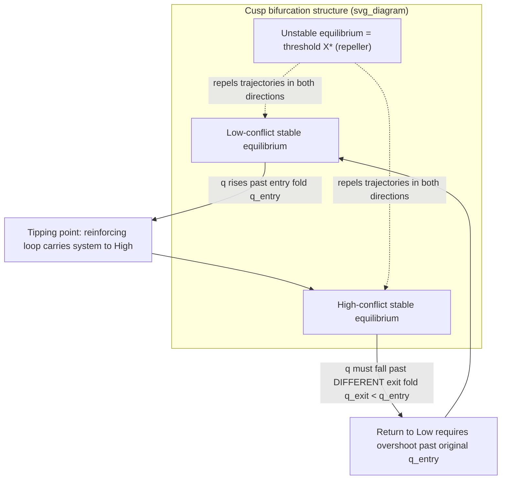

## Tipping Points, Thresholds, and Hysteresis in Conflict State Transitions

### Formal Purpose

Threshold and hysteresis behavior have been invoked in prior items as specific, load-bearing claims — the mobilization threshold $G^*$ in grievance stock-flow modeling, the ratchet asymmetry in grievance hysteresis, the basin-deepening argument in path dependency, and the trigger-magnitude-uncorrelated-with-outcome claim in the structural/proximate/triggering taxonomy. This item unifies these under a single formal apparatus — bifurcation and multi-stable-equilibrium dynamics — making explicit the mathematical structure that all of those prior claims were instances of, and distinguishing **tipping point** from **threshold** from **hysteresis** as three related but formally distinct concepts frequently conflated in conflict-analysis prose.

### Three Distinct Concepts, Formally Separated

- **Threshold**: a critical value $X^*$ of a state variable at which the system's qualitative behavior changes discontinuously — below $X^*$ one dynamic regime applies, above it another. A threshold is a **static property of the system's structure** (its potential function, recall path dependency's $U(X,p)$ formalism) — it exists whether or not the system is currently near it.
- **Tipping point**: the specific *event* of a system crossing a threshold, after which the system's own internal dynamics (typically a reinforcing loop, recall R1–R4) carry it away from the pre-threshold state without requiring continued external input — this is a **dynamic, trajectory-level event**, not a structural property. A system can possess a threshold for decades without ever tipping, if its trajectory never approaches $X^*$; conversely, "tipping" is meaningless without a pre-existing threshold structure to cross.
- **Hysteresis** (recall grievance stock-flow modeling and path dependency): the property that the threshold for transitioning *into* a state and the threshold for transitioning *out of* it are asymmetric — $X^*_{entry} \neq X^*_{exit}$, typically with $X^*_{exit}$ requiring the control parameter to move substantially further than $X^*_{entry}$ required. Hysteresis is a property of **how the threshold itself depends on trajectory direction**, distinct from both the static threshold value and the dynamic tipping event.

### Formal Model: Bifurcation Structure

Recall the potential-landscape representation from path dependency: $\dot{X} = -\partial U(X,p)/\partial X$, with control parameter $p$ representing slow-moving structural/proximate conditions (recall the three-tier taxonomy) and $X$ representing a fast-moving state variable (mobilization level, active violence intensity). A **cusp catastrophe** — the standard minimal bifurcation structure for hysteresis — arises when $U$ has the form:

$$U(X, p, q) = \frac{X^4}{4} - \frac{p\,X^2}{2} - qX$$

producing equilibrium condition $X^3 - pX - q = 0$. For $p$ above a critical value, this cubic has **three real roots** for a range of $q$ — two stable equilibria (low-conflict and high-conflict states) separated by an unstable equilibrium (the threshold itself, $X^*$, which acts as a repeller: any perturbation away from it is amplified by local dynamics, not damped). This is the formal reason the transition is discontinuous rather than a smooth slide: the system cannot rest at $X^*$, and once $q$ (the fast-moving trigger-level input) pushes the system past the unstable root, the nearby reinforcing dynamics carry it rapidly to the far stable equilibrium — this is precisely the tipping-point event, and its rapidity relative to the slow buildup phase is a structural prediction of the cusp geometry, not an incidental empirical observation.

**Hysteresis emerges directly from this structure**: because the cusp has two stable branches (low-$X$ and high-$X$) for a shared range of $q$, the value of $q$ required to push the system from low-$X$ to high-$X$ (moving rightward across the fold) is **not the same** value of $q$ required to push it back from high-$X$ to low-$X$ (moving leftward) — the two folds of the cusp occur at different $q$ values. This is the exact formal origin of the asymmetric ratchet property asserted qualitatively in grievance stock-flow modeling: it is not a separate ad hoc assumption, but a direct consequence of the multi-stable-equilibrium geometry.

### Early-Warning Signals: Detecting Proximity to an Unmarked Threshold

Because thresholds are structural but their location $X^*$ is generally not directly observable in real conflict systems (unlike the stylized cusp model), a distinct diagnostic literature — critical slowing down, drawn from dynamical systems theory and applied to social-ecological and conflict systems — identifies statistical signatures that a system is approaching an unmarked threshold without requiring the threshold's exact value to be known in advance:

- **Rising variance**: as the system approaches an unstable equilibrium, small perturbations decay more slowly (recall that near $X^*$, the restoring force $-\partial U/\partial X$ weakens), so the state variable's fluctuations around its current trend increase in magnitude even if the mean trend is unchanged.
- **Rising autocorrelation**: perturbations near threshold take longer to decay, meaning the state at time $t$ becomes more strongly predictive of the state at $t+1$ (the system "remembers" perturbations longer) — a measurable proxy for the weakening restoring force.
- **Flickering**: intermittent, brief excursions toward the alternative stable state before falling back — observable in conflict systems as short-lived localized outbreaks of violence that resolve without full-scale escalation, which under this framework are not independent minor incidents but direct statistical evidence of proximity to the tipping threshold.

[Inference] These early-warning-signal indicators are a well-established methodology in ecological regime-shift detection; their direct quantitative application to conflict-onset prediction is an active and comparatively less mature research area, with signal-to-noise and data-availability challenges specific to conflict data that are less severe in ecological time-series contexts.

### Distinguishing Tipping from Ordinary Escalation

Not every instance of rising conflict intensity constitutes tipping-point dynamics in the formal sense above — this distinction has direct diagnostic consequences. **Ordinary reinforcing-loop escalation** (recall reinforcing feedback loops) can produce smooth or accelerating growth without any discontinuous jump or multi-stable structure — a single-equilibrium system with unstable dynamics near that equilibrium. **True tipping-point dynamics** specifically require the cusp-type multi-stable structure: a discontinuous jump between qualitatively distinct regimes, and — the diagnostic signature that most reliably distinguishes the two — **hysteresis upon reversal**. If reducing $q$ back to its pre-escalation value promptly returns the system to the low-conflict state, the system was exhibiting ordinary (single-equilibrium) reinforcing dynamics, not true tipping-point/hysteresis behavior; if the system remains in the high-conflict state despite $q$ returning to its original value, hysteresis is confirmed, and this has the direct design implication (recall path dependency's design section) that reversing the *original* triggering conditions is structurally insufficient for reversal.

### Design Implication: Threshold-Aware Intervention Timing

- **Pre-threshold (system approaching $X^*$ from below)**: intervention should target either raising the threshold itself ($X^*$ as a function of structural parameter $p$ — recall the design-implication mapping from the three-tier taxonomy, where structural-tier interventions shift the threshold rather than the current state) or reducing the proximate-cause "velocity" carrying the system toward $X^*$ — both are comparatively low-cost relative to post-tip intervention, because they operate while the system is still in the stable low-conflict basin.
- **At or near the tipping event**: this is the narrowest and highest-leverage intervention window — recall the delay-structure analysis: if a balancing mechanism's total delay $\tau_{eff}$ exceeds the time the system spends in the near-threshold region, no realistically deployable balancing loop can arrest the tip once triggered, making pre-positioned (zero-implementation-delay) rapid response the only mechanistically viable category of intervention at this stage.
- **Post-tip (system in the high-conflict stable equilibrium)**: recall directly from hysteresis and path dependency — restoring pre-conflict structural conditions is provably insufficient by the cusp geometry itself; effective intervention must push $q$ *past* the exit fold, which is generically a larger and more costly intervention than would have been required at the entry fold, formally justifying the empirical observation that post-conflict reconstruction costs and timeframes are systematically larger than pre-conflict prevention costs for a comparable magnitude of structural change.

**Key Points**

- Threshold (a structural property), tipping point (a trajectory-level crossing event), and hysteresis (asymmetry between entry and exit thresholds) are three distinct concepts; conflating them produces imprecise diagnosis of which intervention category is mechanistically appropriate.
- The cusp catastrophe model shows hysteresis is not an ad hoc empirical add-on but a direct mathematical consequence of multi-stable equilibrium geometry — the entry and exit folds of the same cusp necessarily occur at different control-parameter values.
- Critical slowing down (rising variance, rising autocorrelation, flickering) provides statistically detectable early-warning signals of threshold proximity without requiring prior knowledge of the threshold's exact location.
- The diagnostic test separating true tipping-point/hysteresis dynamics from ordinary reinforcing-loop escalation is reversibility: prompt return to baseline upon reversing the triggering condition indicates single-equilibrium dynamics; persistence despite reversal confirms hysteresis.
- Intervention leverage is highest pre-threshold and narrows sharply at the tipping event itself, where only near-zero-delay pre-positioned response is mechanistically capable of arresting the transition; post-tip reversal generically requires overshooting the original entry condition.

**Related Topics**

- Stock and flow modeling of grievance accumulation and depletion
- Path dependency and lock-in mechanisms in conflict trajectories
- Delay structures and overshoot effects in loop-driven escalation
- Structural, proximate, and triggering cause taxonomy in conflict diagnosis
- Critical slowing down and early-warning signals in dynamical systems
- Reinforcing feedback loops in conflict escalation spirals