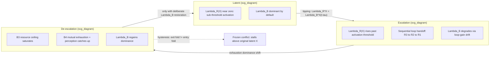

## Loop Dominance Shifts Across Latent, Escalation, and De-Escalation Phases

### Formal Purpose

This item is the synthesis point for the chapter's central methodological distinction, first introduced in reinforcing feedback loops and repeatedly invoked since: **loop polarity is structural and time-invariant; loop dominance is empirical and time-varying**. Every conflict-phase transition — latent to escalating, escalating to de-escalating, de-escalating to resolved or to renewed escalation — is, under this framework, not the appearance or disappearance of causal structure, but a **dominance handoff** among a fixed set of co-present reinforcing and balancing loops whose relative strength changes as state variables move through their range. This item specifies the formal dominance criterion and traces it across three canonical phases.

### Formal Dominance Criterion

For a system with co-present reinforcing loop(s) of aggregate instantaneous gain $\Lambda_R(X,t)$ and balancing loop(s) of aggregate instantaneous (delay-adjusted) gain $\Lambda_B(X,t)$, the net rate of change is:

$$\dot{X} = \Lambda_R(X,t)\cdot X - \Lambda_B(X,t)\cdot X(t-\tau)$$

**Dominance** at a given moment is defined by which term's magnitude exceeds the other: $\Lambda_R X > \Lambda_B X(t-\tau) \Rightarrow$ reinforcing-dominant (net escalation); the reverse $\Rightarrow$ balancing-dominant (net de-escalation or stability). Critically, **both loop sets are structurally present throughout** — dominance is a statement about the current *product* of gain and state-dependent magnitude, not about which loops "exist" at a given phase. This directly resolves a recurring diagnostic error flagged across this chapter (in reinforcing feedback loops, balancing feedback loops, and delay structures): mistaking a dominance shift for the appearance, disappearance, or breaking of a loop.

### Phase 1: Latent Conflict

**Characterization:** $X$ (mobilization/violence intensity) is low, near a stable low-conflict equilibrium (recall the cusp model's low-$X$ branch from tipping points and hysteresis). Both R-loops and B-loops are present, but $\Lambda_R(X)$ is typically small at low $X$ because several reinforcing mechanisms have **state-dependent activation thresholds** below which their gain is near zero — e.g., the R2 security-dilemma loop (recall reinforcing feedback loops) requires a minimum perceived-threat level to activate the perception-updating cycle at all; below that level, incremental buildup is not read as threatening and the loop's effective gain is approximately zero rather than merely small.

**Dominant structure:** B-loops (particularly B1 institutional absorption and B3 resource-ceiling effects operating in the opposite direction — routine social/economic friction is absorbed within normal institutional capacity) dominate by default, not because they are stronger in an absolute sense but because $\Lambda_R(X)$ is suppressed by sub-threshold state values. **This is the formal reason latent conflict is frequently misdiagnosed as "no conflict system present"**: the reinforcing structure is fully there, its gain function is simply operating in its low-activation region — recall the structural/proximate/triggering taxonomy's point that structural causes set the threshold without determining timing; equivalently, structural causes determine the *shape* of $\Lambda_R(X)$, while proximate causes are precisely the process of walking $X$ (or lowering the activation threshold) into the region where $\Lambda_R(X)$ becomes non-negligible.

### Phase 2: Escalation

**Characterization:** proximate-cause developments (recall the three-tier taxonomy) shift $X$ and/or the system's parameters such that one or more R-loops cross into their high-gain activation region — $\Lambda_R(X)$ rises sharply, often faster than $\Lambda_B$ can respond, both because balancing mechanisms carry the delay structure examined in delay structures and overshoot effects and because $\Lambda_B$ itself may be *degrading* during this phase via the loop-gain-drift mechanism (recall path dependency): repeated R-loop cycling can directly erode $r_1(t)$ (institutional redress capacity), meaning $\Lambda_B$ is not merely slow to respond but actively shrinking in parallel with $\Lambda_R$'s rise.

**Dominance handoff mechanism, precisely stated:** the transition from latent to escalation phase is the crossing of the point where $\Lambda_R(X)X = \Lambda_B(X)X(t-\tau)$ — this crossing is exactly the tipping-point event formalized in tipping points and hysteresis as the system passing the unstable equilibrium (repeller) of the cusp structure. Multiple R-loops typically do not activate simultaneously; a common empirical escalation signature is **sequential dominance handoff among reinforcing loops themselves** — e.g., R3 (retaliation spiral) activating first at the local/meso level, its output (rising violence) then providing the perceived-threat input that activates R2 (security dilemma) at the state/macro level, which in turn (via increased state repression) reactivates or intensifies R1 (repression-grievance spiral) — a cascade of loop activations rather than a single loop's gain simply rising, meaning full characterization of an escalation phase generally requires tracking *which* loop is currently dominant, not merely that "a reinforcing loop is dominant."

### Phase 3: De-Escalation

**Characterization:** $X$ approaches or exceeds the resource/capacity ceiling $K$ (recall B3 from balancing feedback loops), and/or actor-level exhaustion dynamics (B4, mutually hurting stalemate — recall Zartman's ripeness theory) begin to dominate. The formal distinction the chapter has repeatedly flagged applies at full force here: **de-escalation onset must be diagnosed as a genuine dominance shift in $\Lambda_R$ vs. $\Lambda_B$, not conflated with exogenous suppression** (recall the counterfactual-removal diagnostic test from balancing feedback loops) — a ceasefire artificially lowers observed $X$ without altering $\Lambda_R(X)$ or $\Lambda_B(X)$ at all, meaning it is not a phase transition in the dominance-criterion sense, merely an external override of the state variable's current value while the underlying gain structure remains in its escalation-phase configuration.

**Genuine de-escalation-phase dominance drivers:**

- B3 resource-ceiling saturation, a purely structural constraint requiring no actor intent.
- B4 mutually-hurting-stalemate perception (recall the ripeness-requires-perception condition), which specifically requires both $\Lambda_B$ to be structurally rising (actual capacity depletion) *and* both actors' perception-update delay (recall delay structures) to have caught up to that material reality — a stalemate that is materially real but not yet perceived is a case where $\Lambda_B$ has risen in material terms but the *effective*, decision-relevant $\Lambda_B$ (mediated through actor perception) has not, illustrating that dominance must sometimes be computed on the perceived rather than objective state variable, depending on which drives actor decision-making.

**Fragility of de-escalation-phase dominance:** because loop-gain drift (recall path dependency) may have permanently altered $\Lambda_R$'s baseline (e.g., $\gamma(t)$, narrative amplification, structurally elevated) and permanently degraded $\Lambda_B$'s ceiling (e.g., $r_1$ capacity destroyed during the escalation phase), a system entering de-escalation-phase dominance via B3/B4 exhaustion mechanisms does **not** automatically return to latent-phase dominance conditions — recall the hysteresis result from tipping points and hysteresis: the exit fold generically requires $q$ to move further than the entry fold did, meaning exhaustion-driven de-escalation can stall at an intermediate, still-elevated $X$ level (a "frozen conflict" configuration) rather than returning fully to the pre-escalation low-$X$ equilibrium, unless a deliberate structural intervention (recall path dependency's design-implication section) actively restores $\Lambda_B$'s degraded capacity rather than relying on exhaustion dynamics alone to carry the system all the way back.

### Diagnostic Method: Dominance-Shift Indicators Distinct from State-Level Indicators

Because dominance is a statement about gain functions rather than the state variable itself, monitoring $X(t)$ alone is an incomplete diagnostic basis for phase classification — recall the critical-slowing-down indicators from tipping points and hysteresis (rising variance, rising autocorrelation, flickering) as the appropriate class of dominance-sensitive signal, since these track the *local restoring-force strength* (a direct function of $\Lambda_R - \Lambda_B$ near the current state) rather than the state level. A declining $X(t)$ trend with **rising** variance and autocorrelation is a specific, diagnosable warning pattern: it indicates apparent de-escalation is occurring *despite*, not because of, a weakening restoring force — consistent with exogenous suppression (a ceasefire) masking continued escalation-phase gain structure rather than genuine B3/B4-driven dominance shift.

### Design Implication: Phase-Matched Intervention Targeting

- **In latent phase**, intervention should target $\Lambda_R(X)$'s activation threshold directly — structural-tier interventions (recall the three-tier taxonomy) that keep proximate-cause developments from ever pushing $X$ or the threshold into the high-gain region, which is categorically cheaper than intervening once $\Lambda_R$ has activated.
- **In escalation phase**, because dominance handoff is frequently sequential across specific named loops (R3→R2→R1 or similar cascades), effective intervention requires identifying **which loop is currently the marginal driver of rising $\Lambda_R$** and targeting that loop's specific link structure (recall the structural-vs-symptomatic distinction from reinforcing feedback loops) rather than applying an undifferentiated "reduce violence" intervention — a security-dilemma-targeted intervention (verification/transparency) is mechanistically mismatched to a retaliation-spiral-dominant phase, and vice versa.
- **In de-escalation phase**, distinguishing genuine dominance shift from exogenous suppression (via the critical-slowing-down diagnostic above) determines whether withdrawal of an external stabilizing mechanism is safe — withdrawing peacekeeping from a genuinely B3/B4-dominant system is far lower-risk than withdrawing from a system whose apparent calm is suppression-masked escalation-phase gain structure; and because de-escalation-phase dominance is hysteresis-fragile, sustaining it durably requires deliberate $\Lambda_B$-capacity restoration (rebuilding degraded $r_1$, institutional redress infrastructure) rather than relying on the exhaustion condition alone to persist indefinitely.

**Key Points**

- Loop dominance is a time-varying empirical property of the current product of gain and state magnitude ($\Lambda_R X$ vs. $\Lambda_B X(t-\tau)$); it is formally distinct from loop polarity, which is structural and unchanging — conflating the two is the chapter's recurring diagnostic error.
- Latent-phase stability results from sub-threshold reinforcing-loop activation (near-zero $\Lambda_R$), not from the absence of reinforcing structure; escalation is the activation of $\Lambda_R$'s high-gain region, formally identical to crossing the tipping-point threshold from tipping points and hysteresis.
- Escalation frequently proceeds via sequential dominance handoff among distinct named reinforcing loops (e.g., R3 activating R2 activating R1), requiring loop-specific rather than generic intervention targeting.
- Genuine de-escalation-phase dominance shift must be distinguished from exogenous suppression via critical-slowing-down indicators (variance, autocorrelation) tracking the restoring force directly, not merely the declining state level.
- De-escalation-phase dominance is hysteresis-fragile: because $\Lambda_R$'s baseline and $\Lambda_B$'s ceiling can be permanently altered by escalation-phase loop-gain drift, exhaustion-driven de-escalation can stall at an elevated "frozen conflict" state rather than returning to latent-phase conditions absent deliberate structural restoration of balancing capacity.

**Related Topics**

- Reinforcing feedback loops in conflict escalation spirals
- Balancing feedback loops and self-limiting conflict dynamics
- Delay structures and overshoot effects in loop-driven escalation
- Tipping points, thresholds, and hysteresis in conflict state transitions
- Path dependency and lock-in mechanisms in conflict trajectories
- Critical slowing down and early-warning signals in dynamical systems