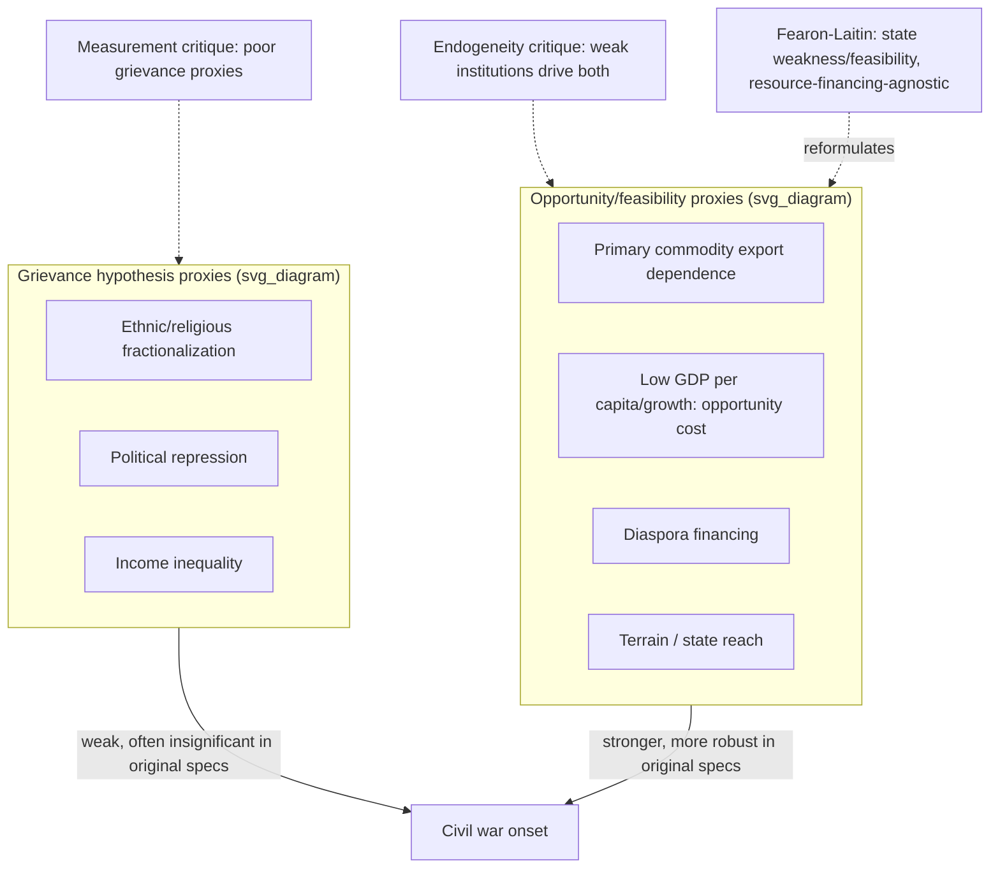

## Collier-Hoeffler Greed and Grievance Framework in Resource-Conflict Linkages

### Formal Purpose and Origin

The Collier-Hoeffler framework (Collier and Hoeffler, World Bank research program, late 1990s–early 2000s) is an econometric research program testing competing explanations for civil war onset using large-N cross-national regression on post-1960 conflict data. Its core contribution is methodological rather than purely theoretical: it operationalizes two rival causal hypotheses — **grievance** (conflict driven by group-level injustice, recall the grievance stock $G(t)$ formalism from stock and flow modeling) and **greed/opportunity** (conflict driven by the material feasibility and profitability of organized violence) — as competing sets of regression covariates, then tests which set better predicts onset in the data. This item has been referenced repeatedly across this curriculum as the empirical anchor for the claim that grievance alone is a poor onset predictor; this item now presents the framework itself, its mechanisms, and the subsequent methodological critique in full.

### The Grievance Hypothesis, as Operationalized

Grievance-hypothesis variables proxy for group-level injustice and are drawn directly from the structural-cause categories in the three-tier taxonomy: ethnic or religious fractionalization, political repression/lack of democracy, income inequality, and horizontal inequality proxies. The grievance hypothesis predicts conflict onset probability rising monotonically with these variables' magnitude — more fractionalization, more repression, more inequality should mechanically predict more war, if grievance stock accumulation (recall $G(t)$) is the primary onset driver.

**Empirical result:** across Collier-Hoeffler's regression specifications, most grievance proxies were **weak or statistically insignificant predictors** of onset once opportunity variables were included, and some produced counterintuitive signs (e.g., ethnic fractionalization showing a non-monotonic or even negative relationship with onset in some specifications — a highly fractionalized society can face a *lower* civil war risk than a moderately polarized one, because effective large-scale rebel mobilization requires organizational coordination that high fractionalization can itself impede, a finding formally consistent with the meso-level organizational-capacity requirement $C(t)$ introduced in the mobilization threshold model).

### The Greed/Opportunity Hypothesis, as Operationalized

Opportunity-hypothesis variables proxy for the **feasibility and financing** of organized rebellion, not for its underlying motive — this distinction matters because "greed" as originally labeled is frequently misread as a claim about individual rebel psychology (personal enrichment motive), when the econometric claim is structural: rebellion requires a viable financing and recruitment base regardless of why any individual participant joins.

- **Primary commodity export dependence**: the single strongest and most robust predictor across specifications — countries with primary commodity exports comprising a large share of GDP showed sharply elevated onset risk, with a widely cited (though later contested, see below) non-monotonic relationship peaking around moderate dependence levels. Mechanism: lootable or taxable natural resources (alluvial diamonds, coca, timber, oil pipelines) provide **financing independent of population-level buy-in** — a rebel organization can sustain itself via resource extraction/taxation without needing broad-based recruitment legitimacy, directly raising meso-level organizational viability $C(t)$ without requiring a correspondingly high $G(t)$.
- **Low per-capita income and low GDP growth**: interpreted primarily through the **opportunity-cost channel**, not a grievance channel — low income lowers the individual opportunity cost of forgoing civilian economic activity to join an armed group (this is the direct micro-level mechanism feeding the meso-level recruitment threshold from micro-meso-macro coupling), rather than functioning as a grievance-magnitude proxy per se, a reinterpretation that directly explains why "poverty predicts war" findings are not straightforward evidence for the grievance hypothesis (recall the ecological-fallacy warning from micro-meso-macro coupling: the macro correlation between low GDP and onset does not by itself establish that individual-level poverty-grievance is the operative micro mechanism, and Collier-Hoeffler's own interpretation favors the opportunity-cost reading over the grievance reading).
- **Large diaspora populations**: a robust predictor of conflict *recurrence* specifically (less so onset), interpreted as an external financing channel — diaspora remittances can fund rebel organizations from abroad, again an opportunity/feasibility mechanism (raising sustainable $C(t)$) rather than a grievance-magnitude effect, though diaspora mobilization itself can be partly grievance-driven at the individual donor level, illustrating that opportunity and grievance channels are not always cleanly separable even where the aggregate-level regression treats them as distinct covariates.
- **Terrain and geographic dispersion**: mountainous terrain, geographic size, dispersed population — proxies for the state's capacity to project counterinsurgent force, a direct feasibility variable connecting to state capacity $S(t)$ in the earlier mobilization threshold formalism.
- **Male secondary school enrollment (inverse proxy)**: low enrollment interpreted as a low-opportunity-cost recruitment pool indicator, structurally identical in mechanism to the income variable above.

### Formal Statement of the Onset Model

Collier-Hoeffler-style specifications estimate:

$$P(\text{onset}) = \Phi\left(\beta_1 \cdot \text{Grievance proxies} + \beta_2 \cdot \text{Opportunity proxies} + \varepsilon\right)$$

with the central empirical claim being $\hat\beta_2$ (opportunity coefficients) generally larger in magnitude and more consistently statistically significant than $\hat\beta_1$ (grievance coefficients) across specifications and robustness checks in the original research program. This is the direct empirical instantiation of the composite onset model introduced in the three-tier taxonomy, with the finding specifically that the $\text{Struct}$ (grievance-proxy) term carries less explanatory weight than initially assumed relative to feasibility-side structural variables.

### Methodological Critiques

The framework has been substantially contested on several specific, technical grounds, and a full treatment requires presenting these alongside the original findings rather than treating Collier-Hoeffler as a settled final result:

- **Measurement validity of "grievance" proxies**: critics (notably Cramer, Fearon and Laitin in their own competing feasibility-focused reformulation, and later Fearon's own reassessment) argue the grievance proxies used (fractionalization indices, inequality measures available at the time) were **poor operationalizations** of the actual grievance mechanisms specified in horizontal-inequality theory (recall Stewart's framework from stock and flow modeling) — a null result for a poorly measured proxy is evidence against the proxy, not necessarily against the underlying grievance mechanism. Frances Stewart's own horizontal-inequality research, using more precisely group-differentiated data than the aggregate fractionalization/Gini measures in the original Collier-Hoeffler specifications, finds stronger grievance-onset relationships — suggesting part of the original null result may reflect measurement rather than mechanism.
- **Reverse causation and endogeneity**: primary commodity export dependence and low GDP growth may be **consequences** of weak institutions or prior conflict risk rather than independent causes — a state with weak institutions (a structural-tier cause in its own right) may both fail to diversify its economy away from primary commodities *and* be more conflict-prone, producing a spurious or partially spurious commodity-conflict correlation via this shared antecedent, an identification problem the original cross-sectional specifications could not fully resolve.
- **The Fearon-Laitin alternative**: a competing, highly influential reformulation arguing the core mechanism is not greed specifically but **state weakness/feasibility** more broadly — insurgency is more likely wherever the state lacks the administrative and military reach to deter or rapidly suppress a small, armed, organized group, largely independent of natural-resource financing per se. This is formally a narrower and more general claim than Collier-Hoeffler's resource-specific mechanism: state weakness lowers the *general* cost of insurgency (raising $C(t)$'s viability threshold for any financing source, not resource financing specifically), a claim directly consonant with the $S(t)$ state-capacity variable introduced earlier in this curriculum's threshold-dynamics formalism.
- **Non-monotonicity re-examination**: later re-analyses (including with updated data and alternative specifications) found the originally reported resource-dependence relationship to be less robust than initially presented, sensitive to specification choices, outlier cases, and the particular commodity-dependence measure used — a caution against treating any single specification's coefficient magnitudes as definitive rather than as one data point in an ongoing, methodologically contested research program. [Unverified] The precise current consensus weighting between greed/opportunity and grievance/reformulated-grievance explanations continues to evolve in the civil war onset literature and is not settled to a single agreed model.

### Design Implication: Why the Framework Matters for Peace Engineering

The greed/opportunity emphasis has direct, actionable design consequences distinct from grievance-focused interventions (recall the design-implication sections of stock and flow modeling and the three-tier taxonomy):

- **Resource-revenue transparency and traceability mechanisms** (certification schemes analogous to the Kimberley Process for diamonds, extractive-industry transparency initiatives) target the opportunity channel directly — reducing a rebel organization's capacity to convert lootable resources into sustained financing, independent of whether the underlying grievance driving initial mobilization is ever addressed. This is mechanistically distinct from, and complementary to, grievance-reduction interventions: it targets $C(t)$'s financing viability rather than $G(t)$'s accumulation.
- **State capacity-building in peripheral/contested territory** (the Fearon-Laitin-consistent intervention) targets the general feasibility of insurgency rather than any resource-specific channel, directly raising $S(t)$ and thereby raising the mobilization threshold $G^*$ implicitly (recall the threshold-dynamics formalism from grievance stock-flow modeling, where $S(t)$ enters as a multiplicative gate on realized mobilization).
- **The measurement critique has its own design implication**: because aggregate fractionalization/Gini-type measures may understate genuine horizontal-inequality grievance mechanisms, peace-engineering diagnosis should not treat a null result on coarse cross-national grievance proxies as license to deprioritize group-differentiated inequality data collection at the case level — the correct inference from the critique is "measure grievance better," not "grievance does not matter."

**Key Points**

- Collier-Hoeffler operationalizes grievance and greed/opportunity as competing regression covariate sets and finds opportunity/feasibility variables (especially primary commodity export dependence and low-income-as-opportunity-cost) generally more robust predictors of onset than grievance proxies in the original specifications.
- "Greed" in the econometric sense denotes structural financing/feasibility conditions for rebellion, not individual rebel enrichment motive — a frequent misreading of the framework's actual mechanism.
- Major critiques target grievance-proxy measurement validity (Stewart's more precise horizontal-inequality data yields stronger results), reverse-causation/endogeneity in the opportunity variables, and the Fearon-Laitin reformulation emphasizing general state weakness over resource-specific financing.
- The framework's design implication is not that grievance-reduction is unimportant, but that resource-financing-interdiction and state-capacity-building constitute a mechanistically distinct intervention category operating on $C(t)$ and $S(t)$ rather than on $G(t)$.
- The precise empirical balance between greed/opportunity and (better-measured) grievance explanations remains an active, contested area rather than a fully settled question.

**Related Topics**

- Stock and flow modeling of grievance accumulation and depletion
- Structural, proximate, and triggering cause taxonomy in conflict diagnosis
- Micro, meso, and macro coupling models in conflict system analysis
- Fearon and Laitin's state-weakness/feasibility thesis
- Resource curse theory and extractive-industry transparency mechanisms
- Horizontal inequality theory (Frances Stewart)