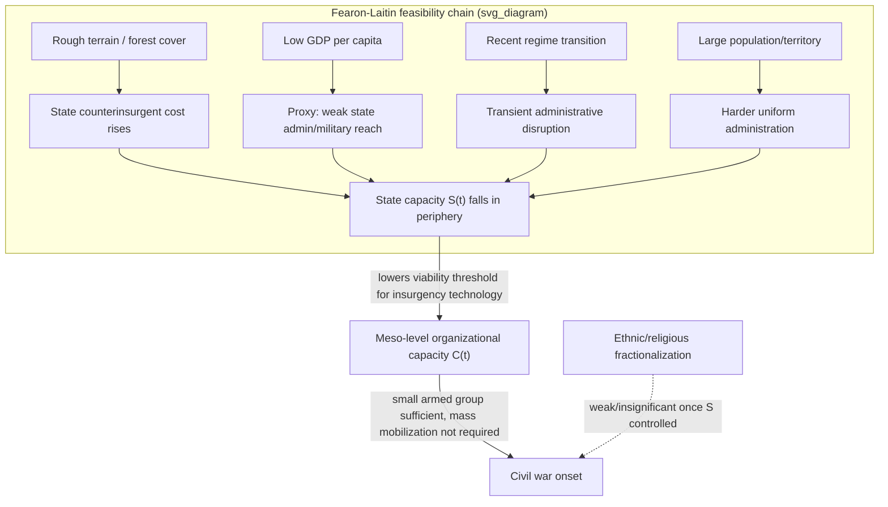

## Fearon-Laitin State Capacity and Opportunity Model of Civil War Onset

### Formal Purpose and Origin

Fearon and Laitin's 2003 study ("Ethnicity, Insurgency, and Civil War," *American Political Science Review*) is the direct theoretical competitor to Collier-Hoeffler introduced in the preceding item — recall that both programs share the opportunity/feasibility emphasis over grievance, but differ on the *specific mechanism*: Collier-Hoeffler centers resource-financing viability, while Fearon-Laitin centers **general state administrative and military reach** as the binding constraint on insurgency, largely independent of any particular financing source. This item presents the Fearon-Laitin model as a distinct causal architecture, not merely a variant specification of Collier-Hoeffler, and traces its specific mechanism, evidence, and the subsequent debate.

### Core Thesis: Insurgency as a Technology of Rebellion

The central claim, stated precisely: **civil war onset is best predicted by conditions that favor insurgency as a viable military-organizational technology**, not by the magnitude of grievance (ethnic, religious, or economic) present in a society. Fearon and Laitin explicitly reject the ethnic-fractionalization-as-cause hypothesis that had dominated much pre-2000s civil war scholarship, arguing instead that ethnic diversity's apparent correlation with conflict in cross-national data is confounded by its correlation with the true causal variable: **state weakness in peripheral, hard-to-govern territory**.

Formally, the model treats civil war onset as gated by a **feasibility condition** rather than a **motive condition** — recall the composite onset model from the three-tier taxonomy, $P(\text{onset}) = \Phi(\alpha \cdot \text{Struct} + \beta \cdot \text{Prox} + \kappa \cdot \text{Trig})$; Fearon-Laitin's specific claim is that the dominant loading in this composite is carried by state-capacity-related structural terms, with grievance-related terms contributing comparatively little independent explanatory power once state capacity is properly controlled for.

### Mechanism: Insurgency Requires Only a Small, Organized, Armed Group

The mechanistic core: unlike conventional civil conflict models implicitly assuming mass mobilization is required to challenge the state, Fearon and Laitin argue **insurgency is a low-population-threshold technology** — a small number of fighters (hundreds, not tens of thousands) operating in terrain the state cannot effectively police can sustain a prolonged insurgency indefinitely, evading suppression through mobility and local terrain advantage rather than through broad popular support. This directly reframes the meso-level organizational-capacity variable $C(t)$ (recall micro-meso-macro coupling): $C(t)$'s viability threshold for *insurgency specifically* is argued to be far lower than intuitive mass-mobilization models suggest, meaning the binding constraint on onset is not "can enough people be persuaded to join" (a grievance-magnitude question) but "can a state-evading organizational nucleus be formed and sustained" (a feasibility question).

**Conditions favoring insurgency technology, as identified:**

- **Rough/mountainous terrain and forest cover**: directly raises the cost of state counterinsurgent operations, lowering the population and financing threshold a rebel organization needs to survive — a direct feasibility variable, formally identical in role to the terrain variable in Collier-Hoeffler but here elevated to the model's primary mechanism rather than a secondary control.
- **Low per-capita income**: interpreted, as in Collier-Hoeffler, primarily as a **proxy for state administrative, military, and police capacity** rather than as an opportunity-cost-of-labor variable per se — Fearon and Laitin's specific reading is that GDP per capita in their data functions mainly as an indicator of the state's bureaucratic and coercive reach into its own territory (poorer states have weaker militaries, less effective local administration, less capacity for counterinsurgent policing), a distinct causal story from Collier-Hoeffler's individual-opportunity-cost mechanism even though both use similar income variables.
- **Political instability (recent regime transition)**: a proximate-tier variable (recall the three-tier taxonomy) capturing transient state administrative disruption — new or recently-transitioned regimes have had less time to consolidate territorial administrative control, temporarily lowering $S(t)$ independent of the state's longer-run structural capacity.
- **Population size**: larger populations and larger territories are harder to administer uniformly, mechanically raising the probability that *some* peripheral region falls outside effective state reach — a scale effect on feasibility rather than a grievance or greed variable.
- **Oil exporter status**: included as a control variable, found to elevate onset risk — Fearon and Laitin interpret this similarly to Collier-Hoeffler's resource mechanism (financing viability) but treat it as one specific instance of the broader feasibility category rather than as the central causal story.

**Explicitly de-emphasized in the Fearon-Laitin specification:** ethnic and religious fractionalization indices, and cross-cultural/linguistic distance measures — both found to have weak or statistically insignificant independent effects once the state-capacity/feasibility variables above are included, directly contradicting the then-conventional "ethnic diversity causes ethnic war" narrative.

### Formal Distinction from Collier-Hoeffler

Though both are opportunity/feasibility-centered models and are frequently cited together as a joint "greed and grievance is wrong, look at opportunity" research program, they differ on a specific, testable point:

| Dimension | Collier-Hoeffler | Fearon-Laitin |
| --- | --- | --- |
| Primary mechanism | Resource-financing viability for rebel organizations | General state administrative/military reach |
| Role of primary commodities | Central causal variable | One control variable among several, not privileged |
| Role of low income | Individual opportunity-cost of labor (micro-level recruitment) | Proxy for state bureaucratic/military capacity (macro-level feasibility) |
| Predicted intervention target | Resource-revenue interdiction, financing traceability | State capacity-building, territorial administrative reach |

This distinction is not merely academic: recall from the design-implication section of the Collier-Hoeffler item that resource-transparency mechanisms and state-capacity-building are **mechanistically distinct intervention categories**, and the Fearon-Laitin model provides the theoretical grounding specifically for the latter, independent of whether a given conflict has a salient lootable-resource dimension at all — a Fearon-Laitin-consistent intervention remains relevant in non-resource-financed insurgencies where the Collier-Hoeffler mechanism has comparatively little to say.

### Methodological Critiques and Subsequent Debate

- **Overlap and complementarity with Collier-Hoeffler, not pure rivalry**: subsequent literature has increasingly treated the two frameworks as **partially overlapping components of a broader feasibility thesis** rather than strictly competing models — both identify state weakness and financing/organizational viability as central, differing mainly in emphasis and in which specific mechanism (resource rents vs. general administrative capacity) is treated as primary. [Inference] Whether this convergence is best understood as reconciliation or as underlying measurement overlap (income and terrain variables partially proxying for similar latent state-weakness constructs in both specifications) is not fully settled in the literature.
- **Ethnic grievance re-assertion**: critics (e.g., subsequent work by Cederman and collaborators using more group-differentiated data, in a lineage connected to Stewart's horizontal-inequality critique of Collier-Hoeffler) argue Fearon-Laitin's null result on ethnicity reflects the **same aggregate-fractionalization measurement problem** flagged against Collier-Hoeffler — fractionalization indices measure diversity, not **group-level political exclusion**, and studies using politically-relevant-group exclusion data (e.g., the Ethnic Power Relations dataset) find substantially stronger and more robust ethnic-grievance effects on civil war onset than the aggregate fractionalization measures used in either original framework, directly paralleling the "measure grievance better, don't discard the mechanism" implication flagged in the Collier-Hoeffler item.
- **State capacity measurement circularity concern**: using GDP per capita as a state-capacity proxy has been critiqued as potentially conflating economic development with administrative capacity, which are correlated but conceptually distinct — a state could be poor but administratively cohesive (limiting the proxy's validity), motivating later research using more direct governance/bureaucratic-quality indicators rather than income as the state-capacity measure.
- **Endogeneity of terrain-conflict correlation**: while terrain itself is exogenous (time-invariant, recall the static-factor discussion from CLD construction), its *interaction* with the state's historical investment in peripheral infrastructure and administration is not necessarily exogenous — a state may have systematically underinvested in a mountainous periphery for reasons correlated with the same ethnic/political marginalization that grievance theories emphasize, suggesting terrain's predictive power may partly channel a grievance-adjacent mechanism rather than a pure feasibility mechanism, complicating a clean feasibility-versus-grievance separation.

### Design Implication: State-Capacity-Building as a Distinct Intervention Category

- **Territorial administrative reach as a primary peace-engineering target**, independent of resource dimensions: extending effective civilian administration, policing, and service delivery into peripheral regions directly raises $S(t)$ in the areas where insurgency technology is otherwise cheaply viable — this targets the feasibility gate on onset directly, complementing rather than substituting for grievance-reduction interventions (recall the design-implication sections of stock and flow modeling and the three-tier taxonomy).
- **Post-regime-transition vulnerability window**: because political instability functions as a proximate-tier feasibility shock (transient administrative disruption) rather than a purely political-legitimacy variable, peace-engineering practice should treat the period immediately following regime transitions as a specific, time-bounded high-feasibility window for insurgency onset, warranting targeted administrative-continuity and security-sector-stability measures distinct from the broader grievance-management agenda.
- **Reconciling with the ethnic-grievance critique**: the design implication is not to discount ethnic/group-level dynamics on the strength of the aggregate-fractionalization null result, but to combine state-capacity-building with **politically-relevant-group-specific** power-sharing or inclusion mechanisms (informed by Ethnic Power Relations-style data) — the corrected reading of both Fearon-Laitin and Collier-Hoeffler's grievance null results is that coarse ethnic-diversity measures were the wrong operationalization, not that group-based political exclusion is causally unimportant.

**Key Points**

- Fearon-Laitin's central claim is that civil war onset is gated by insurgency's feasibility as a low-population-threshold military technology, primarily determined by state administrative/military reach into peripheral territory, not by grievance magnitude or ethnic fractionalization.
- The model explicitly de-emphasizes ethnic/religious fractionalization as an independent onset predictor, directly challenging the pre-2000s conventional wisdom that diversity itself drives conflict.
- Fearon-Laitin and Collier-Hoeffler share the opportunity/feasibility orientation but differ in primary mechanism (general state capacity vs. resource-financing viability specifically), producing distinct and complementary, not merely duplicate, intervention implications.
- The strongest critique parallels the Collier-Hoeffler grievance critique: aggregate ethnic-fractionalization measures likely understate genuine group-level political-exclusion grievance effects, which more precise data (Ethnic Power Relations-style) tends to recover.
- Design implications center on territorial administrative-capacity building and post-transition stability measures as a feasibility-gate intervention category, intended to complement rather than replace grievance-focused and resource-financing-focused interventions.

**Related Topics**

- Collier-Hoeffler greed and grievance framework in resource-conflict linkages
- Structural, proximate, and triggering cause taxonomy in conflict diagnosis
- Micro, meso, and macro coupling models in conflict system analysis
- Ethnic Power Relations and politically-relevant-group exclusion data
- Horizontal inequality theory (Frances Stewart)
- State capacity, territorial administration, and counterinsurgency feasibility