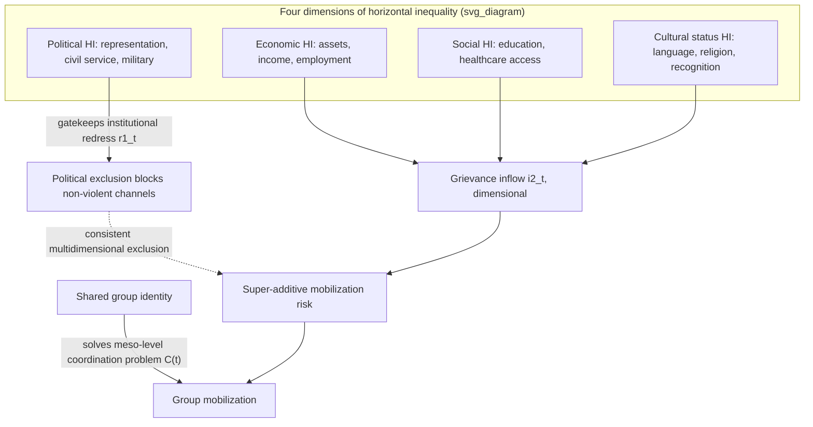

## Stewart's Horizontal Inequality Framework and Group-Based Grievance Formation

### Formal Purpose and Origin

Frances Stewart's horizontal inequality (HI) framework, developed through the Centre for Research on Inequality, Human Security and Ethnicity (CRISE) at Oxford in the 2000s, has been invoked repeatedly across this curriculum as the corrective to a specific measurement failure identified in both prior items in this chapter: recall that Collier-Hoeffler's and Fearon-Laitin's null or weak grievance results were substantially attributed to **poor operationalization** of grievance via aggregate fractionalization and Gini-coefficient measures, and that Stewart's group-differentiated data was cited as recovering stronger grievance-onset relationships. This item presents the HI framework itself as a distinct theoretical and measurement architecture, not merely as a critique of its predecessors.

### Core Definitional Distinction: Horizontal vs. Vertical Inequality

**Vertical inequality (VI)** is inequality between *individuals or households*, ranked without reference to group membership — the standard object measured by Gini coefficients, income deciles, and most conventional inequality metrics. **Horizontal inequality (HI)** is inequality between *culturally defined or constructed groups* — ethnic, religious, regional, linguistic — measured as the gap between group-level aggregates, not individual-level dispersion. This distinction is not merely definitional bookkeeping: Stewart's central empirical and theoretical claim is that **aggregate VI measures can be entirely uninformative about HI**, because a society can have low overall (vertical) inequality while harboring severe, conflict-relevant group-based (horizontal) inequality if the *within-group* distributions offset at the aggregate level — a Gini coefficient averages across group membership and is mathematically incapable of detecting a scenario where Group A is uniformly wealthy and Group B is uniformly poor, versus a scenario with the identical aggregate Gini but individual-level, group-uncorrelated variance. This is the precise formal mechanism behind the measurement critique flagged in both Collier-Hoeffler and Fearon-Laitin items: a low-VI, high-HI society would show weak grievance-proxy correlations in a standard cross-national regression using Gini/fractionalization data, while the group-differentiated mechanism driving actual mobilization risk remains fully present and undetected.

### The Four Dimensions of Horizontal Inequality

Stewart's framework specifies HI as multidimensional, not reducible to economic gaps alone — this multidimensionality is itself a substantive theoretical claim about grievance formation, not merely a data-collection convenience:

- **Economic HI**: group-differentiated access to assets (land, capital), employment, income, and public-sector positions.
- **Social HI**: group-differentiated access to education, healthcare, and other public services — distinct from economic HI because service-access gaps can persist or even widen independent of income convergence, and are frequently more directly visible/salient to affected populations (a school or clinic's presence or absence is locally observable in a way aggregate income statistics are not).
- **Political HI**: group-differentiated access to political power — representation in the legislature, cabinet, civil service, judiciary, and military officer corps. Stewart's research places particular causal weight on this dimension, since political exclusion directly determines a group's capacity to use *institutional* channels (recall $r_1(t)$, institutional redress, from grievance stock-flow modeling) to address the other HI dimensions — a group excluded from political power has a structurally degraded outflow mechanism for its economic and social grievances, meaning political HI functions partly as a **gatekeeper variable** determining whether other-dimension grievances can be processed non-violently at all.
- **Cultural status HI**: group-differentiated recognition and respect for cultural practices, religion, language, and customs in the public sphere (e.g., official-language status, religious holiday recognition, curriculum content) — directly connects to the "status/identity threat inflow" $i_4(t)$ specified in the original grievance stock-flow model.

**Formal aggregation issue**: these four dimensions do not necessarily move together — a group can face severe political exclusion while experiencing relative economic parity (or vice versa), and Stewart's framework treats **dimensional consistency versus divergence** as itself analytically significant: consistently negative HI across all four dimensions for the same group is associated with substantially higher conflict risk than a single-dimension gap, because consistency removes the ambiguity/deniability that allows a single-dimension gap to be attributed to non-discriminatory factors, and because a group facing consistent multidimensional exclusion lacks any institutional dimension (political HI) through which to seek redress on the others.

### Mechanism: From Horizontal Inequality to Group Mobilization

Stewart's causal mechanism connects directly to the mobilization-threshold formalism introduced in grievance stock-flow modeling and the micro-meso-macro coupling framework, with a specific addition: HI provides not just a grievance-inflow source but a **ready-made mobilization structure**. Because the inequality is organized along pre-existing group/identity lines rather than distributed individually, HI directly solves the collective-action coordination problem that would otherwise impede mobilization (recall the meso-level organizational-capacity requirement $C(t)$) — shared group identity functions as a low-cost coordination device (a Schelling focal point, recall the triggering-cause item's use of the same concept) for who mobilizes with whom, meaning HI is causally potent not merely because it raises the grievance-inflow term $i_2(t)$ (recall the horizontal-inequality inflow specified in grievance stock-flow modeling as $i_2(t) = k\cdot[E_{group} - A_{group}(t)]$) but because the *same* group boundary that defines the inequality gap also defines the natural mobilization unit — vertical (individual-level) inequality lacks this property, since individually-dispersed grievance has no natural coordination boundary along which affected individuals can identify and organize with one another.

**Formal restatement of the inflow mechanism**: recall $i_2(t) = k\cdot[E_{group} - A_{group}(t)]$, the entitlement-minus-actual-allocation gap. Stewart's multidimensional framework decomposes this single term into a vector across the four HI dimensions, and the dimensional-consistency finding above amounts to a claim that the *effective* mobilization-relevant grievance inflow is better modeled as a function that weights consistently-negative multidimensional profiles more heavily than the simple sum of single-dimension gaps would predict — i.e., a super-additive rather than additive aggregation across dimensions, though [Inference] the precise functional form of this super-additivity is not fully specified in the empirical HI literature and is presented here as a structural implication of the consistency finding rather than an established quantitative model.

### Empirical Findings and Relation to Collier-Hoeffler / Fearon-Laitin

Stewart and CRISE-affiliated research, using group-differentiated data across cases (including work later formalized in datasets such as Ethnic Power Relations, referenced in the Fearon-Laitin item as the corrective to aggregate fractionalization measures), finds that **political HI in particular is a robust and substantively large predictor of conflict onset and recurrence** once measured at the appropriate group-differentiated level — directly reversing the near-null grievance results in the original Collier-Hoeffler and Fearon-Laitin specifications, which used aggregate fractionalization (a diversity measure, not an exclusion measure) rather than group-specific political-exclusion data. This is not, properly understood, a refutation of either prior framework's opportunity/feasibility findings — Stewart's own position, and the position adopted by subsequent syncretic literature, is that **HI and opportunity/feasibility are complementary rather than competing mechanisms**: HI provides the grievance-inflow and mobilization-coordination structure, while state weakness (Fearon-Laitin) and resource financing (Collier-Hoeffler) determine whether a mobilized, aggrieved group can sustain organized violence against the state. Formally, in terms of the composite onset model from the three-tier taxonomy, Stewart's contribution is best read as correctly re-specifying the $\text{Struct}$ (grievance) term's *measurement*, not as challenging the $\beta$ weighting on opportunity terms found by the earlier frameworks.

### Methodological Critique and Open Questions

- **Group boundary endogeneity**: HI measurement requires a prior specification of which groups matter, but group boundaries are themselves frequently contested, constructed, or fluid (recall the identity-hardening mechanism from path dependency) — an HI measurement taken *after* conflict has already begun to harden categorical boundaries may overstate pre-conflict HI's causal role, since the boundaries used to measure the "pre-existing" inequality may themselves have been sharpened by processes connected to the conflict's own escalation.
- **Direction of causation between political HI and state capacity**: political exclusion (low political HI for a group) and general state weakness (Fearon-Laitin's mechanism) are frequently correlated in practice — a weak, low-capacity state may govern via ad hoc patronage networks that are more likely to be ethnically exclusive by construction, raising the question of whether political HI is an independent causal channel or partly a downstream symptom of the same state-weakness variable Fearon-Laitin identifies as primary; the literature has not fully resolved this identification problem.
- **Data availability constraints**: group-differentiated data across the four dimensions, especially political and cultural-status HI, is substantially harder to collect systematically across a large cross-national sample than the aggregate measures used in the original Collier-Hoeffler/Fearon-Laitin specifications, meaning HI-based cross-national tests generally rely on smaller or more recent samples than the original opportunity-focused studies, a data-availability asymmetry that complicates direct large-N comparison between the frameworks even where the underlying theoretical claims are treated as complementary.

### Design Implication: Multidimensional, Group-Differentiated Diagnosis

- **Diagnosis must be group-differentiated, not aggregate**, directly reversing the measurement practice critiqued above — conflict risk assessment should collect and report economic, social, political, and cultural-status indicators broken out by politically relevant group, not only national aggregates, since aggregate indicators can mask exactly the HI structure that drives mobilization risk.
- **Political HI deserves diagnostic priority** given its gatekeeper role — a peace-engineering assessment finding severe economic or social HI alongside adequate political inclusion faces a substantively different design problem (targeted economic/service redress, with institutional channels available to process it) than one finding political exclusion compounding the other dimensions (which requires political-power-sharing design, recall consociational mechanisms discussed in system boundary specification's design section, before economic or social redress mechanisms can be expected to function as genuine outflows rather than being blocked at the institutional gate).
- **Dimensional-consistency screening as an early-warning tool**: because consistent multidimensional negative HI for a single group is the highest-risk configuration identified by the framework, tracking whether a group's HI profile is becoming more consistent (previously offsetting dimensions converging toward uniform exclusion) provides a specific, monitorable leading indicator distinct from tracking any single dimension's level in isolation.

**Key Points**

- Horizontal inequality (between constructed groups) is mathematically distinguishable from and can be entirely undetected by vertical inequality measures (individual-level Gini coefficients), directly explaining the weak grievance results in Collier-Hoeffler and Fearon-Laitin's aggregate specifications.
- HI is multidimensional (economic, social, political, cultural-status); political HI functions as a gatekeeper dimension because political exclusion degrades a group's access to institutional redress channels for the other dimensions.
- Consistent multidimensional negative HI for a single group is associated with disproportionately higher conflict risk than single-dimension gaps, interpreted as a super-additive rather than additive grievance effect.
- HI's mobilization potency derives partly from group identity solving the collective-action coordination problem inherent in organizing dispersed individual grievance — a mechanism vertical inequality structurally lacks.
- HI and the opportunity/feasibility frameworks (Collier-Hoeffler, Fearon-Laitin) are best understood as complementary, addressing different terms in the composite onset model, rather than as competing explanations of the same variance.

**Related Topics**

- Stock and flow modeling of grievance accumulation and depletion
- Collier-Hoeffler greed and grievance framework in resource-conflict linkages
- Fearon-Laitin state capacity and opportunity model of civil war onset
- Ethnic Power Relations and politically-relevant-group exclusion data
- Consociational power-sharing design and political inclusion mechanisms
- Identity hardening and categorical fixation under path dependency