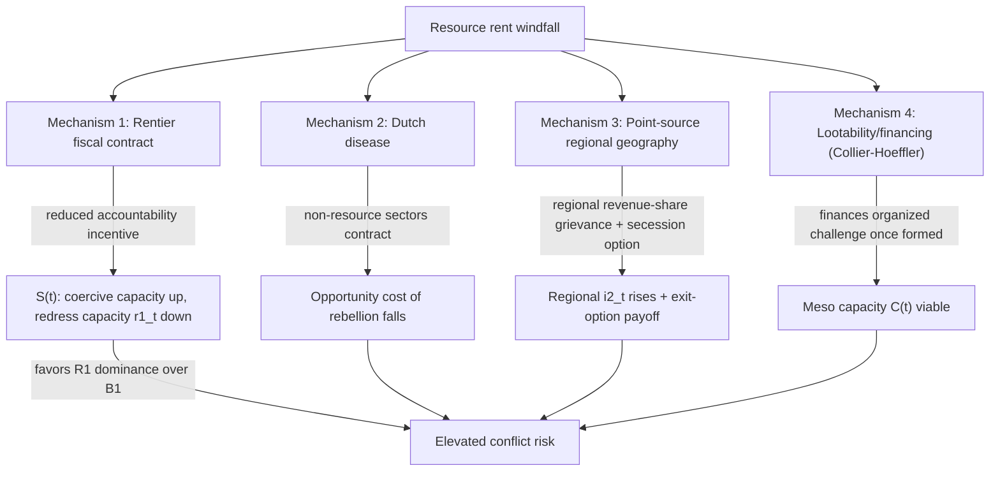

## Resource Curse Mechanisms and Rentier-State Conflict Pathways

### Formal Purpose and Scope

Recall from the Collier-Hoeffler item that primary commodity export dependence was identified as a robust onset predictor, interpreted there primarily through a **rebel-financing viability** channel (raising meso-level organizational capacity $C(t)$). This item addresses a distinct, complementary causal architecture: the **resource curse** literature, which asks not how resources finance an *already-forming* rebellion, but how resource wealth **restructures state institutions and the state-society bargain itself**, generating conflict-conducive structural conditions independent of any specific rebel organization's financing. The scope here is macro-institutional (recall micro-meso-macro coupling); the mechanisms below operate primarily at the macro→meso downward-causation channel, shaping the state-capacity and institutional-quality parameters that condition all of the mechanisms discussed in the two preceding items.

### Definitional Core: The Resource Curse Paradox

The resource curse denotes the empirical regularity that countries with abundant natural resource wealth (particularly point-source, capital-intensive resources: oil, gas, minerals — as opposed to diffuse, labor-intensive agricultural resources) frequently exhibit **worse** economic growth, governance quality, and conflict outcomes than comparably endowed but resource-poor states, inverting the naive expectation that resource wealth should improve a state's development trajectory. This is a distinct empirical puzzle from, though mechanistically related to, the conflict-specific findings discussed under Collier-Hoeffler.

### Mechanism 1: Rentier State Formation and the Fiscal Social Contract

**Formal mechanism**: in a rentier state, government revenue derives predominantly from resource rents (state ownership or heavy taxation of extraction) rather than from broad-based taxation of citizen economic activity. This severs the standard fiscal social-contract link — "no taxation without representation" runs in reverse here: because the state does not depend on citizen taxation for revenue, it has structurally **reduced accountability incentive** to provide responsive governance, representation, or service delivery in exchange for revenue, since its fiscal survival does not depend on citizen compliance or consent in the way a tax-dependent state's does. This directly degrades multiple dimensions of Stewart's horizontal-inequality framework simultaneously (recall political HI's gatekeeper role) — a rentier state has weaker structural incentive to maintain the institutional redress channels ($r_1(t)$, recall grievance stock-flow modeling) that a tax-dependent state's accountability relationship would otherwise pressure it to sustain.

**Formal restatement via state capacity $S(t)$**: recall from the Fearon-Laitin item that $S(t)$ (state administrative/military reach) was treated largely as a function of economic development. The rentier mechanism specifies a distinct pathway by which $S(t)$'s *military* component can rise (resource rents fund an expanded security apparatus) even as $S(t)$'s *administrative/service-delivery/accountability* component falls — this decomposition matters because it predicts a specific institutional profile (strong coercive capacity, weak accountable governance) rather than uniform state strengthening or weakening, and this asymmetric profile is itself conflict-relevant: a state well-resourced for repression but poorly incentivized toward redress is precisely the parameter configuration that favors R1 (repression-grievance spiral, recall reinforcing feedback loops) dominance over B1 (institutional absorption) dominance.

### Mechanism 2: Dutch Disease and Structural Economic Distortion

**Formal mechanism**: large resource-export revenues appreciate the real exchange rate, making the country's non-resource tradable sectors (manufacturing, agriculture) uncompetitive in export markets — capital and labor shift toward the resource sector and non-tradable services, while manufacturing and diversified agriculture contract. This is a well-established macroeconomic mechanism (named for the Netherlands' natural-gas-driven manufacturing decline) with a direct conflict-relevant consequence: it **narrows the economy's employment base** outside the capital-intensive resource sector itself, which — recall the opportunity-cost mechanism from Collier-Hoeffler and Fearon-Laitin — lowers the general population's opportunity cost of joining an armed group, since alternative civilian economic pathways have been structurally narrowed by exchange-rate-driven deindustrialization rather than by any grievance-related process. This mechanism is therefore a distinct route to the *same* opportunity-cost variable both prior frameworks identified, operating through macroeconomic structure rather than through direct poverty or state-capacity channels.

### Mechanism 3: Point-Source Resource Geography and Secessionist/Regional Conflict

**Formal mechanism**: unlike diffuse agricultural wealth, point-source resources (oil fields, mineral deposits) are geographically concentrated, frequently in specific sub-national regions that may be ethnically or regionally distinct from the political center. This generates a specific conflict pathway distinct from the general rentier-accountability mechanism above: **regional grievance over resource-revenue distribution**, combining Stewart's economic-HI dimension (the extracting region's share of derived revenue versus the center's) with a **secessionist incentive structure** absent in non-resource contexts — a resource-rich region has a materially higher expected payoff from independence or greater autonomy than a resource-poor region would, because it can plausibly expect to retain resource rents currently captured by the center. This is formally an addition to the entitlement-gap grievance inflow $i_2(t) = k\cdot[E_{group}-A_{group}(t)]$ specific to resource-producing regions, where $E_{group}$ (entitlement) is anchored to the region's belief about its "fair share" of resource-derived revenue specifically, and the secession option changes the *payoff structure* of the region's mobilization decision (an exit option, recall the outmigration/exit outflow $r_4(t)$ from grievance stock-flow modeling — but here operating as a *collective territorial* exit option rather than an individual emigration outflow, structurally distinct in its conflict implications since a credible secession threat is itself a bargaining lever rather than a pure grievance-depleting mechanism).

### Mechanism 4: Lootability and Financing Viability (Recall and Integration)

This is the mechanism already introduced under Collier-Hoeffler — resource rents finance rebel organizations directly, whether via looting/taxation of extraction sites, control of transport routes, or (for more diffuse resources like alluvial diamonds or coca) direct participation in extraction and sale. The integration point for this item: **mechanisms 1–3 explain why resource wealth generates the grievance and secessionist-incentive conditions that make organized challenge to the state attractive, while mechanism 4 (already established) explains why that challenge is financially sustainable once organized** — the full resource-curse-to-conflict pathway therefore spans both the macro-institutional/grievance side (this item's primary contribution) and the meso-organizational-financing side (Collier-Hoeffler's primary contribution), rather than resource wealth operating through a single channel.

### Non-Monotonicity and Conditioning Variables

Consistent with the re-examination flagged in the Collier-Hoeffler item, the resource-conflict relationship is **not uniform across all resource-rich states** — a substantial branch of the literature identifies conditioning variables that determine whether resource wealth produces curse-pathway outcomes or not:

- **Pre-existing institutional quality**: states with strong, accountable institutions *prior to* major resource discovery (the frequently cited contrast case being Norway/Botswana-type outcomes versus Nigeria/Angola-type outcomes) show substantially attenuated curse effects — this suggests the causal arrow runs partly through institutional quality **conditioning** resource wealth's effect rather than resource wealth **determining** institutional quality unconditionally; formally, mechanism 1's effect size is itself a function of pre-resource institutional baseline, not a fixed constant.
- **Resource type**: point-source, capital-intensive resources (oil, diamonds, minerals) show more robust curse/conflict associations than diffuse, labor-intensive resources (most agricultural commodities), consistent with mechanism 3's geography-specific channel and mechanism 4's lootability channel both being sensitive to resource type in ways mechanism 1 (general rentier fiscal effect) is not.
- **Democratic versus autocratic baseline**: some research finds the rentier fiscal-contract mechanism (mechanism 1) operates more strongly in already-weak or transitional democratic contexts than in either fully consolidated democracies or fully entrenched autocracies, suggesting a non-monotonic relationship between baseline regime type and curse severity rather than a simple linear conditioning effect. [Unverified] The precise functional form and current consensus strength of this regime-type interaction is contested and not settled to a single agreed specification across the literature.

### Design Implication: Distinct Intervention Points Across Mechanisms

Because mechanisms 1–4 operate through structurally distinct channels, resource-curse-informed peace engineering requires **mechanism-specific rather than generic "resource governance" intervention**, directly extending the Collier-Hoeffler design-implication section's resource-transparency recommendation:

- **Mechanism 1 (rentier accountability)**: direct redistribution mechanisms that recreate a fiscal social-contract-like accountability link — resource-revenue-funded conditional cash transfers, sovereign wealth funds with transparent, rules-based citizen dividends (the Alaska Permanent Fund model cited as a partial precedent) — designed specifically to restore a citizen-state fiscal dependency the rentier structure otherwise severs, distinct from simple revenue-transparency measures, which address mechanism 4's financing-traceability concern but do not by themselves restore mechanism 1's accountability link.
- **Mechanism 2 (Dutch disease)**: macroeconomic management (sovereign wealth fund sterilization of windfall revenue, deliberate exchange-rate management, diversification-targeted industrial policy) to preserve non-resource sector competitiveness and thereby preserve the opportunity-cost-elevating effect of a diversified economy — this is a distinct policy lever from both mechanism 1's political-accountability fix and mechanism 4's financing-interdiction fix.
- **Mechanism 3 (regional/secessionist)**: revenue-sharing formulas explicitly allocating a transparent, credible share of resource rents to producing regions, combined with genuine political-HI-addressing regional autonomy arrangements (recall Stewart's political-HI gatekeeper finding) — addressing the economic-HI gap alone without a credible political mechanism to sustain the allocation risks the same institutional-gatekeeper failure mode identified in the horizontal-inequality item.
- **Mechanism 4 (financing)**: as previously specified under Collier-Hoeffler — certification, traceability, and interdiction of lootable-resource revenue streams to organized armed actors.

**Key Points**

- The resource curse is a macro-institutional restructuring effect distinct from, though complementary to, Collier-Hoeffler's rebel-financing-viability mechanism; it explains why resource-rich states develop conflict-conducive institutional profiles rather than how an already-forming rebellion sustains itself financially.
- The rentier-state mechanism reduces state accountability incentive because fiscal survival no longer depends on citizen taxation, producing an asymmetric $S(t)$ profile (strong coercive capacity, weak redress capacity $r_1(t)$) that favors reinforcing-loop dominance over balancing-loop dominance.
- Dutch disease narrows non-resource employment, elevating rebellion's relative attractiveness via the same opportunity-cost channel identified in Collier-Hoeffler and Fearon-Laitin, but via a distinct macroeconomic pathway.
- Point-source resource geography generates region-specific economic-HI grievance combined with a secession payoff option, structurally distinct from a simple entitlement-gap grievance inflow because it introduces a credible collective territorial exit option.
- Curse severity is strongly conditioned by pre-existing institutional quality and resource type, meaning resource wealth's conflict effect is not uniform or deterministic, and each of the four mechanisms identified requires a distinct, non-interchangeable intervention design.

**Related Topics**

- Collier-Hoeffler greed and grievance framework in resource-conflict linkages
- Fearon-Laitin state capacity and opportunity model of civil war onset
- Stewart's horizontal inequality framework and group-based grievance formation
- Stock and flow modeling of grievance accumulation and depletion
- Sovereign wealth fund design and rentier fiscal-contract restoration
- Secessionist bargaining and regional autonomy design