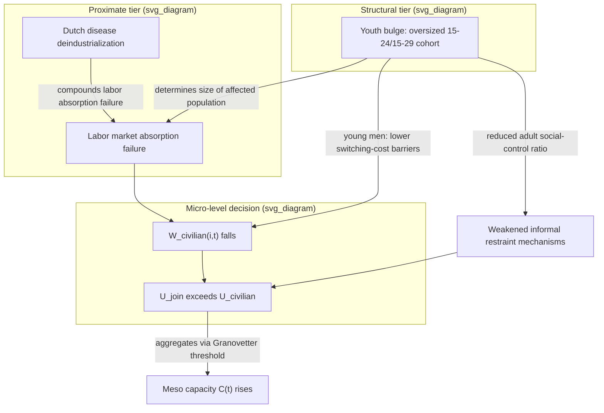

## Youth Bulge and Opportunity-Cost Models of Armed Group Recruitment

### Formal Purpose

The opportunity-cost mechanism has been invoked repeatedly across this chapter (Collier-Hoeffler's low-income variable, Fearon-Laitin's income-as-state-capacity-proxy reinterpretation, the resource curse's Dutch-disease channel) but not yet formalized as a standalone micro-level decision model. This item provides that formalization and integrates it with a specific demographic-structural variable — the youth bulge — that determines the **supply-side magnitude** of the population facing the opportunity-cost calculation, closing the recruitment-side mechanism this chapter has been building toward across all four preceding items.

### The Opportunity-Cost Model of Individual Recruitment Decision

**Formal setup**: recall from micro-meso-macro coupling that individual-level join/flee/collaborate/stay-neutral decisions are the micro-level state variable feeding meso-level organizational capacity $C(t)$. The opportunity-cost model specifies this individual decision as a comparison of expected utility across the available options. For individual $i$ at time $t$, the decision to join an armed group is modeled as rational (or boundedly rational) under:

$$U_{join}(i,t) = p_{win}\cdot V_{win} + p_{survive}\cdot(\text{material/status benefits}) - p_{die/injured}\cdot(\text{cost}) - \delta \cdot W_{civilian}(i,t)$$

where $W_{civilian}(i,t)$ is individual $i$'s **forgone civilian economic value** — wages, land-based livelihood, or business income the individual sacrifices by joining — and $\delta$ is a discount/salience weight. The critical comparative-statics result: **joining becomes more attractive precisely as $W_{civilian}(i,t)$ falls**, independent of any change in the armed group's own recruitment offer or in the individual's grievance level. This is the formal basis for reading "low income predicts conflict" as an opportunity-cost finding rather than a grievance finding (recall this exact reinterpretation from the Fearon-Laitin item) — the mechanism operates on the *denominator* of the join-decision comparison, not on the *numerator* (perceived injustice, $G(t)$'s individual-level correlate).

**Distinction from pure grievance-driven recruitment**: a purely grievance-driven model predicts recruitment magnitude tracking $G(t)$; an opportunity-cost model predicts recruitment magnitude tracking $-W_{civilian}(t)$ largely independent of $G(t)$'s level — these are empirically separable predictions (a research design implication: recruitment surges coinciding with local economic shocks but not with new grievance-generating events would favor the opportunity-cost model; recruitment surges coinciding with a rights violation or atrocity but not with economic conditions would favor the grievance channel), and most empirical treatments (including Weinstein's work referenced in micro-meso-macro coupling on resource-rich versus resource-poor rebel organizations) treat both channels as simultaneously operative, with their relative weight varying by organization type and context.

### Youth Bulge: Definition and Demographic Mechanism

**Definition**: a youth bulge is a population age structure with a disproportionately large cohort of individuals aged roughly 15–24 (or 15–29 in some specifications) relative to the total adult population, typically arising from a preceding period of high fertility followed by declining infant mortality without a corresponding fertility decline — a demographic transition-stage phenomenon rather than a permanent population feature.

**Mechanism connecting youth bulge to conflict risk, formally stated**: the youth bulge is not itself a motive variable — it is a **supply-side scale variable** determining how large the population facing an adverse opportunity-cost calculation can be at a given moment. Three distinct, non-mutually-exclusive causal pathways connect youth bulge to elevated conflict risk:

1. **Labor market absorption failure**: a disproportionately large youth cohort entering the labor market simultaneously strains an economy's capacity to generate sufficient formal-sector employment, mechanically lowering $W_{civilian}(i,t)$ for a large fraction of the population simultaneously — this is a *composition* effect distinct from an aggregate income-level effect (recall Collier-Hoeffler's low-GDP variable): a country can have moderate aggregate GDP per capita while still facing severe youth un(der)employment if its demographic structure has outpaced its labor-market absorption capacity, meaning youth bulge and aggregate income are partially independent risk channels rather than the same variable measured differently.
2. **Lower per-fighter opportunity cost specifically among young men**: young, unmarried men without dependents or accumulated assets face structurally lower $W_{civilian}$ and lower switching-cost barriers (no family to support, no land/business investment to forfeit) than older, established individuals — this is a within-population heterogeneity claim, meaning the youth bulge's conflict-relevant effect operates partly through *which* demographic segment is oversized, not merely through population size generally.
3. **Reduced adult social control/authority ratio**: a youth bulge mechanically reduces the ratio of established adults (parents, community elders, employers) to young adults, which — in social-control theories of collective violence — is argued to weaken the informal social mechanisms that otherwise dampen youth mobilization into armed activity, a mechanism operating at the meso/community level rather than the pure individual-economic level.

### Formal Integration with the Composite Onset Model

Recall the composite onset model from the three-tier taxonomy: $P(\text{onset}) = \Phi(\alpha\cdot\text{Struct} + \beta\cdot\text{Prox} + \kappa\cdot\text{Trig})$. Youth bulge functions as a **structural-tier variable** (a slow-moving demographic parameter, changing over generational timescales, recall the tier-1 definition from that item) that determines the *population base* available for opportunity-cost-driven recruitment, while acute labor-market shocks (a recession, a resource-price collapse) function as **proximate-tier** developments that convert a latent youth-bulge structural risk into an active recruitment surge — directly parallel to the general structural-sets-threshold, proximate-walks-toward-it relationship established in that item. This also integrates cleanly with the resource curse's Dutch-disease mechanism (recall the preceding item): Dutch-disease-driven deindustrialization is a specific *cause* of the labor-market-absorption-failure pathway above, meaning a resource-rich, Dutch-disease-affected economy with a simultaneous youth bulge faces a compounded opportunity-cost risk — two independent structural/proximate mechanisms lowering $W_{civilian}(t)$ for the same oversized demographic cohort simultaneously.

### Methodological Critiques

- **Demographic determinism concern**: a substantial critique (paralleling the measurement critiques raised against Collier-Hoeffler's fractionalization variable and Fearon-Laitin's income variable) holds that youth-bulge statistics alone show only a **weak-to-moderate, highly context-conditional** correlation with conflict onset in isolation — the mechanism requires the *compounding* conditions specified above (labor-market absorption failure specifically, not merely a large youth cohort per se) to translate into elevated risk; a youth bulge in an economy successfully absorbing that cohort into productive employment shows little to no elevated risk, meaning youth bulge functions as a **conditional risk multiplier** on labor-market conditions rather than as an independent, unconditional predictor — treating it as a standalone causal variable overstates its independent explanatory power.
- **Selection and agency critique**: opportunity-cost models, taken in isolation, risk implying recruitment is purely a function of economic desperation, which empirical micro-level studies of ex-combatants (Humphreys and Weinstein's survey-based research, referenced under micro-meso-macro coupling) do not uniformly support — participation motives in their data are heterogeneous, including grievance, security-seeking (joining for protection rather than economic gain), coercion, and social-network ties, alongside economic opportunity-cost considerations; the opportunity-cost model's proper scope is as one significant contributing channel among several coexisting mechanisms, not a complete or exclusive explanation of individual recruitment decisions.
- **Reverse causation in youth-bulge measurement**: because youth-bulge statistics derive from fertility and mortality data collected over preceding decades, and because conflict itself can disrupt data collection or, in protracted-conflict settings, affect fertility and mortality patterns, care is required in cases of long-running conflict to avoid treating a youth-bulge measure that is itself partly a *product* of prior conflict-era demographic disruption as a clean, exogenous predictor of that same conflict's continuation — a boundary-specification concern (recall system boundary specification) about whether youth-bulge is genuinely exogenous or partially endogenous in protracted-conflict cases specifically.

### Design Implication: Labor-Market-Targeted, Age-Cohort-Specific Intervention

- **Employment-generation programs targeted specifically at the oversized youth cohort** (vocational training linked to actual labor-demand forecasting, youth-targeted microfinance, public employment schemes during demographic-transition windows) directly raise $W_{civilian}(i,t)$ for the population segment identified as facing the steepest opportunity-cost gap, distinct from generic national economic-growth policy, which may not specifically reach the age-cohort or labor-market-segment most exposed to the recruitment-relevant opportunity-cost calculation.
- **Demographic-transition timing as a planning variable**: because youth bulge is a structural-tier, generationally-predictable demographic parameter (fertility and mortality data allow multi-decade-ahead forecasting of cohort size), peace-engineering and development planning can treat youth-bulge risk as a scheduled rather than surprise structural condition — labor-market-absorption capacity-building can, in principle, be timed to precede the peak-cohort-size window rather than responding reactively once the proximate-tier labor-market strain has already materialized.
- **Compounded-risk screening**: given the resource-curse integration above, jurisdictions with simultaneous youth bulge and heavy resource-export dependence (Dutch-disease exposure) constitute a specific, identifiable higher-risk configuration warranting combined diversification and youth-employment intervention design rather than either measure pursued in isolation.
- **Avoiding the demographic-determinism trap in design**: because youth bulge is a conditional multiplier rather than an unconditional predictor, intervention design should prioritize the labor-market-absorption and social-integration conditioning variables identified above over demographic composition itself, since the demographic structure is comparatively slow to change (a generational-timescale structural variable) while labor-market absorption capacity is a more directly and immediately addressable proximate-tier lever.

**Key Points**

- The opportunity-cost model formalizes recruitment as an individual-level utility comparison in which lower forgone civilian economic value ($W_{civilian}$) raises the relative attractiveness of joining an armed group, operating independently of, and empirically separable from, the grievance channel.
- Youth bulge functions as a structural-tier supply-side variable determining the size of the population exposed to opportunity-cost-driven recruitment, not as a direct motive variable in itself — its effect is substantially conditional on labor-market absorption capacity, a proximate-tier variable.
- Three distinct pathways connect youth bulge to risk: labor-market absorption failure (composition effect), lower per-fighter switching costs among young unmarried men (within-population heterogeneity), and reduced adult social-control ratios (meso-level informal restraint weakening).
- Youth bulge functions as a conditional risk multiplier rather than an unconditional predictor; treating it as independently causal without accounting for labor-market conditions overstates its standalone explanatory power, a critique paralleling the measurement critiques of fractionalization and aggregate income variables elsewhere in this chapter.
- Design implications center on age-cohort-specific, labor-market-targeted employment generation, timed where possible to precede peak-cohort-size windows using the demographic parameter's long forecast horizon.

**Related Topics**

- Collier-Hoeffler greed and grievance framework in resource-conflict linkages
- Fearon-Laitin state capacity and opportunity model of civil war onset
- Resource curse mechanisms and rentier-state conflict pathways
- Micro, meso, and macro coupling models in conflict system analysis
- Weinstein's resource-based theory of rebel recruitment
- Granovetter threshold models of collective mobilization