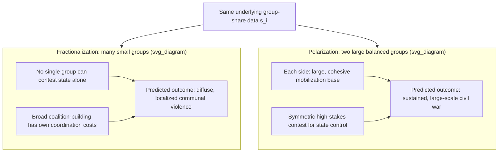

## Ethnic Fractionalization versus Polarization Indices as Conflict Predictors

### Formal Purpose

Both Collier-Hoeffler and Fearon-Laitin found weak or insignificant effects for ethnic fractionalization, and Stewart's horizontal-inequality item attributed part of this null result to poor measurement — but that critique targeted *what* was measured (aggregate diversity versus group-specific exclusion), not *how* diversity itself should be quantified. This item addresses the latter, distinct question: fractionalization and polarization are two mathematically different ways of summarizing the same underlying group-composition data, and they make **opposite predictions** about which societies face elevated risk, a distinction the earlier null results substantially obscured by relying on fractionalization alone.

### Formal Definition: Fractionalization

The standard ethnic fractionalization index (ELF, or its modern refinements) measures the probability that two randomly selected individuals from the population belong to **different** groups:

$$F = 1 - \sum_{i=1}^{n} s_i^2$$

where $s_i$ is group $i$'s population share and $n$ is the number of groups. Formal properties: $F$ is **maximized when the population is divided into many small, roughly equal-sized groups**, and $F$ approaches its minimum (zero) both in a fully homogeneous society ($n=1$) and, less intuitively, in a society with very many groups each holding a vanishingly small share (since $\sum s_i^2 \to 0$ as $n\to\infty$ with even shares — wait, more precisely, $F\to 1$ as $n\to\infty$ with even shares, its maximum). The key structural point: **fractionalization treats "many groups" as the high-risk configuration**, consistent with the intuitive but ultimately weakly-supported hypothesis (tested and largely rejected in Collier-Hoeffler and Fearon-Laitin) that simple diversity itself drives conflict via coordination-failure or general distrust mechanisms.

### Formal Definition: Polarization

The polarization index (most commonly the Reynal-Querol / Montalvo-Reynal-Querol RQ index, adapting Esteban-Ray polarization theory) is constructed to instead be **maximized when the population is divided into exactly two roughly equal-sized groups**, and to fall toward zero both in a homogeneous society and in a highly fractionalized many-small-groups society:

$$RQ = 1 - \sum_{i=1}^{n} \left(\frac{0.5 - s_i}{0.5}\right)^2 s_i$$

Formal properties: $RQ$ peaks at a bipolar 50/50 split and declines as group-size distribution departs from bipolarity in either direction (toward homogeneity or toward high fragmentation). This is not a minor rescaling of the same underlying construct — **fractionalization and polarization are structurally distinct functions of the same group-share data and can move in opposite directions as group composition changes**, making them genuinely competing rather than redundant covariates in an onset regression.

### Why the Distinction Matters Mechanistically

The mechanistic case for polarization over fractionalization as a conflict predictor connects directly to the meso-level organizational-capacity requirement $C(t)$ (recall micro-meso-macro coupling) and the mobilization-coordination role of group identity (recall Stewart's item on how shared identity solves the collective-action coordination problem):

- **A bipolar society** (two large, roughly balanced groups) presents the *clearest* coordination structure for large-scale mobilization — each side has a large, cohesive, and roughly power-matched rival, which both provides a large ready-made mobilization base on each side (satisfying $C(t)$'s viability threshold easily) and creates a symmetric, high-stakes contest for control of the state (since a 50/50 split society's political outcome genuinely swings on group-level mobilization, unlike a society where any single group is a clear numerical minority).
- **A highly fractionalized society** (many small groups) faces the *opposite* structural problem for large-scale civil war specifically: no single group can plausibly mobilize enough of the population to seriously contest state control alone, and coordinating a broad multi-group coalition against the state faces its own collective-action costs (this is the mechanism behind the counterintuitive Collier-Hoeffler finding, referenced in that item, that high fractionalization can show a *negative* relationship with onset in some specifications) — fractionalized societies may instead be more prone to localized, low-intensity communal violence involving many small, shifting group configurations rather than sustained, large-scale civil war.

This yields a specific, falsifiable, and **outcome-differentiated** prediction that a fractionalization-only specification cannot make: polarization should better predict large-scale, sustained civil war (which requires substantial, symmetric mobilization capacity on at least one side against the state), while fractionalization's relationship to conflict, if any, should manifest more in low-intensity, diffuse communal violence rather than sustained civil war — a distinction in **conflict type**, not merely conflict presence/absence, that resolves part of the apparent contradiction between "diversity doesn't predict war" (Collier-Hoeffler, Fearon-Laitin, using fractionalization) and "identity-based mobilization is clearly conflict-relevant" (Stewart, using group-differentiated political exclusion).

### Empirical Findings: Montalvo-Reynal-Querol and Subsequent Work

Montalvo and Reynal-Querol's research program, testing the RQ polarization index against standard ELF fractionalization in the same cross-national samples used by Collier-Hoeffler and Fearon-Laitin-adjacent work, found **polarization to be a significantly stronger and more robust predictor of civil war onset** than fractionalization — directly supporting the mechanistic prediction above and offering a specific, complementary resolution to the "grievance/diversity doesn't matter" finding: it was not diversity's irrelevance being demonstrated, but the use of a functional form (fractionalization) that is mechanistically mismatched to the coordination-capacity logic of large-scale civil war onset specifically. This finding sits alongside, and is complementary to rather than competing with, Stewart's horizontal-inequality critique — both identify measurement-specification failures in the original fractionalization-based grievance tests, but target **different aspects** of the specification: Stewart's critique concerns *which groups* and *which dimensions* of inequality are measured (exclusion versus mere diversity); the fractionalization-versus-polarization critique concerns *how the same group-composition data is functionally aggregated* into a single index, a distinct and additive rather than overlapping correction.

### Methodological Critiques

- **Ethnic demography as a coarse proxy regardless of index choice**: both fractionalization and polarization indices, however constructed, still reduce a society's full social structure to a single scalar derived from group population shares — neither captures the **political-relevance** dimension emphasized in the Fearon-Laitin follow-up critique (recall the Ethnic Power Relations discussion) — a bipolar demographic split with genuine power-sharing and political inclusion for both groups may show a high RQ score while facing substantially lower actual conflict risk than a bipolar split with severe political exclusion of one group, meaning polarization indices remain vulnerable to a version of the same "measures composition, not exclusion" critique leveled at fractionalization, just with a different functional form.
- **Group-definition sensitivity**: both indices are highly sensitive to how "groups" are coded in the underlying data (linguistic versus religious versus self-identified ethnic categories can produce substantially different fractionalization and polarization scores for the same country) — this is the same group-boundary-construction concern raised in Stewart's item and in path dependency's identity-hardening discussion, and it affects both indices' construction validity symmetrically rather than favoring one over the other.
- **Non-linear and interaction effects**: subsequent research has explored whether fractionalization and polarization interact rather than functioning as pure substitutes — e.g., some specifications find polarization's effect is itself conditioned by overall fractionalization level (a bipolar split within an otherwise fractionalized regional context may behave differently than a bipolar split in an otherwise homogeneous national context), suggesting the two indices may be better treated as jointly informative rather than as strictly competing alternative specifications. [Inference] The precise functional form of this interaction, and whether a single combined index dominates using both separately, is not settled to a single canonical specification in the literature.

### Design Implication: Index Choice as a Diagnostic, Not Merely Statistical, Decision

- **Match index to conflict-type question being asked**: a risk assessment concerned with sustained, large-scale civil war onset should weight polarization-type diagnostics (is the society structured around one or two large, roughly power-matched groups?) more heavily; an assessment concerned with diffuse communal or localized violence should weight fractionalization-adjacent diagnostics (how many distinct group configurations exist locally, and how do they interact in specific contested localities?) — treating the two as interchangeable "ethnic diversity" measures in intervention design risks mismatching the diagnostic tool to the conflict-type risk actually being assessed.
- **Combine with political-relevance data as a required complement**, not an optional refinement — given the shared vulnerability of both indices to the composition-versus-exclusion critique, neither fractionalization nor polarization alone should drive intervention design without integration with Stewart-style group-differentiated political-HI data (recall the gatekeeper-dimension finding) — a high-RQ bipolar society with inclusive power-sharing and a high-RQ bipolar society with severe political exclusion of one side warrant entirely different intervention priorities despite identical polarization scores.
- **Bipolar-society design implication specifically**: where polarization diagnostics identify a genuinely bipolar demographic structure, consociational or power-sharing institutional design (recall the design-implication discussion in system boundary specification) is mechanistically well-matched to the specific coordination structure polarization identifies — a symmetric two-group contest for state control is precisely the configuration power-sharing arrangements are designed to defuse by removing winner-take-all stakes from the contest.

**Key Points**

- Fractionalization and polarization are mathematically distinct functions of the same group-share data: fractionalization is maximized by many small equal groups, polarization is maximized by two large roughly equal groups, and the two indices can move in opposite directions.
- The mechanistic case for polarization's superiority as a civil-war-onset predictor rests on coordination capacity: a bipolar structure provides each side a large, cohesive mobilization base and a symmetric high-stakes contest, while high fractionalization faces its own collective-action barriers to large-scale mobilization.
- Montalvo and Reynal-Querol's empirical work found polarization substantially outperforms fractionalization as a civil-war-onset predictor, offering a distinct, additive resolution (alongside Stewart's exclusion-versus-diversity critique) to the earlier null grievance/diversity findings.
- Both indices remain vulnerable to the same underlying critique of measuring composition rather than political exclusion or relevance, meaning index refinement alone does not substitute for integrating group-differentiated political-HI or Ethnic-Power-Relations-style data.
- Index choice has direct design implications: polarization diagnostics point toward power-sharing/consociational design for bipolar structures, while fractionalization-relevant diagnostics point toward localized communal-violence-focused rather than civil-war-focused intervention strategies.

**Related Topics**

- Stewart's horizontal inequality framework and group-based grievance formation
- Collier-Hoeffler greed and grievance framework in resource-conflict linkages
- Fearon-Laitin state capacity and opportunity model of civil war onset
- Ethnic Power Relations and politically-relevant-group exclusion data
- Micro, meso, and macro coupling models in conflict system analysis
- Consociational power-sharing design and political inclusion mechanisms