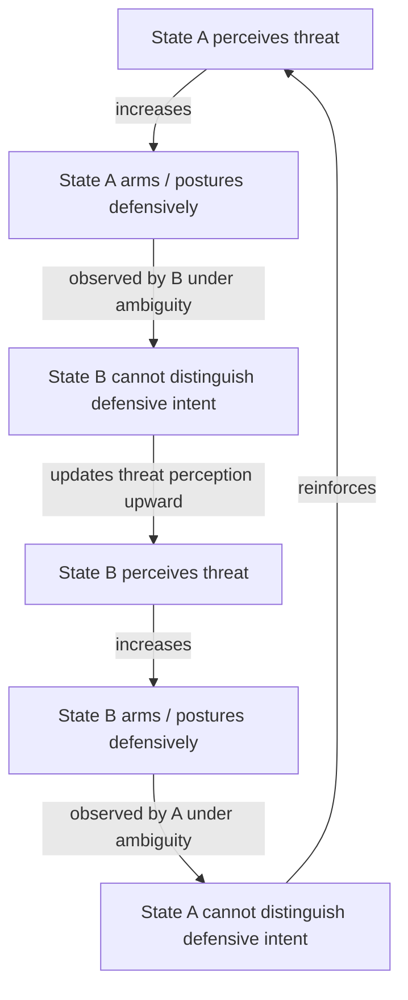

## Jervis's Security Dilemma Under Offense-Defense Uncertainty

### Formal Setup: The Dilemma as a Structural Property

The security dilemma is a structural condition, not a psychological failure: under anarchy, actions a state takes to increase its own security decrease the security of others, regardless of the actors' intentions. This is distinct from a simple prisoner's dilemma in one critical respect — the payoff structure itself is uncertain to the players, because neither side can reliably observe whether the other's capabilities are offensive or defensive in character.

Formally, let two states $A$ and $B$ each choose an arming level $a_i \in \{0, 1\}$ (restrain, arm). Security for state $i$ is a function not only of the joint action profile but of an unobserved type $\theta_i \in \{O, D\}$ (offensive-dominant or defensive-dominant technology regime) held by the other player. The utility a state derives from its rival's arming decision depends on $\theta$, but $\theta$ is private information or is masked by technological ambiguity. This converts a coordination problem with common knowledge of payoffs into a Bayesian game with type uncertainty layered on top of a standard spiral dynamic.

### Jervis's Two Structuring Variables

Jervis's 1978 framework reduces the problem to two binary-ish dimensions, both of which are frequently *unobservable ex ante*:

1. **Offense-defense balance**: whether prevailing military technology favors the attacker or the defender in a given confrontation.
2. **Offense-defense distinguishability**: whether weapons and postures procured for defense are distinguishable, by observation or doctrine, from those procured for offense.

These generate a 2×2 typology of strategic environments:

|  | Offense distinguishable from defense | Offense indistinguishable from defense |
| --- | --- | --- |
| **Defense dominant** | Doubly safe: arms racing rare, status quo stable | Security dilemma exists but is mild |
| **Offense dominant** | Dilemma exists but signaling is possible | Doubly dangerous: dilemma is most severe, war-proneness highest |

The "doubly dangerous" cell is the analytically load-bearing case: when offense dominates *and* offensive and defensive postures look identical, a purely security-seeking state cannot signal benign intent through its choice of capabilities, because the same weapon serves both purposes. This is the condition under which the security dilemma is least escapable by unilateral behavior.

### Why Uncertainty, Not Just Anarchy, Drives the Spiral

A useful way to separate this from the vanilla security dilemma claim ("anarchy causes insecurity") is to note that the dilemma degenerates under either of two conditions:

- If offense-defense balance is common knowledge and defense-dominant, arming is not threatening (defensive weapons cannot support conquest), so the dilemma is structurally absent — there is no signaling problem to solve.
- If postures are perfectly distinguishable, a state can invest in defense-only capability and this is credibly observed by the rival, resolving the informational component even under offense dominance.

The severity of the dilemma is therefore a strictly increasing function of the *joint* uncertainty over balance and distinguishability, not of anarchy alone. This matters for peace engineering: interventions that reduce anarchy (e.g., alliances) do not address the dilemma's root cause if offense-defense ambiguity remains; interventions that improve distinguishability (e.g., verification regimes) can reduce the dilemma's severity even without touching the anarchic structure of the system.

### The Feedback Loop Representation

The dilemma is best modeled as a reinforcing loop rather than a single strategic move:

This is a positive (reinforcing) feedback loop with no natural damping term unless an exogenous mechanism is introduced — this is precisely the analytic space that peace-engineering interventions (arms control verification, transparency regimes, defensive-only force postures) are designed to occupy: each is an attempt to insert a balancing loop or to break a specific edge in this cycle.

Note the causal structure explicitly: the independent variable driving each iteration is not the rival's actual type $\theta_i$, but the *observing state's posterior belief* about $\theta_i$ given ambiguous signals. This is why the dilemma persists even between two states that are, in fact, purely security-seeking (type $D,D$) — the spiral is generated by the inability to verify type, not by the true type distribution.

### Bayesian Updating Under Ambiguous Signals

Consider state $B$ observing an arms buildup by $A$. Let $p$ be $B$'s prior belief that $A$ is type $O$ (revisionist/offensive-intent). If offensive and defensive buildups are observationally identical (the doubly-dangerous cell), the buildup signal $s$ has the same likelihood under both types:

$$P(s \mid O) = P(s \mid D)$$

By Bayes' rule, the posterior equals the prior — the signal carries no information, and $B$ is forced to respond to the buildup itself as if it were threat-neutral evidence, typically defaulting to worst-case planning (the standard justification for security-dilemma-driven racing under indistinguishability). Conversely, where postures are distinguishable, $P(s \mid O) \neq P(s \mid D)$, and observation of a defensive-only posture shifts the posterior toward $D$, is Bayes-consistent, and can in principle terminate the spiral — this is the formal condition under which unilateral defensive postures are self-signaling.

[Inference] The magnitude of the likelihood-ratio gap $P(s\mid O)/P(s\mid D)$ is rarely measurable in real cases; historical assessments of distinguishability (e.g., debates over whether ballistic missile defense is "defensive") are contested rather than cleanly observed.

### Canonical Empirical Illustration: 1914 and Mobilization

The July 1914 crisis is the standard case Jervis and successors (Van Evera, Snyder) use to illustrate the doubly-dangerous cell. Prevailing military doctrine held that offense dominated (the "cult of the offensive"), and mobilization schedules — once initiated — were logistically continuous with attack, making defensive mobilization indistinguishable from offensive preparation. Under this joint condition, Russia's partial mobilization could not be credibly signaled as defensive, triggering German mobilization under the same logic, illustrating the reinforcing loop above operating over a compressed multi-week timescale. [Unverified: the causal weight of offense-dominant doctrine versus alliance commitment structures in explaining 1914 escalation remains debated among historians and is not settled by the security-dilemma model alone.]

### Design Implications: What Peace Engineering Targets

Given the loop structure above, interventions map onto specific edges of the causal diagram:

- **Verification regimes** (e.g., on-site inspection, national technical means) target the edge "posture observed under ambiguity → cannot distinguish intent," converting an offense-defense-indistinguishable environment into a distinguishable one without requiring disarmament.
- **Confidence-building measures** (advance notification of exercises, observer exchanges) reduce the variance of the belief update itself, functioning as a noise-reduction mechanism on the signal $s$.
- **Defensive-defense postures** (procuring capabilities with low offensive utility — e.g., short-range/immobile systems) shift the true offense-defense balance itself rather than merely improving signaling, addressing the "offense dominant" axis directly.
- **Costly signaling** (unilateral, reversible-cost restraint) works by imposing a cost that a revisionist type would not willingly bear, which can separate types even without changing observability — this is the standard costly-signaling solution concept applied to the security dilemma's Bayesian structure.

Each intervention closes off a distinct failure mode: verification closes the "no informative signal" failure; defensive-defense procurement closes the "offense dominance" failure; costly signaling closes the "no separating equilibrium" failure directly.

### Formal Boundary Conditions and Critiques

[Inference] Critics (notably Charles Glaser's structural realist extensions) argue offense-defense balance is not a clean binary but a continuous and often technology-specific variable, and that Jervis's typology understates the role of variance in *intentions* alongside variance in *capability* — a state's rational strategy under the security dilemma depends jointly on its beliefs about the rival's greed versus security-seeking, not on offense-defense balance alone. This is a genuine theoretical extension rather than a settled refutation, and both frameworks remain in active use in the literature.

**Related Topics:**

- Costly signaling and reassurance games under incomplete information
- Offense-defense theory: measurement problems and critiques (Glaser, Lieber)
- Spiral model vs. deterrence model as competing prescriptions
- Commitment problems and preventive war under shifting power
- Arms control verification architectures as institutional solutions to distinguishability failure