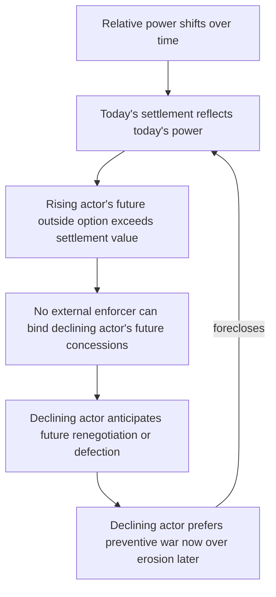

## Fearon's Commitment Problem Model of Credible Commitment Failure

### Positioning Within the Rationalist Research Program

James Fearon's 1995 "Rationalist Explanations for War" identifies commitment problems as one of three mechanisms (alongside private information with incentives to misrepresent, and issue indivisibility) by which rational, unitary actors can fail to reach a negotiated settlement that both would prefer to war. The commitment problem is structurally distinct from the information-based mechanism covered under bargaining-failure theory: even with complete information about relative power and resolve, war remains possible because no institution external to the states can enforce an agreed division of the contested good over time.

**Commitment problem**, defined precisely: a strategic situation in which an actor cannot make a binding promise about its own future behavior because, once a triggering condition is reached, the actor's incentives will have changed such that it is rational to renege — and the counterpart, anticipating this, cannot rationally accept the deal today.

### The Bargaining Range and Why It Should Preclude War

Recall the standard bargaining model of war: if fighting is costly, there exists a bargaining range — a set of settlements $x \in [x_L, x_H]$ that both sides strictly prefer to the expected costs and risks of war. Under complete information, any point in this range is a Pareto improvement over conflict, so the puzzle is not "why do interests conflict" but "why can bargaining not locate a point in this range." The commitment problem answers this by showing that the *range itself is not stable across time* even when it exists at any given instant.

### The Canonical Formalization: Shifting Power

Let $V_A(t)$ and $V_B(t)$ denote the relative military capability of states $A$ and $B$ at time $t$, normalized so $V_A + V_B = 1$. Suppose power is shifting: $\frac{dV_A}{dt} > 0$, i.e., $A$'s relative power is rising and is commonly known to be rising (this is a complete-information setup — the shift itself is not the informational failure). At time $t_0$, $B$ can offer $A$ a settlement $x_0$ reflecting the current balance $V_A(t_0)$, which $A$ would accept if:

$$x_0 \geq p(V_A(t_0)) - c_A$$

where $p(\cdot)$ is $A$'s probability of winning a war as a function of relative power and $c_A$ is $A$'s cost of fighting. The problem is that $B$ cannot credibly commit to *renegotiate* $x$ upward as $A$'s power continues to rise. At some future $t_1$, once $V_A(t_1)$ has increased, $A$'s outside option (fighting and winning) now exceeds $x_0$, so $A$ has a rational incentive to abrogate the deal and fight — or, anticipating this, to fight preventively *now* at $t_0$ rather than accept a settlement it knows will become obsolete. $B$, understanding this dynamic, may itself prefer preventive war at $t_0$ while the power ratio still favors $B$, rather than waiting to negotiate under worse future terms with an actor it cannot bind. This is the formal microfoundation of the **preventive war** logic: rational war launched not from misperception but from anticipated future weakness relative to a rising, unconstrainable rival.

$$\text{War at } t_0 \text{ is rational for } B \iff \mathbb{E}[U_B(\text{war now})] > \mathbb{E}[U_B(\text{settlement, renegotiated later})]$$

The key structural feature: no settlement $x^*$ exists that is simultaneously (a) acceptable to $A$ given $A$'s current power, (b) acceptable to $B$ given $B$'s current power, and (c) *stable* — i.e., that neither side will have unilateral incentive to overturn once the power shift materializes. The bargaining range is non-empty at each instant but has no point that persists across instants, and rational actors, foreseeing this, may abandon negotiation for prevention.

### Second Canonical Case: First-Strike/Offense Incentives

A structurally identical commitment problem arises without any power shift, purely from offense-dominant technology (linking directly to Jervis's offense-defense variable covered separately). If striking first confers a decisive military advantage, then even two status-quo powers cannot credibly commit to *not* preempting, because whichever side would move second suffers a catastrophic loss. Formally, if $U_i(\text{strike first}) > U_i(\text{status quo}) > U_i(\text{struck second})$ for both $i$, the status quo is not an equilibrium under any positive probability that the other side might defect from it — this is a coordination failure nested inside a commitment problem, and it is the formal core of **crisis instability**.

### Third Canonical Case: Indivisible Sovereignty Costs / Post-Conflict Enforcement

Commitment problems also explain why negotiated settlements to *end* civil wars are difficult even absent territorial disputes: a government cannot credibly commit to protect a rebel group's security after the rebels disarm, because once disarmed, the rebels' bargaining leverage (their capacity to resume fighting) vanishes, and the government's post-settlement incentive to renege — politically, financially, or through selective repression — rises. This is the **security guarantee commitment problem**, and it is the primary theoretical justification in the peace-engineering literature for third-party enforcement (peacekeeping forces, demilitarized-zone monitoring) as a mechanism that substitutes for the absent credible commitment by making reneging costly to an *external* party's continued involvement rather than relying on the promise-maker's own restraint.

### Feedback Structure

Unlike the security dilemma's mutually reinforcing perception loop, the commitment problem is better modeled as a **one-directional erosion process** acting on the stability of an equilibrium, not a two-sided escalatory spiral:

The absence of a feedback arrow back into "relative power shifts" is analytically important: this is a structural, not perceptual, failure. Improving communication or reducing misperception (the standard remedy for information-failure war) does *nothing* to resolve a pure commitment problem, since both sides may have full and accurate information about the power trajectory — the problem is enforcement, not epistemics. This distinction is the primary reason Fearon's typology treats commitment problems as a mechanism analytically separate from private-information bargaining failure.

### Empirical Illustration: Rising Power Transitions

The commitment-problem logic underlies power-transition theory's prediction that wars cluster around moments when a rising challenger approaches parity with an established hegemon (Organski; extended formally by Powell). [Inference] Historical cases frequently cited as illustrative — Germany's position before 1914, or Sparta's calculus regarding Athenian growth per Thucydides's "the growth of Athenian power, and the fear this caused in Sparta" — are consistent with the model's predictions but are also compatible with alternative explanations (misperception, alliance commitment problems, domestic politics), so their status as clean confirming cases is contested rather than definitive.

### Design Implications: What Peace Engineering Targets

Commitment-problem theory generates a specific and narrow set of institutional remedies, each targeting the absence of a binding mechanism rather than the absence of information:

- **Third-party security guarantees / peacekeeping deployment**: substitutes an external enforcer for the missing credible domestic commitment, directly closing the "no external enforcer can bind" node above. Effectiveness is conditional on the guarantor's own commitment being credible — an infinite regress the literature calls the **enforcer's commitment problem**.
- **Gradual, verifiable disarmament sequencing**: rather than requiring a rebel group to fully disarm before any government concession, staged reciprocal steps reduce the magnitude of the one-shot renegotiation exposure at any single point in time.
- **Institutional lock-in mechanisms** (constitutional power-sharing formulas, minority vetoes): convert a promise into a structural feature of the state that is more costly to unilaterally reverse, raising the cost of reneging above the cost of honoring the commitment.
- **Slowing or flattening the power-shift trajectory itself** (e.g., arms-control caps on a rising power's military growth rate) addresses the root variable $\frac{dV_A}{dt}$ directly, rather than attempting to engineer trust around an unchanged trajectory.

[Speculation] Whether formal contract-theoretic mechanisms from economics (e.g., renegotiation-proof contracts) can be meaningfully imported into interstate settlement design remains a live and largely unresolved research question rather than an established peace-engineering technique.

**Related Topics:**

- Bargaining models of war and the cost-of-conflict bargaining range
- Power transition theory and the Thucydides Trap debate
- Third-party enforcement and peacekeeping effectiveness literature
- Private information and costly signaling as a distinct rationalist war mechanism
- Civil war settlement design: DDR (disarmament, demobilization, reintegration) sequencing