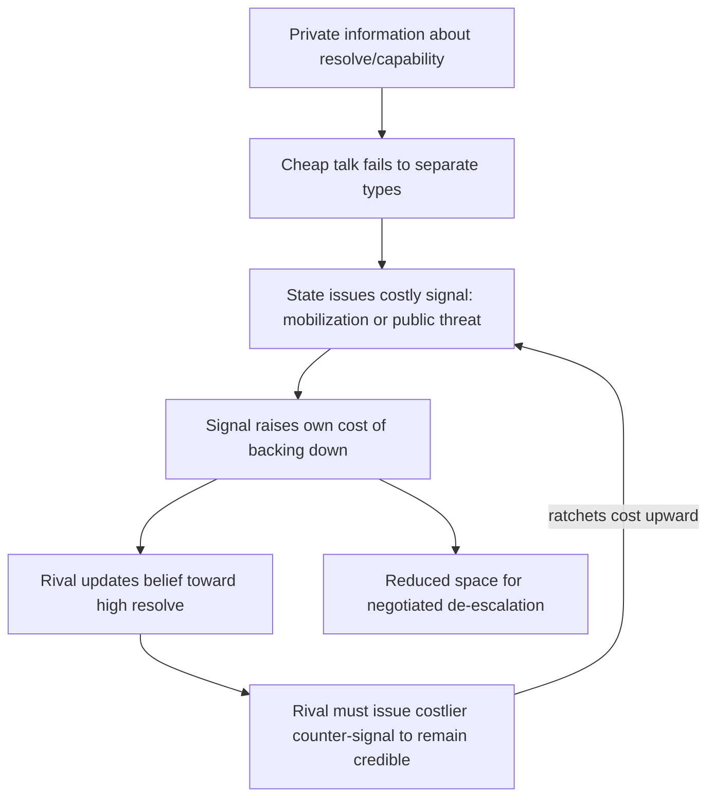

## Information Asymmetry and Costly Signaling in Crisis Bargaining

### Positioning: The Second Rationalist Mechanism

Recall that Fearon's rationalist framework identifies commitment problems as one mechanism generating inefficient war among rational actors; the second mechanism is **private information with incentives to misrepresent**. Here the bargaining range problem is not that a stable settlement fails to exist across time, but that a stable settlement exists at the current instant and *neither side can locate it*, because each holds private information about its own military capability or resolve, and each has a strategic incentive to overstate that information during negotiation.

**Private information with incentives to misrepresent**, defined precisely: a condition in which at least one bargaining variable (capability, resolve, cost tolerance) is known only to the actor who holds it, and that actor benefits from misrepresenting it upward, such that cheap talk cannot credibly convey the information and the resulting uncertainty produces settlement offers that fall outside the true bargaining range.

### Why Cheap Talk Fails

If state $A$ privately knows its resolve type $\theta_A \in \{\text{high}, \text{low}\}$, and a high-resolve type strictly prefers to be perceived as high-resolve (it extracts better settlement terms), then any costless announcement "$A$ is high-resolve" is made identically by both types. Formally, in a cheap-talk game with fully aligned incentives to claim strength, there is no separating equilibrium: the message space partitions no information because the low-resolve type's optimal deviation is to mimic the high-resolve type's message exactly, since mimicking is free.

$$\text{Cheap talk is informative} \iff \exists \text{ some divergence in sender-receiver preferences over the induced action}$$

Here, preferences are aligned in the wrong direction (both types want to look strong), so the condition fails. This motivates the shift to **costly signaling**: for information to be credibly transmitted, the signal must impose a cost structure such that mimicry is *irrational* for the low type, even though it remains attractive for the high type.

### The Formal Separating-Equilibrium Condition (Spence-Style Signaling Applied to Crisis Bargaining)

Let a state choose a costly action $s \geq 0$ (e.g., troop mobilization, public commitment, alliance formation) at cost $c(s, \theta)$, where cost is type-dependent: $c_H(s) < c_L(s)$ for all $s > 0$ — the high-resolve type finds costly signaling cheaper at the margin, typically because genuine resolve reduces the marginal cost of visibly committing (a state that truly intends to fight loses less by mobilizing than one that is bluffing and risks being called).

A separating equilibrium exists at signal level $s^*$ if:

$$c_L(s^*) > \Delta u \quad \text{and} \quad c_H(s^*) < \Delta u$$

where $\Delta u$ is the payoff gain from being believed high-resolve. This is the single-crossing condition: the signal must be expensive enough to deter the low type from mimicking, but cheap enough that the high type still finds it worthwhile. When such an $s^*$ exists, the receiver can perfectly infer type from observed behavior, and cheap talk's information failure is resolved — at the cost of the signal itself being wasteful (a deadweight cost paid purely for credibility, not for any direct military value).

### Canonical Mechanism: Audience Costs

Fearon's (1994) domestic audience cost model is the dominant formalization of costly signaling in interstate crisis bargaining. **Audience cost**: the domestic political penalty a leader incurs for publicly threatening action and then backing down, imposed by a domestic constituency (voters, elites, military) that punishes visible inconsistency independent of the underlying strategic merits.

The mechanism: a leader who makes a public, visible threat generates an audience cost $k > 0$ if they later back down. Because $k$ is a real cost paid regardless of resolve type, but a high-resolve leader was never going to back down anyway (so $k$ is never actually paid in equilibrium by that type), while a low-resolve leader who bluffs risks paying $k$ with positive probability, the audience cost functions as exactly the $c_L > \Delta u > c_H$ structure required for separation — provided $k$ is large enough and, critically, *observable to the rival state*. This is why democracies with transparent public accountability are modeled as possessing a structural signaling advantage in crisis bargaining: the visibility of the audience itself is what makes the cost usable as a signal, not merely its existence.

$$\text{Audience cost signal is credible} \iff k \text{ is large} \; \wedge \; k \text{ is observable to the rival}$$

[Inference] The empirical magnitude and even the existence of audience costs in real crises is contested in the international relations literature (Snyder and Borghard's critique argues leaders anticipate and evade audience costs rather than being bound by them); the model's logical structure is well established, but its empirical bite is an open question, not a settled finding.

### Alternative Signaling Mechanism: Sunk-Cost Mobilization

A second canonical instrument is irreversible or highly visible military mobilization — moving troops to a border, activating reserves — which imposes a direct financial and readiness cost paid regardless of outcome. Unlike audience costs (a domestic political mechanism), sunk-cost mobilization signals through **irrecoverable material commitment**: because $c(s)$ is paid up front and cannot be recouped by backing down, only a state that expects the crisis to be worth the expenditure — i.e., a genuinely high-resolve type — finds the expenditure rational ex ante. This is the standard game-theoretic account of why "tying hands" via troop deployment is treated as a stronger signal than mere verbal threat-making, and why crisis literature distinguishes tying-hands signals (irreversible cost) from sinking-cost signals (cost paid regardless of resolution) as related but formally distinct instrument classes.

### The Bargaining Failure Under Information Asymmetry: Formal Statement

Where private information persists unresolved, the risk of war rises because offers made under uncertainty about the rival's true reservation value can fall outside the true, but unobserved, bargaining range:

$$P(\text{war}) = P\left(x_A^{\text{offer}} < x_B^{\text{reservation}}(\theta_B)\right)$$

where $A$'s offer is optimized against $A$'s *belief distribution* over $B$'s type rather than $B$'s true type. Even fully rational, expected-utility-maximizing bargaining under this uncertainty generates a strictly positive probability of settlements falling outside the true bargaining range, producing costly conflict that both actual types would have preferred to avoid had type been common knowledge. This is the formal core of the claim that war can be an outcome of rational behavior under incomplete information, not merely of irrationality or misperception.

### Feedback and Signaling-Escalation Dynamics

Unlike the security dilemma's mutual-perception spiral or the commitment problem's one-directional erosion, costly signaling under crisis bargaining generates a **ratchet dynamic**: each side's credible signal raises the cost of backing down for both, since audience costs and sunk costs accumulate with each escalatory step, narrowing the space for face-saving de-escalation even among actors who would prefer, in retrospect, to have avoided the confrontation entirely.

Note this loop is reinforcing in escalatory cost but is not identical in mechanism to the security dilemma loop: here the reinforcement operates on the *credibility stakes* each side has accumulated, not on mutual misreading of ambiguous capability.

### Canonical Empirical Illustrations

The 1962 Cuban Missile Crisis is standardly modeled as a costly-signaling case: the U.S. naval quarantine functioned as a publicly visible, partially reversible signal calibrated to demonstrate resolve without foreclosing negotiation, illustrating deliberate signal-strength calibration rather than maximal escalation. [Unverified: the extent to which either Kennedy or Khrushchev's private deliberations followed the formal audience-cost logic specifically, versus other strategic considerations, cannot be fully verified from declassified records alone and remains a matter of historiographical interpretation.]

### Design Implications: What Peace Engineering Targets

Because the failure mode here is informational rather than structural-temporal (commitment problems) or perceptual-technological (security dilemma), the design remedies target verification and cheap-but-credible communication channels:

- **Third-party verification and monitoring institutions** (e.g., international observers, satellite transparency regimes) substitute externally verified information for costly self-signaling, reducing the need for materially wasteful demonstrations of resolve.
- **Institutionalized, low-cost signaling channels** (hotlines, pre-agreed diplomatic protocols such as the U.S.–Soviet post-Cuban-crisis direct communication link) lower the cost of transmitting credible information in a live crisis, shrinking the window in which misestimation of resolve can produce inadvertent escalation.
- **Graduated signaling ladders** (pre-defined escalatory steps with known costs at each rung) allow states to signal incrementally rather than being forced to jump directly to high-cost signals, reducing the ratchet effect's speed.
- **Transparency-enhancing verification regimes** (arms inspections, force-posture declarations) address the *capability* dimension of private information directly, distinct from resolve-signaling mechanisms, and can substitute for costly signaling by making the underlying variable observable rather than merely inferable from behavior.

[Speculation] Whether real-time crisis communication technology (encrypted, verifiable, tamper-evident messaging between rival command structures) could substantially reduce reliance on costly material signaling is a plausible extrapolation of the theory but has not been empirically tested against a real high-stakes crisis.

**Related Topics:**

- Fearon's audience cost model: formal derivation and empirical critiques
- Tying-hands versus sinking-cost signaling instrument classes
- Bargaining models of war and the stability of the bargaining range
- Verification regimes as institutional substitutes for costly signaling
- Crisis communication infrastructure (hotlines, pre-agreed protocols) as engineered de-escalation mechanisms