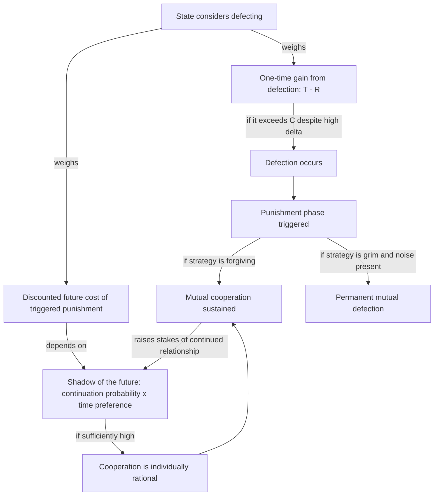

## Repeated Games and Shadow-of-the-Future Stability Conditions

### Positioning: From One-Shot Failure to Sustainable Cooperation

The three rationalist mechanisms — commitment problems, private information, and (implicitly) issue indivisibility — explain why cooperation can fail even between rational actors in a single interaction. Repeated game theory addresses the complementary question: under what conditions can cooperation be *sustained* between actors who interact indefinitely, absent any external enforcer, purely through the structure of ongoing interaction itself. This is the formal machinery underlying claims that anarchy does not necessitate perpetual conflict — that decentralized enforcement through repeated play can substitute for the missing centralized authority that Fearon's models take as given.

### The Stage Game and the Defection Temptation

Recall the standard prisoner's dilemma payoff ranking $T > R > P > S$ (temptation, reward, punishment, sucker's payoff), where mutual cooperation ($R$) Pareto-dominates mutual defection ($P$), but unilateral defection ($T$) dominates cooperation regardless of the other player's action in the one-shot game, making $(D,D)$ the unique Nash equilibrium despite its inefficiency. In a security or conflict context, $C$ typically maps to restraint (non-aggression, arms limitation, treaty compliance) and $D$ maps to exploitation (surprise attack, defection from an agreement, opportunistic expansion).

The central question of repeated-game theory is whether the threat of future punishment can render cooperation individually rational *today*, by making the total discounted value of sustained mutual cooperation exceed the one-time gain from defecting plus the discounted cost of subsequent punishment.

### The Folk Theorem and the Discount Factor

Let $\delta \in [0,1)$ be the **discount factor**: the weight a player places on payoffs in the next period relative to the current period, interpretable in interstate contexts as a composite of political time horizons, leadership stability, and the probability the relationship continues at all (the game does not end via conquest, regime collapse, or exogenous termination).

Consider the grim-trigger strategy: cooperate until the rival defects, then defect forever. For grim trigger to sustain cooperation as a subgame-perfect equilibrium, the discounted value of permanent cooperation must weakly exceed the value of defecting once and suffering permanent punishment:

$$\frac{R}{1-\delta} \geq T + \frac{\delta P}{1-\delta}$$

Solving for the **critical discount factor**:

$$\delta \geq \delta^* = \frac{T - R}{T - P}$$

This inequality is the formal statement of the **shadow of the future**: cooperation is sustainable if and only if actors value future interactions enough, relative to the one-time temptation to defect, for the threat of retaliation to outweigh the immediate gain. The folk theorem generalizes this result: for $\delta$ sufficiently close to 1, *any* individually rational, feasible payoff vector (including full cooperation) can be supported as a subgame-perfect equilibrium outcome by an appropriately constructed punishment strategy — meaning the repeated structure alone, without any change to the stage-game payoffs, can convert a defection-dominant one-shot interaction into one where sustained cooperation is an equilibrium.

### Decomposing the Shadow of the Future in Security Contexts

$\delta$ is not a single empirical primitive but a composite of at least three factors relevant to conflict systems, and peace-engineering interventions typically target one of these sub-components rather than $\delta$ as an undifferentiated whole:

1. **Continuation probability** $\pi$: the probability the interaction persists into the next period (survival of the regime, absence of a terminal war, continuity of the relevant relationship). $\delta$ is properly modeled as $\delta = \pi \beta$, where $\beta$ is pure time preference.
2. **Time preference** $\beta$: how heavily a leader discounts future payoffs independent of continuation risk — shaped by leadership tenure expectations, electoral cycles, or succession uncertainty.
3. **Payoff magnitude ratios** $(T-R)$ and $(T-P)$: the size of the one-time defection temptation relative to the cost of triggering punishment, which is a property of the stage game's structure (weapon lethality, verification costs, the value of the contested good) rather than of time itself.

This decomposition matters because "increase the shadow of the future" is not a single lever: extending expected relationship duration ($\pi$), stabilizing leadership incentives across electoral or succession transitions ($\beta$), or reducing the payoff from unilateral defection ($T$, via verification that shrinks the surprise-attack advantage) are three distinct engineering interventions with different institutional instruments.

### Why the Folk Theorem's Permissiveness Is a Problem, Not Just a Solution

[Inference] A frequently underemphasized implication of the folk theorem is that it supports a *multiplicity* of equilibria, not uniquely cooperative ones — sustained mutual defection, or asymmetric exploitation patterns, can also be subgame-perfect equilibria under high $\delta$. The theorem establishes that cooperation *can* be an equilibrium; it does not establish that rational repeated interaction *selects* cooperation over other sustainable but inefficient patterns. This is why real-world repeated interstate interaction (e.g., prolonged rivalries) frequently stabilizes into entrenched hostility rather than cooperation despite high $\delta$ — the shadow of the future sustains whatever pattern of mutual expectations becomes focal, not cooperation specifically.

### Robustness Under Noise: From Grim Trigger to Forgiving Strategies

Grim trigger's permanent-punishment structure is not robust to observational noise — a common condition in security environments where verification of compliance is imperfect (a troop movement is ambiguous, an accident is mistaken for defection). If defection is imperfectly observed with probability $\epsilon$ per period, grim trigger triggers permanent mutual defection following any false-positive signal, and since false positives occur with certainty over a sufficiently long horizon, grim trigger under noise converges to permanent defection almost surely — collapsing exactly the cooperative outcome it was designed to sustain.

This motivates **forgiving strategies**, most notably generalizations of tit-for-tat and its stochastic variants (e.g., "contrite tit-for-tat," win-stay-lose-shift): strategies that punish a single observed defection but return to cooperation after a bounded retaliation, rather than punishing forever. The design trade-off is explicit and quantifiable:

$$\text{Punishment severity} \uparrow \Rightarrow \text{deterrence of genuine defection} \uparrow, \; \text{tolerance of noise-induced false punishment} \downarrow$$

Axelrod's tournament findings (favoring tit-for-tat's combination of niceness, retaliation, and forgiveness) are the canonical illustration, but the formal generalization — that the optimal punishment length is a function of the noise rate $\epsilon$ and the discount factor $\delta$ jointly, not a fixed strategic constant — is the operative design principle for arms-control and treaty-compliance regimes, where verification imperfection is the empirical norm rather than the exception.

### Feedback Structure: Stabilizing Versus Destabilizing Loops

Repeated-game cooperation, once established, constitutes a **balancing (negative) feedback loop** distinct from the security dilemma's reinforcing spiral — the mechanism that returns the system to cooperation after a deviation is itself the object of design:

The critical design distinction from the security dilemma diagram is that this loop is *self-correcting by construction* when the punishment strategy is forgiving and $\delta \geq \delta^*$ — the system has a built-in mechanism to return to the cooperative attractor after a deviation, whereas the security dilemma spiral has no such endogenous correction and requires an external institutional intervention to introduce one.

### Canonical Empirical Illustrations

Cold War strategic arms limitation (SALT/START verification regimes) is standardly modeled as an attempt to engineer a high-$\delta$, low-noise repeated environment: satellite verification reduced $\epsilon$ (the probability a compliant action is misread as defection), while mutual second-strike capability altered the stage-game payoffs themselves by reducing $T$ (the value of a first strike) rather than relying on shadow-of-the-future effects alone. [Unverified: the relative causal contribution of repeated-game stability logic versus deterrence-by-punishment logic (a distinct mechanism) to Cold War strategic stability is not resolved and is typically treated as jointly operative rather than separable in the historical record.]

### Design Implications: What Peace Engineering Targets

Because sustainable cooperation under repetition depends jointly on $\delta$, the payoff structure, and robustness to noise, interventions map onto each parameter distinctly:

- **Lengthening time horizons and stabilizing leadership incentives** (e.g., institutionalizing succession, reducing electoral incentives for short-term aggressive signaling) directly raises $\beta$.
- **Reducing termination risk** (security guarantees that lower the probability the relationship ends via conquest) raises $\pi$, and thus $\delta$, without requiring any change in actor preferences.
- **Verification and transparency regimes** reduce $\epsilon$, permitting less severe, more forgiving punishment strategies to remain deterrence-adequate — directly addressing the noise-robustness problem rather than the discount factor.
- **Payoff-restructuring interventions** (reducing the material or strategic value of a surprise first move, e.g., through survivable second-strike forces or verified force caps) lower $T-R$, reducing the required $\delta^*$ threshold directly, which is valuable when raising $\delta$ itself is politically or structurally infeasible.
- **Designing explicit, proportionate, and de-escalating punishment protocols** into treaty architecture (graduated sanctions with defined reversal conditions) operationalizes the noise-robust forgiving-strategy design rather than leaving punishment severity to ad hoc crisis response.

[Speculation] Whether real-time, high-fidelity verification technology (satellite, cyber-monitoring) can reduce $\epsilon$ close enough to zero to make grim-trigger-adjacent (harsher, more deterrent) strategies viable without the fragility historically associated with them is a plausible but empirically untested extension of the noise-robustness literature.

**Related Topics:**

- Folk theorem formalization and equilibrium multiplicity in repeated games
- Axelrod's tournament results and the evolution of forgiving strategies
- Deterrence-by-punishment versus deterrence-by-denial as distinct stabilization mechanisms
- Verification technology and its role in reducing observational noise in compliance regimes
- Alliance design as a mechanism for altering continuation probability $\pi$