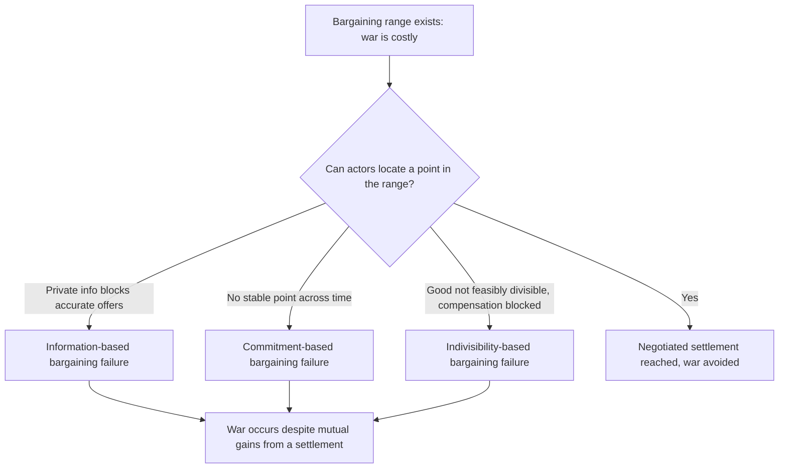

## Bargaining Failure and the Inefficiency Puzzle of War

### The Puzzle Stated Precisely

War is materially costly: it destroys resources, kills combatants, and consumes wealth that could otherwise be allocated to either belligerent. This generates the **inefficiency puzzle**: if a negotiated settlement exists that both sides would prefer to the expected outcome of fighting — inclusive of its costs — then rational, expected-utility-maximizing actors should always be able to locate and agree to that settlement, since bargaining is (in principle) costless relative to fighting. War, under this view, is a strictly dominated outcome whenever a superior negotiated alternative exists, which raises the question the entire rationalist research program (Fearon 1995) is built to answer: why does ex ante Pareto-improving bargaining ever fail among rational actors?

This is a distinct and prior question from "why do interests conflict" — conflicting interests alone do not explain fighting, since divergent interests are precisely what negotiation exists to resolve short of costly violence. The puzzle is why *negotiation itself* fails.

### The Bargaining Range: Formal Construction

Model the contested issue as a division of a unit-value good $x \in [0,1]$ between states $A$ and $B$, where $A$ receives $x$ and $B$ receives $1-x$. Let $p$ be $A$'s probability of winning a war, and let $c_A, c_B > 0$ be each side's cost of fighting (as a fraction of the total value at stake). $A$'s expected utility from war is:

$$U_A(\text{war}) = p - c_A$$

and symmetrically $U_B(\text{war}) = (1-p) - c_B$. A negotiated settlement $x$ is preferred to war by both sides if and only if:

$$p - c_A \leq x \leq p + c_B$$

This interval $[p - c_A, \, p + c_B]$ is the **bargaining range**, and it is non-empty (has positive width $c_A + c_B$) whenever fighting is costly at all — that is, for *any* positive cost of war, however small, a range of mutually preferable settlements exists. This is the formal heart of the puzzle: the bargaining range's existence does not depend on relative power, resolve, or the value of the good — it depends only on war being costly, which is true in essentially every real conflict. War is therefore never Pareto-efficient under complete information and common knowledge of $p$, $c_A$, and $c_B$; it is always a negotiation failure relative to some feasible alternative.

### Why "Divergent Interests" Is Not a Sufficient Explanation

A common but formally inadequate explanation is that war occurs because states have "irreconcilable interests" or that the good is highly valued by both sides. This fails as an explanation because the bargaining range's width $c_A + c_B$ is invariant to how much either side values the good — raising the stakes rescales both the war payoff and the settlement payoff proportionally but does not eliminate the range. High-stakes conflicts have bargaining ranges exactly as robustly non-empty as low-stakes ones, provided costs remain positive. This is why the rationalist program locates the explanatory burden not in the *size* of the conflict of interest but in specific *mechanisms* that prevent actors from locating any point within an existing, non-empty range.

### The Three (and only three) Rationalist Mechanisms

Fearon's contribution was to show that, under the unitary-rational-actor assumption, only a small number of mechanisms can generate bargaining failure despite a non-empty range, and each has been treated formally elsewhere in this framework — this item's role is to establish why these three, and not "conflicting interests" per se, constitute the actual causal inventory:

1. **Private information with incentives to misrepresent**: actors cannot credibly convey true $p$ or $c$ values, so offers are optimized against a belief distribution rather than the truth, generating positive probability that an offer falls outside the *true* range even though both sides believe they are bargaining rationally. (Formally covered under costly signaling and audience costs.)
2. **Commitment problems**: the range exists at each instant but no point in it is stable across time (shifting power) or across a discrete transition (disarmament, first-strike incentives), so no credible settlement can be locked in even with complete information. (Formally covered under Fearon's commitment-problem model.)
3. **Issue indivisibility**: if $x$ cannot be continuously divided (a capital city, a matter of sovereign indivisibility, a leader's survival), the bargaining range may be non-empty in value terms but have no *feasible* implementable point — though Fearon and successors note that side payments or issue-linkage can typically restore divisibility in principle, making pure indivisibility a comparatively weak standalone explanation. [Inference] The theoretical consensus treats indivisibility as the least robust of the three mechanisms, since most apparently indivisible goods can be rendered divisible through compensation, time-sharing, or linked issues, unless a further mechanism (e.g., a commitment problem preventing credible compensation) is also present.

The analytically important claim is negative: *no other mechanism* generates rational bargaining failure under the unitary-actor, complete-information-eventually assumption. Explanations invoking leader irrationality, miscalculation, or domestic pathology (explored elsewhere as non-rationalist supplements) are not excluded by this framework, but they operate outside it — Fearon's contribution specifically demonstrates that rationality and unitary actors alone do not preclude bargaining failure, removing the need to invoke irrationality as the default explanation for war.

### Restating the Puzzle as a Design Target

Reframing bargaining failure as a systems property rather than a narrative event clarifies what peace engineering must target: not "reduce conflicting interests" (which does not shrink the bargaining range problem, per above) but "increase the probability that actors successfully locate a point within an existing range." This reframes each mechanism as a distinct *search-and-commitment failure* rather than a failure of goodwill:

Each downstream branch (C, D, E) has its own engineered remedy developed elsewhere in this framework (verification and signaling institutions; external enforcement and gradual sequencing; side-payment and issue-linkage mechanisms respectively) — the diagnostic value of this item is establishing that these are the *exhaustive* rational-actor failure modes, so a peace-engineering intervention that does not map onto one of these three nodes is not addressing a rationalist bargaining failure and may be targeting a different (e.g., domestic-political or psychological) causal pathway instead.

### The Efficiency Puzzle's Empirical Bite

[Inference] A frequently noted implication is that this framework predicts most crises should *not* end in war — and empirically, most militarized interstate disputes are in fact resolved short of full-scale war, which is broadly consistent with the model's prediction that the bargaining range is usually locatable. The puzzle is specifically about the residual cases where it is not, making the rationalist program's target explanandum narrower than "war in general" — it is "the subset of costly conflicts that escape an otherwise-available negotiated resolution."

[Unverified: precise empirical base rates of dispute resolution short of war, and whether they causally validate the model versus merely being consistent with it, depend on dataset construction choices (e.g., Correlates of War MID coding) that are subject to ongoing methodological debate in the quantitative conflict literature.]

### Canonical Illustration: The Falklands/Malvinas Crisis of 1982

[Inference] The 1982 Falklands conflict is frequently used pedagogically to illustrate multiple mechanisms operating jointly: private information about British resolve and willingness to project force at distance (Argentina's junta reportedly underestimated UK resolve), combined with a domestically-driven commitment problem for the Argentine junta (backing down carried a regime-survival cost that made concession politically irrational regardless of the material bargaining range). This illustrates that real cases often involve *overlapping* mechanisms rather than a single clean mechanism in isolation, complicating attempts to cleanly test the three mechanisms against each other empirically.

### Design Implications: What Peace Engineering Targets

Because the inefficiency puzzle is a *diagnostic* frame rather than a standalone mechanism, its design implication is primarily methodological: any peace-engineering intervention should be evaluated by which specific bargaining-failure node it addresses, since a mismatched intervention (e.g., improving communication to solve what is actually a commitment problem) will be ineffective even if well-intentioned.

- **Mechanism diagnosis as a prerequisite for intervention design**: before deploying verification regimes (targets information failure), third-party guarantees (targets commitment failure), or compensation/linkage frameworks (targets indivisibility), the specific failure mode generating non-settlement in a given crisis should be identified, since the three mechanisms have non-overlapping institutional remedies.
- **Side-payment and issue-linkage architectures**: directly address indivisibility by converting a discrete, non-divisible good into an effectively continuous bargaining space (e.g., trading sovereignty concessions for economic integration, security guarantees, or phased authority transfer).
- **Mixed-mechanism crisis analysis**: given that real crises (per the Falklands illustration) often present overlapping failure modes, robust peace-engineering design frequently requires layered interventions (verification *and* external enforcement *and* compensation mechanisms) rather than a single-mechanism fix.

**Related Topics:**

- Fearon's commitment problem model of credible commitment failure
- Information asymmetry and costly signaling in crisis bargaining
- Issue indivisibility, side payments, and issue-linkage as bargaining-space design
- Correlates of War dataset methodology and empirical testing of rationalist war theory
- Domestic political constraints as a supplementary (non-rationalist) source of bargaining failure