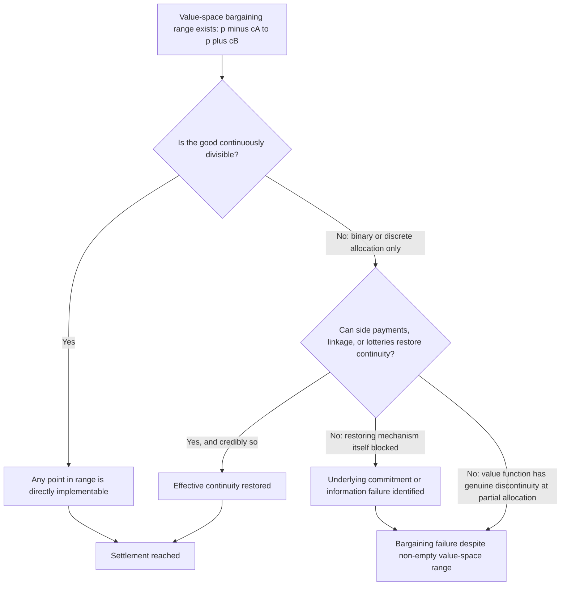

## Issue Indivisibility and Its Effect on Negotiated Settlement Space

### Positioning: The Third Rationalist Mechanism

Recall that the bargaining range $[p - c_A, \, p + c_B]$ is guaranteed non-empty whenever fighting is costly, regardless of relative power or the value of the contested good. Issue indivisibility is Fearon's third proposed mechanism for bargaining failure despite this non-empty range: the claim that some goods cannot be continuously divided, so even though a mutually preferable *value* exists within the range, no *feasible allocation* realizes that value. This item establishes both the formal mechanism and why the theoretical literature treats it as structurally weaker than commitment problems or private information — a distinction with direct consequences for peace-engineering design.

### Formal Statement: Value-Space Versus Allocation-Space

The bargaining range as constructed under Fearon's model is defined over a continuous value variable $x \in [0,1]$, implicitly assuming the underlying good can be partitioned at any point on that interval — territory can be split at any line, resources can be shared in any proportion, authority can be shared in any ratio. **Issue indivisibility**, defined precisely: a condition in which the feasible allocation set $X_{\text{feasible}} \subset [0,1]$ is a strict, typically discrete, subset of the value interval, such that the bargaining range $[p-c_A, p+c_B]$ may be non-empty in value terms while containing no point in $X_{\text{feasible}}$.

Canonical examples treated as indivisible in the literature: control of a single capital city (Jerusalem in Israeli-Palestinian negotiations is the standard illustration), the survival or removal of a specific ruling leader, or a claim to sole sovereign title over a territory where partial sovereignty is not recognized as meaningful by either claimant. In each case, the good is denominated in a binary or near-binary allocation space $X_{\text{feasible}} = \{0, 1\}$ rather than a continuous $[0,1]$, and if $p \notin \{0,1\}$ (i.e., neither side is certain to win outright), no feasible point coincides with the value-weighted range.

### Why Indivisibility Is the Theoretically Weakest of the Three Mechanisms

[Inference] The dominant view in the rationalist literature (articulated by Fearon himself, and extended by Powell 2006) is that pure indivisibility rarely survives scrutiny as a standalone explanation, because most apparently indivisible goods admit at least one of three restoring mechanisms:

1. **Side payments**: if $A$ receives the indivisible good outright, $A$ can compensate $B$ with a transfer from a separate, continuously divisible resource (money, territory elsewhere, trade concessions), restoring an effectively continuous joint allocation space even though the original good itself remains undivided.
2. **Probabilistic or temporal allocation**: a good that cannot be split in space can often be split in time (rotating custodianship, alternating control) or in probability (a lottery over full allocation, which is formally equivalent in expected-value terms to a continuous split under risk-neutrality).
3. **Issue linkage**: bundling the indivisible issue with a separate, genuinely divisible issue converts a single binary bargaining problem into a joint continuous one, restoring a locatable settlement point across the linked-issue space even though neither issue alone is divisible.

Given these restoring mechanisms, Fearon's own treatment (and Powell's later formalization) argues that indivisibility functions as a *proximate* rather than *root* cause of bargaining failure: something else must explain why side payments, temporal splitting, or issue linkage are themselves unavailable or non-credible in a given case. This is the theoretically important move — it typically relocates the actual causal mechanism back to a commitment problem (side payments require a credible guarantee they will actually be delivered and not later revoked) or a private-information problem (the size of side payment needed to compensate $B$ depends on $B$'s true valuation, which may be misrepresented).

$$\text{Indivisibility blocks settlement} \iff \text{restoring mechanisms (side payments, linkage, lotteries) are also blocked, typically by an underlying commitment or information failure}$$

### When Indivisibility Is Genuinely Load-Bearing: Identity and Legitimacy Goods

[Inference] The residual category where indivisibility retains independent explanatory force involves goods whose value is partly constituted by *exclusivity itself* rather than by a separable material payoff — sovereignty claims tied to national identity or religious significance, where partial or shared control is valued by domestic constituencies at less than a linear fraction of full control (a discontinuous, not merely concave, value function). Formally, if $B$'s utility from partial control $x \in (0,1)$ is not $x \cdot V$ but instead drops discontinuously toward the value of $x=0$ for any $x < 1$ — because partial control fails to satisfy the symbolic or legitimacy function driving the claim — then no continuous side-payment schedule can smoothly compensate for the lost value, since the value lost is not proportional to the territorial or material share foregone.

$$U_B(x) = \begin{cases} V_B & x = 1 \\ \epsilon \cdot V_B, \; \epsilon \ll x & 0 < x < 1 \end{cases}$$

This discontinuity is what genuinely distinguishes indivisibility from a disguised commitment or information problem: even a fully credible, perfectly informed side payment cannot restore a smooth bargaining range if the underlying value function itself has a jump discontinuity at partial allocation. [Speculation] Whether such genuine value discontinuities are common in real disputes, or whether apparently discontinuous domestic valuations are themselves endogenous to political mobilization (and thus more tractable through issue-reframing than the model suggests), remains an open and largely qualitative debate rather than one with a settled formal answer.

### Effect on the Negotiated Settlement Space: A Geometric Restatement

Where the standard bargaining-range model treats settlement search as locating any point in a continuous interval, indivisibility converts the search into locating a point in a sparse or discrete feasible set intersected with that interval — a fundamentally different (and generically harder) search problem:

The diagnostic payoff of this diagram is that node G explicitly routes most apparent indivisibility failures back into the other two rationalist mechanisms, while only the bottom-right path represents indivisibility as a load-bearing, irreducible cause — reinforcing why peace-engineering design should treat indivisibility primarily as a signal to investigate the blocked restoring mechanism rather than as a terminal diagnosis.

### Canonical Illustration: Jerusalem in Israeli-Palestinian Negotiations

Jerusalem's status is the standard pedagogical case for indivisibility: proposed solutions across multiple negotiation rounds have included functional division (separate municipal authority over different quarters), shared or international sovereignty regimes, and religious-site-specific arrangements distinct from territorial sovereignty — each representing an attempt to apply one of the three restoring mechanisms (temporal/functional splitting, linkage to broader statehood arrangements, or side-payment-equivalent security and economic guarantees) against a good with a strong claim to identity-based, potentially discontinuous valuation on both sides. [Unverified: whether the persistent failure to reach settlement on this specific issue reflects genuine value discontinuity, an underlying unresolved commitment problem (neither side trusts the other's guarantees regarding religious site access or security arrangements), or domestic political constraints external to the rationalist framework, is contested among specialists and not resolved by the formal model alone.]

### Design Implications: What Peace Engineering Targets

Given the diagnostic structure above, the design response to apparent indivisibility bifurcates sharply depending on which branch of the flowchart actually applies:

- **Where restoring mechanisms are blocked by a commitment problem** (side payment delivery is not credible): the correct intervention is third-party guarantee or escrow-style enforcement of the compensation arrangement, not further negotiation over the indivisible good itself — this redirects the engineering effort to the commitment-problem toolkit developed elsewhere in this framework.
- **Where restoring mechanisms are blocked by private information** (the compensation required to offset $B$'s loss is unknown because $B$'s true valuation is private): mechanism-design approaches (e.g., structured, incentive-compatible compensation-revelation processes) address the informational blockage directly.
- **Functional and temporal unbundling**: designing governance arrangements that separate sovereignty, security, economic access, and symbolic recognition into distinct, independently allocable dimensions converts a single binary good into a multi-dimensional, more nearly continuous bargaining space — the standard practical response to identity-linked indivisible claims.
- **Issue linkage architecture**: deliberately bundling an indivisible issue with unrelated but genuinely divisible issues (economic integration, security cooperation, resource access) to reconstruct an effectively continuous joint settlement space, provided the linkage itself does not introduce a new commitment problem regarding the durability of the linked concessions.

**Related Topics:**

- Fearon's commitment problem model of credible commitment failure
- Bargaining failure and the inefficiency puzzle of war
- Mechanism design for preference revelation in compensation negotiations
- Functional sovereignty-sharing arrangements in territorial dispute resolution
- Identity-based conflict and the endogeneity of "indivisible" valuations