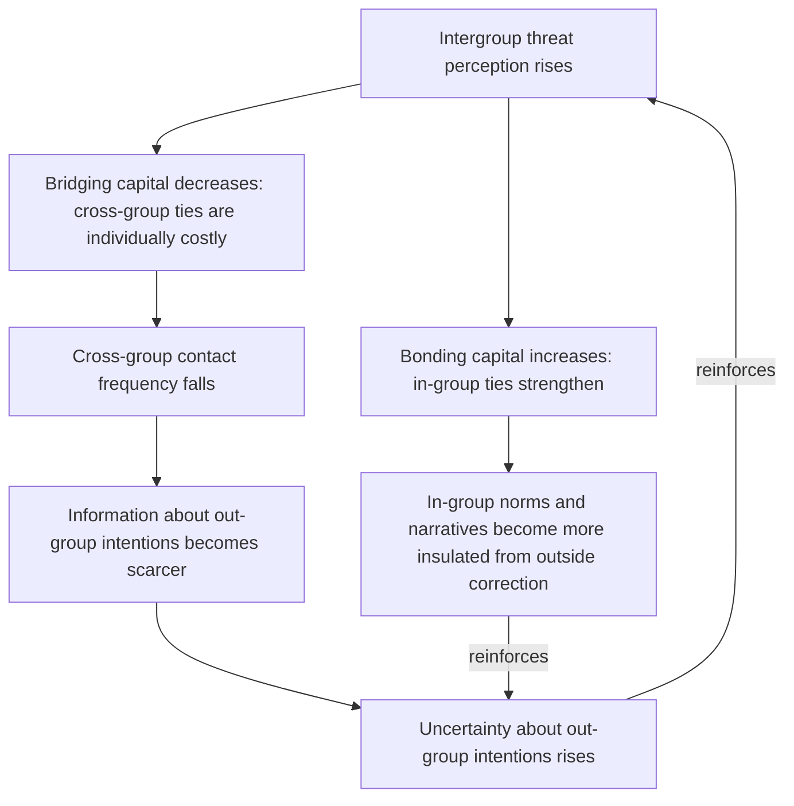

## Putnam's Social Capital Framework and Its Erosion Under Conflict Exposure

### Definitional Foundation

**Social capital**, per Putnam's formulation, refers to features of social organization — networks, norms of reciprocity, and generalized trust — that facilitate coordination and cooperation for mutual benefit among members of a community. Unlike physical or human capital, social capital is a property of *relationships between* actors rather than an attribute of any individual actor, which has a direct consequence for conflict systems modeling: it cannot be stockpiled or protected unilaterally, and its depreciation is a function of interaction patterns across the whole network, not of any single node's behavior.

Putnam's key analytical distinction, essential for conflict applications, separates social capital into two structurally different types:

- **Bonding social capital**: dense, inward-looking ties among relatively homogeneous group members (co-ethnics, co-religionists, close kin networks) that strengthen in-group solidarity and mutual support.
- **Bridging social capital**: sparser, outward-looking ties that cut across group boundaries (cross-ethnic friendships, mixed civic associations, integrated economic networks) that connect otherwise-separate groups.

This distinction is load-bearing for conflict analysis because the two types respond to conflict exposure in *opposite directions*, and the aggregate quantity "social capital" can appear stable or even rise in a conflict zone while masking a compositional shift with severe systemic consequences.

### The Core Mechanism: Divergent Response to Threat

Recall from the security-dilemma treatment that a reinforcing perception loop under ambiguity drives interstate arms spirals; an analogous but distinct mechanism operates at the intergroup level within a single society or contested space. Under conditions of perceived threat, bonding capital is a rational, individually adaptive response — in-group networks provide mutual insurance, information-sharing about danger, and collective defense capacity when formal security institutions are weak or partisan. Bridging capital, by contrast, becomes individually costly under threat: maintaining cross-group ties can be read by one's own in-group as suspect loyalty, and out-group members may withdraw from ties that carry physical risk or informational leakage concerns (e.g., a cross-group friend as a potential informant).

This generates a *predictable, mechanism-level* prediction distinct from a purely narrative "conflict destroys trust" claim:

$$\frac{d(\text{Bonding capital})}{d(\text{Threat perception})} > 0, \qquad \frac{d(\text{Bridging capital})}{d(\text{Threat perception})} < 0$$

The divergence itself — not merely an aggregate decline in trust — is the structurally important finding, because it means conflict-affected societies frequently exhibit *high* social capital by within-group measures (strong mutual aid, dense associational life) simultaneously with severely eroded capacity for cross-group cooperation, a pattern invisible to any metric that aggregates trust without disaggregating by group boundary.

### Feedback Structure: The Segregation Spiral

The divergent response generates a reinforcing loop structurally analogous to, but mechanistically distinct from, the security dilemma: here the reinforcement operates through network topology rather than through capability misperception.

This loop is self-reinforcing through a distinct channel from the security dilemma's capability-signaling ambiguity: here the eroding variable is the *density of the cross-group information network itself*, meaning that even accurate, well-intentioned signals sent across the group boundary have progressively fewer channels through which to travel and be verified, independent of any strategic ambiguity in the signals themselves. The mechanism therefore compounds, rather than substitutes for, information-based bargaining failure covered elsewhere in this framework — declining bridging capital is one structural cause of the private-information conditions that make costly signaling necessary in the first place.

### Generalized Trust as the Aggregate-Level Casualty

Putnam's broader claim — that associational density predicts **generalized trust** (trust extended to non-kin, non-intimate others as a diffuse social norm rather than as a case-by-case calculation) — implies a specific, testable degradation pathway under sustained conflict exposure: as bridging associations (mixed workplaces, integrated schools, cross-group civic organizations) are the primary generators of generalized trust in Putnam's original framework, their disproportionate erosion under conflict should produce a decline in generalized trust that is *steeper* than the decline in particularized (in-group) trust, and should persist even after active violence subsides, since the associational infrastructure that generated generalized trust does not automatically regenerate once threat perception declines.

[Inference] This asymmetric-recovery prediction — that particularized trust rebounds faster than generalized trust after conflict termination — is broadly consistent with post-conflict survey literature (e.g., studies of post-war Bosnia and Rwanda), but precise causal attribution is complicated by the fact that post-conflict societies also undergo simultaneous economic, demographic, and institutional changes that independently affect trust measures.

### Distinguishing Social Capital Erosion from Related Conflict Mechanisms

This mechanism should be kept analytically distinct from the security dilemma and commitment-problem frameworks treated elsewhere in this curriculum, though the three interact:

- The security dilemma operates on *capability perception* between unitary state actors under offense-defense ambiguity; social capital erosion operates on *interpersonal network structure* within and across group boundaries, frequently *within* a single state or contested territory.
- Commitment problems concern the *credibility of promises* between strategic actors; social capital erosion concerns the *availability of the relational infrastructure* through which any promise (credible or not) would need to be communicated and monitored in the first place.
- [Inference] A plausible cross-mechanism linkage — not fully formalized in Putnam's own work but developed in subsequent conflict-studies literature — is that eroded bridging capital raises the effective cost of the verification and monitoring institutions needed to solve commitment problems (per the earlier treatment of third-party enforcement), since such institutions typically depend on local cross-group informants, mixed monitoring staff, or community-level buy-in that bonding-dominant social structures do not readily supply.

### Canonical Empirical Illustration: Rwanda and Bosnia

[Inference] Post-genocide Rwanda and post-war Bosnia-Herzegovina are the most frequently cited cases in the peacebuilding literature for the bonding/bridging divergence pattern: both contexts show robust within-group associational life alongside persistently low cross-group civic participation and intermarriage rates relative to pre-conflict baselines, a pattern consistent with the model's prediction of asymmetric recovery. [Unverified: the specific magnitude of pre-conflict bridging capital in either case, and therefore the precise scale of its decline, relies on retrospective survey and qualitative reconstruction rather than contemporaneous pre-war measurement, introducing recall and selection biases that limit strong causal claims about the size of the erosion effect.]

### Design Implications: What Peace Engineering Targets

Because bonding and bridging capital respond to threat in opposite directions, and because generalized trust depends specifically on bridging infrastructure, peace-engineering interventions in this domain target the *reconstruction of cross-group network density* rather than trust levels as an undifferentiated aggregate:

- **Structured intergroup contact programs** (per contact theory, formally the operational mechanism for rebuilding bridging ties): designed to restore cross-group interaction under conditions — equal status, common goals, institutional support, sustained rather than one-off contact — that prevent the interaction itself from reinforcing threat perception rather than reducing it.
- **Mixed-composition institutional design**: integrating economic, educational, and civic institutions (mixed workplaces, integrated schooling, joint water/resource management bodies) to rebuild bridging capital through recurring, structurally mandated cross-group interaction rather than relying on voluntary association, which the threat-driven withdrawal mechanism above predicts will underperform in the aggregate.
- **Cross-group verification and monitoring institutions**: directly addressing the plausible linkage to commitment-problem enforcement, deliberately staffing monitoring or peacekeeping bodies with cross-group composition to simultaneously perform enforcement and bridging-capital-generation functions.
- **Targeted protection for existing bridging ties during active conflict**: since the segregation spiral above shows loss of bridging capital as a leading, self-reinforcing indicator, early intervention to protect cross-group associational infrastructure (rather than waiting until post-conflict reconstruction) may interrupt the loop before generalized trust degrades to the point of requiring full reconstruction.

[Speculation] Whether digitally mediated cross-group contact (online platforms designed for structured intergroup dialogue) can substitute for physical bridging institutions in generating durable generalized trust is an active but empirically unsettled question in the contemporary peacebuilding-technology literature.

**Related Topics:**

- Allport's intergroup contact theory and the conditions for prejudice reduction
- Generalized versus particularized trust as distinct measurement constructs
- Third-party enforcement and the local-information requirements of monitoring institutions
- Post-conflict reconciliation program design and evaluation methodology
- Ethnic outbidding and the political economy of bonding-capital mobilization