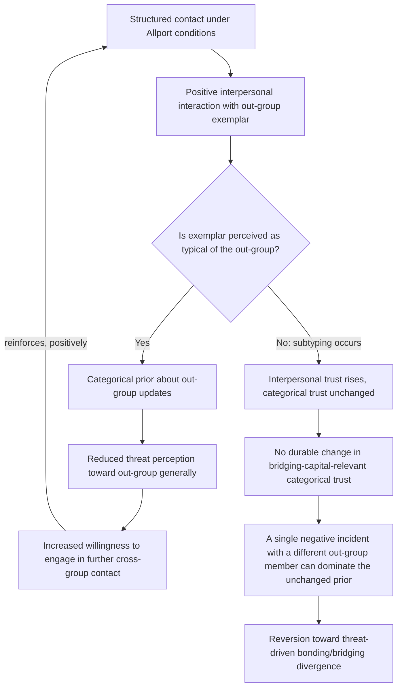

## Trust Formation Mechanisms in Repeated Intergroup Interaction

### Positioning: From Structural Divergence to Formation Dynamics

Recall that bonding and bridging social capital respond in opposite directions to threat perception, producing a segregation spiral driven by declining cross-group network density. This item addresses the complementary question: under what interaction conditions can trust be *formed or restored* across group boundaries once contact resumes, and what formal properties distinguish interactions that build durable trust from those that fail to generalize or actively backfire. The relevant machinery draws on the repeated-game stability conditions treated earlier, but requires substantial modification, because intergroup trust involves an additional variable absent from the interstate repeated-game model: the individual's uncertainty is not only about the *specific counterpart's* type, but about how much information a single interaction reveals about the *counterpart's entire group*.

### Formal Distinction: Interpersonal Trust Versus Categorical Trust Generalization

Define **interpersonal trust** as an updated belief about a specific known individual's trustworthiness type, following the standard Bayesian updating logic used elsewhere in this framework (recall the posterior-updating structure from costly signaling: $P(\theta \mid s)$ updated via observed behavior $s$). Define **categorical trust generalization** as the separate, additional inferential step of updating one's prior belief about the distribution of types *within the counterpart's entire out-group*, based on the observed behavior of one or a small number of individual exemplars.

The critical formal property is that these two updating processes are not automatically linked, and the conditions under which interpersonal trust generalizes to categorical trust are a primary object of the intergroup contact literature (Allport's original hypothesis, formalized and extended by Pettigrew):

$$P(\theta_{\text{group}} = \text{trustworthy} \mid s_i) \; \text{updates significantly} \iff \text{individual } i \text{ is perceived as a representative (typical) group exemplar}$$

This produces a counterintuitive but well-documented design implication: a positive interaction with an individual perceived as *atypical* of their group ("an exception") can strengthen interpersonal trust in that individual specifically while leaving — or even reinforcing, via subtyping — the categorical prior about the out-group unchanged. This decoupling is the formal reason why repeated positive contact does not mechanically produce reduced intergroup conflict; it produces reduced conflict only under specific structural conditions that ensure generalization actually occurs.

### Allport's Contact Conditions as Formal Design Parameters

Allport's original four conditions for contact to reduce prejudice, restated as design parameters governing whether interpersonal updating generalizes categorically:

1. **Equal status within the contact situation**: asymmetric status contact risks confirming rather than revising prior hierarchical beliefs, since behavior under status asymmetry is not read as diagnostic of underlying type (a subordinate's cooperative behavior may be attributed to the power structure rather than to trustworthy disposition — an attribution problem structurally identical to the signal-informativeness condition from costly-signaling theory: a costly signal is only informative if it could not be produced identically by an untrustworthy type under different incentive structures).
2. **Common superordinate goals**: interaction structured around a shared objective that neither group can achieve unilaterally functions analogously to a repeated coordination game with aligned rather than conflicting stage-game payoffs, shifting the interaction out of the prisoner's-dilemma-like structure where defection is individually tempting.
3. **Institutional and authority support**: explicit sanctioning of the contact by recognized authorities on both sides raises the perceived stability and legitimacy of the interaction, functioning as a device that reduces each participant's fear of in-group sanction for engaging (directly counteracting the bridging-capital-erosion mechanism, in which cross-group ties are individually costly due to in-group suspicion).
4. **Sustained, non-superficial contact**: a sufficient number of repeated interactions is required for the Bayesian updating process to accumulate enough evidence to shift a categorical prior meaningfully; a single or superficial interaction typically provides too weak a signal relative to the strength of the pre-existing prior, especially where that prior was formed over an extended conflict history.

[Inference] Pettigrew's meta-analytic extension (2006, with Tropp) found the four conditions to be facilitating rather than strictly necessary — contact under weaker conditions still shows a measurable, if smaller, prejudice-reduction effect — which is broadly consistent with a Bayesian updating model in which the conditions increase the *informativeness* of the signal rather than being binary gating requirements for any updating to occur at all.

### The Generalization Bottleneck: Subtyping as a Belief-Protection Mechanism

A specific failure mode, load-bearing for peace-engineering design, is **subtyping**: the categorization of a positively-perceived out-group exemplar as a distinct subcategory ("not like the rest of them") that leaves the broader categorical prior about the out-group as a whole insulated from revision. This is formally a form of motivated reasoning that resists standard Bayesian updating — rather than updating $P(\theta_{\text{group}})$ on new evidence $s_i$, the individual instead updates a narrower category $P(\theta_{\text{exemplar-type}})$, leaving the original group-level prior untouched.

$$\text{Subtyping occurs when the perceiver's model includes a free parameter (a new subcategory) that can absorb disconfirming evidence without updating the parent category}$$

This is analytically significant because it means the volume of positive contact alone is an insufficient design metric — contact programs must be specifically structured to prevent the perceiver's belief-updating model from having this escape valve available, typically by emphasizing the exemplar's typicality and multiplying the number of distinct individual exemplars encountered (since subtyping becomes progressively less tenable as the number of disconfirming individual cases grows relative to the size of the category).

### Feedback Structure: The Trust-Building Loop and Its Fragility

Unlike the segregation spiral's purely reinforcing (positive feedback) structure, successful trust formation constitutes a fragile balancing loop that can revert to the reinforcing segregation dynamic if disrupted at any stage — an asymmetry with direct design consequences (destruction is structurally easier to sustain than construction):

The asymmetric fragility illustrated at node I reflects a well-documented empirical regularity: negative intergroup interactions tend to generalize to categorical judgments more readily than positive ones (a negativity-bias asymmetry in social categorization), meaning the trust-formation loop requires deliberate, sustained design support to compete against a categorical-updating asymmetry that favors reversion to the segregation spiral by default.

### Canonical Empirical Illustration: Contact Program Evaluations in Divided Societies

[Inference] Structured intergroup contact programs in Northern Ireland (post-Good-Friday-Agreement integrated education initiatives) and in Israeli-Palestinian coexistence programs are frequently cited as testing grounds for the typicality and sustained-contact conditions specifically: evaluations generally report stronger and more durable attitude change under conditions of extended, institutionally embedded contact (shared schooling over years) compared to short-term workshop-style encounters. [Unverified: whether observed attitude change in these evaluations reflects genuine categorical trust generalization as modeled above, versus a social-desirability response bias in post-program surveys, is a persistent methodological concern in this literature that has not been fully resolved through behavioral (as opposed to self-report) outcome measures.]

### Design Implications: What Peace Engineering Targets

The formal decoupling of interpersonal and categorical trust, and the identification of subtyping as the primary generalization bottleneck, generate specific and non-obvious design requirements distinct from simply "increasing contact":

- **Deliberate typicality framing**: contact program design should actively counter the subtyping escape valve by structuring encounters to emphasize the exemplar's representativeness of their broader group rather than allowing (or implicitly encouraging) participants to categorize a positive contact as exceptional.
- **Multiplicity of exemplars over intensity with a single exemplar**: since subtyping becomes harder to sustain as disconfirming cases accumulate, program design that maximizes the *number* of distinct positive cross-group contacts, even at lower intensity per contact, may outperform designs concentrating contact intensity on a small number of individuals.
- **Institutional embedding to raise interaction stability**: per Allport's authority-support condition, formal institutional sponsorship (state-recognized integrated schooling, officially sanctioned joint economic zones) both increases signal credibility and reduces the in-group-sanction cost that otherwise drives the bridging-capital-erosion mechanism.
- **Asymmetric protective design against negativity bias**: because negative incidents disproportionately threaten accumulated categorical trust gains, sustained programs benefit from explicit incident-management protocols (rapid, transparent handling of any negative cross-group incident) designed to prevent a single event from dominating an otherwise-accumulating positive Bayesian update.

[Speculation] Whether large-scale, technology-mediated contact interventions (structured virtual exchange programs) can achieve the typicality and multiplicity conditions at a lower per-contact cost than physical integrated institutions is a plausible extrapolation but remains empirically untested at the scale and duration required to assess durable categorical trust generalization.

**Related Topics:**

- Putnam's social capital framework and its erosion under conflict exposure
- Allport's intergroup contact theory: original formulation and Pettigrew-Tropp meta-analysis
- Repeated games and shadow-of-the-future stability conditions
- Subtyping and motivated reasoning in social categorization research
- Integrated education program design and evaluation in divided societies