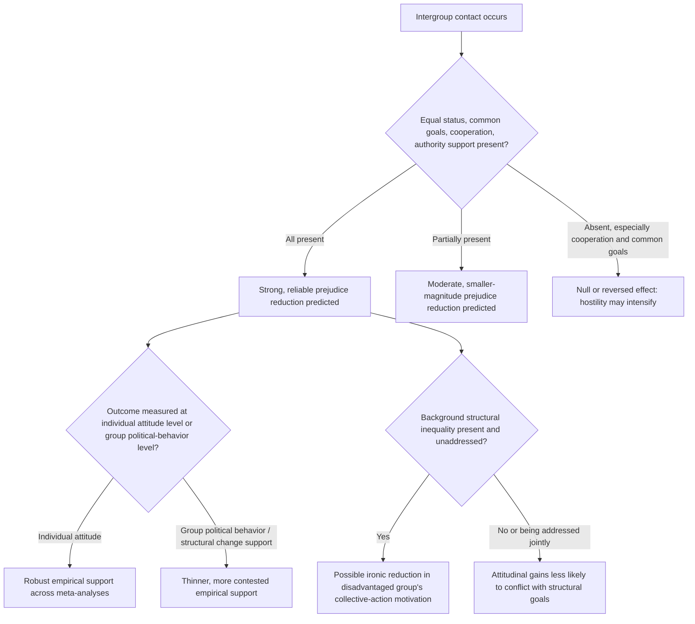

## Allport's Intergroup Contact Theory and Its Scope Conditions

### Positioning: From Formation Mechanism to Foundational Theory and Its Boundaries

The previous item treated Allport's four conditions as design parameters governing whether interpersonal trust updates generalize to categorical trust, and identified subtyping as the primary bottleneck. This item steps back to the theory's own scope: which conditions Allport (1954) originally specified as *necessary versus facilitating*, how the subsequent five decades of empirical testing (particularly Pettigrew and Tropp's 2006 meta-analysis) revised that specification, and — critically for a design-oriented treatment — under what structural conditions contact fails to reduce prejudice or actively backfires. A contact-theory-informed intervention that ignores the scope conditions risks reproducing exactly the reinforcing threat spiral it is meant to counteract.

### The Original Formulation: Necessary Conditions, Not Mere Facilitators

Allport's original hypothesis was stated more restrictively than it is often summarized: intergroup contact reduces prejudice only under four jointly specified conditions, framed as approximating *necessary* criteria rather than variables that merely improve an already-positive baseline effect:

1. **Equal status** between groups within the specific contact situation (not necessarily in the broader society).
2. **Common goals** that require intergroup cooperation to achieve.
3. **Intergroup cooperation** itself, as opposed to competition, structuring the interaction.
4. **Support of authorities, law, or custom** — explicit institutional sanction of the contact.

Allport's original claim was conditional in a strong sense: contact absent these conditions was theorized to have no reliable prejudice-reducing effect and, under some configurations (particularly competitive contact without common goals), to *increase* intergroup hostility rather than merely fail to reduce it. This is the theoretically important point obscured by loose popular summaries of "contact reduces prejudice": the original theory is a **conditional**, not unconditional, claim, and the conditions were proposed as scope-defining rather than merely effect-enhancing.

### The Robbers Cave Illustration: Contact Without the Conditions

[Inference] Sherif's Robbers Cave experiment (1954, contemporaneous with Allport's formulation) is standardly cited as the canonical illustration of contact's null-to-negative effect absent the specified conditions: mere proximity and unstructured contact between the two experimentally created boy-groups failed to reduce, and in some phases intensified, intergroup hostility, while the subsequent introduction of superordinate goals (tasks requiring both groups' cooperation to succeed) produced a measurable reduction in intergroup hostility. This sequencing — contact alone insufficient, common-goal-structured cooperation sufficient — is the empirical anchor for treating condition 2 (common goals) and condition 3 (cooperation) as doing substantial causal work rather than being redundant with mere contact frequency.

### Pettigrew and Tropp's Meta-Analytic Revision

The 2006 meta-analysis (aggregating over 500 studies) revised Allport's strong necessity claim in a specific, quantifiable direction: the four conditions were found to *facilitate* prejudice reduction and predict larger effect sizes, but contact lacking one or more conditions still showed a measurable average negative correlation with prejudice, rather than a null or reversed effect as the strict necessity reading would predict.

$$\text{Effect size (contact} \to \text{reduced prejudice)} = f(\text{conditions met}) \; \text{monotonically increasing, but } f(0) \neq 0$$

This revision matters for peace-engineering design because it changes the risk calculus of imperfect interventions: contact programs that cannot fully satisfy all four conditions (a common constraint in resource-limited or actively contested environments) are not necessarily worthless under the revised formulation, though they remain predicted to substantially underperform fully-specified programs — the meta-analytic revision downgrades the conditions from gating requirements to effect-size modifiers, without eliminating their importance.

[Inference] A further, less frequently emphasized finding from the same meta-analytic tradition is that the *type* of contact matters independently of the four conditions: contact involving self-disclosure and the formation of cross-group friendship (as opposed to purely transactional or task-based contact) shows systematically larger effect sizes, suggesting that friendship-potential — a variable outside Allport's original four — functions as an additional, empirically supported moderator not present in the 1954 formulation.

### Scope Condition: The Generalization Problem Revisited at the Theory Level

Recall from the prior item that subtyping can decouple interpersonal trust gains from categorical trust generalization. At the theory level, this generates a specific scope condition on contact theory's applicability: the theory's predictions hold most reliably for **individual-level prejudice attitudes** measured via self-report or implicit-association methods, and hold considerably less reliably — with a thinner and more contested evidence base — for **behavioral or political outcomes** at the group level (voting behavior, support for group-based policy concessions, willingness to make political compromises). [Inference] This individual-attitude-to-collective-political-behavior gap is a recognized limitation in the literature (raised prominently by critics such as Dixon, Levine, and colleagues), who argue that contact theory's dominant empirical support base concerns attitudinal rather than structural or political change, and that attitude change under contact does not reliably translate into support for the redistributive or power-sharing arrangements that group-level conflict resolution typically requires.

### Scope Condition: Contact Under Persisting Structural Inequality

A second major scope-limiting critique concerns condition 1 (equal status within the situation) when it coexists with unaddressed structural inequality outside the contact situation. [Inference] The "ironic effects" literature (associated with Dixon and colleagues) argues that positive, harmonious cross-group contact can, under conditions of persistent background structural inequality, reduce the disadvantaged group's *perception of injustice* and willingness to engage in collective action for structural change — a documented tension between contact theory's individual-attitude goals and structural-justice goals that is not resolved within Allport's original framework. This generates a genuine design tension rather than a straightforward implementation problem: contact programs optimized purely for prejudice reduction may, under specific background conditions, be in some tension with parallel efforts toward structural remedy, and peace-engineering design in contexts with significant background inequality needs to treat these as jointly managed objectives rather than assuming attitudinal improvement straightforwardly serves structural peace goals.

### Feedback and Scope Structure: Where the Theory's Predictions Hold Versus Break Down

This scope map is the operative output of treating contact theory as a bounded, condition-dependent model rather than a general-purpose prejudice-reduction technology: nodes E, H, and J each represent a documented failure or tension mode that a peace-engineering design relying uncritically on "more contact" as a universal remedy would not anticipate.

### Design Implications: What Peace Engineering Targets

Given the theory's genuine scope conditions and documented failure modes, design guidance bifurcates from the simpler "structure contact under the four conditions" prescription into a more conditional set of requirements:

- **Verify cooperative task structure, not mere proximity, before deployment**: per the Robbers Cave illustration, physical co-location or shared institutional membership without genuine common-goal cooperative structure risks the null-to-negative effect region of the scope map; program design should audit for authentic interdependence, not just contact frequency.
- **Prioritize friendship-potential design features**: incorporating self-disclosure-oriented and sustained-relationship-building program elements, per the meta-analytic finding that friendship-track contact outperforms purely transactional contact, independent of the original four conditions.
- **Distinguish attitudinal from structural objectives explicitly in program evaluation**: given the thinner evidence base for group-level political behavior change, programs aimed at building support for structural settlements (power-sharing, redistribution) should be evaluated against behavioral and political outcome measures directly, rather than inferring political effect from attitudinal survey improvement alone.
- **Pair contact interventions with parallel structural-justice mechanisms**: given the ironic-effects risk under unaddressed inequality, peace-engineering designs operating in structurally unequal settings should treat contact programming and structural remedy as jointly sequenced or concurrent tracks rather than assuming the former substitutes for or naturally leads to the latter.

[Speculation] Whether explicitly naming and addressing background structural inequality *within* the contact program itself (rather than treating it as a separate track) can neutralize the ironic-effects risk while preserving attitudinal gains is a design hypothesis with some qualitative support but no robust experimental confirmation at scale.

**Related Topics:**

- Trust formation mechanisms in repeated intergroup interaction
- Putnam's social capital framework and its erosion under conflict exposure
- Sherif's Robbers Cave experiment and realistic conflict theory
- The ironic-effects critique: contact theory versus collective action for structural change
- Power-sharing institutional design as a structural complement to attitudinal peacebuilding