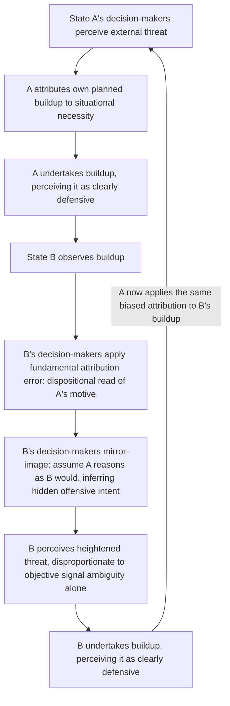

## Threat Perception and Security Dilemma Sensitivity at the Individual Level

### Positioning: Rescaling a Structural Model to Psychological Micro-Foundations

Recall that the interstate security dilemma is a structural condition in which security-seeking actions by state $A$ decrease state $B$'s security under offense-defense ambiguity, generating a reinforcing perception spiral independent of either side's actual intentions. This item examines the individual-level psychological mechanisms that generate, sustain, and modulate the *threat perception* variable that drives that spiral — treating perception not as a black-box input to the state-level model but as an object with its own documented cognitive architecture, biases, and boundary conditions. This is the necessary micro-foundational layer connecting the trust-and-contact mechanisms already covered to the structural security-dilemma dynamics covered earlier in this curriculum.

### Formal Bridge: Individual Threat Perception as the Microfoundation of $P(s \mid \theta)$

Recall the Bayesian structure from the security-dilemma treatment: a state's posterior belief about a rival's type updates on an observed signal $s$ according to the likelihood ratio $P(s \mid O)/P(s \mid D)$, and this ratio collapses to uninformative (posterior equals prior) when offensive and defensive postures are observationally indistinguishable. Individual-level threat perception research decomposes what is aggregated at the state level into a *decision-maker's* subjective likelihood function, which is not the objective likelihood ratio but a psychologically biased estimate of it — meaning the "doubly dangerous" structural condition is compounded, not merely instantiated, by systematic individual-level perceptual distortions layered on top of genuine informational ambiguity.

**Security dilemma sensitivity**, defined precisely (following Booth and Wheeler's individual-level extension): the perceptual and dispositional capacity of a decision-maker to recognize that their own state's security-seeking actions may appear threatening to others, as distinct from *possessing* accurate information about the rival's intentions. This is a meta-cognitive variable — awareness of how one is perceived — layered on top of, and analytically distinct from, first-order threat perception of the rival.

### The Fundamental Attribution Error as a Structural Amplifier

The single most load-bearing individual-level mechanism connecting psychology to the security dilemma's severity is the **fundamental attribution error**: the well-documented tendency to attribute one's own behavior to situational constraints while attributing an out-group actor's identical behavior to stable dispositional traits.

Applied to threat perception: a decision-maker interprets their own state's arms buildup as a situationally forced response to external threat ("we have no choice given what they are doing"), while interpreting an *identical* buildup by the rival as revealing an inherently aggressive disposition ("they are arming because they are expansionist"). Formally, this generates asymmetric likelihood assignment even where the objective evidence is symmetric:

$$P(\text{aggressive intent} \mid \text{own buildup}) \ll P(\text{aggressive intent} \mid \text{rival's identical buildup})$$

This is analytically distinct from the pure informational ambiguity problem in the structural model (where $P(s\mid O) = P(s\mid D)$ because postures are genuinely indistinguishable): the fundamental attribution error introduces bias even when postures *are* distinguishable in principle, because the interpretive asymmetry operates on the attribution of motive rather than on the observability of the action itself. This means improving objective signal distinguishability (a structural remedy covered earlier) does not fully resolve the security dilemma's psychological amplification if attributional bias remains unaddressed — the two failure modes require distinct interventions.

### Mirror Imaging and the Empathy Gap

A closely related mechanism, prominent in Cold War-era political psychology (Jervis's own later work, and White's "mirror-imaging" concept), is the tendency for decision-makers to model the adversary's reasoning process as a mirror of their own strategic logic rather than engaging in genuine perspective-taking about the adversary's distinct historical experience, domestic constraints, and threat perceptions. This produces a specific and testable failure: each side, believing itself to be purely defensive and assuming the rival reasons identically, concludes the rival's matching defensive posture must indicate an ulterior offensive motive — since "if I were arming this much while claiming to be defensive, I would be lying," and this inference is then misapplied to the rival's genuinely defensive but formally identical behavior.

[Inference] This mechanism is theoretically distinct from, but frequently co-occurs with, the fundamental attribution error: mirror-imaging concerns a failure to model the *other's reasoning process* accurately, while attribution error concerns a bias in interpreting *observed behavior* independent of any explicit modeling of the other's reasoning at all. Both push in the same escalatory direction, and disentangling their relative contribution in any given historical case is typically not feasible from documentary evidence alone.

### Feedback Structure: Recasting the Security Dilemma Spiral at the Cognitive Level

The structural security-dilemma loop (perceived threat → arm → observed under ambiguity → rival's perceived threat → ...) can now be given explicit cognitive content at each node, revealing where individual-level bias adds amplification beyond the pure structural-informational mechanism:

The explicit insertion of nodes E and F between the objective observation (D) and the threat-perception update (G) is the key structural addition this individual-level treatment makes to the state-level model: it shows that even a decision-maker possessing high genuine security dilemma sensitivity (awareness that their own actions may look threatening) must still overcome these two independent cognitive biases in their model of the *rival's* perception process, not merely in their own self-awareness, for that sensitivity to translate into de-escalatory behavior.

### Security Dilemma Sensitivity as a Bounded, Trainable Variable

[Inference] Booth and Wheeler's framework treats security dilemma sensitivity as varying meaningfully across individual decision-makers and as potentially responsive to deliberate cultivation (historical perspective-taking training, structured adversary-perspective exercises used in some diplomatic and military education contexts) rather than being a fixed trait — though the empirical literature on whether such training produces durable behavioral change in actual high-stakes crisis decision-making, as opposed to controlled experimental or educational settings, remains thin. [Speculation] Whether security dilemma sensitivity, once acquired through training, persists under the acute stress and time pressure characteristic of real crises — conditions known independently in the political psychology literature to degrade complex perspective-taking capacity — is a plausible concern but not one with direct empirical resolution.

### Canonical Illustration: Cold War Crisis Perception

[Inference] Jervis's own extended case analyses of Cold War crisis decision-making (particularly around the Cuban Missile Crisis and earlier Berlin crises) are frequently cited as illustrating both mirror-imaging failures (initial U.S. assumptions about Soviet reasoning patterns not matching internal Soviet deliberative records that became available later) and instances of unusually high security dilemma sensitivity exercised by specific individual decision-makers under pressure, credited in some historical accounts with contributing to crisis de-escalation. [Unverified: attributing crisis outcomes to individual-level cognitive variables versus structural factors (relative capability balance, domestic political constraints, alliance commitments) already covered in this framework is inherently difficult to disentangle from historical case evidence alone, and specialist accounts differ in the relative causal weight assigned to psychological versus structural variables in these episodes.]

### Design Implications: What Peace Engineering Targets

Because the individual-level layer introduces amplification mechanisms distinct from, and additive to, the structural offense-defense ambiguity problem, interventions here target cognitive and institutional processes rather than the observable capability signals addressed by structural remedies:

- **Structured adversary-perspective-taking protocols in crisis decision-making institutions**: formal requirement that threat assessments include an explicit, documented "how would this look from their side" analytic step, directly targeting the mirror-imaging and attribution-error mechanisms rather than assuming awareness alone suffices.
- **Track-two and back-channel dialogue mechanisms staffed by individuals with documented high security dilemma sensitivity**: leveraging the individual-variation finding by deliberately selecting or training personnel for sustained diplomatic and crisis-communication roles based on demonstrated perspective-taking capacity, rather than treating all personnel as interchangeable with respect to this variable.
- **Institutionalized "red team" adversary-modeling units**: a structural analog to individual perspective-taking training, embedding the corrective mechanism into standing bureaucratic process rather than relying on any single decision-maker's trait-level sensitivity, which is particularly important given the concern that individual sensitivity may degrade under crisis stress.
- **Historical case-study education emphasizing documented mirror-imaging failures**: using declassified crisis records (where available) as training material specifically designed to make the attribution-error and mirror-imaging mechanisms cognitively salient and recognizable to future decision-makers in real time.

**Related Topics:**

- Jervis's security dilemma under offense-defense uncertainty
- Fundamental attribution error and its applications in political psychology
- Track-two diplomacy and back-channel crisis communication design
- Cold War crisis decision-making case studies (Cuban Missile Crisis, Berlin crises)
- Institutional red-teaming and adversary-perspective simulation in defense planning