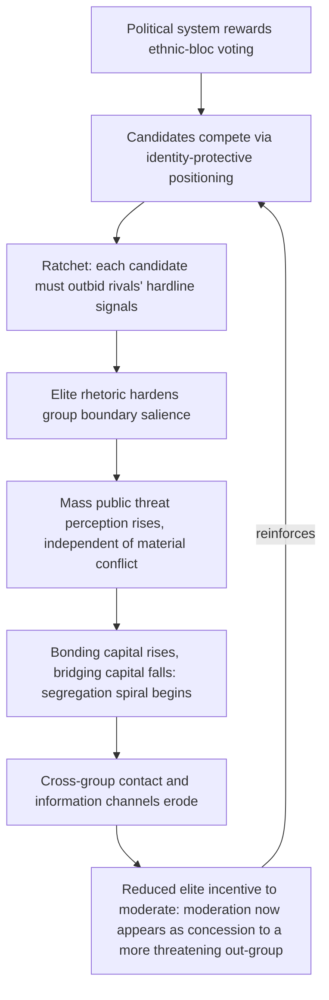

## Identity Entrepreneurship and Elite Manipulation of Group Boundaries

### Positioning: From Perceptual Bias to Deliberate Strategic Construction

The preceding items treated threat perception and categorical trust as subject to cognitive biases (attribution error, mirror-imaging, subtyping) that operate largely without deliberate design by any strategic actor. This item addresses a distinct causal layer: group boundaries and threat perceptions as objects that political elites can deliberately construct, harden, or mobilize for strategic advantage, independent of — and often in the absence of — any underlying material conflict of interest. This reframes ethnic and identity conflict from a primordial or purely structural phenomenon into a domain amenable to agency-level, incentive-driven analysis, with direct consequences for which peace-engineering interventions can plausibly succeed.

### The Constructivist Foundation: Identity as Endogenous, Not Primordial

**Identity entrepreneurship**, defined precisely: the deliberate strategic activation, amplification, or construction of group identity categories and boundaries by political elites, undertaken because doing so serves the elite actor's material or political interests (retaining power, winning elections, justifying resource extraction, deflecting accountability), rather than because the underlying group difference generates conflict independent of elite action.

This directly contradicts a primordialist reading of ethnic conflict (the view that ancient, fixed group hatreds are the exogenous cause of violence) and instead treats the *salience* and *boundary hardness* of group identity as an endogenous variable, manipulable within a single generation and sometimes within a single electoral cycle. The formal claim is not that group differences are fictional, but that which differences become politically salient, and how rigidly group boundaries are drawn, is a strategic choice variable rather than a fixed input.

### The Ethnic Outbidding Model

The primary formal mechanism through which identity entrepreneurship operates in competitive political systems is **ethnic outbidding** (Rabushka and Shepsle's original formalization, subsequently extended): in a political system where voters are assumed to vote along salient identity lines once those lines are activated, candidates within the same ethnic bloc face an incentive to compete for votes by adopting *more* extreme, more exclusionary positions relative to the out-group than their intra-bloc rivals, since a marginally more hardline candidate can peel off votes from a rival perceived as insufficiently protective of in-group interests.

Formally, let candidates $i, j$ within group $G_A$ compete for votes from $G_A$'s electorate, where voter utility is increasing in perceived candidate commitment to group interest $\phi_i$. If moderate positions are perceived as risking capture by, or concession to, group $G_B$, then:

$$\frac{\partial(\text{vote share})}{\partial \phi_i} > 0 \quad \text{even where } \phi_i \text{ exceeds the median voter's true preference}$$

This generates a **ratchet dynamic structurally analogous to the costly-signaling escalation loop** covered earlier, but operating through intra-group electoral competition rather than inter-state crisis signaling: each candidate's increment in hardline positioning raises the bar for credible in-group-protective signaling for all rivals, producing a reinforcing spiral toward more extreme positions that does not require any actual increase in underlying inter-group hostility to occur — it can be generated purely by the competitive structure of intra-group electoral politics.

### Why This Mechanism Is Distinct from, and Compounds, the Segregation Spiral

Recall the bonding/bridging divergence mechanism: threat perception drives bonding capital up and bridging capital down through a decentralized, individually-rational network-level process. Ethnic outbidding introduces a distinct, top-down causal channel that can *initiate* or *accelerate* that same divergence even absent any prior organic threat perception, because elite rhetoric itself functions as a threat signal to the mass public. This is analytically important: it means the segregation spiral's trigger variable ("intergroup threat perception rises") is not necessarily exogenous or organically generated — it can be manufactured as a byproduct of intra-group elite competition, meaning interventions aimed solely at the mass-level contact and trust-formation mechanisms (covered in prior items) will be undermined if the elite-level incentive structure generating outbidding remains unaddressed.

The loop's closure at node H is the critical compounding feature: once mass-level threat perception has risen (itself partly caused by elite rhetoric), moderation by any individual elite actor now carries a *higher* electoral cost than it did before the spiral began, since the mass electorate's updated threat perception makes moderate positioning look more like appeasement. This means ethnic outbidding is not merely an initiating trigger but a self-reinforcing structural feature of the political system once activated, requiring institutional rather than purely rhetorical counter-measures.

### Institutional Conditions That Enable or Suppress Outbidding

[Inference] The comparative politics literature (building on Horowitz's foundational work on ethnic party systems) identifies specific institutional features as moderating the outbidding mechanism's strength, providing the direct link to constitutional and electoral design as a peace-engineering lever:

- **Electoral system structure**: majoritarian, single-member-district systems in ethnically segmented societies are theorized to more strongly reward outbidding (a candidate need only maximize support within their own group's geographic concentration), whereas systems requiring cross-group vote pooling (alternative vote, certain proportional representation designs with cross-ethnic preference requirements) can structurally reward moderate, cross-group-appealing candidates instead.
- **Party system fragmentation within ethnic blocs**: outbidding dynamics require *intra-bloc* competition to operate (the mechanism depends on candidates within the same group competing against each other); a dominant single party per ethnic bloc removes the specific electoral incentive for escalating hardline positioning, though this trades off against reduced intra-group political accountability.
- **Federalism and issue decentralization**: shifting salient distributive decisions to sub-national levels can, in some institutional designs, reduce the stakes of any single national identity-based electoral contest, lowering the payoff to outbidding at the national level specifically. [Speculation] Whether this merely displaces outbidding dynamics to the sub-national level rather than genuinely reducing their aggregate incidence is a contested empirical question without clear resolution across the comparative federalism literature.

### Canonical Empirical Illustrations

[Inference] Rwanda's pre-genocide political trajectory (1990–1994) is frequently cited as an outbidding case: Hutu Power movement rhetoric progressively escalated in the years preceding the genocide partly through competitive dynamics among Hutu political factions rather than through a single unified strategic actor, consistent with the ratchet-dynamic prediction that no single elite necessarily intends the aggregate outcome. [Unverified: the precise causal weight of electoral/factional outbidding competition versus other frequently cited factors (external shock from the RPF invasion, structural economic pressures, colonial-era institutionalized ethnic categorization) in explaining the pace and scale of the 1994 genocide remains a matter of substantial historiographical debate and is not resolved by the outbidding model in isolation.]

[Inference] Consociational and cross-ethnic-pooling electoral design in post-conflict Bosnia and Northern Ireland are frequently analyzed as real-world tests of the institutional-suppression hypothesis, with mixed and contested results: [Unverified] whether Northern Ireland's Assembly cross-community voting requirements have durably suppressed outbidding dynamics or merely shifted them into intra-bloc competition over which party is toughest *within* an overall cross-community power-sharing framework is actively debated in the Northern Ireland politics literature, without clear scholarly consensus.

### Design Implications: What Peace Engineering Targets

Because outbidding is a structural feature of specific electoral and party-system incentive structures rather than a fixed cultural or psychological given, the design response targets institutional architecture directly, complementing rather than substituting for the mass-level contact and trust interventions covered elsewhere:

- **Vote-pooling electoral system design**: adopting alternative vote, cross-ethnic preference-requirement, or similar mechanisms specifically to make moderate, cross-group-appealing positioning electorally rewarded rather than punished, directly targeting the ratchet mechanism's root incentive structure.
- **Constitutional design limiting the stakes of any single identity-coded contest**: power-sharing formulas, guaranteed minority representation, or federal decentralization of the most identity-salient distributive decisions, reducing the marginal payoff to any single hardline electoral strategy.
- **Media and rhetoric-monitoring institutions with real-time flagging capacity**: given that mass-level threat perception updates on elite rhetoric (node D–E in the diagram), institutions capable of documenting and publicly flagging escalatory rhetoric in close to real time can raise the reputational cost of outbidding independent of electoral system reform, which typically requires longer institutional lead time.
- **Deliberate cultivation of intra-bloc moderate coalitions**: since the mechanism depends on intra-group competitive dynamics specifically, supporting coordination among moderate factions within a single ethnic bloc (reducing the number of independent competitors subject to the ratchet) can suppress the dynamic without requiring full electoral system redesign.

**Related Topics:**

- Putnam's social capital framework and its erosion under conflict exposure
- Consociational power-sharing and constitutional design in divided societies
- Rabushka and Shepsle's formal model of ethnic party competition
- Comparative electoral system design: vote-pooling and alternative-vote mechanisms
- Rwandan genocide historiography and the role of elite political competition