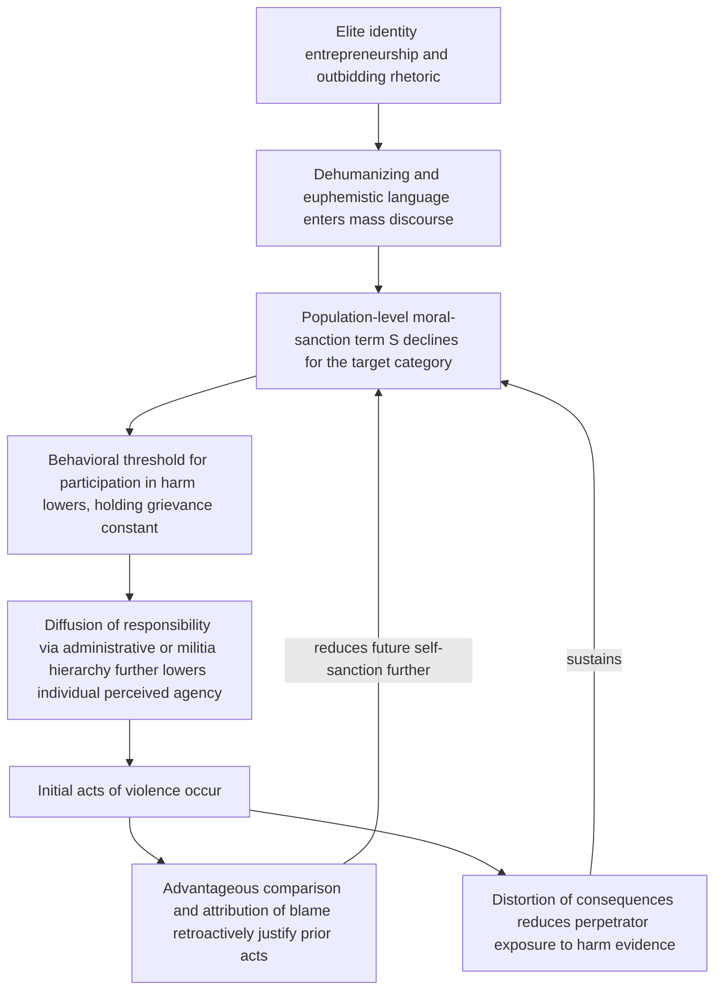

## Dehumanization and Moral Disengagement Mechanisms in Atrocity Dynamics

### Positioning: From Boundary Construction to the Removal of Moral Constraint

Recall that identity entrepreneurship explains how elites strategically harden group boundaries and elevate threat salience for competitive advantage, and that this boundary-hardening feeds the mass-level segregation spiral through reduced bridging capital. This item addresses the further, causally distinct step required to explain not merely intergroup hostility or discrimination but mass atrocity specifically: the psychological mechanisms by which ordinary individuals become capable of perpetrating or passively enabling extreme violence against out-group members, which requires the prior or concurrent removal of standard moral self-sanctions that would otherwise inhibit such behavior. Elevated threat perception and hardened boundaries are necessary preconditions but are not, by themselves, sufficient to explain the transition from hostility to systematic violence.

### Bandura's Moral Disengagement Framework

**Moral disengagement**, defined precisely (Bandura's formulation): a set of cognitive mechanisms through which individuals selectively deactivate their internalized moral self-sanctions — the self-condemning reactions that normally inhibit harmful conduct — without abandoning the moral standards themselves, thereby permitting participation in or toleration of harm while preserving a self-concept of being a moral person. The theoretical importance of this framing is that it does not require perpetrators to have weak morals or to undergo wholesale moral collapse; it requires only that specific, well-documented cognitive maneuvers selectively disable the normal moral-behavioral link for a bounded category of victims and actions.

Bandura's model specifies eight distinct mechanisms, clustering around four points in the causal chain from conduct to consequence, each independently sufficient to weaken self-sanction but frequently operating in combination:

1. **Moral justification**: reframing harmful conduct as serving a higher moral or ideological purpose (defense of the nation, religious duty, historical necessity), such that the act is redescribed as virtuous rather than harmful.
2. **Euphemistic labeling**: sanitizing language that obscures the nature of the act itself (administrative or technical terminology for killing, displacement, or destruction), reducing the act's cognitive and emotional salience as harm.
3. **Advantageous comparison**: framing one's own conduct as less severe than a worse alternative or than the target's alleged prior conduct, making the act appear moderate by contrast rather than assessed on its own terms.
4. **Displacement of responsibility**: attributing one's actions to the orders or authority of a legitimate hierarchy, reducing perceived personal moral agency over the outcome (formally connected to Milgram's obedience paradigm).
5. **Diffusion of responsibility**: distributing an action across many participants (a firing squad structure, division of labor across a bureaucratic process) such that no single individual perceives themselves as the proximate cause of harm.
6. **Distortion of consequences**: minimizing, ignoring, or disbelieving evidence of the actual harm caused, often facilitated by physical or temporal distance from the direct outcome.
7. **Dehumanization**: perceiving or portraying the victim as lacking full human qualities, thereby removing the victim from the moral community to whom self-sanctions against harm would normally apply.
8. **Attribution of blame**: casting the victim as having provoked or deserved the harm, reversing the moral valence of aggressor and victim.

### Dehumanization as the Formally Distinct, Load-Bearing Mechanism

Among the eight, dehumanization occupies a structurally distinct position: the other seven operate on the *perpetrator's construal of the act or of themselves*, while dehumanization operates on the *perpetrator's construal of the victim's moral status itself*. This distinction matters because dehumanization does not merely reduce the perceived severity of an act — it removes the victim from the category of entities to which moral consideration is owed at all, which the psychological literature (Haslam's dual-model extension) further decomposes into two formally distinct sub-mechanisms with different downstream behavioral correlates:

- **Animalistic dehumanization**: denial of uniquely human attributes (civility, refinement, rationality, moral sensibility), typically associating the out-group with animal or vermin imagery, and empirically associated with disgust-based emotional responses and violence framed as extermination or "cleansing."
- **Mechanistic dehumanization**: denial of human nature attributes (warmth, emotional depth, individual agency), typically associating the out-group with object- or automaton-like imagery, and empirically associated with indifference-based responses and instrumental, bureaucratically administered harm.

[Inference] This distinction has direct diagnostic value: atrocity dynamics characterized by animalistic dehumanization rhetoric (vermin, insect, disease metaphors — well documented in Rwandan radio propaganda referring to Tutsi as "inyenzi," cockroaches) tend to correlate with more visceral, participatory, disgust-driven mass violence, while mechanistic dehumanization (bureaucratic categorization and processing language) tends to correlate more with the diffusion-of-responsibility and euphemistic-labeling mechanisms operating through administrative distance, as documented in analyses of Holocaust bureaucratic processes. [Unverified: whether this correlation reflects a genuine causal distinction in violence type versus a post-hoc pattern-matching across a small number of canonical cases is not established with the statistical rigor a strong causal claim would require.]

### Formal Structure: Moral Disengagement as Removing a Behavioral Constraint, Not Adding a Motive

A precise way to state the model's structure, distinguishing it from a simple "hatred causes violence" narrative: assume a baseline behavioral model in which an individual's propensity to commit harm $H$ is a function of both an incentive or grievance term $G$ (which the outbidding and threat-perception mechanisms already covered can elevate) and an internalized moral-sanction term $S$ that imposes a self-punishing cost on harmful action:

$$P(H) = f(G, S), \quad \frac{\partial P(H)}{\partial S} < 0$$

Moral disengagement mechanisms operate specifically on $S$, driving it toward zero for a bounded target category, *without necessarily requiring any independent increase in* $G$. This is the theoretically important claim distinguishing atrocity dynamics from ordinary interstate conflict escalation: an individual or population can undergo a substantial increase in violence propensity through disengagement-mechanism activation alone, holding the underlying grievance or threat level constant, which is why documented cases frequently show mass participation in violence by individuals with limited independent history of hostility toward the specific victims, once institutional and rhetorical disengagement mechanisms are actively supplied (propaganda infrastructure, bureaucratic labeling systems, chain-of-command diffusion structures).

### Feedback Structure: Disengagement as an Accelerant on the Outbidding and Segregation Spirals

Moral disengagement mechanisms function as a distinct causal layer that *interacts with*, rather than duplicates, the segregation spiral and ethnic-outbidding dynamics already covered — specifically, elite-supplied dehumanizing rhetoric (an outbidding-compatible strategy, since dehumanizing language can itself function as a hardline signal in intra-bloc competition) directly supplies the mechanism that converts elevated threat perception into behavioral capacity for violence, a step the segregation-spiral model alone does not specify:

This loop's closure at G is a specific and important feature: post-hoc justification of already-committed acts (a well-documented cognitive dissonance-reduction process) feeds back to further lower the moral-sanction term for subsequent acts, meaning the mechanism is self-reinforcing once violence has begun, independent of any further external escalation in threat or grievance — a structural reason why atrocity dynamics, once initiated, can accelerate in severity even absent continued elite instruction or rising material stakes.

### Canonical Empirical Illustrations

The Rwandan genocide's radio propaganda apparatus (Radio Télévision Libre des Mille Collines) is standardly analyzed as an unusually direct real-time application of moral justification, euphemistic labeling ("work," referring to killing), and animalistic dehumanization operating in close temporal proximity to the violence itself, providing one of the better-documented cases of the disengagement mechanisms operating as an active, deliberate instrument rather than a passive byproduct of conflict. [Inference] The Holocaust's bureaucratic administrative structure is standardly analyzed as illustrating diffusion of responsibility and displacement of responsibility operating through an extended chain of command and specialized administrative division of labor (documented extensively in Hilberg's institutional analysis and reflected in Arendt's "banality of evil" framing), consistent with the mechanistic-dehumanization correlation noted above. [Unverified: the relative causal weight of top-down propaganda-driven disengagement versus bottom-up social-conformity and peer-pressure dynamics (a related but formally distinct mechanism, documented in Browning's study of Reserve Police Battalion 101) in explaining mass perpetrator participation remains actively debated and likely varies across cases rather than admitting a single general answer.]

### Design Implications: What Peace Engineering Targets

Because moral disengagement operates on the sanction term $S$ largely independent of the grievance term $G$, interventions here are distinct from — and necessary in addition to — grievance-reduction and threat-de-escalation measures covered elsewhere:

- **Real-time propaganda and hate-speech monitoring with rapid interdiction capacity**: given the documented role of mass-media dehumanizing rhetoric as a proximate enabler (RTLM), institutions capable of identifying and countering dehumanizing broadcast content in near-real time target the mechanism at its most direct point of mass transmission.
- **Atrocity-prevention early-warning frameworks keyed to disengagement-mechanism indicators specifically**: rather than (or in addition to) monitoring grievance or threat-perception indicators alone, tracking the specific linguistic markers of moral justification, euphemistic labeling, and dehumanization in political and media discourse as a distinct early-warning signal class, since these can escalate independent of measurable material grievance.
- **Bureaucratic and command-structure design limiting diffusion-of-responsibility pathways**: in security-sector and paramilitary institutional design, building explicit, individually attributable accountability mechanisms (documented chains of command with clear individual responsibility markers) to counteract the diffusion mechanism's reliance on distributed, anonymized participation structures.
- **Post-conflict transitional justice mechanisms targeting re-engagement of moral sanction**: truth and reconciliation processes, and individual accountability mechanisms (tribunals), can be understood in this framework as designed in part to reverse the advantageous-comparison and attribution-of-blame feedback loop by re-establishing an accurate, socially validated account of harm and responsibility.

**Related Topics:**

- Identity entrepreneurship and elite manipulation of group boundaries
- Milgram's obedience paradigm and displacement of responsibility
- Haslam's dual model of dehumanization: animalistic versus mechanistic
- Browning's Ordinary Men and bottom-up perpetrator conformity dynamics
- Atrocity early-warning systems and mass-violence prevention frameworks