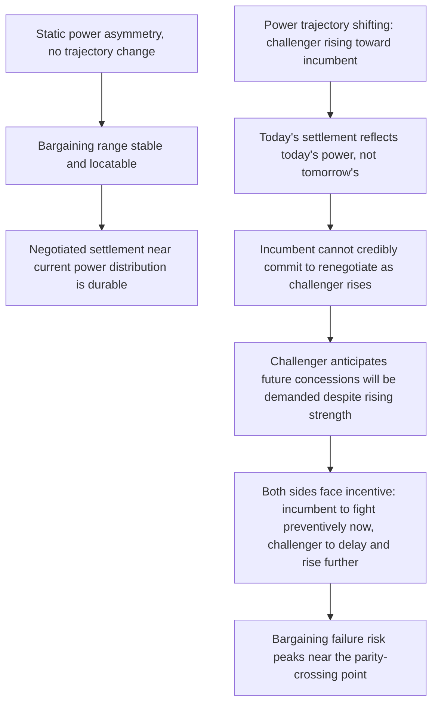

## Power Asymmetry Effects on Bargaining Range and War Likelihood

### Positioning: Reintroducing the Formal Bargaining Model with Power as the Active Variable

Recall the bargaining range from the inefficiency-puzzle treatment: $[p - c_A, \, p + c_B]$, where $p$ is $A$'s probability of prevailing in war, and the range's non-emptiness (width $c_A + c_B$) depends only on the costs of fighting, not on the value of $p$ itself. This item isolates $p$ — the relative power variable — as the object of analysis, asking not whether a bargaining range exists (it generically does, for any $p \in (0,1)$ with positive fighting costs) but how the *location* of that range within $[0,1]$, and the *stability* of any given point within it, respond to power asymmetry, and why extreme asymmetry interacts differently with the three rationalist failure mechanisms than does rough parity.

### Power Asymmetry and Bargaining Range Location, Not Existence

A common misconception, worth explicitly correcting for analytical precision, is that power asymmetry itself is a source of bargaining failure. It is not, in the baseline complete-information model: shifting $p$ toward $1$ (extreme advantage for $A$) simply relocates the bargaining range toward the upper end of $[0,1]$ — $A$ can extract a settlement close to full control of the contested good, and $B$, recognizing its weak position, should still prefer a negotiated settlement near $p - c_A$ over the certain loss and cost of a war it will almost surely lose. Extreme asymmetry, under complete information alone, should if anything make negotiated settlement *easier* to reach, since the range's width $c_A + c_B$ is invariant to $p$, and the weaker side has strong incentive to settle rather than fight a contest it expects to lose.

$$\text{Extreme asymmetry} \; (p \to 1) \implies \text{range} \to [1-c_A, \, 1+c_B] \; \text{(non-empty, located near full concession by } B)$$

This is the theoretically important negative result: since power asymmetry alone does not generate bargaining failure under complete information, the empirical association frequently observed between asymmetric power distributions and war onset must be explained through asymmetry's *interaction* with the three rationalist mechanisms (private information, commitment problems, indivisibility) rather than through asymmetry as an independent causal factor.

### Interaction Channel One: Power Parity and Private Information Severity

Recall that private information about relative capability or resolve generates bargaining failure because offers are optimized against a belief distribution over $p$ rather than the true $p$, producing positive probability that a settlement falls outside the true range. The severity of this failure is a function of the *variance* of the belief distribution over $p$, not of $p$'s true value directly — but variance itself is plausibly correlated with the true balance in a specific, asymmetric way: [Inference] under rough power parity, small errors in either side's estimate of relative capability translate into large uncertainty about the war outcome (since the win-probability function $p(\cdot)$ is typically steepest, i.e., most sensitive to capability estimation error, near $p=0.5$), whereas under extreme asymmetry, even substantial estimation error leaves the qualitative outcome (near-certain victory for the stronger side) largely unchanged. This generates the formal prediction that private-information-driven bargaining failure should be most severe near power parity and comparatively muted under extreme asymmetry — a claim with a specific, testable functional form:

$$\text{Var}[\hat{p}] \cdot \left|\frac{\partial p}{\partial(\text{capability ratio})}\right|_{\text{near } p=0.5} \; \gg \; \text{Var}[\hat{p}] \cdot \left|\frac{\partial p}{\partial(\text{capability ratio})}\right|_{\text{near } p \to 1}$$

[Unverified: this steepness-based prediction is a theoretically motivated extension rather than a directly tested empirical finding in the original Fearon framework, and the power-transition and parity-conflict empirical literatures (discussed below) offer only indirect and contested support.]

### Interaction Channel Two: Power Shifts and the Commitment Problem

Recall from the commitment-problem treatment that a rising power's trajectory $\frac{dV_A}{dt} > 0$ generates preventive-war incentives precisely because no settlement reflecting today's power distribution can be credibly locked in against tomorrow's. This is the interaction channel through which power *asymmetry in its rate of change*, rather than its static level, becomes the operative variable: static asymmetry (however extreme) generates no commitment problem on its own, since a stable, extreme distribution admits a stable, extreme settlement. It is specifically the *anticipated closing of an asymmetry* — a rising challenger approaching a currently dominant incumbent — that reintroduces the commitment-problem mechanism, converting what should be an easily negotiable static bargaining range into a dynamically unstable one that no single-period settlement can resolve.

This is the direct formal link to **power transition theory** (Organski; formalized by Powell 1996, 1999): war risk is predicted to be highest not at either extreme of the static asymmetry spectrum but specifically during the *transition window* — when a rising challenger's power trajectory threatens to overtake, or has recently overtaken, an incumbent hegemon, and the incumbent's incentive to fight preventively (per the commitment-problem logic) is at its peak just before the crossing point.

Node A/B/C versus D through I represents the core distinction this item establishes: it is the presence of arrow D (a trajectory), not the static asymmetry level itself, that reintroduces bargaining instability — directly correcting the intuitive but formally incorrect view that "asymmetric power causes war" in favor of the more precise "asymmetric and *shifting* power reintroduces a commitment problem that static asymmetry does not."

### The Empirical Power-Parity Literature and Its Contested Relationship to the Formal Models

[Inference] The quantitative conflict literature contains two partially competing empirical traditions with different implications for the parity-versus-asymmetry question: the **power-parity/preponderance debate**, associated with Organski's original power transition theory, which predicts war is more likely under approaching parity (consistent with the commitment-problem interaction channel above), versus deterrence-theoretic traditions predicting war is more likely under rough parity for a distinct reason (neither side's expected victory is clear enough to make war's expected cost obviously prohibitive, consistent with the private-information interaction channel above). [Unverified: these two traditions arrive at broadly convergent predictions about parity being more war-prone than static extreme asymmetry, but through different causal mechanisms — commitment problems versus information failure — and the empirical literature has not decisively distinguished which mechanism carries greater explanatory weight in any given case, since both predict the same directional relationship between parity and war risk, making them difficult to separate using power-distribution data alone.]

### Boundary Condition: When Extreme Asymmetry Still Produces War

The negative result above (extreme asymmetry should ease settlement) has a specific and important qualification: it assumes the weaker side has an available, acceptable settlement option and that fighting is undertaken with expected-utility-maximizing rationality about the likely outcome. Extreme asymmetry can still produce war through channels *external* to the pure power-asymmetry variable itself:

- **Indivisibility interacting with asymmetry**: if the contested good is indivisible (recall the earlier treatment) and the weak side's minimum acceptable settlement (driven by a discontinuous value function, e.g., regime survival) exceeds what the strong side is willing to concede even at $p \to 1$, no settlement point satisfies both sides regardless of how favorable the power balance is to the stronger party.
- **Private information about resolve, not capability**: a weak side with privately known, unusually high resolve (willingness to bear extreme costs $c_B$) can generate a bargaining failure if the strong side's belief about $c_B$ is downward-biased, since the true bargaining range depends on both $p$ and $c_B$ jointly, and asymmetric power does not eliminate uncertainty about the weaker side's cost tolerance specifically.
- [Speculation] Domestic political commitment problems within the weaker side (a leadership that cannot credibly commit to keep a concessionary settlement, due to its own internal audience-cost or succession dynamics) may generate apparently "irrational" resistance from a materially overmatched actor, though this moves outside the pure interstate bargaining model into the domestic-political extensions noted elsewhere in this framework.

### Canonical Empirical Illustration

[Inference] The prelude to the 1990–91 Gulf War is sometimes analyzed as an illustration of the private-information interaction channel under substantial (though not extreme) asymmetry: [Unverified] whether Iraqi leadership's apparent underestimation of the U.S.-led coalition's resolve and capability to assemble and sustain a large-scale intervention reflects a genuine private-information bargaining failure as modeled here, versus alternative explanations rooted in domestic political incentives or misperception distinct from the formal rationalist mechanism, remains debated in the specialist literature and is not settled by the model alone.

### Design Implications: What Peace Engineering Targets

Because the war-risk-relevant variable is the *interaction* of power asymmetry with information, commitment, and indivisibility failures rather than asymmetry per se, design interventions target the specific interaction channel rather than the power distribution directly:

- **Transition-window-focused verification and reassurance mechanisms**: given that commitment-problem risk peaks specifically during anticipated power-transition windows, peace-engineering resources (enhanced monitoring, confidence-building measures, gradual and credible power-sharing arrangements) are disproportionately valuable when deployed in anticipation of, rather than after, an approaching parity crossing.
- **Capability transparency measures targeted at near-parity dyads**: since private-information severity is predicted to be highest near $p=0.5$, verification and capability-disclosure regimes yield the largest marginal reduction in bargaining-failure risk specifically in roughly balanced power relationships, rather than uniformly across all dyads regardless of power distribution.
- **Explicit resolve-signaling channels for materially weaker parties**: addressing the boundary condition where a weak side's privately high resolve is underestimated by a stronger side, institutionalized channels allowing credible resolve communication (costly signaling mechanisms, covered earlier) can prevent the specific asymmetric-war pathway driven by underestimated weak-side cost tolerance.
- **Slowing the rate of power-trajectory change through arms-control caps on a rising party specifically**: directly targeting $\frac{dV_A}{dt}$, per the commitment-problem remedy set, as opposed to symmetric arms limitations that do not address the transition-specific instability.

**Related Topics:**

- Fearon's commitment problem model of credible commitment failure
- Bargaining failure and the inefficiency puzzle of war
- Power transition theory and the Thucydides Trap debate
- Information asymmetry and costly signaling in crisis bargaining
- Issue indivisibility and its effect on negotiated settlement space