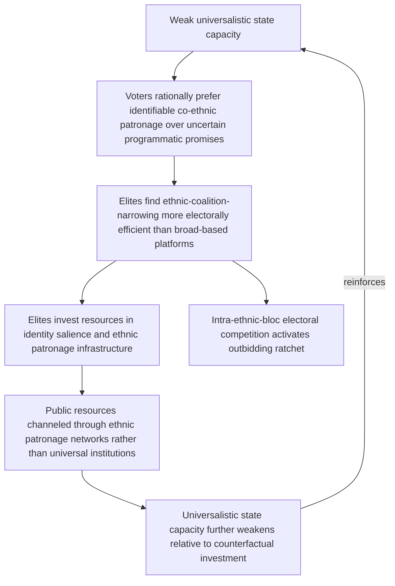

## Ethnic Outbidding and the Political Economy of Identity Mobilization

### Positioning: From Electoral Mechanism to Political Economy Foundations

Recall that ethnic outbidding was introduced as a formal electoral-competition mechanism: candidates within a bloc adopt increasingly hardline identity-protective positions because moderate positioning risks appearing insufficiently protective relative to intra-bloc rivals, producing a ratchet toward extremity. This item extends that mechanism into its political economy foundations — the material incentive structures, rent-distribution arrangements, and resource-allocation logics that make identity mobilization a rational elite strategy independent of, and often prior to, any electoral contest. The question addressed here is not merely *how* outbidding operates once identity is politically salient, but *why* elites find it materially advantageous to invest in constructing identity salience as a political resource in the first place.

### Identity as a Selectorate-Narrowing Technology

Recall the formal logic in which candidates compete for votes by adopting group-protective positions; the political economy extension asks what an elite actor *gains materially* from narrowing their effective selectorate — the group whose support is necessary and sufficient to retain power — along identity lines rather than competing on programmatic or valence grounds across the whole electorate. **Selectorate theory** (Bueno de Mesquita et al.) provides the formal apparatus: a leader's optimal governance strategy depends on the ratio between the *selectorate* (those with a formal say in selecting the leader) and the **winning coalition** (the minimum subset of the selectorate whose support the leader actually needs to retain power). Where the winning coalition is small relative to the selectorate, leaders can retain power through targeted, excludable private goods (patronage, rents, targeted resource transfers) delivered to coalition members, rather than through broad, non-excludable public goods.

Ethnicity, where politically salient, functions as an unusually efficient technology for defining and monitoring a small winning coalition: unlike an ideological or economic-interest coalition, ethnic group membership is typically observable, difficult to fake, and inherited, making it a low-cost mechanism for both delimiting who receives patronage and excluding others from it, and for solving the credible-commitment problem *within* the coalition (an ethnic patron is less able to costlessly renege on co-ethnic clients without incurring reputational costs specific to future intra-ethnic dealings). This generates a formal, materially grounded reason elites *invest* in identity salience even absent any pre-existing electoral competition: it is a rent-distribution technology, not merely a campaign rhetoric strategy.

$$\text{Ethnic patronage system rational} \iff \text{cost of excludable ethnic targeting} < \text{cost of broad public-goods provision required to retain a larger coalition}$$

### Clientelism and the Demand Side of Identity Mobilization

The supply-side account above (elites benefit from narrow, ethnically-defined coalitions) requires a complementary demand-side mechanism to explain why voters accept ethnic patronage appeals over programmatic alternatives, since a purely elite-driven account risks treating mass political behavior as a passive residual. [Inference] The clientelism literature (Chandra's "ethnic head count" model, among others) argues that where formal state institutions provide weak or unreliable public-goods delivery, individual voters rationally prefer a patron who can credibly deliver targeted goods through an identifiable, monitorable channel (a co-ethnic patronage network) over a programmatic promise from a more distant, less monitorable political actor — meaning ethnic voting can be a rational response to weak formal-institutional capacity rather than requiring an independent assumption of primordial ethnic preference. This generates a further structural implication: identity mobilization's political viability is partly endogenous to state capacity itself, predicting that ethnic-patronage-based mobilization should be comparatively more prevalent and more electorally effective in weak-institutional-capacity settings than in settings with robust, universalistic public service delivery.

### The Reinforcing Loop: Patronage, Institutional Weakness, and Outbidding

This generates a distinct but interacting feedback structure from the pure electoral-ratchet mechanism covered previously — here the reinforcement runs through the interaction between state capacity and the material returns to ethnic mobilization, rather than purely through electoral signaling competition:

Node F's closure back to A is the structurally important addition this political-economy layer makes: it predicts that identity-mobilization-based politics is not merely an equilibrium response to a fixed level of weak state capacity but can *actively degrade* universalistic institutional capacity over time as public resources are diverted into ethnically-targeted patronage channels, creating a self-reinforcing trap in which the material conditions favoring identity mobilization (weak universal institutions) are themselves produced, in part, by identity mobilization's own success as a political strategy. This is analytically distinct from, and complements, the electoral outbidding ratchet (node G), which continues to operate on top of this material-institutional layer once identity has been mobilized as a political resource.

### Resource Rents as an Amplifying Variable

[Inference] A frequently examined amplifying condition in the political economy literature is the presence of point-source natural resource rents (oil, mineral extraction revenues) that can be captured and distributed through centralized state control without requiring broad-based taxation or corresponding public accountability. Where such rents are large relative to the overall economy, the material payoff to controlling the state apparatus — and thus to constructing or capturing an ethnically-defined winning coalition sufficient to control that apparatus — rises sharply, independent of any programmatic governance capacity. This is the formal mechanism underlying the broader "resource curse and conflict" literature's ethnic-dimension: rents raise the stakes of ethnic coalition control without correspondingly requiring the coalition-controlling elite to deliver broad developmental public goods, reinforcing the narrow-coalition/patronage equilibrium described above rather than creating pressure toward more inclusive, programmatic politics.

[Unverified: the precise causal weight of resource rents versus other institutional and historical factors (colonial-era administrative boundary-drawing, pre-existing social stratification) in determining which societies develop strong ethnic-patronage political economies is contested across the comparative politics and conflict-resource literatures, and case-specific historical trajectories likely interact with rather than being fully explained by the rent-availability variable alone.]

### Canonical Empirical Illustrations

[Inference] Kenya's post-independence political economy is frequently analyzed through this framework: patronage networks organized substantially along ethnic-regional lines have been documented as a persistent feature of resource and appointment allocation across multiple political eras, with electoral outbidding dynamics (well documented around the 2007–08 post-election violence) operating on top of, and interacting with, longer-standing ethnic-patronage distributional structures rather than emerging as an isolated electoral phenomenon. [Unverified: specific causal attribution linking documented patronage patterns to particular episodes of electoral violence, as opposed to correlation between co-occurring structural features, requires case-specific evidentiary work beyond what the general political-economy model alone can establish.]

[Inference] Nigeria's federal character principle and associated resource-revenue-sharing formula are frequently cited as a deliberate institutional attempt to formalize and thereby regulate ethnic-regional distributional competition (channeling identity-based distributional claims through a codified constitutional formula) rather than leaving distribution to unregulated patronage competition, representing an explicit institutional response to the dynamics modeled in this item. [Speculation] Whether formalizing ethnic distributional shares in this way durably reduces outbidding incentives or instead entrenches identity as the primary organizing axis of political competition by constitutionally validating it is a genuinely contested question in the Nigerian federalism literature without a clear resolution.

### Design Implications: What Peace Engineering Targets

Because identity mobilization here is modeled as a materially rational elite and mass response to specific institutional and resource conditions, rather than a purely rhetorical or psychological phenomenon, design interventions target the underlying incentive architecture directly:

- **Universalistic public service delivery investment as a demand-side intervention**: strengthening broad-based, reliably delivered public goods (health, education, infrastructure accessible independent of ethnic-patronage channel) directly reduces the demand-side rational basis for preferring ethnic patronage over programmatic politics, per the clientelism mechanism above.
- **Resource revenue transparency and universalistic distribution formulas**: given the amplifying role of capturable rents, mandated transparent, broad-based, or constitutionally formalized (per the Nigerian illustration) revenue-sharing mechanisms can reduce the marginal payoff to narrow ethnic-coalition capture of centralized resource control.
- **Anti-patronage civil service and procurement reform**: institutional design that reduces elites' capacity to distribute state resources through excludable, ethnically-targetable channels (merit-based civil service rules, transparent and auditable procurement) directly raises the cost side of the ethnic-patronage-technology calculation.
- **Coordination with electoral-system interventions**: since this political-economy layer operates beneath, and reinforces, the electoral outbidding ratchet covered previously, vote-pooling electoral design (covered in the identity entrepreneurship treatment) is likely to underperform if deployed without complementary reform to the underlying patronage-resource structure, since electoral incentive redesign alone does not address the material rent-distribution logic sustaining ethnic coalition-building between elections.

**Related Topics:**

- Identity entrepreneurship and elite manipulation of group boundaries
- Selectorate theory and the logic of political survival (Bueno de Mesquita et al.)
- Resource curse literature and the political economy of rentier states
- Clientelism, state capacity, and the demand side of ethnic voting
- Federal revenue-sharing design as institutionalized distributional conflict management