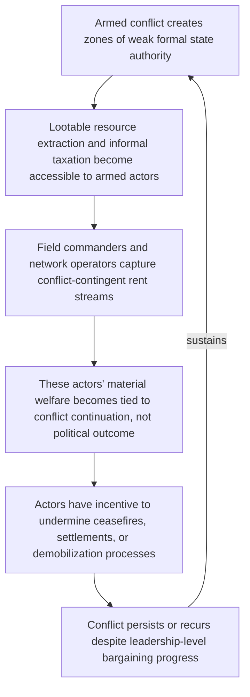

## Patronage Networks and War Economies as Incentive Structures

### Positioning: From Peacetime Patronage to Conflict as a Sustaining Equilibrium

Recall that ethnic patronage functions as a selectorate-narrowing technology under weak universalistic state capacity, generating a self-reinforcing loop in which patronage investment further degrades the institutional capacity that would otherwise compete with it. This item extends that framework into the specific case where the relevant patronage resource is generated *by* ongoing conflict itself, rather than merely distributed through ethnic channels in an otherwise peacetime economy. The analytical shift is significant: where the preceding treatment modeled identity mobilization as an elite strategy for winning or retaining power *despite* the costs of conflict, the war economy literature models active conflict as sometimes materially rational to *sustain*, because specific actors derive a rent stream from war's continuation that a negotiated peace would eliminate.

### The Core Reframing: War as Rational Equilibrium, Not Failed Bargaining

This item requires an explicit conceptual bridge to the bargaining-failure framework covered earlier: Fearon's three mechanisms explain why a mutually preferable settlement is not *reached* despite existing; the war economy literature (most closely associated with Collier and Hoeffler's "greed versus grievance" research program, and subsequently refined) asks a related but distinct question — whether, for specific actors embedded in a war economy, continued conflict may not merely be an unresolved bargaining failure but an actively *preferred* outcome relative to any available peace settlement, because the war itself generates a rent stream unavailable in peacetime. This is a different causal claim from all three rationalist mechanisms: it does not require private information, a commitment problem, or indivisibility to explain non-settlement — it requires only that $U_i(\text{war continuation}) > U_i(\text{best available peace settlement})$ for the specific actor controlling the relevant war-economy rent stream, even where that actor is not the nominal principal (state or rebel leadership) on whose behalf the conflict is formally being fought.

$$\text{War economy actor } i \text{ prefers continuation} \iff R_i(\text{war}) > R_i(\text{peace}) + (\text{transition payoff from settlement})$$

where $R_i(\text{war})$ is actor $i$'s rent stream specifically contingent on the conflict's continuation (control over informal taxation checkpoints, extraction and smuggling of contested natural resources, black-market trade networks enabled by state absence) — a stream that a peace settlement, by restoring formal state authority and market regulation, would typically extinguish or substantially reduce.

### Formal Structure: The Principal-Agent Gap in Conflict Actors

This generates a **principal-agent divergence** within conflict-actor organizations that the state-level bargaining models (which treat states or rebel groups as unitary actors) do not capture: a rebel group's nominal political leadership may have preferences well-approximated by the unitary-actor bargaining model (seeking a negotiated political settlement once war costs exceed expected gains), while field commanders, resource-extraction network operators, or mid-level patronage beneficiaries within the same organization may have individually rational incentives to prolong conflict indefinitely, since their personal rent stream is tied to the war economy's continuation rather than to the organization's stated political objectives.

[Inference] This divergence is the theoretical basis for the widely observed empirical pattern in which peace negotiations succeed in reaching a formal political settlement at the leadership level while violence persists or recurs at the local level, driven by war-economy-dependent actors (commanders controlling lucrative checkpoints or resource-extraction zones) who have a direct material interest in the settlement's failure or in a return to conflict, independent of the nominal political leadership's actual preferences. This reframes "spoiler" behavior (covered formally in peace-process design literature) not merely as ideological rejectionism but as a predictable rent-seeking response by a specific, identifiable actor class within a war economy.

**Spoiler problem**, defined precisely for this context: the risk that an actor with the capacity to disrupt a peace process — whether for ideological reasons or, as emphasized here, for war-economy rent-preservation reasons — will act to undermine implementation even after a formal settlement has been reached by the nominal principal parties.

### Natural Resource Lootability as a Structural Variable

[Inference] The war economy literature (Le Billon's geography-of-resource-wars extension) identifies **resource lootability** — the ease with which a given resource can be extracted, transported, and sold by small, poorly capitalized, and often illicit armed actors without requiring large-scale fixed capital investment or formal market access — as a key variable determining whether a natural resource endowment functions as a war-sustaining incentive structure specifically, as opposed to merely being a general grievance-generating or state-capacity-relevant factor (as in the previous item's rentier-state treatment).

- **Highly lootable resources** (alluvial diamonds, coltan, artisanal gold): extractable by small groups with minimal capital, easily smuggled, difficult to formally regulate or trace — theorized to be strongly associated with prolonged, decentralized, low-intensity conflict sustained by exactly the rent-dependent actor class described above.
- **Non-lootable, high fixed-cost resources** (deep-water oil extraction, large-scale mining requiring substantial capital infrastructure): require centralized control and formal market access to monetize, theorized to concentrate rent capture at the state or centralized-rebel-leadership level rather than dispersing it across a decentralized network of war-economy-dependent field actors, with correspondingly different conflict dynamics (more likely to produce a clean state-capture contest than protracted, decentralized violence).

[Unverified: while this lootability distinction has substantial theoretical grounding and case-study support (Sierra Leone and Angola's contrasting diamond-versus-oil dynamics are frequently cited), the broader "greed versus grievance" empirical program from which it derives has faced significant methodological critique regarding the reliability of cross-national conflict-onset regression evidence, and the lootability mechanism specifically has stronger qualitative than quantitative empirical support.]

### Feedback Structure: The War Economy as a Self-Sustaining Equilibrium

This generates a distinct feedback loop from both the segregation spiral and the ethnic-patronage trap covered previously — here the reinforcement operates through the direct material capture of conflict-contingent rents by an identifiable actor class, rather than through perception, electoral incentive, or general patronage-institutional degradation:

The loop's independence from the political-leadership bargaining track (explicit in nodes D–E) is the key structural feature distinguishing this mechanism from the state-level rationalist models: even a fully successful resolution of the leadership-level commitment, information, or indivisibility problem does not guarantee peace, because this loop can operate entirely independently at the sub-organizational level, requiring its own distinct remedy rather than being automatically resolved by the same interventions that address leadership-level bargaining failure.

### Canonical Empirical Illustrations

[Inference] Sierra Leone's civil war (1991–2002) is the most frequently cited case for the lootable-resource war economy mechanism: alluvial diamond fields provided a decentralized, easily monetized rent stream that is widely credited in the specialist literature with prolonging the conflict and complicating disarmament, since demobilization directly threatened the rent access of field-level RUF commanders and associated trading networks, independent of the movement's stated political grievances. [Unverified: the precise causal weight of diamond-rent incentives versus the movement's original political grievances (documented as significant in the war's early phases) in explaining the conflict's specific multi-year duration is contested, with most specialist accounts treating the two as interacting rather than the resource dimension being a complete explanation on its own.]

[Inference] The Democratic Republic of Congo's protracted eastern conflicts are frequently analyzed through a similar lens, with coltan and other mineral extraction networks cited as sustaining incentive structures for numerous armed groups whose continued relevance and resource access depend on the absence of consolidated state authority in the relevant territories, contributing to the documented difficulty of achieving durable disarmament despite multiple formal peace agreements at the national leadership level.

### Design Implications: What Peace Engineering Targets

Because this mechanism operates at the level of individual and sub-organizational material incentive rather than at the level of unitary-actor political bargaining, remedies target rent-stream disruption and alternative-livelihood provision specifically, distinct from the leadership-level negotiation and verification mechanisms covered elsewhere:

- **Supply-chain certification and resource-tracing regimes**: mechanisms directly analogous to the Kimberley Process for diamonds, designed to reduce the marketability of conflict-linked resources by making their provenance traceable and their sale outside certified channels costly, directly targeting the "easily monetized" component of the lootability variable.
- **Targeted demobilization incentive design accounting for rent-dependent actors specifically**: DDR (disarmament, demobilization, reintegration) programs designed with awareness that field commanders and network operators face a distinct incentive calculus from nominal political leadership require dedicated alternative-livelihood and, where necessary, negotiated buy-out provisions targeted at this specific actor class, rather than assuming a single settlement negotiated with political leadership will be self-implementing at the local level.
- **Spoiler-risk mapping as a required peace-process design input**: formally identifying which specific actors derive conflict-contingent rents, and at what magnitude, prior to settlement design, allows peace-process architects to anticipate which local actors carry the strongest independent incentive to undermine implementation, informing where monitoring, security-sector reform, and reintegration resources should be concentrated.
- **Formal-sector economic alternative provision in resource-extraction zones**: since the underlying condition enabling war-economy capture is the absence of accessible formal-market alternatives for the relevant population, post-conflict economic development targeted specifically at formalizing resource-extraction livelihoods (regulated artisanal mining cooperatives, for instance) addresses the structural precondition rather than only the security-sector symptom.

**Related Topics:**

- Ethnic outbidding and the political economy of identity mobilization
- Collier-Hoeffler "greed versus grievance" empirical research program and its critiques
- The spoiler problem in peace process design and implementation
- Kimberley Process and conflict-resource certification mechanisms
- DDR (disarmament, demobilization, reintegration) sequencing and design