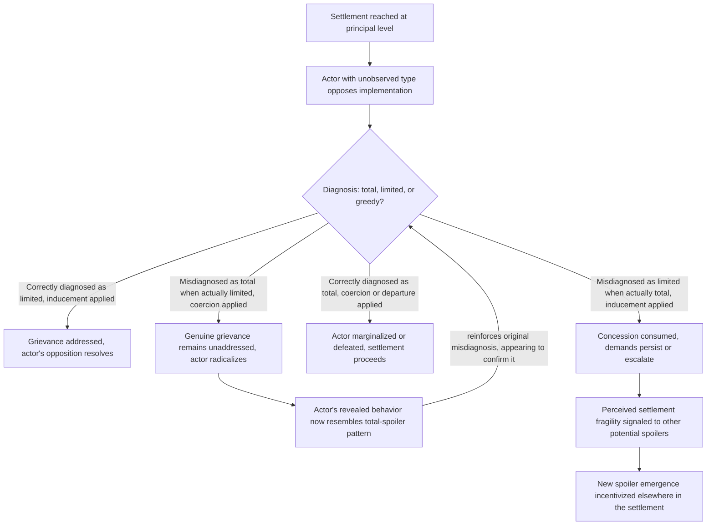

## Spoiler Dynamics and Veto-Player Incentives Against Settlement

### Positioning: Formalizing the Actor Class Introduced Under War Economies

Recall that war-economy rent capture generates a principal-agent divergence in which sub-organizational actors (field commanders, network operators) may rationally prefer conflict continuation even where nominal political leadership prefers settlement, and that this was formally introduced as the **spoiler problem**. This item develops that concept into its full analytical typology and formal incentive structure, drawing on Stephen Stedman's foundational framework, and extends it beyond the war-economy-specific mechanism to cover the complete set of actor types and motivations capable of undermining a negotiated settlement after it has been reached at the principal level.

### Formal Definition and Scope Boundary

**Spoiler**, per Stedman's original formulation: a leader or party who believes the emerging peace threatens their power, worldview, or interests, and who is willing and able to use violence to undermine attempted settlements. The definitional scope boundary is important and frequently blurred in looser usage: a spoiler is specifically an actor operating *after* a peace process has been initiated or a settlement reached, distinguishing spoiler dynamics from the earlier bargaining-failure mechanisms (private information, commitment problems, indivisibility) that explain why a settlement was not reached *in the first place*. Spoiler theory presupposes that principal-level bargaining has succeeded and asks the distinct question of why implementation subsequently fails.

This scope distinction has direct design consequences: interventions addressing bargaining failure (verification regimes, third-party enforcement, side payments) operate on different causal variables than interventions addressing spoiler risk, and treating post-settlement violence as evidence that the original bargaining-failure diagnosis was wrong, rather than as a distinct downstream problem requiring its own remedy, is a documented practical error in peace-process design.

### Stedman's Typology: Position, Not Just Actor Identity

Stedman's typology classifies spoilers along two independent dimensions, generating a structure with direct implications for which remedy is appropriate — a critical departure from treating "spoilers" as a single undifferentiated threat category:

**Dimension one — type, by goal structure:**

1. **Total spoilers**: hold maximalist, non-negotiable goals (total power, complete exclusion of the rival group) that are inherently incompatible with any compromise settlement; no concession within the feasible settlement space can satisfy this actor's stated objectives.
2. **Limited spoilers**: hold goals that are in principle satisfiable through a modified settlement (better terms on a specific issue, greater representation, specific security guarantees) — meaning their opposition is a bargaining position rather than a rejection of the settlement framework itself.
3. **Greedy spoilers**: goals that expand or contract opportunistically based on the perceived costs and risks of pursuing them — formally the most strategically ambiguous type, since their revealed behavior under pressure is diagnostic of which underlying category they actually resemble.

**Dimension two — position, by locus within the settlement process:** whether the actor is an "inside" spoiler (a signatory to the agreement who defects from implementation) or an "outside" spoiler (never party to the agreement, opposing it from outside the negotiated framework) — a distinction with direct implications for available leverage, since inside spoilers can be sanctioned through mechanisms built into the agreement itself (exclusion from power-sharing benefits, reversion clauses) that are unavailable against outside spoilers.

### The Diagnostic Problem: Type Is Often Unobservable Ex Ante

A formally important complication, directly analogous to the private-information problem covered in the crisis-bargaining treatment, is that an actor's true type (total, limited, or greedy) is frequently not observable prior to testing through the settlement-implementation process itself — an actor's *stated* maximalist rhetoric during negotiation does not reliably distinguish a total spoiler from a limited spoiler using extreme rhetoric as a negotiating tactic, nor from a greedy spoiler probing for the limits of what concessions the international community or counterpart will tolerate.

$$\text{Optimal spoiler-management strategy} = f(\text{true type}), \; \text{but type} \; \theta \in \{\text{total, limited, greedy}\} \; \text{is not directly observed}$$

This generates a design problem structurally analogous to the separating-equilibrium logic from costly signaling: since a uniform strategy applied without regard to type risks either wasting resources accommodating an unappeasable total spoiler or needlessly escalating against an accommodable limited spoiler, effective spoiler management requires a strategy capable of *revealing* type through the response to a calibrated test — offering a genuine, meaningful concession and observing whether the actor's demands correspondingly narrow (consistent with limited or satisfied-greedy type) or persist unchanged/escalate (consistent with total type).

### Stedman's Prescriptive Framework: Strategy Matched to Type

The typology's design payoff is a matched-strategy framework, in which mismatched strategy application is the primary predicted failure mode of naive peace-process management:

- **Against total spoilers**: Stedman's framework prescribes a strategy of **departure** or **coercion** — since no settlement modification can satisfy a genuinely maximalist actor, negotiation attempts are predicted to be wasted effort at best and, at worst, to signal exploitable weakness; военный or political marginalization/defeat of the actor is the framework's prescribed response.
- **Against limited spoilers**: **inducement** strategies — genuine, targeted concessions addressing the specific, satisfiable grievance — are prescribed, since the actor's opposition reflects a real, addressable bargaining position rather than rejection of the settlement framework.
- **Against greedy spoilers**: **socialization** strategies — raising the normative, reputational, or material cost of continued spoiling behavior (international monitoring, conditional aid, reputational sanction) — are prescribed, since this actor type's revealed behavior is sensitive to the perceived cost-benefit calculus of continued defection rather than to either principled rejection (total) or a single satisfiable grievance (limited).

[Inference] The core prescriptive risk the typology is designed to flag is applying inducement (concessions) against a total spoiler — predicted to be read as a costly signal of the settlement's fragility, potentially inviting further escalatory demands rather than resolving the underlying opposition — or applying coercion against a limited spoiler, predicted to convert a satisfiable grievance into an entrenched, potentially total-spoiler-equivalent opposition through the escalatory dynamics covered in the costly-signaling and outbidding treatments elsewhere in this framework.

### Feedback Structure: Misdiagnosis as a Type-Conversion Risk

A structurally important dynamic, distinct from Stedman's original static typology, is that the strategy applied can itself *change* an actor's revealed type over time — meaning the diagnostic and prescriptive problems are not independent but interact through a feedback channel:

The loop closing at F is the critical addition: a misdiagnosis that applies coercion to a genuinely limited spoiler can produce a self-confirming radicalization dynamic, where the actor's post-coercion behavior comes to resemble the total-spoiler pattern the misdiagnosis originally (incorrectly) assumed, making retrospective type-attribution from observed behavior alone methodologically unreliable — the actor's *current* behavior may reflect the strategy applied to them rather than their original underlying type.

### Canonical Empirical Illustrations

[Inference] UNITA's role in post-1992 Angola is frequently cited as a case in which an actor initially treated by external mediators as potentially accommodable (limited-spoiler-consistent engagement) subsequently exhibited behavior more consistent with total-spoiler classification (renewed full-scale war following electoral defeat), illustrating the ex ante diagnostic difficulty directly. [Unverified: whether this reflects a genuine total-spoiler type present from the outset that was initially misdiagnosed, or a type-conversion process in which perceived settlement or electoral-process shortcomings triggered escalation from an initially more limited position, is disputed in the specialist literature and not resolved by the observed outcome alone, per the methodological point above.]

[Inference] The Real IRA's emergence as an outside spoiler following the 1998 Good Friday Agreement is frequently analyzed as an illustration of the inside/outside distinction's practical importance: as a non-signatory outside spoiler, the agreement's own internal sanctioning mechanisms (available against inside spoilers who might defect from implementation) provided no direct leverage, requiring a distinct security and socialization response rather than agreement-internal enforcement tools.

### Design Implications: What Peace Engineering Targets

Given the typology's structure and the diagnostic-conversion risk identified above, peace-process design targets both accurate type assessment and strategy sequencing that minimizes misdiagnosis costs:

- **Calibrated concession-testing protocols**: designing initial settlement-implementation steps specifically to reveal type at relatively low cost (small, reversible concessions whose acceptance or rejection is diagnostic) before committing to a full inducement or coercion strategy, directly addressing the ex ante unobservability problem.
- **Inside-spoiler-specific institutional design**: building explicit, agreement-internal sanctioning and incentive mechanisms (conditional power-sharing benefits, reversion clauses triggered by defection) that leverage the inside spoiler's formal party status, reserving external coercive or socialization tools specifically for outside spoilers who lack exposure to agreement-internal leverage.
- **Misdiagnosis-cost-minimizing sequencing**: given the asymmetric risk that coercion against a genuinely limited spoiler can trigger radicalization while inducement against a genuinely total spoiler can signal exploitable fragility, sequencing initial responses toward lower-commitment, more reversible actions before escalating to full coercion or full inducement reduces the cost of an initial misdiagnosis relative to an immediate maximal response.
- **International monitoring and reputational-cost infrastructure for the greedy-spoiler category specifically**: since greedy-spoiler behavior is modeled as directly sensitive to the perceived cost-benefit calculus, sustained international attention, conditional aid linkage, and public monitoring are disproportionately effective against this type relative to total spoilers (for whom such costs are, by definition, insufficient to alter maximalist goals).

**Related Topics:**

- Patronage networks and war economies as incentive structures
- Stedman's original spoiler-management framework and subsequent extensions
- Power-sharing institutional design and inside-spoiler sanctioning mechanisms
- Third-party enforcement and the credibility of post-settlement security guarantees
- Northern Ireland peace process: the Good Friday Agreement and dissident republican dynamics