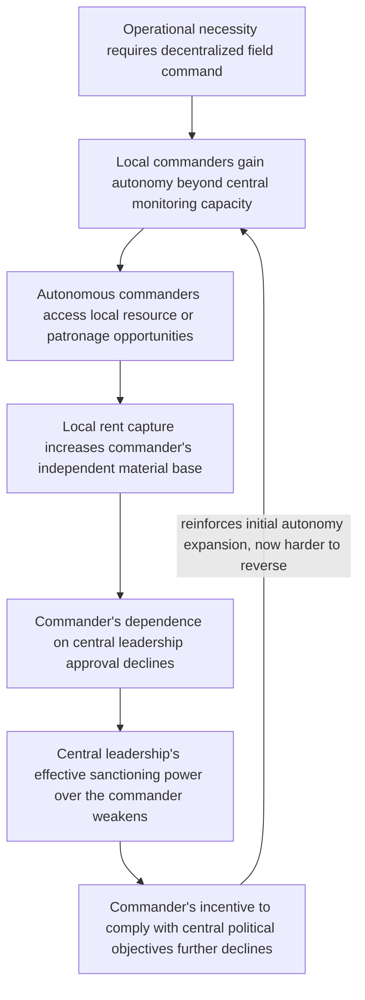

## Principal-Agent Problems in Armed Group Command Structures

### Positioning: Generalizing the Divergence Introduced Under War Economies and Spoilers

Recall that war-economy rent capture was shown to generate a principal-agent divergence between nominal political leadership (whose preferences approximate the unitary-actor bargaining model) and field-level actors whose material welfare is tied to conflict continuation, and that this divergence underlies a specific class of spoiler behavior. This item formalizes that divergence as a general property of armed group command structures, independent of whether a war economy specifically is present — extending principal-agent theory from its economics origins to the distinctive monitoring and enforcement constraints characteristic of clandestine, violence-specialized organizations.

### Formal Setup: Why Armed Groups Are a Hard Case for Principal-Agent Theory

**Principal-agent problem**, defined precisely: a situation in which a principal delegates action to an agent whose interests diverge from the principal's, and whose actions cannot be costlessly and perfectly monitored, such that the agent has both the incentive and the opportunity to pursue their own objectives at the principal's expense. Standard economic treatments of this problem (corporate governance, employment contracts) presume the availability of specific mitigating instruments: formal contracts enforceable by courts, observable performance metrics, external audit, and the option of costless dismissal. Armed group command structures — whether rebel organizations, insurgent networks, or state security forces engaged in irregular operations — are a structurally hard case precisely because most of these standard instruments are unavailable or severely degraded:

- **No external contract enforcement**: an armed group operates outside, or in direct opposition to, formal state legal institutions, so no third party can enforce an internal compensation or conduct agreement between commander and combatant.
- **Severely limited monitoring capacity**: clandestine operational necessity (dispersed units, restricted communication to avoid detection, front-line autonomy requirements) directly conflicts with the centralized observability principal-agent mitigation typically requires.
- **High cost of principal-agent misalignment**: unlike a corporate agency failure (financial loss, reputational damage), armed-group agency failure can manifest as atrocities, indiscipline that alienates the civilian support base the group depends on, or defection with weapons and intelligence to a rival faction or the state.

$$\text{Agency loss} = \mathbb{E}\left[U_{\text{principal}}(\text{agent's actual behavior})\right] - \mathbb{E}\left[U_{\text{principal}}(\text{agent's behavior if perfectly aligned and monitored})\right]$$

The formal claim this item develops is that agency loss in armed groups is structurally larger, and harder to mitigate through standard instruments, than in conventional economic organizations — with direct and severe downstream consequences for both conflict dynamics and, per the spoiler-dynamics treatment, post-settlement implementation.

### The Discipline-Autonomy Trade-off as the Central Design Tension

Armed group leadership faces an unusually acute version of the standard centralization-decentralization trade-off: decentralized, autonomous field command is often operationally necessary (rapid local decision-making under combat conditions where communication with central leadership is unreliable or dangerous), but decentralization directly expands the agency-loss-enabling opportunity space, since local commanders granted operational autonomy simultaneously gain the capacity to divert resources, engage in unauthorized violence, or build independent local rent bases (directly connecting to the war-economy mechanism covered previously) largely outside central leadership's observation.

[Inference] This generates a formal prediction, developed in the civil war micro-dynamics literature (Kalyvas's work on the "logic of violence" and subsequent principal-agent-focused extensions by Weinstein and others): armed groups facing higher operational dispersion requirements (larger territorial control, more diffuse front-line contact, weaker communications infrastructure) should exhibit systematically higher rates of unauthorized or excessive violence against civilians, since decentralization pressure directly expands local commander discretion beyond central leadership's monitoring capacity, independent of central leadership's actual preferences over civilian treatment.

### Recruitment Composition as an Ex Ante Agency-Risk-Shaping Variable

[Inference] Jeremy Weinstein's formal extension of this framework (*Inside Rebellion*) argues that an armed group's *initial resource endowment* at formation shapes its long-run agency-loss profile through its effect on recruitment composition, providing a structural, ex ante explanation for variation in later principal-agent alignment:

- **Resource-rich groups** (access to lootable resources, external state sponsorship) can recruit using material incentives, attracting recruits whose participation is primarily instrumental (opportunistic material gain) rather than ideologically committed — a recruit pool with systematically weaker intrinsic alignment with the organization's stated political objectives, and correspondingly higher baseline agency-loss risk once granted operational autonomy.
- **Resource-poor groups**, unable to offer material incentives, are structurally forced to recruit and retain members through ideological commitment and social investment, screening for a recruit pool with stronger intrinsic goal alignment, predicted to exhibit lower agency loss (less unauthorized violence, less resource diversion) even under comparable monitoring constraints.

$$\text{Baseline agent-principal alignment} = g(\text{recruit selection mechanism}), \; g'(\text{material-incentive-based recruitment}) < g'(\text{ideological-commitment-based recruitment})$$

This is the direct formal link back to the war-economy treatment: resource availability is not merely a rent-stream variable sustaining conflict once underway, but an ex ante determinant of the very agency-alignment structure that later determines how severely that rent stream will be captured by misaligned field-level actors — the two mechanisms are mutually reinforcing rather than independent.

### Feedback Structure: Autonomy, Rent Capture, and Eroding Central Control

This loop is structurally analogous to, and frequently operates in direct combination with, the war-economy feedback loop covered previously (node D here corresponds closely to that mechanism's rent-capture stage), but the causal entry point here is organizational-structural (dispersion-driven autonomy) rather than resource-driven, meaning the two mechanisms can independently initiate the same downstream agency-loss trajectory and are mutually reinforcing where both are present.

### Mitigation Instruments Available to Armed Group Principals

[Inference] Despite the absence of standard economic-organization mitigation tools, the civil-war organizational literature documents several functional substitutes armed group leaderships have employed, each targeting a different node in the loop above:

- **Ideological indoctrination and political education systems**: substituting for external contract enforcement by directly investing in intrinsic goal alignment (raising baseline $g$ in Weinstein's framework) rather than relying on ex post monitoring.
- **Political commissar or parallel-hierarchy structures**: embedding a distinct, centrally loyal monitoring apparatus alongside the operational command hierarchy (a well-documented structural pattern in numerous twentieth-century insurgent and revolutionary organizations), substituting for the external audit function unavailable in a clandestine organization.
- **Rotation policies**: periodically reassigning field commanders across territories specifically to prevent the accumulation of durable local rent bases and patronage networks (directly targeting node D in the loop above), trading off against the loss of local operational knowledge and relationship capital that stable command assignments would otherwise provide.
- **Centralized control of critical resupply (weapons, ammunition)**: maintaining a central chokepoint on a resource local commanders cannot substitute away from, preserving leverage even where local rent capture has otherwise reduced the commander's dependence on central approval for other purposes.

[Speculation] Whether digital-era command-and-control technology (encrypted real-time communication, geolocation tracking of field units) meaningfully expands central monitoring capacity relative to historical armed-group organizational patterns, potentially altering the discipline-autonomy trade-off's underlying parameters, is a plausible but empirically underexplored question given the recency of relevant technology adoption by non-state armed actors.

### Canonical Empirical Illustrations

[Inference] The variation in civilian-treatment records across different rebel factions during the Sierra Leone civil war (contrasted in Weinstein's own comparative analysis) is frequently cited as an illustration of the resource-endowment-recruitment mechanism: factions with greater access to lootable diamond resources are documented as exhibiting patterns more consistent with opportunistic, materially motivated recruitment and correspondingly higher levels of civilian abuse, compared to factions with more constrained resource access. [Unverified: as with the broader war-economy literature, disentangling the causal contribution of resource-driven recruitment selection specifically, as opposed to other concurrent organizational and leadership-culture factors, from case-study evidence alone carries the same methodological limitations noted in the war-economy treatment.]

[Inference] The FARC's internal political-commissar and disciplinary court structures in Colombia are frequently analyzed as a relatively elaborated example of the parallel-hierarchy monitoring substitute, reflecting a deliberate organizational investment in central-control mechanisms partly in response to the discipline-autonomy trade-off inherent in prolonged, territorially dispersed insurgent operations.

### Design Implications: What Peace Engineering Targets

Because agency loss within armed groups directly shapes both wartime civilian harm and post-settlement spoiler risk (per the earlier treatment), interventions here target the specific organizational mechanisms generating misalignment, with direct relevance to negotiation and DDR design:

- **Negotiation-partner assessment incorporating internal command-cohesion analysis**: since a negotiated settlement's durability depends on the principal's actual capacity to bind field-level agents, peace-process design should assess a counterpart organization's internal monitoring and disciplinary capacity as a distinct variable from its stated political preferences, directly informing spoiler-risk assessment at the settlement-design stage rather than only after implementation difficulties emerge.
- **DDR sequencing informed by recruitment-composition analysis**: per Weinstein's framework, reintegration programming can be usefully differentiated between materially-recruited combatants (for whom livelihood and economic reintegration incentives are likely most effective) and ideologically-recruited combatants (for whom political reintegration and reconciliation processes may carry more weight), rather than applying a uniform reintegration package across a heterogeneous combatant population.
- **Support for parallel-monitoring and command-cohesion mechanisms during ceasefire and transition periods**: where a negotiating partner organization's central leadership genuinely seeks to implement a settlement but faces internal agency constraints, targeted support (communications infrastructure, transitional joint monitoring bodies) that strengthens the leadership's actual capacity to enforce compliance among field units directly addresses the mechanism rather than treating implementation failure as evidence of leadership bad faith.
- **Resource-flow interdiction as an agency-loss-reduction tool, not only a war-economy tool**: measures reducing field-level commanders' access to independent resource streams (per the war-economy remedies) serve a dual function identified in this item specifically — reducing both war-sustaining rent capture and the erosion of central command's disciplinary leverage over field units.

**Related Topics:**

- Patronage networks and war economies as incentive structures
- Spoiler dynamics and veto-player incentives against settlement
- Weinstein's resource-recruitment framework (*Inside Rebellion*) and comparative rebel governance
- Kalyvas's logic of violence and the micro-dynamics of civil war
- DDR (disarmament, demobilization, reintegration) sequencing and design