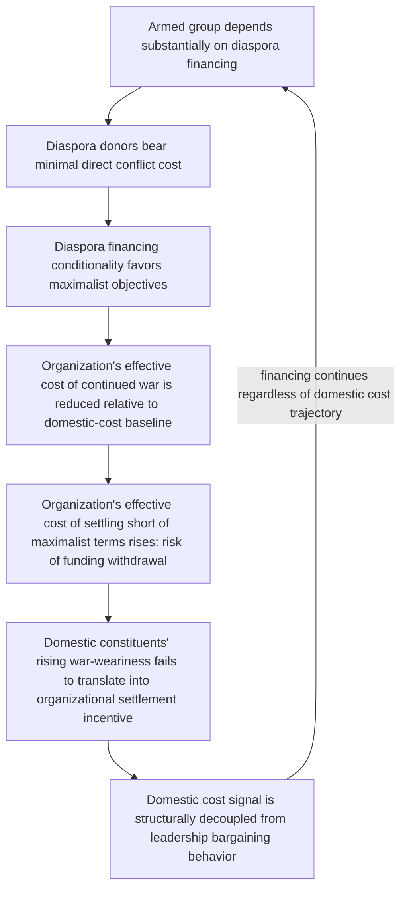

## Diaspora Financing and External Incentive Distortion

### Positioning: Adding an External Principal to the Agency Structure

Recall that armed group command structures exhibit principal-agent divergence between central leadership and field-level agents, and that resource endowment at formation shapes recruitment composition and downstream agency-alignment risk. This item introduces a further structural complication: where a conflict actor's resource base derives substantially from an externally located diaspora population rather than from domestic constituents or battlefield-adjacent extraction, an *additional* principal enters the incentive structure — one whose preferences, risk exposure, and information set can diverge systematically from those of the domestic constituency the armed group nominally represents, and whose financial leverage can distort the group's strategic behavior independent of, and sometimes contrary to, domestic conflict-resolution incentives.

### Formal Setup: Diaspora as a Distinct, Risk-Insulated Principal

**Diaspora financing**, in the conflict-economy sense: sustained financial, material, or political support for an armed group or conflict-linked political movement, sourced from a population sharing ethnic, national, or ideological identification with the group but residing outside the conflict zone, typically in a substantially wealthier and physically secure jurisdiction.

The formally load-bearing feature distinguishing diaspora financing from other war-economy revenue sources (covered in the earlier lootable-resource treatment) is a specific asymmetry in cost exposure: a diaspora donor bears none of the direct physical costs of continued conflict (displacement, casualties, destroyed livelihoods) that domestic constituents and combatants bear, while retaining a claim on the conflict's political or symbolic outcome. This generates a formal divergence in the cost term of each principal's utility function over conflict continuation:

$$U_{\text{domestic}}(\text{war continuation}) = B(\text{political outcome}) - C_{\text{domestic}}(\text{casualties, displacement, destruction})$$

$$U_{\text{diaspora}}(\text{war continuation}) = B(\text{political/symbolic outcome}) - C_{\text{diaspora}}(\approx 0)$$

Where $C_{\text{diaspora}} \ll C_{\text{domestic}}$, diaspora donors are structurally predicted to have a systematically higher tolerance for continued conflict than the domestic population bearing its costs directly, holding constant the valuation both place on the political outcome $B$ itself — this is a pure cost-exposure asymmetry, not a claim that diaspora communities value the political outcome differently or "more" than domestic populations, and the formal distinction matters for avoiding a common but imprecise characterization of diaspora influence as simply reflecting greater commitment or hardline preference.

### The Incentive-Distortion Channel: Financing Conditionality and Bargaining Range Effects

Recall the bargaining-range model: a settlement is reached when a mutually acceptable point exists within $[p - c_A, p + c_B]$, where $c$ terms represent the cost of continued fighting to each side. Where an armed group's financial sustainability depends substantially on diaspora contributions, and those contributions are implicitly or explicitly conditional on continued pursuit of maximalist objectives (a pattern documented in several diaspora-financed conflicts), the group's effective cost-of-continuing-war term is altered: the marginal cost of continued conflict to the *organization* is reduced (financing continues regardless of battlefield conditions, unlike domestically-extracted resources whose availability may correlate with territorial control and thus battlefield success), while the marginal cost of *settling* is increased (a settlement perceived by diaspora donors as insufficiently maximalist risks the withdrawal of financial support the organization has come to depend on).

$$\text{Effective } c_{\text{organization}}(\text{continue war}) \downarrow, \quad \text{Effective cost}(\text{settle short of diaspora-preferred terms}) \uparrow$$

This shifts the organization's revealed bargaining position away from what its cost structure would predict absent diaspora financing, potentially narrowing or eliminating an otherwise-locatable settlement point — a mechanism structurally distinct from, but functionally analogous to, the war-economy rent-capture mechanism covered earlier: both operate by altering an actor's effective cost-of-peace calculus, but diaspora financing operates through external conditional funding rather than through internal battlefield-contingent extraction, and consequently is not disrupted by the supply-chain and resource-tracing interventions that target lootable-resource war economies.

### The Principal-Agent Extension: Diaspora as a Distant, Poorly Monitored Principal

This mechanism compounds the armed-group agency problem covered in the previous item along a further dimension: where central leadership's own political calculus is shaped by dependence on diaspora financing, leadership itself may face reduced incentive to settle even where such leadership's domestic-facing preferences would otherwise approximate the accommodating, cost-sensitive unitary actor of the standard bargaining model. This is distinct from the field-commander agency-loss mechanism (which concerns *sub-organizational* divergence from a settlement-seeking leadership); here the distortion can operate at the leadership level itself, meaning it is not resolved by the parallel-hierarchy or rotation-policy mitigations discussed previously, which address internal command monitoring rather than external donor-conditionality effects on leadership's own preferences.

[Inference] A further complicating layer, documented in the diaspora-conflict-financing literature (Collier's extensions of the greed-grievance framework, and subsequent case-specific work on the Tamil, Irish republican, and various post-Yugoslav diaspora cases), is generational and time-distance heterogeneity within diaspora populations themselves: diaspora members with more recent, direct conflict exposure (first-generation, recently displaced) are theorized to weight the domestic humanitarian cost term more heavily than second- or third-generation diaspora members whose identification with the conflict is comparatively more symbolic or historically inherited, predicting that a diaspora population's aggregate financing conditionality should shift toward greater conflict-tolerance as generational distance from direct experience increases.

### Feedback Structure: External Financing Insulating the Organization from Domestic Cost-Signaling

Node G is the structurally distinctive feature: in the standard unitary-actor bargaining model, rising domestic war costs $c$ directly and mechanically shift an actor's settlement calculus toward acceptance. Diaspora financing introduces a channel by which this domestic cost-signal-to-bargaining-behavior link can be substantially weakened or severed, since the organization's actual financial and political survival becomes decreasingly contingent on domestic cost tolerance specifically — a mechanism with no clean analog in the baseline state-level bargaining framework, which implicitly assumes a single, cost-bearing principal.

### Canonical Empirical Illustrations

[Inference] The Liberation Tigers of Tamil Eelam's (LTTE) financing network among the global Tamil diaspora, particularly in Western Europe, Canada, and Australia, is frequently cited in the specialist literature as a well-documented case of sustained external financing correlating with the organization's protracted pursuit of a maximalist, non-negotiated outcome across multiple failed peace processes, with some accounts attributing part of the group's resistance to compromise settlements to diaspora-donor preferences diverging from war-weary domestic Tamil constituency sentiment in later conflict phases. [Unverified: as with other conflict-economy causal claims, disentangling the specific causal contribution of diaspora-financing conditionality from the LTTE's independently documented organizational ideology and leadership structure is not fully resolved in the historical record, and most careful accounts treat diaspora financing as one contributing factor among several rather than a sufficient standalone explanation for the conflict's trajectory.]

[Inference] Irish republican movement financing from segments of the Irish-American diaspora during the Troubles is similarly documented in the historical literature, though [Unverified] the relative influence of diaspora financing versus other factors on the specific timing and terms of the eventual Good Friday Agreement settlement is a matter of ongoing historical assessment rather than settled consensus.

### Design Implications: What Peace Engineering Targets

Because this mechanism operates through an external, minimally-monitorable financial relationship rather than through domestic battlefield or governance dynamics, remedies target diaspora engagement and financial-flow transparency specifically, distinct from both the domestic war-economy and internal command-structure interventions covered previously:

- **Direct diaspora engagement in peace-process design**: given the documented preference divergence between diaspora and domestic constituencies, including diaspora community representatives as a distinct stakeholder category in negotiation and reconciliation processes — rather than treating the domestic conflict actors as the sole relevant constituency — can surface and potentially narrow this divergence directly rather than leaving it as an unaddressed external distortion.
- **Financial flow transparency and regulatory cooperation with diaspora-hosting states**: since diaspora financing typically transits through the formal or informal financial systems of the (usually stable, rule-of-law) states where diaspora communities reside, targeted regulatory cooperation with those host states can increase the transparency and traceability of conflict-linked financial flows in a manner unavailable for battlefield-adjacent lootable-resource financing.
- **Diaspora-targeted communication and de-escalation messaging**: recognizing that generational and time-distance heterogeneity within diaspora populations may create an underexploited constituency of diaspora members more open to negotiated outcomes, targeted engagement (rather than treating diaspora opinion as monolithically maximalist) may identify leverage points for shifting aggregate diaspora financing conditionality over time.
- **Leadership-level dependency diversification support**: where feasible, supporting an armed or political movement's transition toward more diversified, less donor-conditional revenue sources (formal political party financing, legitimate economic activity) as part of a broader settlement package can reduce leadership's structural dependence on maximalist-conditioned diaspora financing, restoring closer alignment between leadership's bargaining behavior and actual domestic cost conditions.

**Related Topics:**

- Patronage networks and war economies as incentive structures
- Principal-agent problems in armed group command structures
- Collier's extended greed-grievance framework and external conflict financing
- Diaspora political engagement in post-conflict reconciliation design
- Financial regulatory cooperation as a conflict-resource interdiction tool