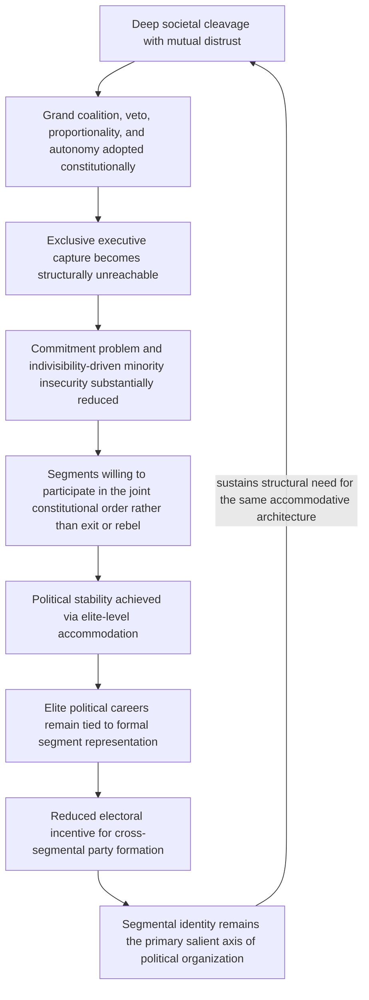

## Lijphart's Consociational Power-Sharing and Grand Coalition Design

### Positioning: From Diagnosing Failure Modes to Prescribing Institutional Architecture

The preceding chapters established a diagnostic inventory of why bargaining fails (private information, commitment problems, indivisibility), why perception and identity dynamics escalate conflict (security dilemma sensitivity, outbidding, dehumanization), and why incentive structures sustain it (war economies, principal-agent divergence, diaspora distortion). This chapter shifts from diagnosis to institutional design: consociationalism is the most extensively developed and empirically tested constitutional framework explicitly engineered to make durable peace an equilibrium outcome in societies divided along deep, persistent identity cleavages, and Lijphart's formulation is its canonical statement.

### Formal Definition and the Four Structural Pillars

**Consociationalism**, per Lijphart's original 1969 formulation and subsequent elaboration: a form of democratic governance for deeply divided societies built on power-sharing rather than majoritarian competition, resting on four structural pillars, each engineered to close off a specific failure mode identified elsewhere in this framework.

1. **Grand coalition government**: political leaders of all significant segments of a divided society jointly govern in an executive coalition, rather than a winning majority governing while excluding minority segments. This directly targets the commitment problem covered earlier: recall that a government cannot credibly commit to protect a minority's interests once a majority controls exclusive executive power, since post-election incentives to renege on pre-election promises rise once electoral leverage is spent. Grand coalition removes the "exclusive executive capture" outcome from the feasible action space entirely, converting the credible-commitment problem from one requiring an external enforcer into one addressed by structural design of the executive itself.
2. **Segmental (mutual) veto**: each major segment holds a formal veto over decisions affecting its vital interests, beyond simple grand-coalition participation. This directly targets the indivisibility-adjacent identity-security concern covered in the identity-mobilization treatment: where a segment's core interests are subject to a value function with discontinuities at less-than-full protection (the identity-goods discontinuity formalized earlier), a simple majority-rules grand coalition still leaves the minority segment exposed to being outvoted on precisely its most vital concerns. The mutual veto closes this specific residual exposure.
3. **Proportionality**: representation in the legislature, civil service, security forces, and resource allocation is apportioned according to each segment's population share (or, in some variants, through negotiated formulas), rather than through majoritarian winner-take-all allocation. This directly targets the selectorate-narrowing patronage mechanism covered in the political-economy treatment: by constitutionally guaranteeing each segment access to state resources and positions independent of electoral outcome, proportionality reduces the marginal payoff to capturing exclusive control of the state apparatus that the earlier ethnic-patronage model identified as a driver of identity mobilization.
4. **Segmental autonomy**: each segment retains self-governing authority over matters of exclusively internal concern (education, religious affairs, certain cultural and administrative matters), reducing the surface area of issues requiring cross-segmental negotiation at all. This is a direct application of the functional-unbundling remedy proposed in the issue-indivisibility treatment: converting a single, high-stakes, all-or-nothing sovereignty contest into multiple, more narrowly-scoped decision domains, several of which can be allocated exclusively to a single segment without requiring a joint bargaining solution at all.

### Formal Logic: Why Grand Coalition Solves the Commitment Problem Structurally, Not Contractually

Recall from Fearon's model that a settlement is unstable when the party controlling future power has no external enforcer binding its future concessions. Grand coalition's design logic is distinct from an external-enforcer solution (third-party guarantees, discussed in the commitment-problem treatment): instead of relying on an outside party to punish reneging, grand coalition eliminates the very state in which reneging is structurally possible, by making exclusive executive control an outcome that cannot arise under the electoral and constitutional rules themselves — the credible commitment is embedded in the rules determining who can hold executive power at all, not in a promise made by whoever currently holds it.

$$\text{Standard commitment problem: no settlement } x^* \text{ stable against a future majority's incentive to renege}$$

$$\text{Grand coalition solution: constitutional rule eliminates "future exclusive majority control" as a reachable state, so no reneging opportunity arises}$$

This is the theoretically important distinction from ordinary majoritarian power-sharing agreements (a temporary coalition formed for electoral convenience): consociational grand coalition is prescribed as a *permanent constitutional feature*, not a contingent political arrangement subject to renegotiation once electoral incentives shift — its stability derives from being embedded in the rules of the game rather than being itself a move within the game.

### The Central Design Tension: Elite Accommodation Versus Democratic Contestation

[Inference] The most substantial and enduring critique of consociational design, developed extensively by Donald Horowitz and subsequently by proponents of "centripetalist" alternatives, targets a structural tension inherent in the model: by guaranteeing each segment's elites a share of power independent of ordinary electoral competition (proportionality) and a veto over policy (segmental veto), consociational design simultaneously reduces the electoral incentive for cross-segmental political competition and, per the outbidding mechanism developed earlier, may *entrench* rather than dissolve identity as the primary organizing axis of political competition, since a politician's electoral security depends on maintaining recognized status as a segment's representative rather than on building cross-segmental coalitions.

$$\text{Consociational proportionality} \implies \text{electoral security tied to segment representation} \implies \text{reduced incentive for cross-segmental party formation}$$

This directly connects to, and complicates, the ethnic-outbidding treatment: recall that vote-pooling electoral design was proposed as a remedy for outbidding specifically by rewarding cross-segmental moderate appeal. Consociationalism's segmental-representation logic operates in the *opposite* direction from vote-pooling at the level of electoral incentive structure, even as it directly addresses the commitment, indivisibility, and patronage-related failure modes through non-electoral institutional channels. This is not a decisive objection to consociational design, but it establishes a genuine and unresolved design trade-off: consociational institutions may durably prevent majoritarian exclusion and executive capture while doing comparatively little to reduce, and potentially reinforcing, the underlying identity-salience dynamics that outbidding theory identifies as electorally self-perpetuating.

### Feedback Structure: Consociational Stability Versus Its Entrenchment Risk

The loop's closure at I represents the entrenchment critique formally: the very institutional architecture that successfully closes off exclusionary and commitment-related failure modes may simultaneously perpetuate the identity-salience conditions that necessitated the architecture in the first place, distinguishing consociational stability (successfully avoiding majoritarian capture and violent conflict) from consociational *transformation* (progressively reducing the political salience of the original cleavage over time) as two distinct and potentially divergent success criteria.

### Canonical Empirical Illustrations

[Inference] The Netherlands, Belgium, Switzerland, and Austria constitute Lijphart's original consociational case set, generally regarded in the comparative politics literature as durable, stable examples, though [Inference] several of these cases (particularly the Netherlands) are frequently noted to have undergone substantial "depillarization" over subsequent decades — a gradual decline in the salience of the original religious-secular cleavage that motivated consociational design — which some scholars read as evidence against the entrenchment critique (suggesting successful transformation can occur) and others read as reflecting the specific, comparatively lower-stakes nature of the original Dutch cleavage relative to more violently divided post-conflict cases.

Bosnia-Herzegovina's post-Dayton constitutional structure and Lebanon's confessional power-sharing system are frequently cited as harder-case applications of consociational design to societies emerging from or containing active violent conflict, with substantially more contested assessments in the specialist literature: [Unverified] whether either case demonstrates consociational design's capacity to produce durable peace in genuinely post-conflict, high-cleavage-salience conditions, or instead illustrates the entrenchment critique's practical force (persistent ethnic/confessional political stagnation, documented governance dysfunction attributed by some analysts to the veto architecture itself), remains a live and substantively unresolved debate rather than a settled empirical finding.

### Design Implications: What Peace Engineering Targets

Consociational design's own internal logic generates specific implementation-level design choices, and the entrenchment critique generates a corresponding set of design considerations for mitigating its risk:

- **Constitutional entrenchment of the four pillars specifically, rather than ordinary legislative coalition arrangements**: per the structural (not contractual) logic of the commitment-problem solution, durability requires the arrangement to be embedded at a level of legal difficulty-to-amend that approximates removing exclusive-capture states from the game's rule set, rather than a revisable ordinary-majority coalition agreement.
- **Explicit veto-scope limitation to genuinely vital-interest matters**: since an overly broad veto risks governance paralysis (a documented critique of both the Bosnian and, in some analyses, the Lebanese systems), design should specify vital-interest veto scope narrowly enough to preserve governmental functionality while still closing the discontinuous-value-function exposure identified in the indivisibility treatment.
- **Sunset or review provisions assessing continued necessity of segmental architecture**: given the entrenchment critique, some contemporary consociational designs incorporate periodic constitutional review mechanisms intended to assess whether cleavage salience has declined sufficiently to permit gradual transition toward less segmentally-structured institutions, attempting to combine initial stability with a pathway toward the transformation outcome the entrenchment critique warns against foreclosing.
- **Complementary investment in cross-segmental civil society and contact infrastructure**: recognizing that consociational elite-level accommodation does not by itself generate the mass-level trust and bridging capital covered in the earlier social-capital and contact-theory treatments, durable peace-engineering design typically pairs consociational constitutional architecture with parallel, non-constitutional investment in cross-segmental civic and economic integration.

**Related Topics:**

- Horowitz's centripetalist critique and vote-pooling electoral design alternatives
- Fearon's commitment problem model of credible commitment failure
- Issue indivisibility and its effect on negotiated settlement space
- Ethnic outbidding and the political economy of identity mobilization
- Bosnia-Herzegovina's Dayton constitutional structure: governance outcomes assessment