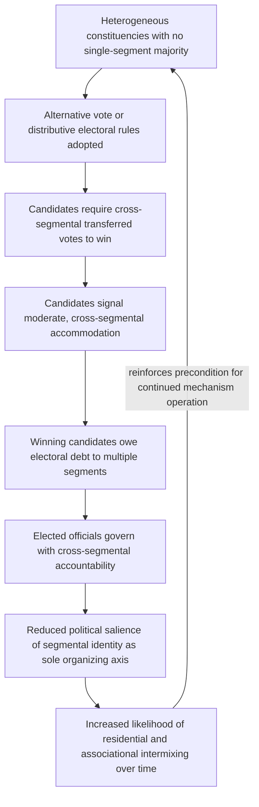

## Horowitz's Centripetalism and Integrative Institutional Incentives

### Positioning: The Direct Institutional Counter-Proposal

Recall the entrenchment critique concluding the previous item: consociational proportionality and segmental veto architecture, while structurally closing the commitment and indivisibility failure modes, may simultaneously remove the electoral incentive for cross-segmental party formation, potentially perpetuating rather than dissolving cleavage salience over time. Horowitz's centripetalism is not a refinement of consociationalism but a rival design paradigm built on the opposite premise: rather than accommodating and formally recognizing segmental identity within governing institutions, centripetal design aims to engineer electoral incentives that reward politicians for building moderate, cross-segmental coalitions, thereby reducing the political salience of the original cleavage as a direct consequence of the incentive structure itself, rather than relying on gradually declining salience as a hoped-for byproduct of elite accommodation.

### The Core Design Premise: Engineering Incentives, Not Accommodating Segments

**Centripetalism**, per Horowitz's formulation: an institutional design approach for divided societies that seeks to create electoral and political incentives for accommodation and moderation across group lines, by making politicians electorally dependent on securing support from multiple segments rather than from a single segment alone — in direct contrast to consociationalism's strategy of guaranteeing each segment representation and veto power independent of cross-segmental appeal.

The formal premise directly inverts the causal direction assumed in much of the constructivist identity-mobilization literature covered earlier: where the ethnic-outbidding and identity-entrepreneurship treatments established that electoral systems rewarding single-segment appeal generate a ratchet toward hardline positioning, centripetalism's design logic is that reversing the electoral reward structure — making votes from *multiple* segments a necessary condition for electoral victory — should reverse the ratchet's direction, rewarding moderate, cross-segmental positioning instead.

$$\text{Consociational logic:} \quad \text{electoral security} \perp \text{cross-segmental appeal} \quad (\text{achieved via guaranteed proportional representation})$$

$$\text{Centripetal logic:} \quad \text{electoral security} \; \text{requires} \; \text{cross-segmental appeal} \quad (\text{achieved via electoral system design})$$

### The Primary Instrument: The Alternative Vote and Vote-Pooling

The centerpiece mechanism, drawing directly on the vote-pooling remedy proposed in the ethnic-outbidding treatment, is the **alternative vote** (AV, also called instant-runoff voting) deployed in ethnically heterogeneous, geographically mixed constituencies: voters rank candidates in order of preference, and if no candidate achieves a majority of first-preference votes, lower-ranked candidates are eliminated sequentially and their votes redistributed according to voters' next preferences until a majority winner emerges.

The formal mechanism by which this rewards moderation: in a constituency with no single-segment majority, a candidate cannot win on first-preference votes from their own segment alone and must secure second- or third-preference votes from voters primarily identifying with other segments to reach a majority. This creates a direct electoral incentive for **vote pooling**: candidates must credibly signal accommodation toward out-group voters specifically to be ranked highly enough on their ballots to receive transferred votes, converting cross-segmental appeal from an electoral liability (under simple plurality rules rewarding pure base mobilization) into a electoral necessity.

$$P(\text{candidate } i \text{ wins}) = f(\text{first-preference votes from own segment}, \; \text{transferred votes from other segments' ballots})$$

$$\frac{\partial f}{\partial(\text{cross-segmental accommodation signaling})} > 0 \; \text{specifically in heterogeneous, no-majority-segment constituencies}$$

This directly reverses the sign of the outbidding mechanism's key derivative established earlier ($\partial(\text{vote share})/\partial \phi_i > 0$ for hardline positioning under simple plurality with a captive single-segment electorate): under AV in a heterogeneous constituency, the same derivative is predicted to become negative, since hardline positioning forecloses the transferred votes necessary for a majority.

### Scope Condition: Geographic and Demographic Preconditions

[Inference] The mechanism's formal logic depends critically on a structural precondition frequently underemphasized in advocacy for AV adoption: vote pooling requires *genuinely heterogeneous constituencies* — geographic areas where no single segment holds an outright majority of the electorate — since in a homogeneous single-segment constituency, AV degenerates to ordinary intra-segment preference aggregation with no cross-segmental incentive generated at all. This generates a direct dependency on demographic geography that is exogenous to the electoral system design itself: centripetalism's mechanism is inoperative, or operative only in a minority of constituencies, in societies where segments are residentially concentrated and geographically segregated rather than intermixed — precisely the demographic pattern the segregation-spiral mechanism (bonding capital rising, bridging capital falling under threat) predicts conflict itself tends to produce over time.

[Unverified: this creates a potentially significant implementation timing problem not fully resolved in the comparative-design literature — centripetal electoral engineering may be most needed, and least mechanically effective, in exactly the post-conflict contexts where prior violence has already driven the demographic sorting that undermines the heterogeneous-constituency precondition, though the size and generality of this effect across cases has not been systematically quantified.]

### Complementary Instruments Beyond the Alternative Vote

[Inference] Horowitz's broader centripetalist toolkit extends beyond AV to a wider set of integrative mechanisms, each targeting the same underlying incentive-reversal logic through a different institutional channel:

- **Federalism with cross-cutting boundaries**: deliberately drawing sub-national administrative boundaries that do not align with segmental settlement patterns, ensuring that most sub-national units contain heterogeneous populations requiring cross-segmental coalition-building even at the regional level, rather than creating ethnically homogeneous federal units (a design choice directly opposed to some federal designs, including some aspects of the segmental-autonomy pillar of consociationalism).
- **Distributive requirements for presidential election**: requiring a presidential candidate to secure a specified minimum vote share across multiple, geographically and demographically distinct regions (rather than a simple national plurality) as a condition of election, directly incentivizing multi-regional and thus typically multi-segmental campaign coalition-building — a mechanism with documented application in Nigeria's presidential election rules.
- **Party-aggregation incentives**: electoral or campaign-finance rules that reward or require political parties to demonstrate multi-segmental membership or leadership composition as a condition of registration or ballot access, directly targeting party-formation incentives rather than only individual-candidate incentives.

### Feedback Structure: The Intended Virtuous Cycle and Its Fragility

The loop's dependency on entry-condition A is the mechanism's central fragility, mirrored in reverse by node H's optimistic assumption: while the model predicts a virtuous cycle in which centripetal incentives reduce segmental salience and thereby increase heterogeneity over time (reinforcing the mechanism's own preconditions), this reinforcement direction is asserted rather than as rigorously established in the empirical literature as the initial incentive-reversal logic itself, and the alternative, less optimistic possibility — that demographic segregation, once established through prior conflict, proves sticky regardless of electoral incentive redesign — remains a live and empirically contested alternative.

### Canonical Empirical Illustrations

[Inference] Papua New Guinea's adoption of the Limited Preferential Vote (an AV variant) in 2007 is frequently cited in the comparative literature as a direct test of the vote-pooling mechanism in a highly fragmented, multi-ethnic political landscape, with some post-adoption analyses reporting increased cross-ethnic campaign coalition behavior consistent with the theory's predictions. [Unverified: the broader literature evaluating AV's real-world moderating effects across the small number of cases where it has been substantially implemented for this purpose (Papua New Guinea, Fiji's earlier AV experience, Sri Lanka's presidential distributive-requirement system) shows mixed and contested results, with critics arguing implementation contexts have rarely provided a clean test of the mechanism in isolation from confounding factors, and the overall empirical base remains considerably thinner than the extensive comparative case literature available for consociational arrangements.]

Nigeria's distributive presidential election requirement (mandating a minimum vote share across a specified number of states in addition to a plurality) is frequently analyzed as a longer-standing test of the distributive-incentive mechanism specifically, [Inference] with general scholarly assessment crediting the rule with contributing to multi-regional campaign coalition patterns in Nigerian presidential politics, though disentangling this specific institutional effect from Nigeria's broader federal character and revenue-sharing arrangements (covered in the earlier political-economy treatment) is not fully resolved.

### Design Implications: What Peace Engineering Targets

Because centripetalism's mechanism depends on specific, verifiable demographic and geographic preconditions rather than operating unconditionally, peace-engineering application requires precondition assessment prior to electoral-system selection, and can be usefully combined with, rather than treated as strictly exclusive of, consociational elements:

- **Demographic heterogeneity mapping prior to electoral system design**: assessing the actual distribution of segment populations across proposed constituency or federal-unit boundaries before adopting AV or distributive-requirement mechanisms, since the mechanism's core logic is inoperative in homogeneous-constituency contexts, directly addressing the scope-condition limitation identified above.
- **Deliberate cross-cutting boundary design where demographic conditions allow**: in federal or constituency-boundary design processes, actively drawing boundaries to maximize heterogeneity where underlying settlement patterns permit, rather than defaulting to boundaries that track existing segmental geography.
- **Hybrid consociational-centripetal architecture**: given that the two paradigms target different failure modes (consociational elements addressing commitment and indivisibility problems at the elite/constitutional level; centripetal elements addressing outbidding-driven electoral incentive structures), several contemporary constitutional designs (Northern Ireland's evolving arrangements are sometimes analyzed in this light) combine elements of both rather than treating them as strictly exclusive design philosophies, though the theoretical compatibility and practical interaction effects of combining them remain an active area of design debate rather than a fully resolved synthesis.
- **Sequencing consideration in post-conflict settings with high residential segregation**: given the identified timing problem (centripetal mechanisms may be least mechanically effective exactly where post-conflict segregation is highest), design sequencing might prioritize consociational stabilization mechanisms in the immediate post-conflict period, with potential transition toward centripetal electoral incentives introduced later as residential and associational intermixing (itself potentially supported by the contact-theory and social-capital interventions covered earlier) increases.

**Related Topics:**

- Lijphart's consociational power-sharing and grand coalition design
- Ethnic outbidding and the political economy of identity mobilization
- Federal boundary design and cross-cutting cleavage engineering
- Comparative electoral system reform in Papua New Guinea, Fiji, and Nigeria
- Putnam's social capital framework and its erosion under conflict exposure