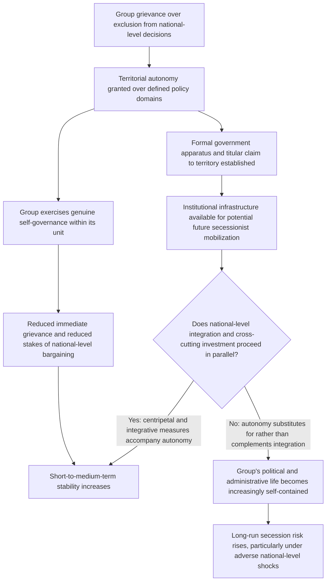

## Federalism, Territorial Autonomy, and Self-Governance Arrangements

### Positioning: The Territorial Dimension of Institutional Design

The two preceding items established a design tension between consociationalism (accommodating segmental identity through guaranteed proportional representation and veto rights) and centripetalism (engineering electoral incentives for cross-segmental moderation). Both, as presented, primarily concerned national-level executive and electoral institutions. This item addresses the territorial dimension: how the allocation of governing authority across geographic levels — federal versus unitary structure, the boundaries of sub-national units, and the scope of devolved self-governance — functions as a distinct but interacting institutional lever, directly operationalizing the segmental-autonomy pillar from consociational design while simultaneously creating the boundary-drawing choices that determine whether centripetal cross-cutting incentives can operate at all.

### Formal Definition and the Core Design Trade-off

**Territorial autonomy**, defined for this context: the constitutional or statutory devolution of governing authority over a defined set of policy domains to a sub-national unit whose boundaries and, in the ethnofederal case, demographic composition are explicitly linked to a group's geographic concentration, allowing that group self-governing control over specified matters without requiring negotiated consensus at the national level.

The central formal trade-off, directly connecting to the unbundling logic introduced in the issue-indivisibility treatment: federalism converts a single, high-stakes national sovereignty contest into multiple, lower-stakes sub-national decision domains, reducing the surface area of any single all-or-nothing bargaining failure. But this risk-reduction benefit is not free — it is purchased at the cost of *formally recognizing and often reinforcing* the group boundary along which autonomy is granted, generating a direct structural tension with the centripetal objective of reducing segmental salience through cross-cutting institutional design.

$$\text{Unbundling benefit: reduces stakes of any single national-level distributive contest}$$

$$\text{Entrenchment cost: formal territorial recognition of group boundary may increase, not decrease, its long-run political salience}$$

### Ethnofederalism Versus Non-Ethnic Federalism: A Critical Formal Distinction

The literature distinguishes sharply between two structurally different federal designs with divergent predicted effects, a distinction with direct bearing on which failure mode each variant addresses and which risk each variant amplifies:

- **Ethnofederalism** (sub-national units drawn to correspond to, and often named after, specific ethnic or identity groups — e.g., the former Soviet and Yugoslav federal systems, contemporary Ethiopia): directly operationalizes the segmental-autonomy pillar and can provide strong, credible protection against majoritarian domination of a minority's core cultural and administrative concerns. [Inference] However, a substantial body of comparative-federalism literature (associated with scholars including Philip Roeder and Henry Hale) argues ethnofederal design carries a distinct structural risk not present in non-ethnic federal designs: by creating a sub-national unit with its own government, institutions, and (often) titular group with a formally recognized claim to that territory, ethnofederalism supplies a ready-made institutional and administrative infrastructure — an existing government apparatus, a defined territory, an internationally legible claim to a "homeland" — that can be directly repurposed for secessionist mobilization, a pathway unavailable to a group without a pre-existing formal territorial-administrative unit to build from.

$$\text{Ethnofederal secession risk} = f(\text{institutional infrastructure available for repurposing}, \; \text{titular group's grievance level})$$

[Unverified: whether ethnofederalism causally *increases* secession risk relative to a counterfactual non-federal or non-ethnic-federal arrangement, or whether ethnofederal design is simply more frequently *adopted* in cases with pre-existing separatist pressure (a selection effect rather than a treatment effect), is a genuinely contested identification problem in the empirical federalism literature, with the Soviet and Yugoslav collapse cases serving as the primary, and much-debated, evidentiary basis for the causal claim.]

- **Non-ethnic (or deliberately cross-cutting) federalism**: sub-national boundaries drawn to maximize demographic heterogeneity within each unit, directly serving the centripetal objective of requiring cross-segmental coalition-building even at the regional level (per the federalism instrument noted in the centripetalism treatment), at the cost of providing weaker direct institutional protection for any single group's distinct cultural or administrative concerns, since no sub-national unit is exclusively or predominantly controlled by any one segment.

### The Boundary-Drawing Problem as a Direct Application of Bargaining-Failure Mechanisms

Federal boundary design is itself frequently subject to exactly the bargaining-failure mechanisms established earlier in this framework, since boundary placement is a distributive decision with its own winners and losers: a boundary drawn to include a valuable resource, a strategically significant location, or a religiously or historically significant site within one segment's federal unit rather than another's can reproduce the indivisibility and commitment-problem dynamics at the sub-national boundary-design level that the federal structure was intended to resolve at the national level. [Inference] This is a frequently underappreciated design point: federalism does not eliminate the underlying rationalist bargaining-failure mechanisms; it relocates and potentially multiplies the number of distinct bargaining problems (now one per boundary segment) requiring resolution, which can be a net improvement if it converts one large, high-stakes indivisible contest into several smaller, more tractable ones, but can also multiply the number of distinct venues in which bargaining failure can occur.

### Feedback Structure: Autonomy as Simultaneously Stabilizing and Boundary-Hardening

The bifurcation at node H is the operative design insight: the same grant of territorial autonomy can plausibly lead to either durable stabilization (E) or elevated long-run secession risk (J) depending on whether it is deployed as a component of a broader integrative strategy or as a stand-alone accommodation substituting for such integration — meaning territorial autonomy's net effect on durable peace is conditional on complementary design choices rather than being a fixed property of autonomy grants themselves.

### Canonical Empirical Illustrations

[Inference] The dissolution of the Soviet Union and Yugoslavia along pre-existing ethnofederal administrative boundaries — in both cases, the successor states that emerged corresponded closely to the formal ethnofederal units established decades earlier — is the primary case evidence cited for the institutional-infrastructure-repurposing mechanism, since the ethnofederal units provided not only a symbolic claim but the actual governing apparatus, defined citizenry, and administrative boundaries that became the successor states with comparatively little need to construct new state infrastructure from scratch. [Unverified: as noted above, whether this reflects the ethnofederal structure's causal contribution to dissolution, or whether ethnofederal design was itself adopted in these cases partly because of pre-existing, causally prior separatist-relevant social cleavages, is not resolved by the outcome alone, and counterfactual non-ethnofederal alternative histories for either state are inherently speculative.]

[Inference] Ethiopia's contemporary ethnofederal constitutional structure (adopted 1995) is frequently analyzed as a live test case of the same structural tension, with [Unverified] ongoing scholarly and policy debate over whether the arrangement has, on balance, provided durable accommodation of the country's substantial ethnic diversity or has instead entrenched ethnic political mobilization and contributed to documented periods of significant intergroup and center-periphery conflict in the years following adoption — a debate not settled within the scope of this treatment and requiring engagement with country-specific, time-sensitive political developments beyond this framework's general theoretical scope.

### Design Implications: What Peace Engineering Targets

Given the conditional, complementarity-dependent nature of territorial autonomy's net effect, design guidance emphasizes pairing autonomy grants with specific safeguards and complementary measures rather than treating autonomy as a self-sufficient solution:

- **Explicit assessment of ethnofederal versus non-ethnic federal trade-offs prior to boundary design**: given the documented secession-risk literature, constitutional designers should explicitly weigh the stronger direct grievance-protection benefit of ethnofederal design against its documented (if contested) association with elevated long-run secession risk, rather than defaulting to ethnofederal design as an unambiguous best practice.
- **Boundary-design processes incorporating explicit bargaining-failure-mechanism review**: since boundary placement itself is subject to indivisibility and commitment-problem dynamics, boundary-drawing processes benefit from the same mechanism-diagnosis discipline recommended in the bargaining-failure-inefficiency-puzzle treatment, rather than treating boundary lines as a purely technical or demographic exercise.
- **Mandatory pairing of autonomy grants with cross-cutting national integration investment**: per the node-H bifurcation, autonomy design should be evaluated jointly with, not independent of, complementary integrative measures (economic integration, national-level institutions with mandated cross-group participation, contact-theory-informed civic programming) specifically to steer outcomes toward the stabilizing rather than infrastructure-entrenching path.
- **Graduated or conditional autonomy with review mechanisms**: analogous to the sunset-review recommendation for consociational architecture, autonomy arrangements incorporating periodic joint review of scope and implementation can provide flexibility to adjust the autonomy-integration balance as conditions evolve, rather than fixing the arrangement permanently at its initial design point.

**Related Topics:**

- Lijphart's consociational power-sharing and grand coalition design
- Horowitz's centripetalism and integrative institutional incentives
- Issue indivisibility and its effect on negotiated settlement space
- Soviet and Yugoslav ethnofederal collapse: comparative institutional analysis
- Ethiopia's ethnofederal constitutional structure and contemporary center-periphery tensions