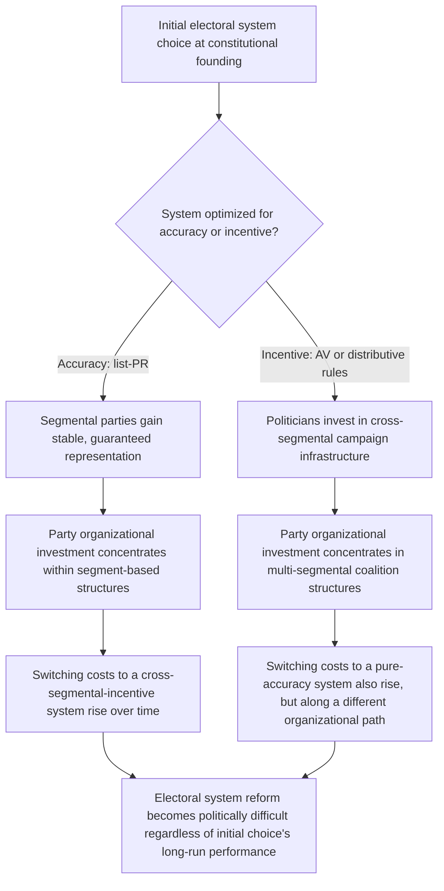

## Electoral System Design Trade-offs in Divided Societies

### Positioning: Synthesizing the Electoral Dimension Across Prior Design Paradigms

The preceding three items each engaged electoral system design as one component of a broader institutional paradigm: consociationalism's proportionality pillar (list-PR systems maximizing accurate segmental representation), centripetalism's alternative-vote mechanism (engineering cross-segmental vote pooling), and federalism's boundary-drawing choices (which determine whether centripetal incentives can operate at any given territorial level). This item isolates electoral system choice as a design variable in its own right, systematizing the trade-offs across the full menu of electoral system families rather than treating any single system as definitionally tied to one design paradigm — since, as the Nigerian and Ethiopian illustrations in prior items suggest, real constitutional designs frequently combine elements across paradigms rather than adopting a pure type.

### The Central Trade-off Axis: Descriptive Accuracy Versus Behavioral Incentive

Recall the core formal distinction established across the consociational and centripetal treatments: proportional representation systems are optimized for **descriptive accuracy** — ensuring the legislature's composition mirrors the electorate's segmental composition as closely as possible — while majoritarian and preferential systems in heterogeneous constituencies are optimized for **behavioral incentive engineering** — shaping candidate strategy toward cross-segmental accommodation, at the cost of representational proportionality (a segment's legislative seat share need not match its population share under such systems).

This is not a minor implementation detail but the organizing axis along which every electoral system choice in a divided society can be positioned:

$$\text{System optimized for accuracy:} \quad \text{seat share} \approx \text{vote share} \approx \text{population share (list-PR)}$$

$$\text{System optimized for incentive:} \quad \text{seat share} \; \text{determined by cross-segmental coalition success (AV, distributive rules)}$$

No electoral system maximizes both objectives simultaneously — this is a formal, not merely empirical, trade-off, since a system guaranteeing proportional seat allocation to each segment (removing electoral risk from failing to build cross-segmental coalitions) mechanically removes the incentive gradient that reward-based systems rely on, and a system rewarding cross-segmental coalition-building necessarily risks producing legislative outcomes that deviate from strict proportionality when such coalitions fail to form or form unevenly across segments.

### List Proportional Representation: The Consociational Default

List-PR, closed or open, with reasonably low electoral thresholds, is the standard instrument for consociationalism's proportionality pillar. Its formal properties directly serve the accommodation objective: any segment above the threshold is guaranteed legislative representation roughly proportional to its vote share, minimizing the risk that a segment is entirely excluded from formal political voice (the majoritarian-exclusion outcome the commitment-problem logic identifies as destabilizing). The trade-off, established in the consociationalism treatment's entrenchment critique, is that list-PR — particularly closed-list variants where voters choose a party rather than an individual candidate — provides minimal incentive for individual politicians to court votes outside their own party's, and typically their own segment's, core electorate, since a closed-list candidate's electoral fate depends on intra-party list position rather than direct cross-segmental appeal.

[Inference] A further parameter within the list-PR family with direct relevance to divided-society application is **district magnitude** (the number of seats allocated per electoral district): higher district magnitude increases proportionality and lowers the effective threshold for small-segment representation, while lower district magnitude (approaching single-member districts) reduces proportionality but can increase the geographic specificity of representation — a parameter choice with its own sub-trade-off between minority-inclusion accuracy and localized accountability, independent of the broader accuracy-versus-incentive axis.

### The Alternative Vote and Preferential Systems: The Centripetal Instrument

As established in the centripetalism treatment, AV's vote-pooling mechanism depends critically on genuine constituency-level heterogeneity — a scope condition that directly limits AV's applicability as a general-purpose instrument for divided societies with segregated settlement patterns, in contrast to list-PR's applicability regardless of the geographic distribution of segments (since list-PR's proportionality can, depending on district design, operate at a national or large-region level independent of local heterogeneity).

$$\text{List-PR proportionality: functions regardless of segment geographic distribution}$$

$$\text{AV vote-pooling: functions only in constituencies lacking a single-segment majority}$$

This generates a specific, quantifiable design implication for system selection: AV's expected value as an accommodation instrument is a direct function of the proportion of constituencies (under any given districting) that are genuinely heterogeneous, meaning an accurate ex ante demographic mapping exercise (as recommended in the centripetalism treatment) is a precondition for assessing AV's likely effectiveness in a specific society, rather than AV being a system whose benefits can be assumed to transfer from cases like Papua New Guinea to a society with more geographically segregated settlement patterns.

### Mixed and Hybrid Systems: Attempting to Capture Both Objectives

[Inference] Given the formal trade-off, a substantial share of contemporary electoral design in divided societies involves hybrid or mixed systems attempting to secure partial benefits of both objectives simultaneously, at the cost of increased institutional complexity:

- **Mixed-member proportional (MMP) systems**: combine single-member district seats (providing localized accountability and, where districts are heterogeneous, some cross-segmental incentive) with a compensatory party-list tier ensuring overall proportionality is restored at the aggregate level regardless of district-tier outcomes — attempting to secure list-PR's accuracy guarantee while preserving some of the localized accountability benefit of district-based representation.
- **Reserved-seat systems**: guarantee a fixed number of legislative seats to specific segments (often smaller or historically marginalized groups) independent of the primary electoral system's operation, functioning as a targeted proportionality guarantee layered onto an otherwise majoritarian or preferential system — directly addressing the risk that a small segment could be structurally disadvantaged even under systems with other design objectives, without requiring the entire system to be reoriented toward proportionality.
- **Two-round (runoff) systems with distributive requirements**: as illustrated by Nigeria's presidential rules covered previously, combining a majoritarian logic with an explicit multi-regional distributive threshold, capturing some of AV's cross-segmental incentive logic without requiring the full preferential-ballot infrastructure AV entails.

[Speculation] Whether hybrid systems' added institutional complexity — which can reduce voter comprehension and complicate post-election legitimacy if outcomes are not well understood by the electorate — offsets their theoretical advantage in partially capturing both design objectives is an under-researched question relative to the extensive separate literatures on pure-type systems.

### Feedback Structure: System Choice as Path-Dependent Institutional Lock-In

The convergence at node I is the key structural insight: regardless of which initial system is chosen, the organizational investments political parties make in response to that system's specific incentive structure generate their own switching costs, meaning electoral system choice at a constitutional founding moment — often made under acute time pressure and incomplete information about a divided society's long-run demographic and political trajectory — tends to become substantially path-dependent, raising the stakes of getting the initial design assessment right relative to a model in which electoral systems could be costlessly adjusted as conditions evolve.

### Canonical Empirical Illustrations

[Inference] New Zealand's adoption of MMP in 1996 (motivated primarily by representational concerns distinct from ethnic division, though subsequently analyzed for its effects on Māori political representation specifically) is frequently cited in the comparative electoral-design literature as a relatively well-documented case of the mixed-system compensatory mechanism operating as designed, providing an accessible reference case for the MMP mechanism's mechanics even though New Zealand's own cleavage structure differs substantially from the deeply divided post-conflict societies more central to this framework's primary concern.

South Africa's post-apartheid adoption of list-PR at the national level is frequently analyzed as a consociational-paradigm-consistent choice prioritizing accurate proportional representation of the country's racial and political diversity during a high-stakes transitional period, [Unverified] with ongoing scholarly debate over whether the system's accuracy benefits during the transition have come at a longer-run cost to cross-racial coalition-building incentives at the party level, given the point raised in the consociationalism treatment regarding proportionality's potential tension with cross-segmental party formation.

### Design Implications: What Peace Engineering Targets

Given the formal accuracy-incentive trade-off and the path-dependency risk identified above, electoral system design for divided societies requires an explicit, case-specific weighting of objectives rather than a default or reflexive choice:

- **Explicit sequencing of design priorities based on conflict phase**: immediate post-conflict transitions with high mutual distrust and acute risk of majoritarian exclusion may warrant prioritizing list-PR's accuracy guarantee (consistent with the consociational stabilization logic), while societies with greater initial stability might better tolerate AV's cross-segmental incentive risk in pursuit of longer-run salience reduction.
- **Demographic heterogeneity mapping as a mandatory pre-design input**: per the AV scope-condition discussion, any consideration of preferential or distributive electoral mechanisms requires prior assessment of actual constituency-level heterogeneity, since the mechanism's value is conditional on this precondition rather than being system-inherent.
- **Deliberate use of hybrid systems where genuine dual objectives exist**: MMP or reserved-seat mechanisms provide a documented, if institutionally more complex, pathway to partially securing both accuracy and incentive benefits, appropriate where neither pure-type system's trade-off is acceptable to the negotiating parties.
- **Awareness of path-dependency in constitutional design timelines**: given that initial system choice generates its own switching costs through party-organizational investment, constitutional design processes benefit from extended deliberation and explicit long-run trajectory modeling prior to founding-moment system selection, rather than treating the choice as easily revisable through ordinary subsequent legislative reform.

**Related Topics:**

- Lijphart's consociational power-sharing and grand coalition design
- Horowitz's centripetalism and integrative institutional incentives
- Federalism, territorial autonomy, and self-governance arrangements
- Mixed-member proportional system design and comparative case analysis
- South African post-apartheid constitutional design and electoral system choice