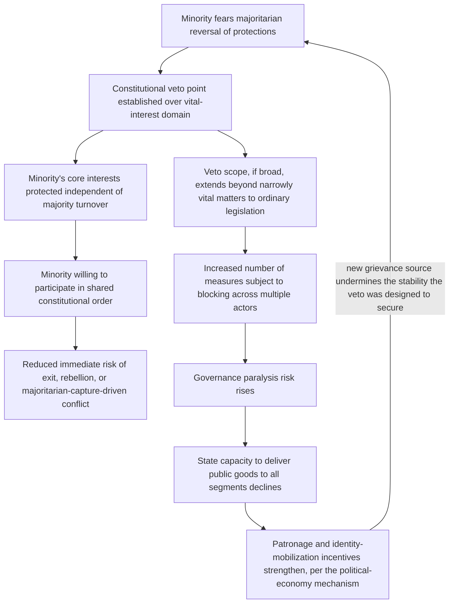

## Constitutional Veto Points and Minority Protection Mechanisms

### Positioning: Generalizing the Veto Instrument Across the Institutional Design Toolkit

Recall that Lijphart's segmental veto was introduced as one of four consociational pillars, specifically targeting the residual exposure a minority faces even under grand coalition and proportionality — the risk of being formally outvoted on matters going to its most vital, potentially discontinuously-valued interests. This item generalizes the veto instrument beyond its consociational-specific formulation, developing veto points as a distinct formal category of institutional design with its own internal typology, trade-offs, and interaction effects with the other design paradigms already covered (centripetalism, federalism, electoral system choice).

### Formal Definition and the Generalized Design Logic

**Constitutional veto point**, defined precisely: an institutional chokepoint at which a specified actor or coalition can block a proposed change to policy or law from taking effect, independent of whether that actor commands a legislative majority. The formal design logic directly extends the commitment-problem-solving mechanism established in the consociationalism treatment: absent a veto point, any protection a minority holds is only as durable as the current majority's willingness to maintain it, and per the standard commitment-problem logic, a future majority coalition has no binding constraint against reversing that protection once its own electoral incentives shift. A veto point converts a *policy outcome* dependent on ongoing majority goodwill into a *structural feature* of the decision process itself, closing the same commitment gap the grand-coalition mechanism addresses but through a narrower, more targeted instrument applicable to specific decision domains rather than the entire executive.

$$\text{Without veto point: minority protection} = f(\text{current majority's preferences}), \; \text{unstable across majority turnover}$$

$$\text{With veto point: minority protection} = \text{structural feature of the decision rule}, \; \text{stable across majority turnover by construction}$$

### The Veto-Point Typology: Scope, Trigger, and Holder

A precise design taxonomy requires specifying three independent dimensions, since conflating them (treating "veto" as a single undifferentiated category) obscures substantial variation in both protective strength and governance-cost implications:

1. **Scope**: the range of policy domains subject to the veto — from narrowly defined "vital interest" categories (language rights, religious practice, specific cultural or educational matters) to broad, general-purpose legislative veto covering any ordinary legislation.
2. **Trigger mechanism**: whether the veto is *self-activating* (a specified minority automatically holds veto power over any measure formally classified within scope, without needing to invoke it through a separate procedural step) or *invocation-based* (a minority must affirmatively trigger the veto through a specified procedure — a petition threshold, a formal declaration — for it to take effect on a given measure).
3. **Holder specification**: whether the veto is held by a formally designated segment (per Lijphart's original consociational formulation), by a numerical legislative threshold (a supermajority requirement applicable regardless of which coalition falls short of it), or by an independent institutional body (a constitutional court empowered to strike down legislation violating specified minority-protection provisions).

This typology matters directly for the entrenchment-versus-governability trade-off first identified in the consociationalism treatment: broad-scope, self-activating, segment-specific vetoes provide the strongest protection but the highest governance-paralysis risk and the strongest reinforcement of formal segmental identity as a category with independent constitutional standing; narrow-scope, invocation-based, threshold-defined vetoes (a supermajority requirement rather than a named-segment veto) provide weaker but more targeted protection with lower paralysis risk and without formally entrenching segmental categories as such in the constitutional text itself.

### The Governance-Paralysis Cost: A Formal Restatement

[Inference] The central critique of broad veto architecture, developed extensively in analyses of both the Lebanese confessional system and post-Dayton Bosnia (touched on in the consociationalism treatment), can be stated formally as a direct trade-off against the ordinary legislative decision-making the veto is layered onto: where $n$ distinct veto-holding actors each hold blocking power over a shared policy domain, the probability that *any* proposed change survives all veto points falls multiplicatively with $n$ (holding each individual actor's independent probability of objecting constant), meaning veto proliferation across multiple segments or institutional bodies can produce a governance environment in which even broadly desired, non-zero-sum reforms become extremely difficult to enact — a distinct pathology from the minority-exclusion risk the veto was designed to prevent, but one that can itself generate new grievances (a stagnant, dysfunctional state unable to deliver public goods to any segment) feeding back into the broader conflict-risk environment covered in the earlier war-economy and patronage treatments, where weak state capacity was identified as a driver of identity-mobilization incentives.

$$P(\text{measure survives all veto points}) = \prod_{i=1}^{n} P(\text{actor } i \text{ does not veto}), \; \text{strictly decreasing in } n$$

### Judicial Veto: The Independent-Body Variant and Its Distinct Properties

Constitutional court review, as a veto-point variant distinct from segment-specific or supermajority-threshold vetoes, introduces a formally different actor type into the model: rather than a directly interested party (a segment or numerical coalition) holding blocking power, an ostensibly neutral judicial body reviews measures against pre-specified constitutional minority-protection standards. [Inference] This variant's formal advantage is that it does not require identifying and empowering specific segments as constitutional actors (avoiding some of the entrenchment critique's force), but its protective strength is correspondingly contingent on a variable absent from the segment-veto model: judicial independence and the court's own institutional credibility as genuinely neutral rather than captured by whichever coalition holds appointment power — a variable itself potentially subject to the same commitment-problem dynamics the veto point is meant to resolve (a court whose composition a current majority can eventually reshape through appointments offers a weaker structural guarantee than one with strongly insulated, staggered, or cross-segmentally-negotiated appointment procedures).

### Feedback Structure: Veto Architecture as a Double-Edged Stabilizer

The loop's closure at J is the structurally important finding: an excessively broad veto architecture can, through the governance-paralysis and state-capacity-degradation channel, regenerate the very grievance and identity-mobilization dynamics it was constitutionally designed to close off — meaning veto-point design is subject to the same entrenchment-versus-protection calibration problem identified for consociational architecture generally, with the added formal precision that the mechanism generating the risk (multiplicative survival-probability decay in $n$) is directly quantifiable and thus, in principle, subject to explicit ex ante design calibration rather than only post hoc diagnosis.

### Canonical Empirical Illustrations

[Inference] Lebanon's confessional veto architecture, in which the presidency, premiership, and speakership are constitutionally allocated to specific religious communities and major legislation frequently requires cross-confessional consensus in practice, is frequently cited as an illustration of the broad-scope veto's paralysis risk: [Unverified] the specific causal link between the confessional veto structure and Lebanon's documented, prolonged periods of governmental gridlock and state-capacity weakness (including well-documented failures in basic public service delivery) is generally accepted in the specialist literature as substantial, though the precise relative contribution of the veto architecture versus other concurrent factors (external regional influence, entrenched patronage networks predating the current constitutional order) is not fully disentangled.

Constitutional court review of minority-protection provisions in South Africa's post-apartheid order is frequently cited as an example of the independent-body veto variant operating with substantial judicial independence and credibility, [Inference] generally assessed in the comparative constitutional literature as having provided meaningful minority and rights protection without the governance-paralysis pathology associated with broader multi-actor segmental veto systems, though [Speculation] whether this reflects the inherent design advantage of the judicial-veto variant specifically, or South Africa's particular judicial-appointment and institutional-culture circumstances, is not established as a generalizable finding transferable to other institutional contexts without judicial systems of comparable independence and credibility.

### Design Implications: What Peace Engineering Targets

Given the formal governance-paralysis trade-off and the distinct properties of the judicial-veto variant, design guidance emphasizes precise scope calibration and careful holder-type selection rather than defaulting to the broadest available protective instrument:

- **Narrow, explicit scope definition limited to genuinely vital-interest matters**: directly informed by the multiplicative-decay formalization above, minimizing $n$ and restricting veto scope to matters plausibly involving the discontinuous-value-function exposure identified in the indivisibility treatment (rather than extending veto power to ordinary legislation) preserves protective benefit while containing governance-paralysis risk.
- **Preference for invocation-based over self-activating triggers where feasible**: requiring affirmative invocation (rather than automatic activation) can reduce the frequency of veto deployment to cases where a minority genuinely perceives a vital-interest threat, potentially reducing routine governance friction relative to blanket self-activating protection, at some cost to the certainty of protection in ambiguous cases.
- **Investment in judicial independence infrastructure where a judicial-veto variant is selected**: since the judicial-veto variant's protective strength is contingent on independence and credibility rather than being structurally guaranteed by design alone, complementary investment in insulated appointment procedures, staggered terms, and cross-segmentally-negotiated judicial selection processes is a necessary complement rather than an optional addition to the basic judicial-review mechanism.
- **Explicit ex ante modeling of veto-holder proliferation before constitutional adoption**: given the quantifiable multiplicative relationship between the number of veto holders and governance functionality, constitutional design processes benefit from explicitly modeling the expected frequency and domain-overlap of veto invocation across all proposed veto holders jointly, rather than negotiating each segment's or institution's veto protection in isolation without assessing their aggregate governance-cost interaction.

**Related Topics:**

- Lijphart's consociational power-sharing and grand coalition design
- Issue indivisibility and its effect on negotiated settlement space
- Judicial independence design and constitutional court appointment mechanisms
- Lebanon's confessional system and documented governance-capacity outcomes
- Patronage networks and war economies as incentive structures