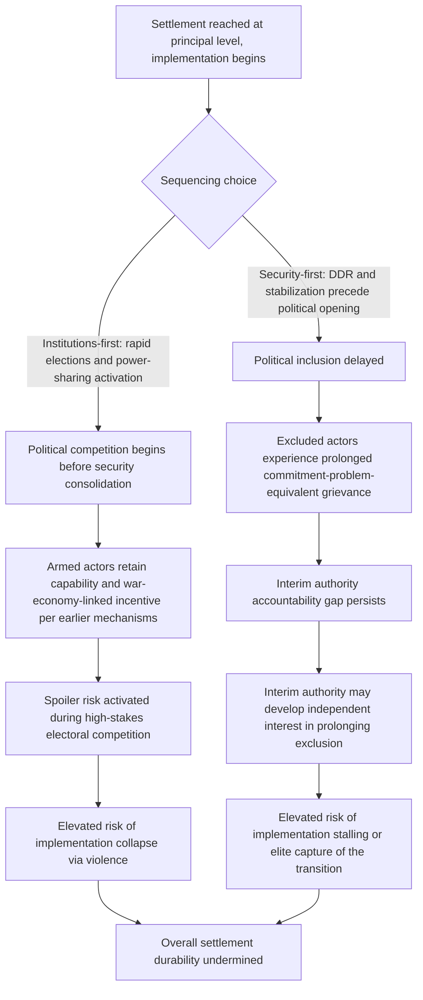

## Sequencing and Timing of Power-Sharing Implementation

### Positioning: From Institutional Menu to Implementation Dynamics

The preceding four items established a menu of institutional instruments — consociational grand coalition and veto architecture, centripetal electoral engineering, territorial autonomy, and electoral system trade-offs — each analyzed largely as static design choices. This item addresses a distinct and equally consequential question the static treatment leaves open: given a chosen institutional package, in what order and at what pace should its components be implemented, and does implementation timing itself independently affect the probability that the chosen institutions successfully stabilize rather than collapse. This connects directly to the spoiler-dynamics and principal-agent treatments covered earlier: implementation is not a single discrete event but an extended process during which the specific failure modes those items identified (spoiler action, agency loss, war-economy rent-preservation incentives) have repeated opportunities to derail an otherwise sound institutional design.

### The Core Formal Tension: Security-First Versus Politics-First Sequencing

The sequencing literature (most extensively developed by Paul Collier, Roland Paris, and the broader "liberal peacebuilding" debate) is organized around a foundational disagreement over which category of reform should precede the other, formalized as a trade-off between two distinct risk exposures during the implementation window:

**Security-first sequencing**: prioritizes disarmament, demobilization, ceasefire consolidation, and security-sector stabilization before introducing competitive political institutions (elections, power-sharing implementation), on the formal logic that competitive political processes introduced while armed actors retain both capability and incentive to use force (recall the war-economy and principal-agent treatments establishing that such incentives frequently persist independent of leadership-level settlement) risk being decided or disrupted by violence rather than by the political process itself — directly analogous to the spoiler problem's inside/outside distinction, since premature political competition provides both greater incentive and greater opportunity for spoiler action.

**Institutions-first (rapid political liberalization) sequencing**: prioritizes early elections and power-sharing institutional activation on the logic that prolonged security-phase delay before political inclusion risks its own distinct failure mode — extended exclusion of relevant political actors from formal power can itself function as the majoritarian-exclusion-equivalent condition the commitment-problem literature identifies as destabilizing (recall that grand coalition's stabilizing logic depends on genuine, timely inclusion), and that security forces retained under a non-inclusive interim authority may themselves develop entrenched interests opposed to eventual power-sharing (a principal-agent-style entrenchment risk operating at the level of the transitional security apparatus itself).

$$\text{Security-first risk: prolonged political exclusion regenerates commitment-problem-style grievance}$$

$$\text{Institutions-first risk: premature competition activates spoiler incentives before capability to disrupt is reduced}$$

Neither ordering is formally dominant; the trade-off's resolution is context-dependent on the relative magnitude of each risk in a given case, which the sequencing literature has attempted to operationalize through more granular conditional frameworks rather than a single universal ordering rule.

### Roland Paris's "Institutionalization Before Liberalization" Framework

[Inference] Paris's influential critique of 1990s-era rapid-liberalization peacebuilding practice (developed in *At War's End*) argues the institutions-first approach, as practiced in several UN-administered post-conflict transitions, systematically underweighted a distinct mechanism: competitive elections and market liberalization introduced before adequate institutional capacity exists to manage the resulting political and economic competition can *themselves* trigger renewed conflict, because competitive processes generate winners and losers whose disputes require functioning courts, police, and administrative institutions to resolve peacefully — institutions frequently underdeveloped or destroyed by the preceding conflict. This generates Paris's prescriptive reframing: **institutionalization before liberalization**, meaning basic administrative, judicial, and security institutional capacity should be substantially rebuilt before introducing the full competitive political and economic liberalization the power-sharing and market-reform agenda typically includes, rather than treating institutional capacity-building and political liberalization as simultaneous or liberalization-first processes.

[Unverified: this framework, while influential, is not without significant counter-critique in the subsequent literature — critics note that "institutionalization before liberalization" risks providing normative cover for prolonged, potentially unaccountable transitional authority exercised by incumbent elites or international administrators, and that the framework does not fully resolve who governs, and under what accountability constraints, during the extended institutionalization phase itself.]

### The Interim-Authority Accountability Gap

[Inference] A specific formal problem this sequencing debate surfaces, connecting directly to the principal-agent framework developed earlier: whatever authority governs during a security-first or institutionalization-first interim period — a transitional government, an international administration, an incumbent regime retained pending elections — exercises power without the accountability mechanisms (competitive elections, functioning legislative oversight) that the eventual power-sharing settlement is designed to provide. This interim authority itself becomes a distinct principal whose incentive alignment with eventual power-sharing implementation cannot be assumed, and which may, per the principal-agent entrenchment logic covered earlier, develop independent interests in prolonging the interim period or shaping eventual institutional design to favor its own continued influence.

$$\text{Interim authority's incentive alignment with eventual power-sharing} \; \text{is not guaranteed by the sequencing choice itself}$$

This generates a design implication independent of which broad sequencing philosophy is adopted: any extended interim period, regardless of whether it prioritizes security or institutional capacity-building, requires its own distinct accountability and sunset-commitment mechanisms to prevent the interim authority from becoming a new, unaccountable veto point over the eventual settlement — directly paralleling the constitutional-veto treatment's concern with credible commitment to eventual protections, but applied to the transitional period itself rather than the final constitutional order.

### Feedback Structure: Sequencing Choice and the Compounding of Prior Mechanisms

The convergent structure at node L — both sequencing paths terminating in a distinct but comparably severe durability risk — is the item's central formal claim: sequencing choice does not eliminate the risks established in the war-economy, principal-agent, and commitment-problem treatments, it determines *which* of those mechanisms is more acutely activated during the implementation window, meaning sequencing design should be treated as risk-allocation across known mechanisms rather than as a search for a sequencing order that avoids implementation risk altogether.

### Canonical Empirical Illustrations

[Inference] Angola's 1992 elections, held relatively rapidly after the Bicesse Accords without adequate preceding DDR of UNITA's military capacity, are frequently cited as the canonical illustration of the institutions-first sequencing risk: UNITA's return to full-scale war following its electoral defeat is widely analyzed in the peacebuilding literature (and was referenced earlier in the spoiler-dynamics treatment) as directly linked to premature electoral competition occurring while the losing party retained substantial independent military capability, consistent with the formal mechanism in the diagram above.

[Inference] Cambodia's UNTAC-administered transition, and various international administration cases in Bosnia and Kosovo, are frequently analyzed as illustrations of the interim-authority accountability-gap risk specifically: [Unverified] the extent to which extended international administration in these cases successfully avoided developing independent institutional interests contrary to eventual local self-governance, versus generating documented local grievances about prolonged external control lacking robust local accountability, is a matter of ongoing and substantively contested assessment in the peacebuilding evaluation literature, without a clear consensus resolution.

### Design Implications: What Peace Engineering Targets

Given that sequencing choice reallocates rather than eliminates implementation risk, design guidance emphasizes case-specific risk assessment and building safeguards against whichever mechanism a given sequencing choice most acutely activates:

- **Ex ante assessment of armed-actor demobilization feasibility before electoral timeline commitment**: directly informed by the Angola illustration, sequencing decisions should be grounded in a concrete, verifiable assessment of whether the specific armed actors involved can be substantially demobilized (per the DDR treatment's own sequencing considerations) within a proposed pre-election timeframe, rather than adopting rapid-election timelines as a default international-community preference independent of case-specific military-capacity conditions.
- **Explicit sunset and accountability provisions for any interim authority**: given the interim-authority accountability gap identified above, any security-first or institutionalization-first sequencing choice should be paired with binding, externally verifiable sunset commitments and interim oversight mechanisms, directly addressing the risk that delay-based sequencing choices create a new, unaccountable veto point over the eventual settlement.
- **Phased, conditional sequencing rather than binary security-first-versus-institutions-first commitment**: given that neither pure sequencing philosophy dominates, several contemporary transition designs favor explicitly conditional, milestone-based sequencing (partial political opening contingent on verified partial demobilization, proceeding incrementally rather than committing to a full sequencing order at the outset), allowing sequencing pace to be adjusted based on observed implementation progress rather than being fixed at the settlement's outset.
- **Spoiler-risk and principal-agent assessment integrated into sequencing design specifically**: since the diagram above shows sequencing choice determining which previously-covered mechanism (spoiler action versus interim-authority entrenchment) is more acutely activated, sequencing design should draw directly on the spoiler-typology and command-structure-cohesion assessments covered in earlier items as concrete inputs to the sequencing decision, rather than treating sequencing as a separate design question independent of those actor-level assessments.

**Related Topics:**

- Spoiler dynamics and veto-player incentives against settlement
- Principal-agent problems in armed group command structures
- Patronage networks and war economies as incentive structures
- Roland Paris's institutionalization-before-liberalization framework and liberal peacebuilding critique
- Angola's Bicesse Accords and the 1992 electoral collapse