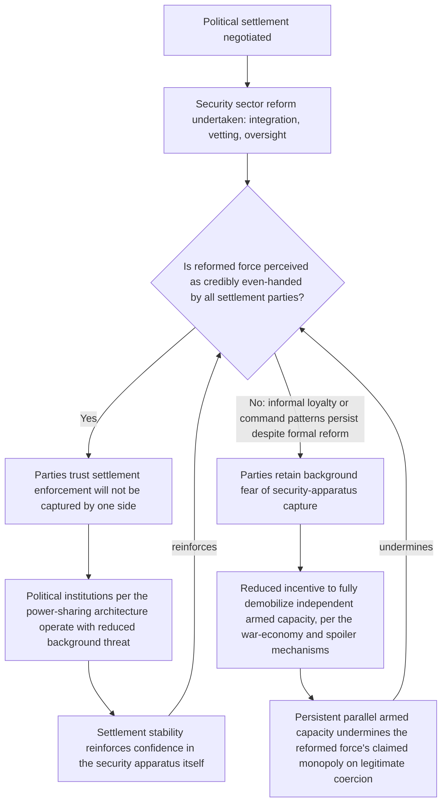

## Security Sector Reform as a Credible Commitment Device

### Positioning: From Sequencing Choice to the Substantive Content of Security-Phase Reform

Recall that the sequencing treatment identified security-sector stabilization as one pole of the implementation-ordering trade-off, without specifying what substantive institutional transformation "security-first" reform should actually accomplish beyond disarmament and demobilization of non-state armed actors. This item addresses that substantive content directly: security sector reform (SSR) as a distinct institutional design problem in its own right, formally connecting to the commitment-problem literature established early in this curriculum, since a state's monopolized coercive apparatus — the police, military, and intelligence services — is precisely the instrument whose future, post-settlement use a former adversary or minority population cannot take on faith without some structural transformation of the apparatus itself.

### Formal Positioning: SSR as Addressing the State's Own Commitment Problem

Recall the canonical commitment-problem structure: a settlement is unstable when the party holding future power has no external enforcer binding its future concessions, and third-party security guarantees were identified as the standard remedy where the settlement's beneficiary cannot itself supply a credible commitment. Security sector reform addresses a distinct but closely related variant of this same underlying problem: even where a negotiated settlement grants a former rebel group or minority population specific political and security guarantees, those guarantees are only as credible as the guarantee-enforcing security apparatus's actual composition, loyalty structure, and institutional culture — an apparatus that, in most civil war settlements, previously served as the instrument of one side's dominance and whose personnel, command structure, and operational doctrine do not automatically transform merely because a political settlement has been signed.

$$\text{Political settlement credibility} \leq \min\left(\text{political commitment credibility}, \; \text{security apparatus commitment credibility}\right)$$

This inequality is the formally important claim: a political settlement's overall credibility is bounded by the *weaker* of its political and security-institutional components, meaning even a well-designed consociational or centripetal political architecture (covered in the preceding chapter) cannot deliver durable peace if the security apparatus enforcing or potentially threatening that architecture remains institutionally unreformed and retains the capacity and loyalty structure to serve one segment's interests over another's.

### The Core SSR Design Objective: Converting a Partisan Instrument into a Credible Guarantor

**Security sector reform**, defined precisely for this context: the deliberate restructuring of a state's coercive institutions — composition (personnel recruitment and vetting), command structure (chain of authority and civilian oversight), and operational doctrine (rules of engagement, permissible use of force) — undertaken specifically to transform an apparatus previously aligned with one conflict party into one credibly capable of, and incentivized toward, even-handed enforcement of a negotiated settlement's provisions across all parties to it.

This directly operationalizes the third-party-enforcement remedy identified in the original commitment-problem treatment, but internalizes it: rather than relying on an external guarantor indefinitely, SSR aims to reconstruct the *domestic* security apparatus itself into a credible guarantor, addressing the practical reality that external guarantees are frequently time-limited (peacekeeping mandates expire, international attention shifts) while the underlying commitment problem the state's own coercive apparatus poses persists indefinitely absent internal transformation.

### Formal Instruments: Integration, Vetting, and Oversight as Distinct Mechanisms

The SSR literature identifies three formally distinct instrument classes, each targeting a different component of the credibility inequality above, and each drawing directly on tools developed elsewhere in this framework:

1. **Integration (ethnic/factional balancing of personnel)**: incorporating former rebel combatants and members of previously excluded or marginalized groups directly into the reformed security services' rank-and-file and command structure, at ratios often explicitly negotiated as part of the settlement itself. This is the direct security-sector analog of consociational proportionality: rather than guaranteeing proportional political representation, integration guarantees proportional representation *within the coercive apparatus itself*, addressing the specific fear that an unreformed, single-segment-dominated security force could be used to reverse a political settlement by force even where the settlement's political terms are formally honored.
2. **Vetting**: screening existing security personnel for prior human rights violations, war crimes, or clear partisan loyalty markers, removing or disqualifying personnel whose prior conduct or documented allegiance is incompatible with even-handed post-settlement service. This directly targets the recruitment-composition mechanism from the principal-agent treatment: recall that Weinstein's framework predicted resource-driven, opportunistically-recruited combatants exhibit weaker intrinsic goal alignment; vetting functions as an ex post screening mechanism attempting to select out personnel whose documented prior behavior signals poor alignment with the new settlement's even-handedness objective, functioning analogously to (though distinct from) the ex ante recruitment-composition effects Weinstein describes for rebel organizations specifically.
3. **Civilian oversight and command-structure reform**: establishing functioning civilian ministerial control, legislative oversight committees, and independent complaints or ombudsman mechanisms over the security services, directly addressing the command-structure dimension of credibility by ensuring that even a well-integrated and well-vetted security force remains subject to accountability mechanisms external to the security apparatus's own internal chain of command — a structural safeguard against the same principal-agent entrenchment risk (autonomous field or unit-level actors developing independent interests) covered in the armed-group command-structure treatment, now applied to the state's own post-settlement forces.

$$\text{SSR credibility} = h(\text{integration ratio}, \; \text{vetting rigor}, \; \text{civilian oversight strength})$$

### The Verification Problem: Integration Is Observable, Loyalty Is Not

[Inference] A formally important complication, directly parallel to the offense-defense distinguishability problem from the security-dilemma treatment, is that integration ratios and formal command-structure reforms are relatively easily observed and verified (personnel rosters, unit composition data, formal oversight committee existence), while the *substantive loyalty and operational behavior* those reforms are meant to produce is considerably harder to verify directly, particularly during an extended transitional period before the reformed force has had sufficient operational history to establish a track record. This generates a structural information problem analogous to costly signaling: a formally well-integrated security force could still, in practice, retain informal command loyalties or operational patterns inconsistent with even-handed enforcement, and this gap between formal compliance and substantive transformation is difficult for either party to a settlement to verify with confidence during the critical early implementation period.

[Unverified: the empirical SSR evaluation literature has not established a reliable, generalizable metric for substantive loyalty transformation independent of formal integration and vetting indicators, meaning assessments of SSR "success" in specific cases frequently rely on the absence of subsequent security-force-perpetrated violations as an outcome measure, which is itself a lagging rather than a leading indicator of the underlying credibility the reform is meant to establish in advance.]

### Feedback Structure: SSR Success as a Precondition for, and Product of, Broader Settlement Stability

The bifurcation at node C, and its self-reinforcing continuation in both directions, is the item's central structural insight: SSR credibility and broader settlement stability are mutually reinforcing in both the positive and negative direction, meaning early perceptions of SSR's substantive credibility (not merely its formal compliance indicators) can lock in either a virtuous or a vicious cycle relatively early in the implementation period, directly connecting to the sequencing treatment's concern with what occurs during the critical early implementation window.

### Canonical Empirical Illustrations

[Inference] South Africa's post-apartheid integration of former liberation-movement combatants (including Umkhonto we Sizwe) into the South African National Defence Force is frequently cited as a substantial, if imperfect, example of the integration instrument applied at significant scale, [Unverified] with mixed assessments in the specialist literature regarding the degree to which formal integration fully translated into substantive institutional culture transformation within the timeframe typically studied.

[Inference] Bosnia-Herzegovina's post-Dayton security sector reform process, including internationally-supervised police restructuring and, later, the formal unification of previously ethnically-separate armed forces into a single Bosnian military structure, is frequently analyzed as a prolonged, internationally-intensive SSR effort illustrating both the integration and civilian-oversight instruments operating under sustained external supervision; [Unverified] whether the resulting institutional transformation reflects durable substantive change or primarily externally-sustained formal compliance contingent on continued international engagement is a matter of ongoing and unresolved assessment in the Bosnia-specific SSR evaluation literature.

### Design Implications: What Peace Engineering Targets

Given the formal credibility inequality and the verification gap between formal and substantive transformation identified above, SSR design targets both the formal instrument mix and mechanisms for narrowing the observability gap specifically:

- **Negotiated, verifiable integration ratios embedded directly in the settlement text**: rather than leaving integration commitments as general aspirational language, specifying concrete, monitorable personnel and command-position ratios directly in the settlement agreement provides an observable compliance benchmark, addressing the formal-compliance half of the verification problem even where substantive loyalty remains harder to verify.
- **Independent, sustained monitoring mechanisms extending beyond the initial reform period**: given that substantive loyalty transformation is a lagging rather than leading indicator, sustained (not merely initial-implementation-phase) independent monitoring of security-force conduct provides an ongoing rather than one-time credibility check, directly addressing the risk that early formal compliance masks persistent informal loyalty patterns that only become evident over an extended operational history.
- **Vetting processes with clear, pre-negotiated evidentiary standards**: since vetting rigor is a direct input to the overall credibility function, establishing clear, jointly-agreed evidentiary standards and independent adjudication mechanisms for vetting decisions prior to implementation reduces the risk that vetting itself becomes a contested, politically manipulable process undermining rather than building cross-party trust in the reform.
- **Explicit linkage between SSR credibility indicators and broader settlement sequencing**: given the mutually reinforcing feedback structure identified above, and its direct connection to the sequencing treatment's concern with implementation-window risk, phased political-institution activation calibrated to observed (not merely formally declared) SSR progress can help ensure that the political architecture's operation does not proceed under conditions where the underlying security-credibility precondition remains genuinely unresolved.

**Related Topics:**

- Sequencing and timing of power-sharing implementation
- Fearon's commitment problem model of credible commitment failure
- Principal-agent problems in armed group command structures
- Vetting and lustration processes in transitional justice design
- Bosnia-Herzegovina's post-Dayton security sector reform process