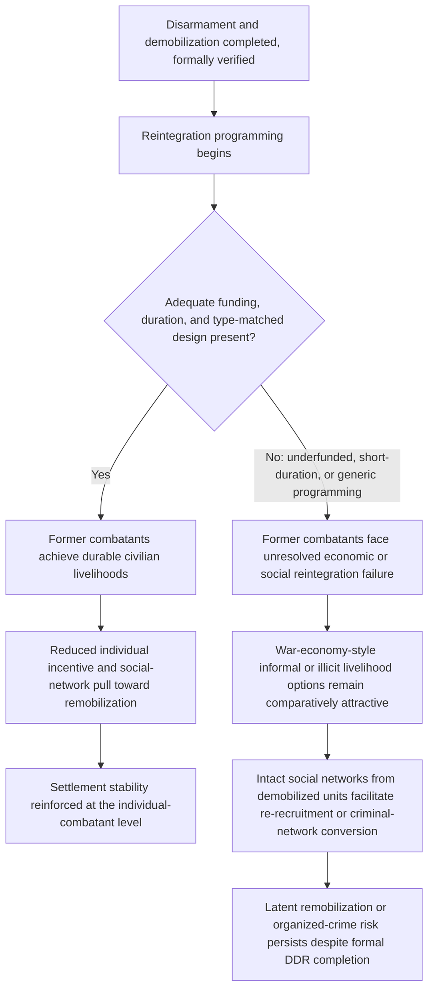

## Disarmament, Demobilization, and Reintegration Program Design

### Positioning: The Combatant-Level Complement to Security Sector Reform

Recall that security sector reform addresses the credibility of the *state's* post-settlement coercive apparatus by transforming its composition, vetting, and oversight structure. DDR addresses the parallel but distinct problem at the level of the *former combatants themselves* — the population whose weapons, organizational cohesion, and economic dependence on armed group membership must be dismantled for a settlement to hold, and who, per the principal-agent and war-economy treatments covered earlier, frequently include actors (field commanders, war-economy rent-capturers) with independent incentives to resist exactly this dismantlement. DDR is therefore not a technical or logistical afterthought to a political settlement but a direct application point for several of the framework's core mechanisms operating simultaneously.

### The Three Formally Distinct Components and Their Sequencing Logic

**Disarmament, demobilization, and reintegration (DDR)**, as a formal three-stage process, addresses three analytically separable problems that are frequently conflated in casual usage but require distinct instruments and carry distinct failure modes:

1. **Disarmament**: the physical collection, control, and disposal of weapons held by combatants. This is the most narrowly technical stage but carries a specific credible-commitment problem of its own: an individual combatant asked to surrender weapons faces a coordination problem structurally analogous to a repeated-game trust dilemma — surrendering first, before verifying that all other combatants (including potential adversaries) are surrendering simultaneously, exposes the first-mover to being disarmed while others remain armed. This generates a formal requirement for verified, simultaneous, and monitored disarmament rather than sequential voluntary surrender, directly paralleling the verification-regime remedies developed for the shadow-of-the-future noise problem in the repeated-games treatment.
2. **Demobilization**: the formal and controlled discharge of combatants from armed group structures, typically involving cantonment (temporary assembly in monitored sites), registration, and issuance of some transitional support package. This stage's core function is dismantling the *organizational* command structure itself — distinct from disarmament's focus on weapons — directly targeting the principal-agent structures covered earlier, since a demobilized but still organizationally intact unit (retaining its chain of command even after surrendering weapons) preserves the latent capacity for remobilization that full demobilization is meant to eliminate.
3. **Reintegration**: the longer-term social and economic transition of former combatants into civilian life and livelihoods, addressing the war-economy dependency mechanism covered earlier directly — since combatants whose economic survival depended on conflict-contingent rent streams (checkpoint taxation, resource extraction, patronage-network membership) face a genuine economic transition problem that demobilization alone does not resolve, and which, left unaddressed, creates exactly the material incentive for remobilization or criminal-violence conversion that the war-economy treatment identified as a driver of conflict persistence.

$$\text{DDR failure risk} = \max(\text{disarmament coordination failure}, \; \text{demobilization command-structure persistence}, \; \text{reintegration economic failure})$$

The formal point of stating DDR's risk as a maximum rather than a sum is important: success at any two stages does not compensate for failure at the third — a population fully disarmed and formally demobilized but economically unreintegrated remains a latent remobilization risk (a well-armed-in-principle-but-currently-weaponless population with unresolved economic grievance and intact social networks can rearm), just as a population with excellent reintegration prospects but incomplete disarmament retains the capacity, whatever its intentions, to threaten the settlement by force.

### The Reintegration Bottleneck: Why This Stage Is the Most Frequently Underfunded and Most Consequential

[Inference] A well-documented empirical regularity in DDR program evaluation (reflected in World Bank and UN DDR resource guidance) is that reintegration is systematically the most underfunded and least successfully implemented of the three stages, despite formal recognition of its centrality — plausibly because disarmament and demobilization produce readily observable, verifiable, short-term completion metrics (weapons collected, combatants registered and cantoned) attractive to donor accountability requirements, while reintegration's success criteria (durable civilian livelihood, social reacceptance, absence of re-recruitment into armed or criminal activity) are inherently longer-horizon, harder to verify, and more expensive to sustain over the multi-year timeframe genuine economic and social reintegration typically requires.

This generates a direct connection to the war-economy treatment's remedy set: recall that formal-sector economic alternative provision was identified there as the structural remedy for lootable-resource-dependent conflict actors; DDR's reintegration stage is the operational vehicle through which that remedy must actually be delivered to the specific individuals whose war-economy dependency the earlier treatment analyzed at the aggregate level, meaning reintegration program design failure directly reproduces the war-economy sustaining-incentive problem at the individual level even after the aggregate conflict has formally ended.

### Combatant Heterogeneity as a Design-Critical Variable

Recall from the principal-agent treatment that Weinstein's framework distinguishes materially-recruited from ideologically-recruited combatants based on an armed group's initial resource endowment, predicting systematically different intrinsic goal alignment between the two populations. This distinction carries a direct and specific DDR design implication not fully developed in the earlier treatment: the two combatant types require substantively different reintegration program content, since their post-conflict motivational structure and vulnerability to re-recruitment differ systematically.

$$\text{Optimal reintegration package} = f(\text{combatant recruitment type}), \; \text{materially-recruited} \neq \text{ideologically-recruited optimum}$$

- For **materially-recruited combatants** (per Weinstein's framework, drawn to armed group membership primarily by economic opportunity or coercion rather than ideological commitment), livelihood-focused reintegration — vocational training, microfinance access, formal-sector employment placement — directly addresses the primary motivational driver and is predicted to substantially reduce re-recruitment vulnerability, since the underlying grievance was economic rather than political.
- For **ideologically-recruited combatants**, livelihood support alone is predicted to be less sufficient in isolation, since continued identification with the movement's political objectives (and, per the political-economy treatment, continued embeddedness in identity-mobilization structures) can sustain re-recruitment vulnerability even where individual economic circumstances improve; this population may require complementary political reintegration, reconciliation processes, or continued political-participation channels (connecting to the power-sharing architecture covered in the prior chapter) alongside economic support.

[Speculation] Whether reintegration programs can be feasibly and reliably differentiated by combatant type at implementation scale — given the practical difficulty of accurately classifying individual combatants' recruitment motivation, and the risk that formal differentiation itself could generate perceived unfairness or stigmatization — is an operational challenge not fully resolved in the current DDR program design literature, which more commonly applies relatively uniform reintegration packages across a heterogeneous combatant population despite the theoretical case for differentiation.

### Feedback Structure: The Reintegration Failure Loop

This loop's structure explicitly shows why formal DDR "completion" (nodes counted in weapons-collected and combatants-registered statistics) can coexist with substantial underlying instability risk: the diagram's branch point at C occurs *after* the readily-measurable disarmament and demobilization stages are already complete, meaning standard DDR completion metrics can indicate success precisely while the reintegration bottleneck — the stage this item identifies as most consequential and most commonly underresourced — remains unresolved.

### Canonical Empirical Illustrations

[Inference] Sierra Leone's post-2002 DDR program is frequently cited in program-evaluation literature as achieving relatively successful disarmament and demobilization (widely credited with a substantial reduction in the country's overall weapons circulation), while assessments of the reintegration component's durability are more mixed, [Unverified] with some evaluations citing continued economic vulnerability among former combatants and documented instances of former-combatant remobilization into regional conflicts or organized-crime activity in subsequent years, though attributing this specifically to reintegration program shortcomings versus broader post-conflict economic conditions is not fully disentangled in the specialist literature.

[Inference] Colombia's DDR programming following the 2016 FARC peace agreement is frequently analyzed as a contemporary test case explicitly incorporating some type-differentiated design elements, given the documented heterogeneity of FARC's combatant base across different regional fronts with varying degrees of ideological versus coercive or economic recruitment; [Unverified] comprehensive long-term assessment of this program's reintegration durability, including documented challenges related to continued violence against demobilized former combatants in some regions, remains an active and evolving area of evaluation rather than a settled outcome.

### Design Implications: What Peace Engineering Targets

Given the maximum-risk formal structure and the specific reintegration bottleneck identified above, DDR program design targets sustained, adequately resourced, and type-sensitive reintegration specifically, rather than treating disarmament and demobilization completion as sufficient success indicators:

- **Verified, simultaneous disarmament protocols with independent monitoring**: directly addressing the first-mover coordination problem identified in the disarmament stage, requiring internationally or independently verified simultaneous compliance across all armed factions rather than relying on sequential voluntary surrender.
- **Reintegration funding and timeline commitments proportional to the stage's actual multi-year requirements**: given the documented systematic underfunding pattern, program design and donor commitment structures should explicitly budget reintegration on a multi-year rather than short-term completion-metric-driven basis, resisting the incentive to prioritize the more readily measurable disarmament and demobilization stages.
- **Combatant classification and type-matched program design where operationally feasible**: incorporating assessment of recruitment-type heterogeneity (per Weinstein's framework) into reintegration program design, even where full individual-level differentiation is impractical, by offering parallel livelihood-focused and political-reintegration-focused program tracks that combatants can access based on self-assessed need.
- **Integration of reintegration design with the war-economy formal-sector-alternative remedies specifically**: explicitly linking DDR reintegration programming to the broader formal-sector economic development interventions recommended in the war-economy treatment (regulated artisanal mining cooperatives, formalized resource-extraction livelihoods) ensures the individual-level reintegration effort is embedded within, rather than isolated from, the aggregate economic restructuring the underlying war-economy dependency problem requires.

**Related Topics:**

- Security sector reform as a credible commitment device
- Patronage networks and war economies as incentive structures
- Principal-agent problems in armed group command structures
- Weinstein's resource-recruitment framework (*Inside Rebellion*) and comparative rebel governance
- Colombia's 2016 FARC peace agreement and contemporary DDR implementation