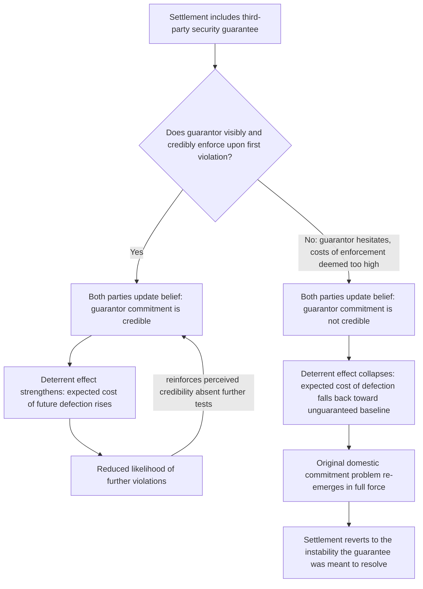

## Third-Party Guarantees and Peacekeeping as Enforcement Mechanisms

### Positioning: Returning to the Original Commitment-Problem Remedy Set

Recall that the commitment-problem treatment identified third-party security guarantees as the standard remedy where a settlement's beneficiary — most acutely, a rebel group asked to disarm — cannot itself supply the credible domestic commitment needed to sustain the settlement, since disarmament eliminates precisely the leverage that made the counterpart take the group's concerns seriously in the first place. This item develops that remedy's own formal structure, its documented conditions for success and failure, and — critically — the further-order commitment problem it introduces rather than resolves: the credibility of the guarantor itself.

### Formal Restatement: The Enforcement Gap Third Parties Are Meant to Fill

Recall the security-guarantee commitment problem in its original form: a government cannot credibly commit to protect a disarming rebel group's security after disarmament, because the group's post-disarmament loss of leverage removes the government's principal incentive to honor prior commitments. **Third-party enforcement**, defined precisely for this context: the deployment of an external actor — an international organization, a coalition of states, or a single guarantor state — with sufficient independent capability and stake in the outcome to punish either party's defection from a negotiated settlement, substituting the missing domestic credible commitment with an externally supplied one.

$$\text{Settlement stability with third-party enforcement} = f(\text{guarantor capability}, \; \text{guarantor's own commitment credibility}, \; \text{mandate scope and duration})$$

The formal function is straightforward in principle: if defection by either party triggers a costly, credible response from the guarantor, then the effective cost of defection ($T$, in the terms of the earlier repeated-games and bargaining-failure treatments) rises for both parties, potentially restoring a stable equilibrium that neither party's own unenforced promise could sustain. The complications addressed in the remainder of this item concern each of the three variables in the formal expression above.

### Peacekeeping as a Specific Enforcement Instrument: Monitoring Versus Enforcement Mandates

A critical formal distinction, frequently blurred in casual usage but load-bearing for the analysis, separates two structurally different peacekeeping mandate types:

- **Monitoring (traditional/Chapter VI-consistent) peacekeeping**: an observer or lightly-armed presence whose function is primarily informational — verifying compliance with ceasefire or disarmament terms and publicly reporting violations — rather than actively preventing or punishing violations through force. This functions primarily as a solution to the *private-information* bargaining-failure mechanism covered earlier (reducing observational noise, per the repeated-games treatment's noise-robustness discussion) rather than to the commitment problem directly: it makes defection more *observable*, which is necessary but not sufficient for deterring defection, since observability alone does not guarantee costly consequences follow.
- **Enforcement (Chapter VII-consistent) peacekeeping**: a mandate empowering the peacekeeping force to use force, including offensively, to compel compliance or protect the settlement's terms, directly targeting the commitment problem itself by supplying the credible punishment capability the domestic parties cannot supply each other.

$$\text{Monitoring mandate: reduces } \epsilon \text{ (observational noise), addresses information failure}$$

$$\text{Enforcement mandate: raises effective } T \text{ (cost of defection), addresses commitment failure directly}$$

This distinction directly determines which of the earlier-covered rationalist mechanisms a given peacekeeping deployment can plausibly resolve: a purely monitoring mission deployed to address a pure commitment problem (as opposed to an information problem) is a mechanism-mismatch of exactly the kind flagged as a design risk in the bargaining-failure-inefficiency-puzzle treatment — it improves the parties' information about each other's compliance without changing the underlying incentive to defect once information is observed.

### The Guarantor's Own Commitment Problem: An Infinite-Regress Structure

[Inference] The most formally significant complication in third-party enforcement theory, noted briefly in the earlier commitment-problem treatment and developed fully here, is that the guarantor's own commitment to intervene is itself subject to exactly the same credibility problem the guarantee is meant to solve. A guarantor's decision to actually incur the costs of enforcement (military deployment, casualties, financial expenditure, potential escalation with other guarantor interests) at the moment defection occurs is a fresh strategic decision, not a mechanically pre-committed action, and a sufficiently determined defecting party can rationally calculate whether the guarantor's ex post incentive to actually follow through on enforcement exceeds the guarantor's cost of doing so — precisely the calculation a domestic party would make regarding its own settlement commitments absent a guarantor.

$$\text{Guarantee is credible} \iff \mathbb{E}[U_{\text{guarantor}}(\text{enforce})] > \mathbb{E}[U_{\text{guarantor}}(\text{do not enforce})] \; \text{at the moment of defection, not merely at the moment of pledging}$$

This generates a formal infinite-regress structure: solving party $A$ and $B$'s mutual commitment problem by introducing guarantor $G$ only succeeds if $G$'s own commitment to enforce is itself credible, which by the same logic would seem to require a further guarantor for $G$'s commitment, and so on. [Inference] The practical resolution the literature offers is not a formal escape from this regress but an empirical observation: unlike $A$ and $B$ (whose relationship is typically defined primarily by the immediate conflict), a guarantor state or international organization typically has a broader, multi-issue reputation at stake across many simultaneous relationships and future engagements, meaning the reputational cost of visibly failing to honor a security guarantee can exceed the direct cost of the specific enforcement action in a way that a purely bilateral domestic commitment often cannot replicate — reputation functioning as a repeated-game mechanism (per the shadow-of-the-future treatment) operating across the guarantor's full portfolio of international commitments rather than being re-derived fresh for each individual guarantee.

[Unverified: whether this reputational mechanism reliably substitutes for a formal solution to the regress problem is contested, and documented cases of guarantors failing to enforce security commitments when the immediate costs of enforcement proved high (discussed below) suggest the reputational mechanism's strength varies substantially by case and is not a dependable structural guarantee.]

### Impartiality and the Consent Problem

A further formal complication specific to enforcement (as opposed to monitoring) peacekeeping concerns the guarantor's perceived impartiality: an enforcement mandate directed disproportionately against one party's violations, even where materially justified by that party's actual conduct, risks being perceived by that party as the guarantor having effectively joined the conflict on the opposing side — converting the guarantor from a neutral enforcer of mutually agreed terms into a co-belligerent, a transformation that can itself trigger the targeted party's withdrawal of consent to the guarantor's presence entirely (where the mission depends on host-state or host-party consent, as most peacekeeping deployments formally do) or escalate rather than dampen the conflict.

[Inference] This generates a documented practical tension in enforcement mandate design: the credibility benefit of a robust enforcement mandate (raising the effective cost of defection for both parties) trades off against the impartiality-perception risk that robust enforcement, once actually exercised against a specific violation, generates — a tension without a clean formal resolution, since the guarantor cannot simultaneously maximize deterrent credibility (requiring willingness to use force decisively when violations occur) and maximize perceived impartiality (which is more easily sustained by a lower-profile, less forceful posture).

### Feedback Structure: Guarantor Credibility as a Self-Reinforcing or Self-Undermining Variable

The bifurcation at node B is the structurally decisive moment in this model: because the guarantor's credibility is not established by the pledge itself but is tested and revealed at the first actual violation, early implementation-period guarantor behavior carries disproportionate weight in determining the guarantee's entire subsequent trajectory — directly paralleling the SSR credibility treatment's analogous finding that early perceptions of substantive (not merely formal) commitment can lock in self-reinforcing trajectories in either direction.

### Canonical Empirical Illustrations

[Inference] The Srebrenica case during the UN Protection Force's (UNPROFOR) mandate in Bosnia is frequently cited as the canonical illustration of the guarantor-credibility-collapse pathway: the "safe area" was nominally protected under an enforcement-consistent mandate, but the peacekeeping force's actual capability and demonstrated willingness to use force to prevent the 1995 events fell far short of the guarantee's implied commitment, an outcome widely analyzed in the peacekeeping literature as illustrating both the guarantor's-own-commitment-problem mechanism and the severe consequences of a guarantee whose credibility is tested and found wanting.

[Inference] The Multinational Force and Observers (MFO) mission monitoring the Egypt-Israel Sinai peace treaty since 1982 is frequently cited as a contrasting, comparatively successful long-duration case, [Unverified] generally attributed in the specialist literature to a combination of a genuinely monitoring (rather than robust-enforcement) mandate well-matched to a settlement where the underlying commitment problem had already been substantially addressed through other means (a bilateral peace treaty backed by extensive separate diplomatic and security arrangements), rather than the MFO's own enforcement capability being the primary credibility-generating mechanism — an important qualification against over-generalizing this case's applicability to settlements still facing unresolved core commitment problems.

### Design Implications: What Peace Engineering Targets

Given the guarantor's-own-commitment-problem structure and the mandate-matching and impartiality tensions identified above, design guidance for third-party enforcement mechanisms emphasizes realistic capability-commitment matching and early-period credibility management specifically:

- **Mandate type selection matched to the actual underlying failure mechanism**: per the monitoring-versus-enforcement distinction, settlement designers should explicitly diagnose whether the primary risk is informational (favoring a monitoring mandate) or a genuine commitment problem (requiring an enforcement-capable mandate), directly applying the mechanism-diagnosis discipline recommended in the bargaining-failure-inefficiency-puzzle treatment to peacekeeping mandate design specifically.
- **Ex ante guarantor capability and political-will assessment, not mandate text alone**: given that a guarantee's credibility is revealed rather than established by its formal pledge, settlement design should weight the guarantor's demonstrated historical willingness to bear enforcement costs and its genuine, sustained political stake in the outcome at least as heavily as the formal scope of the mandate's stated authority.
- **Deliberate early-period credibility-testing awareness in guarantor planning**: given the node-B bifurcation's outsized influence on the guarantee's entire subsequent trajectory, guarantors and settlement designers alike benefit from anticipating that early violations will be read as decisive tests of commitment, and planning enforcement posture and resourcing accordingly rather than treating early violations as routine implementation friction.
- **Layered or multi-guarantor arrangements to distribute the impartiality-perception risk**: where feasible, combining a primary enforcement guarantor with a broader multilateral endorsement or complementary monitoring structure can help distribute the perceived-impartiality burden, reducing the risk that any single guarantor's enforcement actions are read as unilateral co-belligerency by the sanctioned party.

**Related Topics:**

- Fearon's commitment problem model of credible commitment failure
- Security sector reform as a credible commitment device
- Repeated games and shadow-of-the-future stability conditions
- Srebrenica and UNPROFOR: peacekeeping mandate and capability mismatches
- Egypt-Israel Sinai peace treaty and the Multinational Force and Observers mission