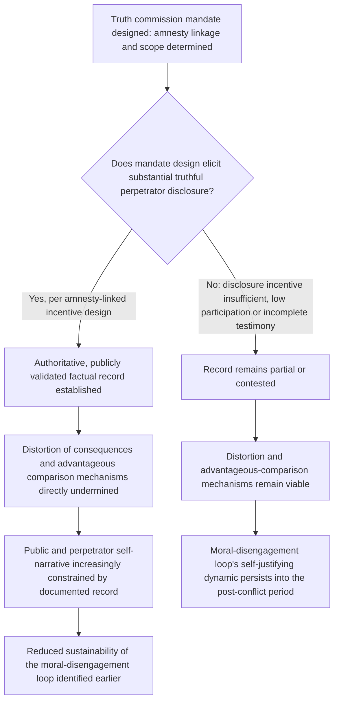

## Truth Commission Design and Mandate Variation

### Positioning: From Security Guarantees to the Moral-Disengagement Reversal Problem

Recall that dehumanization and moral disengagement mechanisms were formally modeled as operating on the moral-sanction term $S$, permitting mass atrocity while leaving underlying moral standards technically intact, and that this loop was shown to be self-reinforcing through post-hoc justification once violence begins. Recall further that transitional justice mechanisms were flagged in that treatment as designed, in part, to reverse this loop by re-establishing an accurate, socially validated account of harm and responsibility. This item develops the primary institutional instrument for that reversal — the truth commission — as a formal design problem with its own internal typology, trade-offs, and interaction effects with the security-guarantee and DDR mechanisms already covered.

### Formal Definition and the Core Design Function

**Truth commission**, defined precisely: a temporary, officially sanctioned body established to investigate and publicly document a pattern of past human rights violations or atrocities, typically covering a defined historical period, with a mandate distinct from and usually not equivalent to criminal prosecution. The core formal function, connecting directly to the moral-disengagement reversal logic: a truth commission's central output — an authoritative, publicly validated factual record — directly targets the **distortion of consequences** and **advantageous comparison** disengagement mechanisms specifically, since both operate by permitting perpetrators and bystanders to maintain a distorted or minimized account of what occurred; an officially documented, difficult-to-deny record removes the informational ambiguity those specific disengagement mechanisms exploit.

$$\text{Truth commission function:} \quad P(\text{distortion of consequences sustainable}) \downarrow \; \text{given an authoritative, publicly validated record}$$

This is a distinct mechanism from criminal prosecution's function (which operates primarily on **displacement of responsibility** and **diffusion of responsibility** by assigning individual legal accountability), meaning truth commissions and prosecutions are not substitutes addressing the same disengagement mechanism but complements addressing different mechanisms within Bandura's eight-part framework — a formal basis for the frequently observed practice of pairing truth commissions with parallel or sequential prosecutorial processes rather than treating them as alternative, mutually exclusive transitional justice choices.

### The Central Design Trade-off: Amnesty-Linked Testimony Versus Prosecutorial Deterrence

The most consequential mandate-design variable, and the one generating the most substantial cross-national variation, concerns whether truth-commission testimony is linked to conditional amnesty from prosecution. This generates a direct formal trade-off structurally analogous to the costly-signaling separating-equilibrium logic developed earlier:

$$\text{Amnesty-linked testimony} \implies \text{higher perpetrator willingness to testify truthfully (lower cost of disclosure)}$$

$$\text{No amnesty linkage} \implies \text{stronger deterrent and accountability function, but lower perpetrator disclosure incentive}$$

Where testimony carries genuine legal jeopardy (no amnesty protection), a rational perpetrator faces the same incentive to misrepresent that the crisis-bargaining private-information treatment identified as blocking credible cheap-talk communication: truthful, complete disclosure is individually costly, and a perpetrator has strong incentive to minimize, deny, or shift blame rather than provide the accurate account the commission's core function requires. Conditional amnesty functions as a mechanism-design solution to this specific incentive problem, directly analogous to reducing the "cost of the signal" in the separating-equilibrium framework: by removing the legal-jeopardy cost of truthful disclosure, amnesty-linked mandates are designed to elicit the very disclosure that a purely prosecutorial mandate's incentive structure would suppress.

[Inference] This generates the central, unresolved normative and empirical tension in the transitional justice literature: amnesty-linked disclosure mechanisms plausibly maximize the *truth* function (per the mechanism-design logic above) at a direct cost to the *accountability and deterrence* function that critics argue is independently necessary both for moral and justice reasons and for the deterrent effect prosecutorial risk provides against future violations — a trade-off without a formal dominant solution, since the two objectives (maximal truth disclosure and maximal accountability) are in direct tension via the same underlying incentive mechanism.

### The South African TRC as the Canonical Conditional-Amnesty Design

[Inference] South Africa's Truth and Reconciliation Commission (1996–1998, under the Promotion of National Unity and Reconciliation Act) is the most extensively analyzed conditional-amnesty design: individual amnesty was available to perpetrators who provided full and truthful disclosure of politically motivated acts committed in pursuit of a political objective, with amnesty granted or denied by a dedicated committee based on the completeness and truthfulness of disclosure specifically, rather than granted unconditionally or automatically. This individualized, disclosure-contingent structure (rather than a blanket amnesty) is the design feature most frequently credited in the specialist literature with partially reconciling the truth-accountability trade-off: perpetrators faced a continued incentive to disclose fully (since incomplete or false disclosure risked amnesty denial and full prosecutorial exposure), while the commission still generated significant testimonial and documentary output feeding the broader public record function.

[Unverified: comprehensive empirical assessment of whether the South African TRC's specific design achieved a net-favorable balance between truth-elicitation and accountability relative to alternative designs is contested in the specialist literature, with critics on one side arguing amnesty grants for serious violations fell short of adequate accountability, and others noting the alternative counterfactual — a purely prosecutorial approach in South Africa's specific transitional political context — carries its own significant, and largely untested, feasibility and stability risks given the negotiated nature of the broader political settlement.]

### Mandate Scope Variation: Individual Versus Institutional/Structural Focus

[Inference] A second major design axis, somewhat independent of the amnesty-linkage question, concerns whether a commission's mandate is scoped toward documenting individual perpetrator acts and victim testimonies specifically, or toward a broader structural and institutional analysis of the conditions (state policy, economic structures, institutional complicity) that enabled the violations — a distinction with direct relevance to the identity-entrepreneurship and moral-disengagement mechanisms covered earlier, since a narrowly individual-acts-focused mandate may document *what* happened without addressing the elite-level rhetoric, institutional design, or economic incentive structures (per the outbidding and war-economy treatments) that enabled or incentivized the violations at a systemic level.

[Speculation] Whether broader structural-mandate commissions more effectively address the systemic, elite-level mechanisms covered throughout this framework, relative to narrower individual-focused commissions that may inadvertently reproduce an "individual bad actor" narrative obscuring the systemic incentive structures this curriculum's earlier chapters emphasize, is a plausible but not rigorously established comparative claim in the current transitional justice evaluation literature, which has more thoroughly documented individual-focused commission outcomes than structural-mandate variants specifically.

### Feedback Structure: Truth Commission Output as an Input to the Moral-Disengagement Reversal Loop

This structure makes explicit the direct causal link this item establishes back to the atrocity-dynamics treatment: a truth commission's success or failure at the disclosure-incentive design stage (node B) determines whether the commission actually interrupts the specific moral-disengagement mechanisms identified there, meaning truth commission design is not merely a symbolic or backward-looking exercise but has a direct, mechanism-level bearing on whether the psychological conditions that enabled the original violence remain sociologically available for future reactivation.

### Canonical Empirical Illustrations

[Inference] Beyond South Africa, Chile's National Commission on Truth and Reconciliation (the Rettig Commission, 1990–1991) is frequently cited as a contrasting design: it operated without an amnesty-granting function of its own (Chile's prior, separately-enacted 1978 self-amnesty law for the military government predated and operated independently of the commission), documenting individual cases and establishing an official record primarily through victim and witness testimony rather than perpetrator disclosure incentivized by the commission's own proceedings — illustrating that not all truth commissions employ the incentive-design logic central to the South African model, with correspondingly different truth-elicitation dynamics given the different testimonial incentive structure facing perpetrators in each case.

[Inference] Peru's Truth and Reconciliation Commission (2001–2003) is frequently analyzed as incorporating a more explicitly structural mandate component, examining root socioeconomic and political causes of the internal conflict alongside individual case documentation, offering a comparative case for the individual-versus-structural mandate-scope distinction discussed above. [Unverified: comparative assessment of whether Peru's more structurally-oriented mandate produced measurably different downstream reconciliation or institutional-reform outcomes relative to more narrowly individual-focused commissions elsewhere has not been established with strong causal confidence given the absence of controlled comparison across the small number of relevant cases.]

### Design Implications: What Peace Engineering Targets

Given the formal truth-accountability trade-off and the disclosure-incentive mechanism identified above, truth commission design targets careful calibration of amnesty linkage and mandate scope to the specific transitional context's political constraints and objectives:

- **Individualized, disclosure-contingent amnesty design over blanket amnesty where perpetrator testimony is a priority objective**: per the South African model's comparative advantage, conditioning amnesty on verified completeness and truthfulness of individual disclosure (rather than granting blanket or unconditional amnesty) preserves a continued incentive for truthful testimony while avoiding the accountability-vacuum critique associated with unconditional amnesty.
- **Explicit ex ante decision on the truth-accountability trade-off's acceptable balance, tailored to the settlement's broader political constraints**: since no mandate design formally dominates on both dimensions simultaneously, designers should explicitly determine, given the specific settlement's political feasibility constraints (including the SSR and DDR considerations covered elsewhere, since perpetrator populations frequently overlap with security-sector and former-combatant populations subject to those processes), which objective takes priority rather than defaulting to a template mandate design.
- **Structural mandate components paired with individual case documentation**: incorporating explicit investigation of the systemic mechanisms covered throughout this framework (elite incentive structures, economic drivers, institutional design failures) alongside individual perpetrator and victim documentation, directly connecting the commission's output to the broader mechanism-level diagnosis this curriculum emphasizes, rather than producing a record limited to individual acts disconnected from their systemic enabling conditions.
- **Sequencing and coordination with parallel prosecutorial mechanisms where both truth and accountability objectives are pursued**: given that truth commissions and prosecutions address different disengagement mechanisms rather than being substitutes, design coordination (temporal sequencing, information-sharing protocols, and clear jurisdictional boundaries between commission and court processes) can allow both mechanisms to operate complementarily rather than the commission's amnesty-incentive structure directly undermining a parallel prosecutorial track's own evidentiary or political viability.

**Related Topics:**

- Dehumanization and moral disengagement mechanisms in atrocity dynamics
- Third-party guarantees and peacekeeping as enforcement mechanisms
- South African Truth and Reconciliation Commission: design and comparative assessment
- Information asymmetry and costly signaling in crisis bargaining
- Prosecutorial transitional justice mechanisms and international criminal tribunals