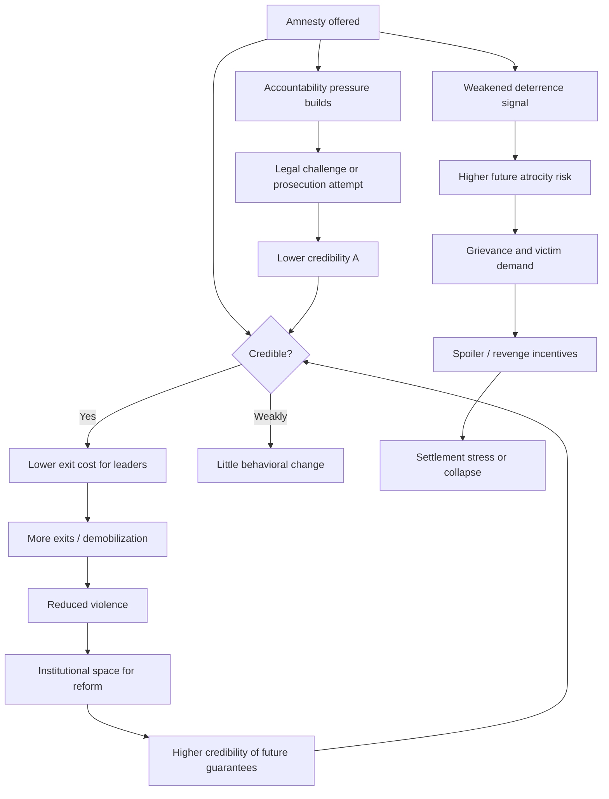
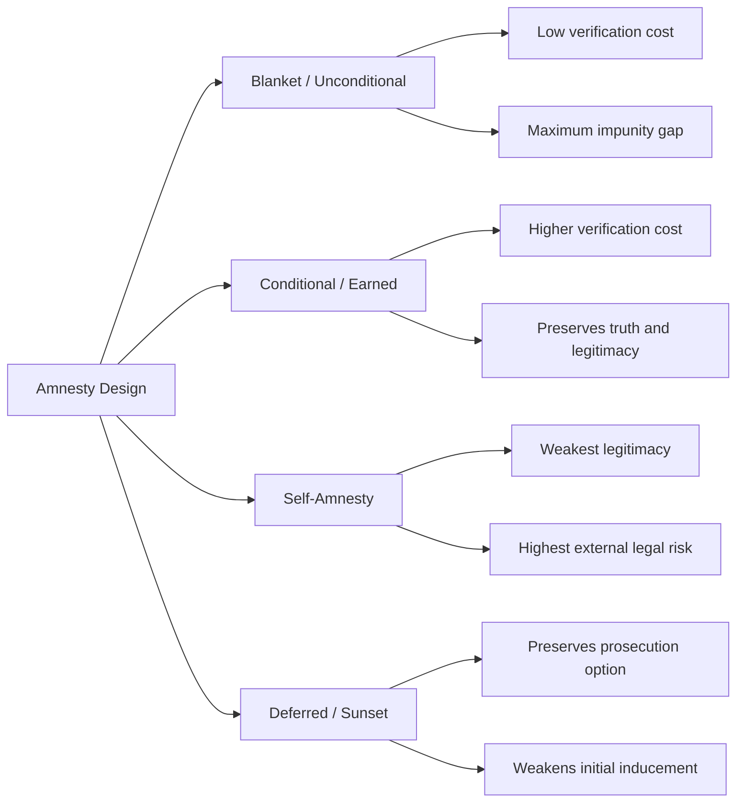

## Amnesty Design and the Peace-versus-Justice Trade-off


### Scope and Framing

This item treats amnesty as a **designed instrument** rather than a moral concession. The analytical question is: under what structural conditions does offering a leader, combatant, or state agent immunity from prosecution change the *incentive structure* of a conflict in ways that increase the probability of settlement and durable peace, and what does it cost in deterrence, legitimacy, and victims' rights?

**Key Points**

- Amnesty is a **commitment device and a price**: it purchases a change in behavior (exit, disarmament, surrender of power) by removing a future penalty.
- The "peace versus justice" framing is a **model of a trade-off frontier**, not a binary. Design choices (scope, conditionality, sequencing, forum) move a settlement along that frontier.
- The empirical literature is contested. Claims about aggregate effects of amnesties and prosecutions vary by dataset, coding scheme, and time window [Unverified as settled consensus].

**Definitions on first use**

- **Amnesty**: a legal act that extinguishes or suspends criminal liability, or bars prosecution, for a defined class of past conduct.
- **Blanket (unconditional) amnesty**: immunity granted with no individual requirements attached beyond membership in a class.
- **Conditional (earned) amnesty**: immunity contingent on individual acts such as full disclosure, disarmament, or participation in a truth process.
- **Self-amnesty**: immunity a regime grants to itself or its agents before or while relinquishing power.
- **Credible commitment**: a promise whose fulfillment does not depend on the promiser's future discretion, because reneging is costly or structurally blocked.
- **Deterrence (in this context)**: the reduction in future offending caused by the expected probability and severity of punishment.
- **Impunity gap**: the difference between the set of acts that occurred and the set that any accountability mechanism addresses.

---

### The Trade-off as a Formal Structure

#### A Minimal Model of a Leader's Exit Decision

Consider an incumbent leader (or armed group commander) choosing between **exiting** a conflict or regime and **continuing to fight or cling to power**. Let:

- $V_c$ = expected payoff from continuing (power, rents, survival)
- $V_e$ = expected payoff from exiting, absent any guarantee
- $p$ = probability of prosecution after exit
- $L$ = loss if prosecuted (imprisonment, asset seizure, reputational ruin)
- $A \in [0,1]$ = credibility-weighted probability that an offered amnesty is honored

The leader's expected exit payoff is:

$$V_e = V_e^{0} - p \cdot L \cdot (1 - A)$$

where $V_e^{0}$ is the payoff from exit if no prosecution risk existed. The leader exits when $V_e > V_c$, which gives a threshold condition:

$$p \cdot L \cdot (1 - A) < V_e^{0} - V_c$$

**Causal reading (variables and direction):**

| Variable | Change | Effect on exit likelihood |
| --- | --- | --- |
| $A$ (amnesty credibility) | increases | increases |
| $p$ (prosecution probability) | increases | decreases |
| $L$ (severity of sanction) | increases | decreases |
| $V_c$ (payoff from continuing) | increases | decreases |

The critical term is $A$. **Offering** amnesty is cheap; making it **believed** is the design problem. A leader who anticipates that a successor government, international court, or foreign prosecutor may override the amnesty will discount $A$ toward zero, and the amnesty purchases nothing.

**Model assumptions and where they break down**

- Assumes a **unitary rational actor**. In practice, leaders face principal-agent problems with their own commanders, who may have separate exposure and separate incentives.
- Assumes $p$, $L$, and $A$ are commonly estimated. In practice, actors hold heterogeneous, sometimes wildly inaccurate beliefs about legal exposure.
- Treats amnesty as the only variable. Exile options, asset protection, and security guarantees are often substitutes or complements.
- Omits the **spoiler** channel: actors excluded from the amnesty may sabotage the settlement (see below).

#### The Justice Side: A Deterrence and Legitimacy Model

Prosecution is defended on two distinct mechanisms, which the trade-off literature often conflates:

1. **Deterrence mechanism**: expected accountability lowers future atrocity. Let $D$ be aggregate deterrence, approximated as:

$$D \propto p_{\text{global}} \cdot L_{\text{global}}$$

where $p_{\text{global}}$ is the perceived probability that *any* future perpetrator faces prosecution. Note that deterrence is a property of the **system-wide expectation**, not of any single case. A single amnesty can degrade $p_{\text{global}}$ by signaling that immunity is negotiable.

2. **Legitimacy and norm-reinforcement mechanism**: prosecution (or a comparable acknowledgment) restores victims' standing and reasserts a rule that certain conduct is unacceptable. This operates through social expectation, not individual calculation, and is not captured by the $D$ formulation.

This distinction matters for design: a mechanism can preserve legitimacy (acknowledgment, truth-telling) while relaxing deterrence-oriented punishment, which is precisely why conditional designs exist.

---

### Feedback Loop Structure

Two competing loops govern how amnesty interacts with the conflict system.

**Reinforcing loop R1 (peace-enabling)**: Credible amnesty → lower exit cost for leaders → more leaders exit → lower violence → greater political space for institution building → greater credibility of future guarantees → (back to) credible amnesty.

**Reinforcing loop R2 (impunity-erosion)**: Broad amnesty → weakened deterrence → higher future atrocity risk → more victims and grievance → weaker legitimacy of the settlement → higher incentive for spoilers and revenge → renewed violence → demand for new amnesty.

**Balancing loop B1 (accountability pressure)**: Amnesty granted → domestic and international pressure for accountability rises → prosecution attempts or legal challenge → lower $A$ for the current and future leaders → amnesty becomes less effective as an incentive.



**Reading the diagram**: the design objective is to keep the R1 loop dominant while dampening R2 and B1. Each design parameter below is a lever on one of these loops.

---

### The Design Space

Amnesty is not one instrument. It is a configuration across at least six dimensions.

#### 1. Scope: Who Is Covered

| Scope choice | Effect | Risk |
| --- | --- | --- |
| **Leaders only** | Targets the decision-makers whose exit is the bottleneck | Rank-and-file left exposed, creating spoilers |
| **Rank-and-file only** | Encourages defection and demobilization | Leaders continue fighting, leaving the decision structure intact |
| **All combatants** | Removes exposure across the organization | Maximum impunity gap |
| **State and non-state actors symmetrically** | Perceived fairness, supports settlement legitimacy | Extends immunity to state agents, often the harder political sell |

**Design principle**: the coverage set should match the set of actors whose defection would otherwise sink the settlement. This is the **spoiler-coverage principle**: an amnesty that excludes a faction with veto capacity has not closed the failure mode it was meant to address.

*Spoiler problem (definition)*: a party to a conflict who believes a peace process threatens its interests and uses violence to undermine it.

#### 2. Offense Coverage: What Conduct Is Covered

Common tiers:

- **Political offenses** (rebellion, sedition, unlawful assembly): almost universally amnestiable.
- **Ordinary crimes** committed in the conflict (theft, assault): usually amnestiable within limits.
- **Grave violations**: war crimes, crimes against humanity, genocide, torture, enforced disappearance. Under prevailing international law and jurisprudence, blanket amnesty for these is widely regarded as impermissible or non-binding on international and foreign courts. The exact bounds vary across treaties, courts, and jurisdictions and are actively debated [Unverified as uniform across all forums].

**Design consequence**: the offense boundary determines the **legal durability** of the amnesty. An amnesty that covers grave violations has a lower effective $A$ against external forums, even if domestically enforceable.

#### 3. Conditionality

Conditional designs attach obligations to immunity. Common conditions:

- Full and truthful disclosure of crimes
- Disarmament and demobilization verification
- Reparations or contribution to a reparations fund
- Non-recidivism (loss of amnesty upon reoffending)
- Individual application and review (rather than class-wide grant)

**Mechanism**: conditionality converts amnesty from a **one-time gift** into a **repeated-game structure**. The recipient must continue complying to retain protection, which raises the recipient's cost of defecting from the settlement.

Let $c$ be the ongoing compliance cost and $\delta$ the discount factor. Compliance is sustained when:

$$\frac{\text{benefit of retained immunity}}{1 - \delta} > c + \text{one-shot gain from defection}$$

This is the standard grim-trigger sustainability condition for a repeated game, adapted here. It requires that **the threat of losing amnesty is itself credible**, which depends on a functioning enforcement body.

#### 4. Timing and Sequencing

- **Ex ante (pre-settlement) amnesty**: offered to induce negotiation. Strong inducement, but cannot be conditioned on outcomes that have not yet occurred.
- **Concurrent amnesty**: granted as part of the settlement package. Allows trades against disarmament and power-sharing terms.
- **Ex post (post-transition) amnesty**: granted after the new order stabilizes, often by a legislature or court. Weaker inducement value but higher democratic legitimacy.
- **Sunset or deferred prosecution**: prosecution is suspended for a fixed period or until a condition is met, then reactivated. This preserves justice as an option without threatening the initial bargain.

**Design consideration**: sequencing interacts with the **time-inconsistency** problem. Recall that a commitment problem arises when a party cannot credibly promise future behavior because its incentives change after the immediate bargain is struck. Once a leader has disarmed and exited, the new authority's incentive to honor the amnesty may weaken, since the leader has lost the coercive capacity that extracted the promise. Designs that lock in amnesty **before** the leader surrenders power (constitutional entrenchment, treaty incorporation, guarantor states) partially close this gap.

#### 5. Forum and Legal Basis

| Basis | Durability | Legitimacy | Vulnerability |
| --- | --- | --- | --- |
| Executive decree | Low | Low | Reversible by successor |
| Legislative statute | Medium | Medium | Subject to constitutional or judicial review |
| Constitutional provision | High (domestically) | Medium to high | Still exposed to international forums |
| Peace agreement with treaty status | Medium to high | Depends on ratification | Contested against jus cogens obligations |
| Referendum-ratified | High legitimacy | High | Can still conflict with international law |

Referendum ratification confers **democratic legitimacy** but does not, by itself, immunize against international or foreign prosecution. Courts in several regional human rights systems have held that even popularly approved amnesties cannot override certain state obligations [Unverified across all systems; treat as jurisdiction-dependent].

#### 6. Verification and Enforcement

Without verification, conditional amnesty degrades into a blanket amnesty by default. Required components include:

- A **body with authority to grant, review, and revoke** individual amnesty status
- **Evidentiary standards** for disclosure claims (how is "full disclosure" tested?)
- **Independent monitoring** of disarmament conditions
- **Revocation triggers** and due-process guarantees for the recipient

---

### Typology of Amnesty Designs



**Trade-off summary across types**

| Design | Inducement strength | Legitimacy | Deterrence preserved | Verification burden |
| --- | --- | --- | --- | --- |
| Blanket | High | Low | Low | Low |
| Conditional | Medium to high | Medium to high | Medium | High |
| Self-amnesty | High (to recipient) | Very low | Very low | Low |
| Deferred/sunset | Medium | Medium | Medium to high | Medium |

---

### The Peace-versus-Justice Frontier

Treat the two goals as outcomes on axes:

- $P$ = probability of settlement and its durability
- $J$ = extent of accountability delivered (truth, punishment, reparation)

A design $d$ maps to a point $(P(d), J(d))$. The set of achievable points forms a **frontier**. Three observations follow:

1. **The frontier is not necessarily downward-sloping everywhere.** Conditional amnesty with truth-telling requirements may increase $J$ (through disclosure) with little reduction in $P$, placing it on a higher segment of the frontier than a blanket amnesty.
2. **The frontier shifts with context.** Where the leader has strong exit options (asylum, military stalemate is not costly), the $P$-cost of denying amnesty is lower. Where the leader faces certain defeat and certain prosecution, denial of any protection can produce a "nothing-to-lose" escalation.
3. **Dynamic effects change the frontier.** A design that yields high short-run $P$ but erodes $D$ can shift the frontier inward in later periods (higher future atrocity risk). Evaluate designs across time, not at settlement signing.

**Illustrative dynamic evaluation**

Let $P_t$ be peace stability at time $t$. A designer with discount rate $\rho$ evaluates a design by:

$$W(d) = \sum_{t=0}^{T} \rho^{t} \left[ \alpha P_t(d) + (1-\alpha) J_t(d) \right]$$

where $\alpha$ weights peace against justice. This makes the weighting **explicit** rather than implicit. It exposes that disagreements between "pragmatists" and "legalists" are often disagreements about $\alpha$ and $\rho$, not about the empirical facts, which are separable questions.

---

### Empirical Mechanisms and Cases

Cases below are used as evidence for specific mechanisms, not as a chronological survey. Characterizations are simplified; consult primary and scholarly sources for detail.

#### Mechanism: Conditional Amnesty Linked to Disclosure (South Africa)

The post-apartheid Truth and Reconciliation Commission's amnesty committee granted individual amnesty in exchange for full disclosure of politically motivated acts. The design **conditioned immunity on truth**, and offered a legal penalty (prosecution) for those who did not apply. This is an instance of **conditionality creating a repeated-game-like incentive**: the credible threat of prosecution for non-applicants gave the conditional offer its value. Critics note that the prosecution threat was weakly enforced in practice, and that reparations were limited relative to expectations [interpretation varies across scholarship].

#### Mechanism: Amnesty Overridden by External Forums (Latin American Self-Amnesties)

Several Southern Cone military regimes granted themselves amnesty before transition. Subsequent domestic annulment and regional human rights court rulings reopened prosecutions in multiple states. This illustrates **credibility decay ($A \to 0$)** over time: self-amnesties bought short-run security for the outgoing regime but did not remain credible once the balance of power shifted and external legal forums developed. The lesson for design is that amnesty durability depends on the **future distribution of power**, not just present bargaining strength.

#### Mechanism: Amnesty and Justice as Complements in Some Contexts (Sierra Leone)

The Lomé Peace Agreement included a broad amnesty, and a later Special Court prosecuted those bearing greatest responsibility, alongside a Truth and Reconciliation Commission. The case is used to illustrate that **amnesty and prosecution can coexist through a division of labor**: broad immunity for lower-level actors, targeted prosecution for senior figures. It also illustrates the **legal fragility** of a broad amnesty when the international community later declines to treat it as binding for grave crimes.

#### Mechanism: Prosecution Threat and Escalation Risk (International Criminal Court Debate)

Arrest warrants against sitting leaders are argued by some to reduce those leaders' willingness to negotiate exit (the "nothing to lose" effect) and by others to strengthen deterrence and marginalize the indicted actor. Empirical work is mixed, and results depend on coding of outcomes and case selection [Unverified as settled]. The design implication is that **prosecutorial timing and reversibility** matter: a warrant that cannot be paused offers the target no reason to negotiate, while a deferrable process retains leverage.

#### Mechanism: Amnesty Rejected by Referendum or Legal Review (Colombia)

Colombia's peace process combined a transitional justice system with reduced sanctions for full confession and exclusion of the gravest crimes from blanket amnesty. A national referendum on the first agreement was rejected, a revised agreement was adopted through legislative channels. This case is used to show the **legitimacy cost of an amnesty perceived as too generous** and the **design response of conditional, differentiated sanctions** rather than blanket immunity.

---

### Design Failure Modes and What They Close Off

| Failure mode | Cause | Design response |
| --- | --- | --- |
| **Spoiler violence** | Excluded faction with veto capacity | Broaden coverage to veto-capable actors, or pair exclusion with credible security guarantees |
| **Credibility collapse** | Successor or external forum overrides amnesty | Entrench legally; involve guarantors; align with international law bounds |
| **Impunity backlash** | Victims and civil society reject settlement | Conditionality, truth mechanisms, reparations, victim participation |
| **Moral hazard** | Future actors expect amnesty as routine | Limit scope; publicize that grave crimes remain prosecutable; avoid serial amnesties |
| **Verification failure** | "Conditional" amnesty not actually enforced | Independent body, evidentiary standards, revocation authority |
| **Selective application** | Amnesty applied asymmetrically between factions | Symmetry rules, independent review, published criteria |
| **Time inconsistency** | Guarantor incentives change post-transition | Front-load guarantees, tie to reversible incentives, use external enforcement |

---

### Design Checklist

**Example: Structured Design Questions for a Given Conflict**

1. **Whose exit is the bottleneck?** Identify actors whose continued fighting or refusal sustains the conflict. Coverage should include them.
2. **Who has spoiler capacity?** Map factions with the ability to veto the settlement through violence, and determine whether excluding them is affordable.
3. **What is the minimum credible offense boundary?** Determine which acts cannot be covered without collapsing legal credibility. Retain prosecution or alternative accountability for those.
4. **What conditions can be verified?** Only attach conditions the verifying body can actually test.
5. **What is the legal basis and its external exposure?** Assess whether the chosen forum protects against successor reversal and against foreign or international courts.
6. **What substitutes for prosecution are offered to victims?** Truth, reparations, institutional reform, memorialization, guarantees of non-repetition.
7. **What is the revocation and sunset structure?** Define what triggers loss of protection and whether prosecution can be deferred rather than waived.
8. **How will the deterrence signal be managed?** Decide how the design communicates that grave crimes remain unacceptable.

**Illustrative pseudo-specification of a conditional amnesty regime**

```plaintext
AMNESTY_REGIME:
  applicant_class: combatants of parties to agreement
  eligibility:
    - individual_application: required
    - disarmament_verified: required
    - full_disclosure: required (tested against evidence)
  excluded_offenses:
    - genocide
    - crimes_against_humanity
    - war_crimes_of_greatest_gravity
  benefits:
    - extinction_of_criminal_liability for covered offenses
    - alternative_sanction for excluded offenses if full confession (non-custodial, restorative)
  obligations:
    - contribute_to_reparations: true
    - non_recidivism: true
  enforcement:
    - review_body: independent, mixed national/international
    - revocation_trigger: false_disclosure, reoffending
  legal_basis:
    - constitutional_entrenchment: true
    - peace_agreement_incorporation: true
  sunset:
    - application_window: fixed period
    - review_after: defined interval
```

The specification above is a schematic illustration of design parameters, not a template drawn from a specific real regime.

---

### Limits of the Model

- **Endogeneity**: amnesties tend to be offered where conflicts are hardest to end, so naive comparisons of outcomes with and without amnesty are confounded. Interpreting observed correlations causally is unreliable without identification strategies.
- **Measurement**: "peace duration" and "justice delivered" are contestable constructs; results shift with operationalization.
- **Normative content**: the trade-off model can be applied descriptively, but the choice of weight $\alpha$ is a normative judgment that no formal model resolves.
- **Legal indeterminacy**: the permissible scope of amnesty under international law is unsettled in some respects, and forum-specific.
- **Behavior may vary**: predicted incentive effects depend on actors' beliefs, institutional context, and enforcement capacity, none of which are captured fully by the formal sketches above.

---

**Conclusion**

Amnesty is best analyzed as a configurable instrument that trades deterrence and retributive accountability for a change in the exit incentives of key actors. Its effectiveness hinges on **credibility ($A$)**, **coverage of veto-capable actors**, and the **availability of substitute accountability mechanisms**. Conditional, differentiated, legally entrenched designs tend to sit on a more favorable segment of the peace-justice frontier than blanket or self-granted amnesties, though the empirical record is contested and context-dependent. The design task is to close specific failure modes (spoilers, credibility decay, impunity backlash) without opening others.

**Related Topics**

- Credible commitment and time-inconsistency in settlement design
- Spoiler problems and inclusion-exclusion trade-offs
- Truth commissions: design, mandate, and verification
- Hybrid and internationalized tribunals
- Reparations programs and transitional victim compensation
- Vetting and lustration as alternatives to prosecution
- International criminal law limits on amnesty (jus cogens, complementarity)
- Guarantor mechanisms and third-party enforcement
- Deterrence effects of international prosecution: empirical evidence
- Guarantees of non-repetition and institutional reform