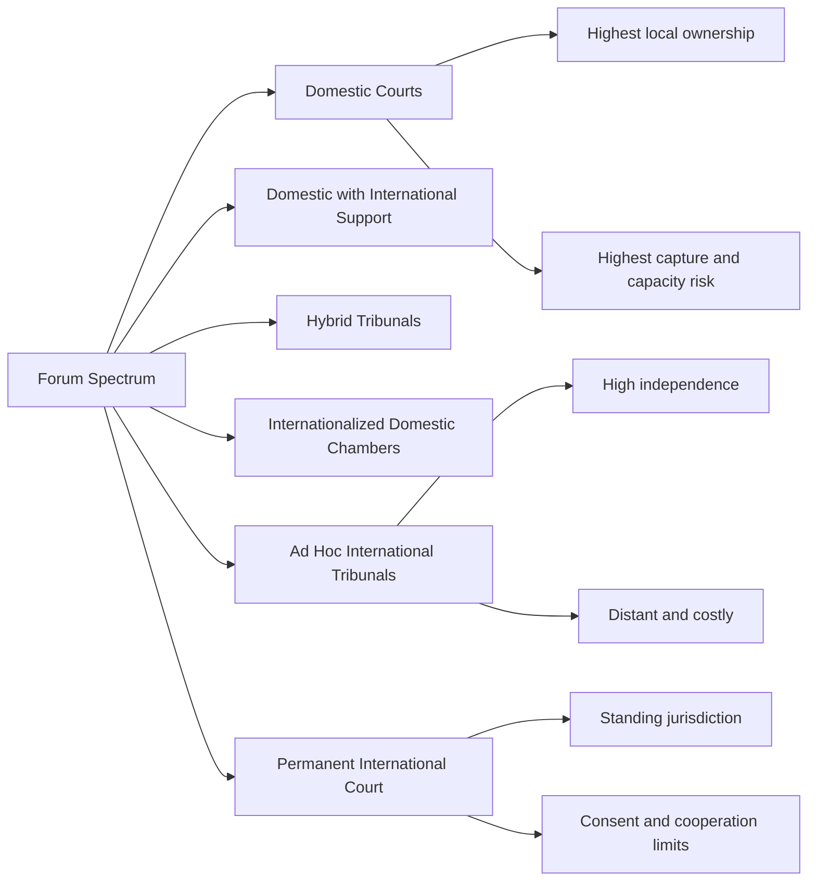
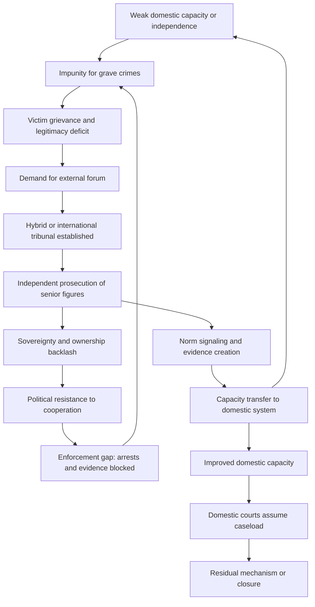

## Hybrid and International Tribunals versus Domestic Judicial Capacity


### Scope and Framing

This item treats the choice of **forum** for prosecuting mass atrocity as a design problem with measurable inputs: the capacity and independence of the domestic judiciary, the political feasibility of external involvement, and the legitimacy and cost profile of each institutional form. The organizing question is: given a post-conflict state's judicial condition and the interests of the actors who control the transition, which forum architecture (purely domestic, hybrid, internationalized, or fully international) best closes the specific failure modes of impunity, capture, and illegitimacy, and what does each architecture cost?

**Key Points**

- Forum choice is a **capacity-legitimacy-sovereignty trade-off**: moving prosecution outward from domestic courts generally raises independence and technical capacity while lowering local ownership and raising cost.
- **Hybrid tribunals** blend national and international personnel, law, and location, and are the main institutional attempt to relax this trade-off rather than choose a corner.
- **Complementarity** (national courts have priority; international courts act where states are unwilling or unable) converts forum choice into a **strategic game** between the state and the external court.
- The empirical literature on legacy effects (capacity transfer, rule-of-law spillovers) is thinner and more contested than the institutional literature suggests [Unverified as settled].

**Definitions on first use**

- **Domestic judicial capacity**: the combined ability of a national legal system to investigate, prosecute, adjudicate, and enforce judgments in complex, high-volume, or politically sensitive cases, including physical security, evidentiary infrastructure, trained personnel, and procedural law adequate to the crimes.
- **Judicial independence**: insulation of judges and prosecutors from removal, coercion, or instruction by political or armed actors with a stake in case outcomes.
- **International tribunal**: a court established by treaty or Security Council action, staffed and located outside the affected state, applying international law.
- **Hybrid (internationalized) tribunal**: a court combining national and international judges, prosecutors, staff, or applicable law, typically located in or near the affected state.
- **Complementarity**: the principle that a state's jurisdiction takes priority and an external court may proceed only when the state is unwilling or genuinely unable to prosecute.
- **Positive complementarity**: an approach in which the external court or its supporters actively help national systems build capacity to prosecute, rather than merely displacing them.
- **Legacy (capacity transfer)**: the durable improvement in national institutions attributable to an external or hybrid court's operation.
- **Jurisdictional design variables**: temporal, territorial, personal (who), and subject-matter (which crimes) limits on a court's authority.

---

### The Forum Choice as a Multi-Criteria Problem

#### Variables and Direction of Causation

Let a designer choose a forum $f$ from the set $\{\text{domestic}, \text{hybrid}, \text{international}\}$. Each forum yields an outcome profile along four dimensions:

- $I(f)$ = judicial independence from the parties to the conflict
- $C(f)$ = technical capacity (evidence handling, complex-case competence, security)
- $L(f)$ = local legitimacy and ownership
- $K(f)$ = cost and time per case

A simple aggregate evaluation with weights $w_i$:

$$U(f) = w_I \cdot I(f) + w_C \cdot C(f) + w_L \cdot L(f) - w_K \cdot K(f)$$

**Causal reading (direction of effects, general tendencies):**

| Move from domestic toward international | $I$ | $C$ | $L$ | $K$ |
| --- | --- | --- | --- | --- |
| Independence from local combatants | increases |  |  |  |
| Technical capacity |  | increases |  |  |
| Local ownership and legitimacy |  |  | decreases |  |
| Cost and duration |  |  |  | increases |

These are **tendencies, not laws**. A well-resourced, independent domestic court can dominate on all four dimensions, and a poorly designed hybrid court can perform worse than a domestic one on legitimacy and independence. Behavior varies by institutional detail.

**Model assumptions and where they break down**

- Assumes dimensions are **separable and additively weighted**. In practice they interact: low local legitimacy reduces witness cooperation, which reduces effective capacity.
- Treats each forum as a **fixed type**. Forums are heterogeneous (a hybrid court with an international majority behaves differently from one with a national majority).
- Ignores **who controls forum choice**. The transition's power holders often select the forum that minimizes their own exposure, so the "optimal" forum for the population may not be politically available.
- Omits **dynamic effects**: a domestic court may improve through capacity building, changing $I$ and $C$ over time.

---

### The Institutional Spectrum



#### Forum Types Compared

| Forum type | Location | Personnel | Applicable law | Typical legitimating basis |
| --- | --- | --- | --- | --- |
| **Domestic court** | In-country | National | National (possibly incorporating international crimes) | State sovereignty |
| **Domestic with external support** | In-country | National, with seconded advisors or mentors | National | Bilateral or multilateral assistance |
| **Internationalized domestic chamber** | In-country | Mixed, embedded in national system | National plus international | Domestic statute with treaty support |
| **Hybrid tribunal** | In or near country | Mixed national and international | Mixed | Treaty or agreement between state and international body |
| **Ad hoc international tribunal** | Outside country | International | International | Security Council or similar authority |
| **Permanent international court** | Outside country | International | International (statute-defined) | Treaty; standing jurisdiction subject to consent and referral rules |

The categories are **ideal types**. Actual institutions occupy positions on continuous dimensions (personnel mix, applicable law, location, governing authority), and scholarly classification of any single tribunal varies.

---

### The Complementarity Game

Recall that complementarity gives national courts priority and permits an external court to act only where the state is **unwilling or unable** genuinely to prosecute. This produces a **strategic interaction** between the state and the external court.

#### A Simplified Game

Players: a **State** (S) controlling the transition, and an **External Court** (E).

- S chooses between: **(a)** genuine domestic prosecution, **(b)** sham or no prosecution, **(c)** invite hybrid or external involvement.
- E chooses between: **(i)** defer to S, **(ii)** intervene.

Let $\pi_S$ denote the state's payoff from controlling outcomes, $c_p$ the state's cost of genuine prosecution (including exposure of its own agents), and $c_s$ the sovereignty cost of external involvement.

The state prefers a forum that minimizes exposure of its supporters. If genuine prosecution is costly ($c_p$ high) and external intervention is a credible threat, the state may prefer **a controlled hybrid arrangement** (which it partly steers) over facing an independent international court with full autonomy.

**Causal reading:**

- Higher **credibility of external intervention** → state incentive shifts from sham prosecution toward either genuine domestic action or negotiated hybrid arrangements.
- Higher **perceived political cost to the external court** of intervening (cooperation dependency, resource limits) → state incentive to shield its agents rises.
- Higher **state exposure ($c_p$)** → state resistance to any credible forum rises, external or domestic.

**The "shadow of the court" mechanism**: the mere availability of an external forum can induce domestic prosecutions the state would otherwise avoid, because a state facing possible external jurisdiction may prefer to control proceedings itself. Whether this produces genuine or merely performative domestic proceedings is the empirical question, and the evidence is mixed [Unverified as settled].

**Model assumptions and breakdown points**

- Assumes the state is a **unitary actor**. In practice, executive, judiciary, and military may have divergent preferences.
- Assumes E can credibly commit to intervene. External courts depend on state cooperation for arrests, evidence, and witness access, which weakens that commitment (see the enforcement gap below).
- The "unwilling or unable" standard is **interpretively contested**; its application requires judgments about intent and capacity that are difficult to observe.

---

### Diagnosing Domestic Judicial Capacity

Forum choice should be conditioned on an explicit capacity diagnostic. A useful decomposition:

| Capacity dimension | Diagnostic question | Failure signature |
| --- | --- | --- |
| **Personnel** | Are enough judges, prosecutors, defenders trained in complex or international crimes? | Case backlogs; reliance on untrained personnel; decimated bar after conflict |
| **Independence** | Can judges and prosecutors act without threat or instruction from implicated actors? | Removals, intimidation, reassignment of sensitive cases |
| **Physical security** | Can courts, witnesses, and staff be protected? | Witness recantation; attacks on court personnel |
| **Evidentiary infrastructure** | Are forensic, archival, and documentary systems available? | Lost records; no forensic capacity; chain-of-custody failure |
| **Substantive law** | Do national statutes criminalize the relevant conduct and permit modes of liability like command responsibility? | Only ordinary crimes available; statute of limitations or amnesty bars |
| **Procedural law** | Do procedures support large, complex cases with victim participation? | Procedural rules built for individual crimes; no victim standing |
| **Enforcement** | Can arrest warrants and sentences be executed, including against powerful defendants? | Defendants beyond reach; unenforced sentences |
| **Public trust** | Do victims and communities regard the judiciary as legitimate? | Low reporting; boycott of proceedings |

**Design principle**: the *bottleneck dimension*, not the average, should drive forum choice. A domestic system with strong personnel but no independence from implicated actors needs **independence-supplying** mechanisms (international judges, external prosecutors), while one with independence but scarce technical capacity needs **capacity-supplying** mechanisms (advisors, forensic support, mentoring).

**Unwilling versus unable** map onto different design responses:

- **Unable** (capacity deficit): capacity building, seconded expertise, evidentiary support, positive complementarity.
- **Unwilling** (independence or political deficit): mechanisms that remove control from implicated actors, such as international prosecutors or judges, external referral, or hybrid structures with veto protections.

---

### Design Levers Within Hybrid Tribunals

Hybrid tribunals are not a single design; they are a configuration across at least six levers.

#### 1. Composition and Control

- **Majority control**: whether international or national judges hold the majority, and whether decisions require a supermajority including at least one member from each group.
- **Prosecution structure**: independent international prosecutor, joint national-international office, or co-prosecutors with dispute-resolution rules.
- **Registry and administration**: who controls hiring, budget, and outreach.

**Mechanism**: control allocation determines **who bears the veto over politically sensitive cases**. Supermajority requirements that include an international judge give the international side a blocking role, while requirements that include a national judge give national actors a blocking role. Designs that give either side an unqualified veto can produce paralysis or capture.

#### 2. Jurisdictional Scope

- **Temporal**: the period of conduct covered.
- **Personal**: "senior leaders and those most responsible" versus all perpetrators.
- **Subject-matter**: international crimes, national crimes, or both.

**Mechanism**: a narrow personal jurisdiction ("those most responsible") makes the tribunal **cost-tractable** and politically less threatening, but produces a large impunity gap for lower-level offenders, which must be closed by domestic courts or alternative mechanisms. This is the source of the **division-of-labor design**: external or hybrid courts handle top-tier cases, domestic courts handle the remainder.

#### 3. Location and Outreach

- **In-country location** raises accessibility, local visibility, and potential legacy, but increases security exposure.
- **Out-of-country location** improves security and independence but reduces local salience.
- **Outreach programs** (community engagement, media, record-keeping access) affect legitimacy and are frequently underfunded relative to their importance.

#### 4. Applicable Law

- Applying international criminal law directly gives access to recognized modes of liability (command responsibility, joint criminal enterprise or equivalent doctrines, superior orders limitations) that some national codes lack.
- Applying national law preserves familiarity but may limit the crimes chargeable.
- Mixed applicable law can create **interpretive friction** between doctrines, sometimes producing inconsistent outcomes.

#### 5. Financing

- **Voluntary contributions** (donor-funded) create funding volatility and donor-leverage risk.
- **Assessed contributions** (treaty or UN-assessed) provide stability but require broader political support.
- **State contribution** increases ownership but can be a capture vector.

Funding structure affects **institutional independence over time**: a court dependent on year-to-year voluntary pledges faces resource shocks and donor pressure, which can shorten proceedings or narrow prosecutorial ambition [interpretation varies across scholarship].

#### 6. Legacy Provisions

- **Mentoring and training** national staff
- **Physical infrastructure** (courtrooms, archives) transferred to national institutions
- **Records custody**: who holds the archive after closure
- **Residual mechanism**: an institution handling appeals, witness protection, and enforcement after the tribunal closes

**Design consideration**: legacy is rarely automatic. Without explicit transfer mechanisms and budget, capacity built inside a tribunal often remains inside it, and departs with the international staff.

---

### Feedback Loop Structure



**Reading the loops**

- **Reinforcing loop R1 (capacity-building)**: tribunal operation → trained national staff and evidentiary infrastructure → higher domestic capacity → smaller tribunal caseload need → tribunal completion and domestic assumption of cases.
- **Reinforcing loop R2 (impunity-resistance)**: external prosecution of senior figures → sovereignty backlash and non-cooperation → weakened enforcement → incomplete accountability → renewed legitimacy deficit → renewed demand for external intervention.
- **Balancing loop B1 (complementarity pressure)**: credible external jurisdiction → state incentive to prosecute domestically → strengthened domestic capacity or performative proceedings → reduced external intervention need.

The design objective is to keep R1 and B1 dominant while dampening R2, which typically requires cooperation-securing arrangements (treaty obligations, Security Council backing, conditionality tied to aid or accession) rather than reliance on the tribunal alone.

---

### The Enforcement Gap

International and hybrid courts typically have **no independent enforcement capability**. They depend on states to:

- execute arrest warrants
- provide access to evidence and witnesses
- enforce sentences and provide detention facilities
- protect witnesses

**Mechanism**: the court's effective reach is bounded by the **cooperation of the very states whose leaders may be implicated**. Define the **cooperation constraint**: the probability that a warrant results in custody is a function of state cooperation $\kappa$:

$$P(\text{custody}) = \kappa \cdot q$$

where $q$ is the operational likelihood of successful arrest given cooperation. When $\kappa$ is near zero (a sitting head of state, a protective regional bloc), the court's warrants may be legally valid but practically inert.

**Design responses:**

- Treaty-based cooperation obligations with reporting and non-compliance findings
- Security Council enforcement backing where politically available
- Conditionality linking accession, aid, or trade to cooperation
- Prosecutorial strategies that prioritize cases where arrests are feasible (with attendant selectivity criticism)
- Sequencing warrants to coincide with shifts in the accused's protection

**Selectivity as a second-order problem**: when enforcement is feasible only against defeated or politically weak parties, tribunals face legitimacy criticism as instruments of "victor's justice" or of great-power selectivity. This is a **legitimacy externality of the enforcement gap**.

---

### Cases as Evidence for Mechanisms

Cases below illustrate specific mechanisms rather than provide a chronological survey. Characterizations are simplified, and scholarly assessments differ.

#### Mechanism: Independence Supply via International Majority (Ad Hoc International Tribunals)

The tribunals for the former Yugoslavia and Rwanda were established by Security Council action and located outside the affected states (or in a third state). They supplied **independence and technical capacity** unavailable domestically, and generated an extensive jurisprudence and evidentiary record. Criticisms include **distance from affected communities**, high cost and long duration, and limited direct capacity transfer. The mechanism illustrated is the **independence-capacity gain at the expense of ownership and cost** [assessments of overall impact remain contested].

#### Mechanism: Mixed Composition with Local Location (Sierra Leone)

The Special Court for Sierra Leone combined national and international judges and prosecutors, sat in-country, and focused on those bearing "greatest responsibility." It illustrates the **narrow personal jurisdiction design** and the **in-country location trade-off** (greater visibility, higher security burden). Its limited caseload left lower-level accountability to other mechanisms, and legacy for the national judiciary is assessed differently across analysts [Unverified as uniform].

#### Mechanism: Embedded Hybrid with Contested Control (Cambodia)

The Extraordinary Chambers in the Courts of Cambodia embedded international participation within the national court structure, with a **supermajority decision rule** designed to require at least one international judge's concurrence. It illustrates the **control-allocation lever** and the **risk of political interference** where national authorities resisted expansion of prosecutions beyond a small number of cases. Reports of disputes over further indictments are documented in secondary literature [details vary by source].

#### Mechanism: Internationalized Domestic Chamber (Bosnia and Herzegovina, Kosovo)

Chambers or panels with international judges and prosecutors were embedded in national systems in post-conflict Bosnia and Kosovo. They illustrate the **capacity-supply and independence-supply model within domestic structures** and the transitional problem of **handover**: transferring caseloads and responsibility to national institutions as international personnel withdrew, with uneven outcomes across cases [assessments vary].

#### Mechanism: Permanent Court and the Complementarity Game (International Criminal Court)

The ICC operates on the complementarity principle, with jurisdiction contingent on state ratification, referral by a state or the Security Council, or (in some cases) prosecutor-initiated investigation subject to judicial authorization. It illustrates the **enforcement gap**, the **selectivity critique**, and the **shadow-of-the-court** effect in which the prospect of ICC involvement may influence domestic proceedings. Empirical work on whether this shadow produces genuine domestic accountability is mixed [Unverified as settled].

#### Mechanism: Universal and Extraterritorial Jurisdiction as a Substitute Forum

National courts in third states have prosecuted atrocity crimes under universal or extraterritorial jurisdiction when the territorial state was unable or unwilling. This illustrates a **fallback forum** that expands the practical forum set beyond the formal spectrum, while raising **evidence-access and legitimacy** questions specific to trials held far from the crime scene [scope and use vary by jurisdiction].

---

### Design Failure Modes and Responses

| Failure mode | Cause | Design response |
| --- | --- | --- |
| **Capture of domestic proceedings** | Implicated actors control prosecutors or judges | International prosecutors or judges; supermajority rules; external referral |
| **Performative domestic prosecution** | State prosecutes low-level or symbolic cases to preempt external jurisdiction | Assessment criteria for genuineness in complementarity review; independent monitoring |
| **Enforcement gap** | Dependence on state cooperation | Treaty obligations; Security Council backing; conditionality; case prioritization by feasibility |
| **Legitimacy deficit (distance)** | External location, foreign personnel | In-country sittings; outreach; local participation; hybrid composition |
| **Legitimacy deficit (capture perception)** | Domestic court seen as partisan | Internationalization of key roles; transparent criteria; victim participation |
| **Cost and duration overrun** | Complex cases, large staff | Narrow personal jurisdiction; completion strategies; case-selection criteria |
| **No legacy** | Capacity stays inside tribunal | Formal mentoring; infrastructure and archive transfer; residual mechanism; budget for handover |
| **Impunity gap for lower-level offenders** | Narrow jurisdiction | Complementary domestic prosecutions; alternative mechanisms (truth, reparation, vetting) |
| **Funding volatility** | Voluntary donor funding | Assessed contributions; multi-year commitments; funding firewalls |
| **Political selectivity** | Only feasible targets prosecuted | Transparent selection criteria; external oversight; broad referral triggers |
| **Doctrinal friction** | Mixed applicable law | Clear hierarchy of norms; harmonization rules; training |

---

### Design Checklist

**Example: Structured Questions for Forum Selection in a Given Transition**

1. **Diagnose the bottleneck.** Is the primary deficit independence (unwilling), capacity (unable), security, or legitimacy? Score each dimension in the domestic capacity table.
2. **Identify who controls forum choice.** Which actors decide, and what is their exposure? Anticipate the forum they will prefer.
3. **Define the personal jurisdiction boundary.** Decide the tier of offenders for the external or hybrid forum, and specify which forum handles the remainder.
4. **Allocate control.** Specify composition, prosecutorial independence, and decision rules, including who holds vetoes.
5. **Secure cooperation.** Identify arrest, evidence, witness-protection, and enforcement mechanisms and their political backing before establishment.
6. **Place the forum.** Weigh in-country visibility against security and independence.
7. **Fund for independence.** Prefer funding structures that insulate the court from donor and state leverage.
8. **Build legacy explicitly.** Specify mentoring, infrastructure, archive custody, and residual functions with budget.
9. **Plan completion.** Define a completion strategy and criteria for handover, avoiding open-ended mandates.
10. **Link to complementary mechanisms.** Coordinate with truth processes, reparations, vetting, and amnesty design to avoid gaps and contradictions.

**Illustrative pseudo-specification of a hybrid tribunal charter**

```plaintext
HYBRID_TRIBUNAL_CHARTER:
  legal_basis: agreement between state and international organization, incorporated by statute
  location: in-country primary seat; out-of-country secure detention
  composition:
    judges: mixed; international majority in appeals chamber; supermajority rule requires at least one from each group
    prosecution: independent international prosecutor with national deputy; disputes resolved by independent panel
    defense_office: independent; funded from tribunal budget
    victims_unit: standing for participation and reparations recommendations
  jurisdiction:
    temporal: defined conflict period
    personal: those most responsible for gravest crimes
    subject_matter: genocide, crimes against humanity, war crimes, and designated national crimes
  applicable_law: international criminal law; national law for designated offenses; hierarchy clause
  cooperation:
    treaty_obligations: arrest, evidence, witness protection
    non_compliance_procedure: reporting to designated political body
    enforcement_backing: negotiated with guarantor states
  financing:
    core: assessed contributions
    supplemental: voluntary, no earmarking for case selection
  legacy:
    mentoring: structured, funded
    archive_custody: transfer plan to national archive with access rules
    residual_mechanism: appeals, witness protection, sentence supervision
  completion:
    strategy: defined, reviewed periodically
```

The specification is a schematic illustration of design parameters, not a template from a specific real institution.

---

### Limits of the Analysis

- **Endogeneity and selection**: tribunals are established where domestic capacity or willingness is lowest, so comparing outcomes across forum types without identification strategies confounds forum effects with conflict severity.
- **Outcome measurement**: "accountability," "legacy," and "legitimacy" are difficult to operationalize; results are sensitive to coding choices.
- **Counterfactual uncertainty**: the domestic-court counterfactual is unobserved for cases that went to external forums.
- **Heterogeneity**: institutions labeled "hybrid" differ substantially, and aggregate claims about the category obscure design differences.
- **Political economy**: forum availability depends on great-power interests, donor priorities, and regional politics that formal models omit.
- **Behavior may vary**: predicted incentive effects depend on actors' beliefs, institutional detail, and enforcement conditions, and the formal sketches above are simplifications.

---

**Conclusion**

The choice among domestic, hybrid, and international forums is best analyzed as a **conditional design problem**: identify the bottleneck in domestic capacity (independence, technical ability, security, or legitimacy), then select and configure the forum that supplies the missing element at the lowest cost to local ownership. Hybrid designs attempt to relax the capacity-legitimacy trade-off through mixed composition, in-country location, and explicit legacy provisions, but they inherit the **enforcement gap** and depend on state cooperation. Complementarity converts forum choice into a strategic game in which credible external jurisdiction can shift domestic behavior, though whether that shift produces genuine accountability is empirically contested. The durable design task is to combine narrow, feasible external prosecution of top-tier offenders with funded, verifiable capacity building so that domestic institutions can assume the remaining caseload.

**Related Topics**

- Complementarity doctrine: admissibility, "unwilling or unable," and positive complementarity
- Command responsibility and modes of liability in international criminal law
- Witness protection and security architectures for atrocity trials
- Residual mechanisms and tribunal completion strategies
- Universal jurisdiction and third-state prosecutions
- Truth commissions and their relationship to prosecution
- Vetting, lustration, and judicial sector reform
- Victim participation and reparations in tribunal design
- Cooperation regimes and Security Council enforcement
- Selectivity, legitimacy, and the politics of international criminal justice