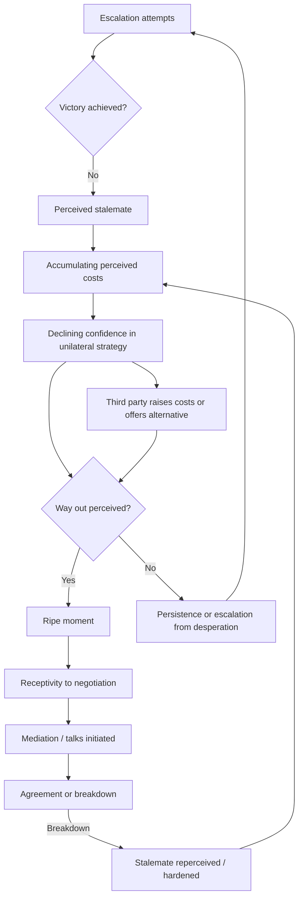

## Zartman's Ripeness Theory and Mutually Hurting Stalemate Conditions


### Scope and Framing

This item treats ripeness as a **decision-theoretic model of when conflicting parties become receptive to negotiation**, and examines its formal structure, its operational indicators, its critiques, and its implications for mediation design. The organizing question is: under what perceived conditions do parties abandon a unilateral strategy of escalation in favor of a negotiated exit, and can a third party engineer or exploit those conditions rather than passively wait for them?

**Key Points**

- Ripeness is a property of **parties' perceptions**, not of objective battlefield or economic conditions. A stalemate that no party perceives as painful and enduring is not ripe.
- The theory has **two necessary components**: a *push* (perceived costs of continuing) and a *pull* (perceived attractiveness of an available alternative). Pain alone does not produce negotiation.
- Ripeness is a **necessary but not sufficient** condition for negotiated settlement. It explains receptivity to talks, not the content or durability of the resulting agreement.
- The theory is **partly tautological** in its original form (ripeness is identified by the occurrence of negotiation), which motivates most subsequent methodological critiques.

**Definitions on first use**

- **Ripe moment**: a period in which the parties to a conflict are, by their own perception, receptive to a negotiated resolution.
- **Mutually hurting stalemate (MHS)**: a situation in which each party perceives that it cannot escalate to victory at acceptable cost, and that continuing the current course is painful and unlikely to improve.
- **Way out (or "pull" factor)**: the perception, by each party, that a negotiated alternative exists that is acceptable and achievable.
- **Impending catastrophe**: a perceived near-future sharp deterioration in a party's position, as distinct from a plateau of ongoing pain.
- **Mutually enticing opportunity (MEO)**: a proposed alternative modeling in which parties are drawn to negotiation by anticipated joint gains rather than pushed by shared pain.
- **Valid spokesperson**: a representative of a party with sufficient authority and internal legitimacy to negotiate and commit.
- **Escalation to victory (unilateral strategy)**: the pursuit of a settlement through force or coercion on one's own terms.
- **Perceptual condition**: a state of belief held by decision-makers, which may diverge from objective circumstance.

---

### The Core Theory

#### Origin and Logical Structure

The theory is associated with I. William Zartman's work from the mid-1980s onward and was developed through analysis of African and other conflicts and negotiation cases. The central claim is that **timing determines whether mediation succeeds**: the same offer, made by the same mediator, will succeed or fail depending on whether the parties perceive the moment as ripe.

The logical structure can be stated as a conditional:

$$R = \text{MHS} \wedge \text{WO}$$

where $R$ is the ripe moment, $\text{MHS}$ is the mutually hurting stalemate perception, and $\text{WO}$ is the perception of a **way out**. Negotiation onset $N$ is then modeled as:

$$R \Rightarrow \Pr(N) \uparrow$$

Note the direction: ripeness raises the *probability* of negotiation onset, it does not guarantee it. The theory is therefore a **probabilistic necessary-condition claim**, not a deterministic sufficiency claim.

#### The Two Components as Push and Pull

| Component | Mechanism | Variable direction | Failure if absent |
| --- | --- | --- | --- |
| **MHS (push)** | Perceived costs of continuing exceed perceived benefits of unilateral strategy | Higher perceived cost → lower attractiveness of continuing | Party sees continued fighting as viable; no incentive to concede |
| **Way out (pull)** | Perceived availability of an acceptable negotiated alternative | Higher perceived attractiveness of settlement → higher willingness to enter talks | Party is in pain but sees no acceptable exit; may escalate or persist from desperation |

The second component is often under-emphasized. **A party in severe pain that sees no acceptable alternative may double down** rather than negotiate, because concession appears to guarantee a worse outcome than continued struggle.

---

### Formalizing the Stalemate

#### A Minimal Decision Model

Consider a party $i$ choosing between continuing a unilateral strategy (escalate/persist) and entering negotiation. Let:

- $U_i^{c}$ = expected utility from continuing
- $U_i^{n}$ = expected utility from negotiated settlement
- $p_i$ = perceived probability that continuing achieves victory
- $V_i$ = value of victory to party $i$
- $C_i$ = perceived cumulative cost of continuing
- $S_i$ = perceived value of the best available negotiated outcome

Then:

$$U_i^{c} = p_i \cdot V_i - C_i, \qquad U_i^{n} = S_i$$

Party $i$ prefers negotiation when:

$$S_i > p_i \cdot V_i - C_i$$

**Causal reading (variables and direction):**

| Change | Effect on preference for negotiation |
| --- | --- |
| $p_i$ falls (victory seems less likely) | increases |
| $C_i$ rises (cost of continuing grows) | increases |
| $V_i$ falls (victory is worth less) | increases |
| $S_i$ rises (settlement looks more attractive) | increases |

The **stalemate** enters through $p_i$: a military or political stalemate lowers the perceived probability of victory. The **hurt** enters through $C_i$. The **way out** enters through $S_i$. This decomposition makes explicit that ripeness is a *joint* condition across three perceptual variables, and that a mediator can influence outcomes by moving $S_i$ (improving the perceived alternative) independently of $p_i$ and $C_i$.

**Both parties must satisfy the condition.** If the inequality holds for party A but not party B, negotiation may be initiated by A but not accepted, or accepted only as a tactical gesture. This yields a **two-sided requirement**:

$$S_A > p_A V_A - C_A \quad \wedge \quad S_B > p_B V_B - C_B$$

#### Model Assumptions and Where They Break Down

- Assumes **unitary rational actors** with stable preferences. In practice, coalitions, factions, and leaders with personal stakes may diverge from group interest.
- Assumes actors form **accurate or at least stable perceptions**. Leaders may misperceive costs, discount them, or manage them through repression or propaganda.
- Treats $S_i$ as exogenous. In practice, $S_i$ depends on **credibility of commitment** by the counterparty and guarantors (see commitment problems below).
- Ignores **domestic audience costs**: leaders may face punishment for conceding even when concession is rational in aggregate.
- Treats the decision as **one-shot**. In practice, parties may enter talks for reasons other than settlement (delay, legitimacy, rearmament), producing false ripeness signals.

---

### Components of the Mutually Hurting Stalemate

#### Stalemate: Deadlock of Unilateral Strategies

A stalemate is not merely the absence of battlefield movement. It requires that each party perceives **the failure of its escalation strategy** to yield victory at acceptable cost.

Indicators frequently used in the literature (interpretation varies by case and coder):

- Failed offensives or reversals
- Depletion of resources or exhaustion of manpower
- Loss of external patron support
- Frontlines that have stabilized despite repeated attempts to break them
- Recognition by leadership (statements, internal discussion, behavior) that military victory is unlikely

#### Hurting: Perceived Costs

The "hurt" can be **material** (casualties, economic damage), **political** (loss of domestic support, leadership challenge), or **reputational** (international isolation). The relevant quantity is **perceived cost relative to perceived stakes**, not absolute cost.

**Mechanism**: a party may tolerate very high absolute costs if the stakes are perceived as existential, and may negotiate at moderate costs if the stakes are perceived as negotiable. Ripeness therefore cannot be read directly off casualty counts or economic figures [Inference from the structure of the model].

#### Mutual: Symmetric Perception

The requirement that pain be **mutual** does not mean symmetric in magnitude. It means that **each party perceives itself as stuck**, regardless of the relative severity. Asymmetry raises the **bargaining-power question** of whether the party in less pain will accept terms favorable to the other.

#### The Role of Impending Catastrophe

A later refinement holds that a **sudden, sharp perceived threat** can substitute for or supplement a longer-term plateau. Parties may enter negotiation not because they have suffered protracted pain, but because they anticipate a near-term disaster (for example, an impending military defeat or a looming economic collapse). This is termed **impending catastrophe** and is sometimes treated as a distinct pathway to ripeness, applying most often to a party that would otherwise be winning or holding out, but perceives a coming reversal.

---

### The Pull Component: Way Out and Mutually Enticing Opportunity

#### The Way Out Requirement

A stalemate becomes ripe only when parties perceive that **a negotiated alternative is viable**. The way-out perception has three sub-components:

1. **Existence**: a feasible outcome is conceivable that is better than continued conflict.
2. **Acceptability**: the outcome would not amount to capitulation or unacceptable loss.
3. **Credibility of the counterparty and process**: the other side will actually honor the deal, and a viable negotiating channel exists.

Recall that a **commitment problem** arises when a party cannot credibly promise future behavior because its incentives will change after the immediate bargain. Commitment problems attack component (3): a party in a stalemate may refuse to negotiate not because it lacks pain, but because it does not believe the counterparty will honor an agreement, so the perceived value of the negotiated outcome $S_i$ is discounted toward zero.

#### Mutually Enticing Opportunity as Complement

A subsequent line of work argues that ripeness can arise from **anticipated joint gains** rather than shared pain, termed a mutually enticing opportunity. Examples in the literature include settings where a resolution unlocks economic cooperation or political benefits, so that parties are drawn to talks by opportunity as well as pushed by cost. Proponents present MEO as a complement to MHS, particularly where conflict costs are low-intensity or chronic, and critics note that MEO is harder to distinguish empirically from ordinary bargaining incentives [interpretation varies across scholarship].

---

### Ripeness as Perception: Objective versus Subjective

The theory's most important and contested claim is that **ripeness is perceptual**.

| Dimension | Objective view | Perceptual view (Zartman) |
| --- | --- | --- |
| Source of ripeness | Structural conditions (casualties, economic indicators) | Parties' interpretation of conditions |
| Role of mediator | Wait for conditions | Shape perceptions |
| Testability | Measurable indicators | Requires access to belief states |
| Risk | Missing perceptual mismatch | Circularity (ripeness inferred from outcome) |

**Design consequence**: if ripeness is perceptual, it is **partly manipulable**. A mediator or third party can attempt to:

- **Ripen the conflict** by raising the perceived cost of continuing (sanctions, arms restrictions, withdrawal of patron support).
- **Sweeten the alternative** by raising $S_i$ (guarantees, side payments, security assurances, face-saving formulas).
- **Reframe the stalemate** by conveying information that clarifies the deadlock or corrects overoptimistic beliefs.

This transforms ripeness from a passive diagnosis into a **design variable**, though the degree to which mediators can reliably manufacture ripeness is disputed.

---

### Feedback Loop Structure



**Reading the loops**

- **Balancing loop B1 (stalemate to negotiation)**: escalation failure → perceived stalemate → rising cost perception → reduced confidence in unilateral strategy → receptivity to negotiation → reduced escalation. This is the ripeness mechanism.
- **Reinforcing loop R1 (desperation trap)**: perceived stalemate without a way out → sunk-cost or existential framing → escalation or persistence → further costs → deeper stalemate. This loop explains why **pain alone can prolong conflict**.
- **Reinforcing loop R2 (failed talks hardening)**: negotiation breakdown → each party's belief that the other is not a credible partner → lower $S_i$ → reduced future receptivity. Failed premature talks can therefore **lower the probability of later ripeness**, a risk of premature mediation.

---

### Operationalizing and Testing Ripeness

#### Indicator Approach

| Concept | Candidate indicators | Measurement concern |
| --- | --- | --- |
| Military stalemate | Territorial control stability, offensive failures, casualty rates | Static frontline may reflect strategic patience, not deadlock |
| Perceived cost | Leadership statements, defections, protests, budget strain | Public statements can be strategic signaling |
| Way out | Response to third-party proposals, back-channel contact, softening language | Tactical engagement can mimic genuine openness |
| Leadership change | Turnover, factional realignment, emergence of a new valid spokesperson | Change may increase or decrease receptivity |
| Patron withdrawal | Reduction of external military or financial support | Effect depends on perceived substitutability |

#### The Circularity Problem

If ripeness is defined as the condition under which parties negotiate, then observing negotiation appears to confirm ripeness by construction, and the theory becomes **unfalsifiable** in that form. The principal defense is to specify ripeness indicators **independently of outcome**, then test whether they predict negotiation onset. Studies attempting this report mixed results [Unverified as settled], and the operationalization choices strongly influence findings.

**Model assumptions and breakdown points for empirical testing**

- **Perceptions are not directly observable.** Proxy indicators introduce measurement error.
- **Selection effects**: conflicts that receive mediation are not a random sample, so mediation success correlates with unobserved case characteristics.
- **Endogeneity**: negotiation itself changes perceptions, so ripeness measured during talks is contaminated by the process.
- **Case-study bias**: much of the foundational evidence comes from selected cases, which can overstate fit.

---

### Critiques and Alternative Framings

#### 1. Circularity and Unfalsifiability

Discussed above. Ripeness risks being an ex-post label for whatever preceded successful negotiation.

#### 2. Determinism and Passivity

The theory can be read as counseling mediators to **wait** for ripeness. Critics argue this legitimizes inaction during ongoing atrocities and neglects that mediators can act to alter conditions. Later formulations partly incorporate this by emphasizing the mediator's role in **ripening** conflict, though this shifts the theory toward a more interventionist stance.

#### 3. Neglect of Domestic and Leadership Politics

The model treats parties as unitary, while leadership incentives, factional struggles, and spoiler dynamics often determine whether stalemate perception translates into action. Recall that a **spoiler** is a party who believes a peace process threatens its interests and uses violence to undermine it. Spoilers can derail talks even when the principal parties are ripe.

#### 4. Sequencing and Process Critiques

Some scholars argue that negotiation itself can **generate** ripeness (parties discover joint gains and update beliefs through talks), so treating ripeness as a precondition reverses the causal arrow in some cases. This is the **process-generates-ripeness** critique, and it suggests a bidirectional relationship [interpretation varies].

#### 5. Alternative Frameworks

| Framework | Core claim | Contrast with ripeness |
| --- | --- | --- |
| **Rational-choice bargaining (information and commitment)** | War results from private information or commitment problems, so negotiation succeeds when these are resolved | Focuses on informational and credibility barriers rather than perceived pain |
| **Mediation-strategy models** | Mediator leverage, bias, and tactics affect outcomes | Emphasizes mediator agency over timing |
| **Readiness theory (Pruitt)** | Parties are ready when motivated to end conflict and optimistic about a negotiated outcome | Similar in spirit, with explicit motivation and optimism components |
| **Turning-point and leadership-focused approaches** | Leadership change and shifts in domestic coalitions drive negotiation | Locates cause in internal political change |

These are complementary lenses rather than mutually exclusive ones, and applied analysis frequently combines them.

---

### Mediator Design Implications

Where ripeness is treated as partly shapeable, mediation design becomes an exercise in **manipulating the three perceptual variables** ($p_i$, $C_i$, $S_i$) and satisfying the **valid spokesperson** requirement.

| Design lever | Target variable | Mechanism | Risk |
| --- | --- | --- | --- |
| **Sanctions, arms embargoes** | Raise $C_i$ | Increase cost of continuing | Hardening, humanitarian harm, spoiler creation |
| **Withdrawal of patron support** | Lower $p_i$ | Reduce ability to sustain escalation | Patron substitution |
| **Security guarantees** | Raise $S_i$ | Address commitment problem | Guarantor commitment credibility |
| **Face-saving formulas** | Raise $S_i$ | Lower political cost of concession | Ambiguity that defers disputes |
| **Confidence-building measures** | Raise $S_i$ | Demonstrate counterparty reliability | Slow; vulnerable to reversal |
| **Information exchange** | Correct $p_i$ | Reduce overoptimism | Perceived bias of the source |
| **Track-two and back-channel dialogue** | Enable perception of way out | Low-cost exploration of alternatives | Deniability loss |
| **Timing of proposals** | All | Present offers at moments of heightened perceived stalemate | Misreading moment |

#### The Premature Mediation Risk

Offering mediation before ripeness has costs:

- Parties may **exploit talks tactically** (delay, legitimacy, rearmament).
- Failed talks can **entrench mistrust** (loop R2).
- The mediator may **spend leverage** without effect.

The opposing risk is **excessive waiting**, during which the conflict continues to impose costs. The design problem is therefore to **detect and exploit windows** rather than to wait passively or push blindly.

**Example: Structured Ripeness Assessment for a Given Conflict**

1. **Identify decision-makers** on each side and the constituencies constraining them.
2. **Estimate each party's perceived probability of victory** ($p_i$) from behavior and statements, not from external assessments alone.
3. **Assess perceived cost trajectories** ($C_i$), including political costs and impending-catastrophe signals.
4. **Test the way-out perception** ($S_i$): what alternative would each party regard as acceptable, and what credibility deficits block it?
5. **Check the valid spokesperson condition** on each side.
6. **Map spoilers** and assess whether ripeness among principals is sufficient.
7. **Choose intervention type**: ripen (raise costs or lower $p_i$), sweeten (raise $S_i$), or convene (if already ripe).
8. **Define monitoring indicators** for shifts in perception and set contingency plans if talks fail.

**Illustrative pseudo-specification of a ripeness assessment record**

```plaintext
RIPENESS_ASSESSMENT:
  conflict_id: <identifier>
  assessment_date: <date>
  parties:
    - party: A
      valid_spokesperson: {identified: true/false, authority_notes: ...}
      perceived_victory_probability: {estimate: low|medium|high, evidence: [...]}
      perceived_cost_trend: {direction: rising|stable|falling, evidence: [...]}
      impending_catastrophe_signal: {present: true/false, evidence: [...]}
      way_out_perception: {acceptable_alternative_exists: true/false, credibility_gap: [...]}
    - party: B
      ...
  mutuality_check: {both_perceive_stalemate: true/false}
  spoiler_map: [ {actor, incentive, capacity}, ... ]
  recommended_intervention: ripen | sweeten | convene | wait
  confidence: low | medium | high
  reassessment_trigger: <events or dates>
```

The specification is a schematic illustration of assessment fields, not a standardized instrument.

---

### Cases as Evidence for Mechanisms

Cases below illustrate specific mechanisms rather than provide a survey. Characterizations are simplified, and scholarly interpretations differ.

#### Mechanism: Stalemate Plus Available Alternative (Southern Africa Transitions)

Zartman's original analysis drew on southern African cases, where prolonged conflict, external pressure, and shifting patron support were argued to produce mutual recognition that unilateral victory was unattainable, alongside the emergence of negotiated formulas. The mechanism illustrated is the **conjunction of push (stalemate, cost) and pull (viable settlement framework)**. Interpretations of the causal weight of each component vary across studies [assessments differ].

#### Mechanism: Impending Catastrophe (Negotiated Exit under Anticipated Defeat)

Cases in which a party entered negotiations after perceiving a looming military reversal or loss of patron support are used to illustrate the **impending catastrophe pathway**, where the trigger is anticipated deterioration rather than accumulated plateau. Case identification depends on how the perception of imminence is established from the record [Unverified as uniform].

#### Mechanism: Pain Without a Way Out (Persistence Despite Costs)

Prolonged conflicts in which heavy costs did not produce negotiation are used to illustrate the **desperation trap (R1)**: where parties believed no acceptable settlement existed or feared counterpart betrayal, cost accumulation was insufficient to produce receptivity. This category is important as a counterweight to readings of the theory that treat pain as sufficient.

#### Mechanism: Premature Talks and Hardening

Instances where early or externally pressed negotiations collapsed and were followed by intensified conflict are used to illustrate the **failed-talks loop (R2)**, in which failed negotiation reduces trust and the perceived value of future settlement. Attribution of subsequent escalation to the failed talks versus underlying conflict dynamics is contested.

#### Mechanism: Mutually Enticing Opportunity (Economic or Political Incentives)

Cases where anticipated economic cooperation or political gains contributed to negotiation onset are cited to illustrate the **MEO pathway**. Distinguishing MEO from ordinary settlement incentives, and from post hoc rationalization, remains a methodological difficulty [interpretation varies].

---

### Design Failure Modes

| Failure mode | Cause | Design response |
| --- | --- | --- |
| **Misread ripeness** | Reliance on objective indicators, not perceptions | Triangulate behavior, statements, back-channel signals |
| **Tactical talks** | Party engages to gain time or legitimacy | Conditions, verification, monitoring of behavior during talks |
| **No way out** | Commitment problem or unacceptable alternatives | Guarantees, third-party enforcement, face-saving design |
| **Asymmetric ripeness** | One party ripe, the other not | Ripen the holdout via cost imposition or patron pressure; sequence proposals |
| **Spoiler derailment** | Excluded or threatened faction undermines process | Inclusion, incentives, security measures, credible enforcement |
| **Invalid spokesperson** | Negotiator lacks authority or legitimacy | Verify authority; strengthen internal legitimacy; involve relevant factions |
| **Premature mediation** | Talks before receptivity | Assess ripeness; delay or use exploratory back-channels |
| **Passive waiting** | Misapplying theory as counsel of inaction | Active ripening strategy; continuous assessment |
| **Hardening after failure** | Failed talks reduce trust | Manage expectations; design reversible, low-cost initial steps |
| **Circular diagnosis** | Ripeness inferred from outcome | Specify indicators in advance; document assumptions |

---

### Limits of the Model

- **Perceptions are hard to observe**, so any operationalization relies on imperfect proxies.
- **Necessary-but-not-sufficient status** means ripeness cannot explain agreement content, implementation, or durability.
- **Unitary-actor simplification** obscures factional, leadership, and spoiler dynamics.
- **Selection and endogeneity** complicate causal inference from observed negotiations.
- **Cultural and contextual variation** in how parties perceive costs, honor, and concession is not captured by the general model.
- **Manipulability of ripeness** is asserted more than demonstrated; evidence that third parties can reliably engineer ripeness is limited and case-dependent [Unverified as settled].
- **Behavior may vary**: predicted effects depend on actors' beliefs, institutional context, external support structures, and the credibility of guarantees, none of which the simple decision sketch fully captures.

---

**Conclusion**

Zartman's ripeness theory frames negotiation onset as the product of two perceptual conditions: a **mutually hurting stalemate** that makes unilateral strategies unattractive, and a **way out** that makes a negotiated alternative appear viable. Its analytic value lies in shifting attention from the content of proposals to the **timing and perceptual state of the parties**, and in decomposing receptivity into variables a mediator can target: the perceived likelihood of victory, the perceived cost of continuing, and the perceived value of settlement. Its weaknesses are **circularity, limited observability of perceptions, and a unitary-actor simplification** that under-represents spoilers and leadership politics. Applied carefully, the framework supports a design orientation in which mediators assess ripeness continuously, ripen conflicts where feasible, sweeten the alternative to address commitment problems, and avoid both premature talks and passive waiting.

**Related Topics**

- Commitment problems and third-party guarantees in settlement design
- Spoiler problems and inclusion-exclusion dynamics
- Pruitt's readiness theory and its relation to ripeness
- Mediator leverage, bias, and strategy typologies
- Information asymmetry and bargaining models of war
- Track-two diplomacy and back-channel negotiation
- Mutually enticing opportunities and joint-gains framing
- Leadership change and turning points in negotiation onset
- Sequencing, confidence-building measures, and staged implementation
- Empirical tests of ripeness: coding, selection effects, and endogeneity